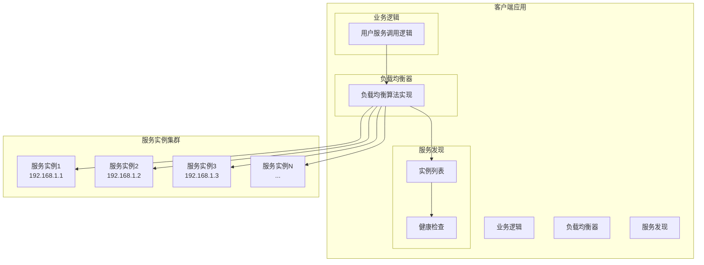
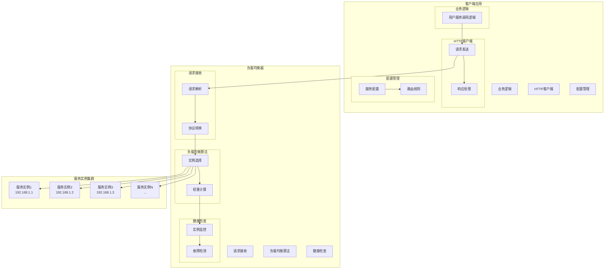
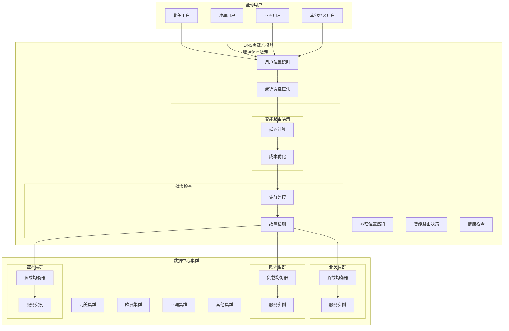
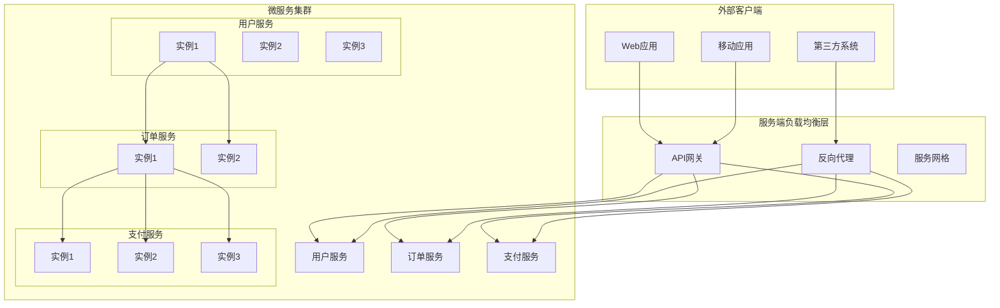

# 微服务负载均衡（Microservices Load Balancing）

## 1. 概览与总述

微服务负载均衡是指在微服务架构中，将请求或任务均匀、智能地分发到多个服务实例或节点上，以提高系统的可用性、性能和弹性。  

在微服务架构中，每个服务可能存在多个实例，负载均衡是保障请求均匀分发、避免单点过载、实现高可用和弹性伸缩的核心机制。  

**目标与价值：**  
- 高可用：避免单实例或节点故障影响整体服务  
- 弹性伸缩：支持动态扩缩容  
- 性能优化：合理分发请求，提高响应速度和吞吐量  

---

## 2. 核心概念

### 2.1 负载均衡类型
- **客户端负载均衡**：客户端通过服务注册表获取可用实例列表，并根据策略选择目标实例（例如 Ribbon、Feign）  
- **服务端负载均衡**：服务请求通过统一入口（如 Nginx、Envoy、Spring Cloud Gateway）由服务器端进行分发  
- **DNS / 全局负载均衡**：在多集群或跨地域场景下，通过 DNS 或全局 LB 分发请求到不同数据中心  

### 2.2 负载均衡指标与度量
- 响应时间（Latency）  
- 请求分发均匀性  
- 健康检查状态（Health Check）  
- 吞吐量（Throughput）  
- 错误率和超时率  

### 2.3 负载均衡算法
- **轮询（Round Robin）**  
- **随机（Random）**  
- **加权轮询（Weighted Round Robin）**  
- **哈希/一致性哈希（Hash / Consistent Hash）**  
- **最小连接数（Least Connection）**  
- **最少响应时间（Least Response Time）**  

---

## 3. 负载均衡架构模式

### 3.1 客户端负载均衡模式

#### 3.1.1 模式概述
客户端负载均衡模式是一种将负载均衡逻辑集成到客户端应用中的架构模式。客户端通过服务注册表获取可用实例列表，并根据负载均衡策略选择目标服务实例进行调用。

**核心特征：**
- 负载均衡逻辑在客户端实现
- 客户端需要维护服务实例列表
- 减少网络跳数，提高性能
- 支持复杂的负载均衡策略

#### 3.1.2 模式架构

#### 3.1.3 模式优势

**性能优势：**
- **低延迟**：减少网络跳数，直接调用目标服务
- **高吞吐**：避免负载均衡器成为性能瓶颈
- **资源节约**：减少中间代理服务器的资源消耗

**灵活性优势：**
- **自定义策略**：可以根据业务需求实现复杂的负载均衡算法
- **动态调整**：客户端可以实时调整负载均衡策略
- **故障处理**：客户端可以实现更精细的故障处理逻辑

**可扩展性优势：**
- **水平扩展**：客户端可以独立扩展，不受负载均衡器限制
- **多数据中心**：支持跨数据中心的负载均衡
- **服务网格**：与服务网格架构完美集成

#### 3.1.4 模式挑战

**实现复杂度：**
- **客户端复杂性**：每个客户端都需要实现负载均衡逻辑
- **服务发现集成**：需要与服务注册中心深度集成
- **配置管理**：负载均衡策略的配置和管理较为复杂

**一致性维护：**
- **实例列表同步**：多个客户端需要保持服务实例列表的一致性
- **健康检查**：客户端需要独立实现健康检查机制
- **故障检测**：需要实现快速故障检测和实例摘除

**运维复杂度：**
- **监控困难**：负载均衡行为分散在各个客户端，难以统一监控
- **调试复杂**：问题排查需要检查每个客户端的负载均衡逻辑
- **版本管理**：负载均衡策略的更新需要协调所有客户端

#### 3.1.5 适用场景

**高并发内部服务调用：**
- 微服务之间的内部调用
- 对延迟敏感的服务调用
- 需要自定义负载均衡策略的场景

**多数据中心部署：**
- 跨数据中心的负载均衡
- 地理位置感知的负载分发
- 灾难恢复和容灾场景

**服务网格环境：**
- Istio、Linkerd等服务网格
- Sidecar代理实现负载均衡
- 云原生微服务架构

#### 3.1.6 实现技术

**Java生态：**
- **Ribbon**：Netflix开源的客户端负载均衡库
- **Spring Cloud LoadBalancer**：Spring Cloud官方负载均衡器
- **Dubbo**：阿里巴巴开源的RPC框架

**其他语言：**
- **gRPC**：Google开源的高性能RPC框架
- **Envoy**：云原生代理，支持客户端负载均衡
- **Consul**：HashiCorp的服务发现和负载均衡解决方案

### 3.2 服务端负载均衡模式

#### 3.2.1 模式概述
服务端负载均衡模式是一种通过独立的负载均衡器（如Nginx、HAProxy）来分发请求的架构模式。客户端将请求发送到负载均衡器，由负载均衡器根据配置的策略将请求转发到后端服务实例。

**核心特征：**
- 负载均衡逻辑在独立的服务器上实现
- 客户端无需感知后端服务实例
- 集中管理，易于维护和监控
- 支持更多高级功能

#### 3.2.2 模式架构

#### 3.2.3 模式优势

**管理优势：**
- **集中管理**：所有负载均衡策略在统一位置配置和管理
- **易于监控**：可以集中监控所有请求和响应
- **配置灵活**：支持动态配置更新，无需重启服务
- **统一入口**：为客户端提供统一的服务访问入口

**功能优势：**
- **高级功能**：支持SSL终止、请求重写、响应压缩等高级功能
- **协议支持**：支持HTTP、HTTPS、TCP、UDP等多种协议
- **安全控制**：可以实现访问控制、限流、防DDoS等安全功能
- **可观测性**：提供详细的访问日志和性能指标

**运维优势：**
- **故障隔离**：后端服务故障不会影响负载均衡器
- **滚动更新**：支持后端服务的滚动更新和灰度发布
- **容量规划**：可以独立规划负载均衡器的容量
- **版本管理**：负载均衡策略的版本管理相对简单

#### 3.2.4 模式挑战

**性能瓶颈：**
- **单点故障**：负载均衡器成为单点故障点
- **性能限制**：负载均衡器的性能可能成为系统瓶颈
- **网络延迟**：增加了一层网络跳转，可能增加延迟
- **资源消耗**：需要额外的服务器资源运行负载均衡器

**配置复杂度：**
- **配置管理**：复杂的配置规则可能导致配置错误
- **版本控制**：配置变更需要严格的版本控制流程
- **测试困难**：负载均衡策略的测试相对困难
- **调试复杂**：问题排查需要检查负载均衡器和后端服务

**扩展限制：**
- **垂直扩展**：主要依赖垂直扩展提升性能
- **成本增加**：需要额外的硬件和运维成本
- **技术栈限制**：受限于负载均衡器的技术能力
- **厂商锁定**：可能被特定厂商的解决方案锁定

#### 3.2.5 适用场景

**外部API服务：**
- 为外部客户端提供统一的API入口
- 需要SSL终止和安全控制
- 需要请求路由和协议转换

**Web应用负载均衡：**
- 高并发的Web应用
- 需要会话保持的应用
- 静态资源分发

**传统架构升级：**
- 从单体应用向微服务架构迁移
- 需要渐进式架构升级
- 对客户端改动要求最小

#### 3.2.6 实现技术

**反向代理服务器：**
- **Nginx**：高性能的Web服务器和反向代理
- **Apache HTTP Server**：功能丰富的Web服务器
- **HAProxy**：专业的负载均衡器

**云原生解决方案：**
- **Envoy Proxy**：云原生代理，支持服务网格
- **Istio Gateway**：服务网格的入口网关
- **Kubernetes Ingress**：Kubernetes的入口控制器

**应用网关：**
- **Spring Cloud Gateway**：Spring Cloud生态的API网关
- **Kong**：开源的API网关和微服务管理平台
- **Zuul**：Netflix的API网关

### 3.3 全局/跨数据中心负载均衡模式

#### 3.3.1 模式概述
全局/跨数据中心负载均衡模式是一种在多个数据中心或集群之间进行负载分发的架构模式。它通过DNS解析、地理位置感知、智能路由等技术，将用户请求分发到最优的数据中心或集群。

**核心特征：**
- 跨数据中心或集群的负载分发
- 地理位置感知和就近访问
- 灾难恢复和容灾支持
- 全局流量管理和优化

#### 3.3.2 模式架构

#### 3.3.3 模式优势

**性能优势：**
- **低延迟**：用户访问最近的数据中心，减少网络延迟
- **高可用**：多数据中心部署，避免单点故障
- **负载分散**：将流量分散到多个数据中心，避免过载
- **弹性扩展**：可以根据流量需求动态调整各数据中心的容量

**业务优势：**
- **全球覆盖**：为全球用户提供一致的服务体验
- **合规支持**：满足数据本地化存储的合规要求
- **灾难恢复**：当某个数据中心故障时，自动切换到其他数据中心
- **成本优化**：根据各数据中心的成本差异进行智能路由

**运维优势：**
- **集中管理**：通过统一的控制台管理所有数据中心
- **监控统一**：提供全局的监控和告警能力
- **配置同步**：确保各数据中心的配置一致性
- **版本控制**：支持全局的版本发布和回滚

#### 3.3.4 模式挑战

**技术复杂度：**
- **数据一致性**：跨数据中心的数据同步和一致性保证
- **网络延迟**：数据中心间的网络延迟可能影响性能
- **配置管理**：多数据中心的配置同步和管理复杂度高
- **故障检测**：需要快速检测和响应跨数据中心的故障

**成本挑战：**
- **基础设施成本**：需要维护多个数据中心的基础设施
- **网络成本**：数据中心间的网络带宽成本较高
- **运维成本**：需要更多的运维人员和工具
- **数据同步成本**：数据同步和备份的成本较高

**一致性挑战：**
- **数据一致性**：保证跨数据中心的数据一致性
- **配置一致性**：确保各数据中心的配置保持同步
- **版本一致性**：保证各数据中心运行相同版本的服务
- **状态一致性**：处理分布式状态管理问题

#### 3.3.5 适用场景

**全球业务部署：**
- 跨国企业的全球服务部署
- 需要为全球用户提供服务的应用
- 满足不同地区合规要求的业务

**高可用要求：**
- 对可用性要求极高的关键业务
- 需要灾难恢复能力的系统
- 不能容忍单点故障的应用

**大流量应用：**
- 高并发的互联网应用
- 视频直播、在线游戏等大流量场景
- 需要全球分发的内容服务

#### 3.3.6 实现技术

**DNS负载均衡：**
- **AWS Route 53**：AWS的DNS服务，支持地理位置路由
- **CloudFlare**：全球CDN和DNS服务提供商
- **Google Cloud DNS**：Google Cloud的DNS服务
- **自建DNS服务器**：使用BIND等开源DNS服务器

**全局负载均衡器：**
- **F5 BIG-IP**：企业级负载均衡器，支持全局负载均衡
- **Citrix NetScaler**：支持多数据中心的负载均衡
- **A10 Networks**：提供全球负载均衡解决方案
- **Kemp LoadMaster**：支持多数据中心的负载均衡

**云原生解决方案：**
- **Istio Multi-Cluster**：服务网格的跨集群负载均衡
- **Kubernetes Federation**：Kubernetes的多集群管理
- **Consul Connect**：HashiCorp的服务网格解决方案

### 3.4 混合负载均衡模式

#### 3.4.1 模式概述
混合负载均衡模式是一种结合客户端和服务端负载均衡的架构模式。它根据不同的场景和需求，灵活选择最适合的负载均衡方式，实现最优的性能和可靠性。

**核心特征：**
- 多种负载均衡方式并存
- 根据场景动态选择策略
- 客户端和服务端协同工作
- 支持复杂的负载均衡需求

#### 3.4.2 模式架构

#### 3.4.3 模式优势

**灵活性优势：**
- **场景适配**：可以根据不同场景选择最适合的负载均衡方式
- **动态调整**：支持运行时动态调整负载均衡策略
- **渐进式升级**：支持从单一模式向混合模式渐进式升级

**性能优势：**
- **最优路径**：为不同请求选择最优的负载均衡路径
- **资源优化**：合理分配负载均衡资源，避免浪费
- **延迟优化**：通过混合模式最小化请求延迟

**可靠性优势：**
- **故障隔离**：不同层级的故障不会相互影响
- **冗余保障**：多层负载均衡提供更好的容错能力
- **降级处理**：支持多级降级策略

#### 3.4.4 模式挑战

**复杂度管理：**
- **配置复杂**：需要管理多套负载均衡配置
- **监控困难**：需要监控多个负载均衡层
- **调试复杂**：问题排查需要检查多个层级

**一致性保证：**
- **策略一致**：确保不同层级的负载均衡策略一致
- **状态同步**：保持各层级状态信息同步
- **版本管理**：协调各层级的版本升级

#### 3.4.5 适用场景

**复杂微服务架构：**
- 包含多种服务类型的微服务系统
- 需要不同负载均衡策略的服务
- 对性能和可靠性要求都很高的系统

**混合部署环境：**
- 同时包含云上和本地部署
- 多数据中心部署
- 传统架构向云原生架构迁移

**高要求业务系统：**
- 金融、电商等对性能要求极高的系统
- 需要精细流量控制的系统
- 对可用性要求极高的关键业务

#### 3.4.6 实现技术

**API网关：**
- **Spring Cloud Gateway**：Spring Cloud生态的API网关
- **Kong**：开源的API网关和微服务管理平台
- **Zuul**：Netflix的API网关

**服务网格：**
- **Istio**：Google、IBM、Lyft联合开发的服务网格
- **Linkerd**：Buoyant开发的服务网格
- **Consul Connect**：HashiCorp的服务网格解决方案

**混合方案：**
- **Nginx + Ribbon**：服务端LB + 客户端LB
- **Istio + Spring Cloud**：服务网格 + 微服务框架
- **Kong + gRPC**：API网关 + gRPC负载均衡  

---

## 4. 框架与工具

### 4.1 Netflix OSS
- **Ribbon**：客户端负载均衡  
- **Eureka**：服务注册与发现  
- **Zuul**：网关路由与负载均衡  
- **Hystrix Dashboard**：监控熔断状态  

### 4.2 Spring Cloud
- Spring Cloud LoadBalancer（替代 Ribbon）  
- 集成 Feign、Gateway 实现客户端与服务端 LB  

### 4.3 Spring Cloud Alibaba
- Nacos（服务注册与发现）  
- Gateway 负载均衡  
- Sentinel（限流、熔断与容错）  

### 4.4 Envoy / 服务网格
- 自动服务发现  
- 负载均衡策略可配置  
- 支持熔断、限流、健康检查  

### 4.5 Kubernetes
- Service 类型：ClusterIP、NodePort、LoadBalancer  
- Ingress / IngressController  
- 基于标签和选择器的流量分发  

---

## 5. 行业最佳实践

### 5.1 负载均衡策略选择
- 客户端 LB 适合轻量、快速迭代的微服务调用  
- 服务端 LB 适合统一入口、集中管理和安全控制  
- 全局 LB 适合跨地域、多集群部署  

### 5.2 性能监控与告警
- 监控负载均衡指标：响应时间、失败率、请求分布  
- 告警机制：异常高负载、健康检查失败、实例不可用  

### 5.3 弹性扩展与伸缩策略
- 水平扩展（Horizontal Scaling）  
- 动态注册与发现  
- 自动伸缩（HPA / Cluster Autoscaler）  

---

## 6. 容错与故障转移

### 6.1 容错机制概述

容错与故障转移是微服务架构中保障系统可靠性的重要机制。虽然容错机制与负载均衡密切相关，但它是一个独立的架构关注点，主要解决系统在面临故障时的稳定性和可用性问题。

**核心目标：**
- 提高系统可用性和可靠性
- 防止级联故障传播
- 实现自动故障恢复
- 保障业务连续性

### 6.2 容错模式

#### 6.2.1 重试模式
**模式描述：** 当服务调用失败时，自动重新尝试调用，直到成功或达到最大重试次数。

**适用场景：**
- 网络临时故障
- 服务临时不可用
- 偶发性错误

**实现策略：**
- **固定间隔重试**：每次重试间隔固定时间
- **指数退避重试**：重试间隔逐渐增加
- **随机退避重试**：在退避时间基础上增加随机性

#### 6.2.2 熔断模式
**模式描述：** 当服务调用失败率超过阈值时，熔断器打开，停止调用该服务，直接返回失败或降级结果。

**适用场景：**
- 服务持续不可用
- 服务响应时间过长
- 需要快速失败保护

**熔断器状态：**
- **关闭状态**：正常调用服务
- **打开状态**：停止调用服务，直接返回失败
- **半开状态**：尝试调用服务，根据结果决定是否恢复

#### 6.2.3 降级模式
**模式描述：** 当服务不可用时，提供备用的简化功能或缓存数据，确保核心业务流程能够继续。

**适用场景：**
- 非核心功能不可用
- 需要保证核心业务流程
- 用户体验优先的场景

**降级策略：**
- **功能降级**：提供简化版本的功能
- **数据降级**：使用缓存数据或默认数据
- **服务降级**：切换到备用服务

#### 6.2.4 超时模式
**模式描述：** 为服务调用设置超时时间，避免长时间等待无响应的服务。

**适用场景：**
- 所有服务调用场景
- 需要控制响应时间的场景
- 防止资源长时间占用

**超时策略：**
- **连接超时**：建立连接的最大等待时间
- **读取超时**：读取响应的最大等待时间
- **总超时**：整个请求的最大等待时间

### 6.3 故障转移策略

#### 6.3.1 健康检查
**机制描述：** 定期检查服务实例的健康状态，及时发现故障实例。

**检查方式：**
- **主动检查**：定期向服务发送健康检查请求
- **被动检查**：监控服务响应和错误率
- **混合检查**：结合主动和被动检查

**健康检查指标：**
- 响应时间
- 错误率
- 资源使用率
- 业务指标

#### 6.3.2 故障检测
**机制描述：** 通过多种方式检测服务故障，包括网络故障、服务故障、实例故障等。

**检测方法：**
- **心跳检测**：定期发送心跳包检测连接
- **超时检测**：通过超时机制检测无响应
- **错误率检测**：监控错误率变化
- **业务指标检测**：监控业务相关指标

#### 6.3.3 故障隔离
**机制描述：** 将故障实例从服务池中移除，防止故障影响其他服务。

**隔离策略：**
- **立即隔离**：检测到故障立即隔离
- **延迟隔离**：连续多次失败后才隔离
- **自动恢复**：故障恢复后自动重新加入
- **手动恢复**：需要人工确认后恢复

### 6.4 容错实现技术

#### 6.4.1 Java生态
- **Hystrix**：Netflix的容错库（已停止维护）
- **Resilience4j**：轻量级容错库
- **Sentinel**：阿里巴巴的流量控制库
- **Spring Retry**：Spring框架的重试机制

#### 6.4.2 服务网格
- **Istio Circuit Breaker**：Istio的熔断器
- **Linkerd Retry**：Linkerd的重试机制
- **Consul Connect**：Consul的容错机制

#### 6.4.3 云原生
- **Kubernetes Health Checks**：Kubernetes的健康检查
- **Prometheus Alerting**：Prometheus的告警机制
- **Grafana Monitoring**：Grafana的监控面板

### 6.5 容错最佳实践

#### 6.5.1 配置策略
- **合理设置重试次数**：避免过度重试
- **选择合适的超时时间**：平衡响应时间和成功率
- **配置合理的熔断阈值**：避免误熔断
- **设置合适的降级策略**：保证核心功能可用

#### 6.5.2 监控告警
- **监控容错指标**：重试次数、熔断次数、降级次数
- **设置告警规则**：异常情况及时告警
- **建立监控面板**：可视化容错状态
- **定期分析**：分析容错效果和优化策略

#### 6.5.3 测试验证
- **故障注入测试**：模拟各种故障场景
- **压力测试**：验证容错机制在高负载下的表现
- **混沌工程**：通过混沌工程验证系统容错能力
- **定期演练**：定期进行故障恢复演练

---

## 7. 参考资料
- [Netflix OSS 官方文档](https://netflix.github.io)  
- [Spring Cloud 官方文档](https://spring.io/projects/spring-cloud)  
- [Spring Cloud Alibaba 官方文档](https://github.com/alibaba/spring-cloud-alibaba)  
- [Kubernetes Service & Ingress](https://kubernetes.io/docs/concepts/services-networking/service/)  
- 技术博客与实践案例（企业内微服务实践）  

