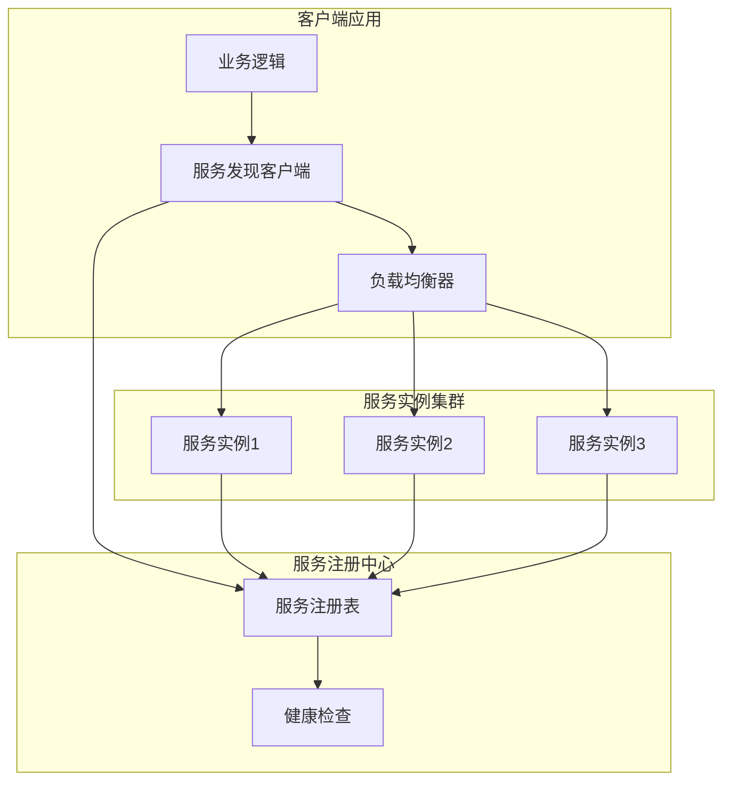
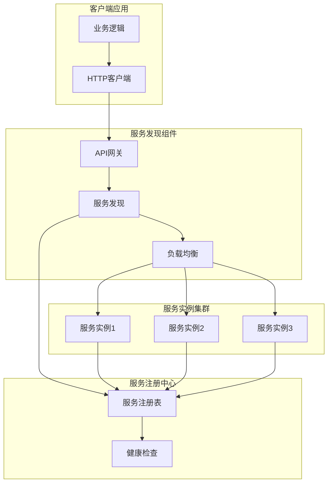
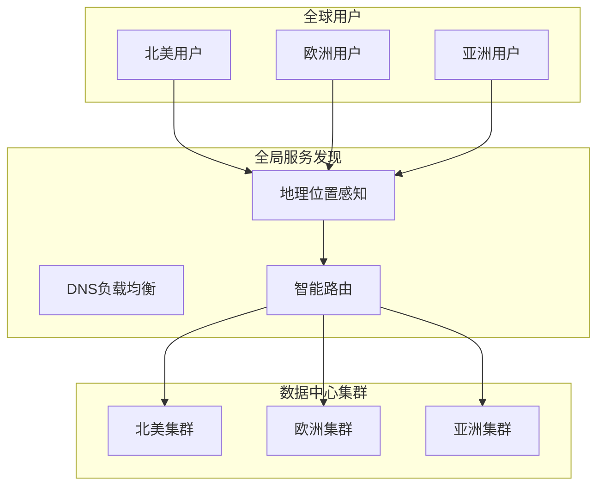

# 微服务服务发现（Service Discovery）

## 1. 什么是服务发现

服务发现是一种机制，用于在微服务架构中让服务消费者动态找到服务提供者实例。它解决了微服务环境中服务实例动态变化的问题，确保请求能够高效、可靠地分发到可用实例。

### 核心价值
- **动态环境支持**：微服务实例可能随时扩缩容，固定 IP/端口不可行
- **高可用与弹性伸缩**：自动剔除不可用实例、平衡请求压力
- **简化运维**：无须手动配置每个服务实例，降低运维复杂度
- **支持复杂架构模式**：结合负载均衡、熔断、限流，实现可靠的服务间通信

### 与负载均衡的关系
服务发现与负载均衡密切相关：
- **服务发现**：负责维护服务实例列表和状态信息
- **负载均衡**：基于服务发现的信息进行请求分发
- **协同工作**：服务发现提供实例信息，负载均衡实现分发策略

---

## 2. 为什么需要服务发现

### 2.1 微服务架构的挑战
- **动态实例管理**：微服务实例可能随时扩缩容，固定 IP/端口不可行
- **服务依赖复杂**：服务间依赖关系复杂，需要动态发现和调用
- **高可用要求**：需要自动剔除不可用实例，保证服务可用性
- **运维复杂度**：手动配置每个服务实例的 IP/端口，运维工作量大

### 2.2 服务发现的价值
- **提升系统可用性**：自动故障检测和实例管理
- **简化运维工作**：减少手动配置，降低运维复杂度
- **支持弹性伸缩**：动态适应负载变化
- **提高开发效率**：开发者无需关心服务实例的具体位置

---

## 3. 服务发现的参与者

### 3.1 服务提供者（Provider）
- **服务注册**：将服务实例信息注册到服务注册中心
- **心跳机制**：定期发送心跳保持服务实例状态
- **健康检查**：提供健康检查接口，供注册中心监控
- **元数据管理**：维护服务实例的元数据信息

### 3.2 服务消费者（Consumer）
- **服务发现**：查询服务注册中心获取可用实例列表
- **负载均衡**：根据策略选择目标实例进行调用
- **故障处理**：处理服务调用失败的情况
- **缓存管理**：缓存服务实例信息，减少查询频率

### 3.3 服务注册中心（Registry）
- **服务注册表**：保存服务实例信息、状态与元数据
- **健康检查**：监控服务实例的健康状态
- **服务发现**：提供查询接口供消费者获取实例列表
- **配置管理**：管理服务发现相关的配置信息

### 3.4 可选中间件
- **API网关**：提供统一的服务入口和路由
- **负载均衡器**：实现服务端负载均衡
- **服务网格**：提供高级的服务发现和流量管理功能

---

## 4. 什么时候使用服务发现

### 4.1 适用场景
- **微服务架构**：服务数量多，实例动态变化
- **云原生应用**：容器化部署，实例频繁扩缩容
- **分布式系统**：服务分布在多个节点或数据中心
- **高可用系统**：需要自动故障检测和恢复

### 4.2 不适用场景
- **单体应用**：单一服务，无需服务发现
- **简单系统**：服务数量少，变化频率低
- **固定环境**：服务实例位置固定不变
- **性能敏感**：对延迟要求极高，无法接受额外开销

---

## 5. 在哪里实现服务发现（Where）

### 5.1 客户端发现模式
**实现位置**：服务发现逻辑在客户端应用中实现

**架构图**：

**特点**：
- 客户端直接查询注册中心
- 减少网络跳数，性能好
- 客户端实现复杂

### 5.2 服务端发现模式
**实现位置**：通过独立的服务发现组件（如API网关）实现

**架构图**：

**特点**：
- 客户端无需感知服务实例
- 集中管理，易于监控
- 可能成为性能瓶颈

### 5.3 全局/跨数据中心发现模式
**实现位置**：通过DNS解析和地理位置感知实现

**架构图**：

**特点**：
- 跨数据中心服务发现
- 地理位置感知和就近访问
- 技术复杂度高

---

## 6. 如何实现服务发现（How）

### 6.1 核心流程

#### 6.1.1 服务注册流程
1. **服务启动**：服务实例启动时向注册中心发送注册请求
2. **信息验证**：注册中心验证服务实例信息的有效性
3. **状态记录**：将服务实例信息记录到服务注册表
4. **心跳建立**：建立心跳机制监控服务实例状态

#### 6.1.2 服务发现流程
1. **查询请求**：消费者向注册中心发送服务发现请求
2. **实例筛选**：注册中心根据健康状态筛选可用实例
3. **列表返回**：将可用实例列表返回给消费者
4. **缓存更新**：消费者更新本地实例缓存

#### 6.1.3 健康检查流程
1. **定期检查**：注册中心定期向服务实例发送健康检查请求
2. **状态评估**：根据响应时间和错误率评估实例健康状态
3. **状态更新**：更新服务注册表中的实例状态
4. **故障处理**：将不健康的实例从可用列表中移除

### 6.2 实现技术

#### 6.2.1 服务注册中心
- **Eureka**：Netflix开源，AP模型，适合Spring Cloud
- **Nacos**：阿里巴巴开源，支持CP/AP模型，配置管理一体化
- **Consul**：HashiCorp开源，CP模型，支持多数据中心
- **Kubernetes**：原生支持，Service + Endpoints + CoreDNS

#### 6.2.2 服务发现客户端
- **Ribbon**：Netflix开源，客户端负载均衡
- **Spring Cloud LoadBalancer**：Spring Cloud官方负载均衡器
- **Dubbo**：阿里巴巴开源，RPC框架
- **gRPC**：Google开源，高性能RPC框架

#### 6.2.3 服务网格
- **Istio**：Google/IBM/Lyft联合开发，功能丰富
- **Linkerd**：Buoyant开发，轻量级易部署
- **Consul Connect**：HashiCorp服务网格解决方案

### 6.3 最佳实践

#### 6.3.1 服务注册最佳实践
- **合理设置心跳间隔**：平衡网络开销和故障检测速度
- **提供健康检查接口**：确保注册中心能够准确判断服务状态
- **使用服务标签**：为服务实例添加标签，便于分类和筛选
- **配置超时时间**：设置合理的注册和心跳超时时间

#### 6.3.2 服务发现最佳实践
- **实现本地缓存**：减少对注册中心的查询频率
- **使用连接池**：复用连接，提高性能
- **实现故障转移**：当注册中心不可用时，使用备用方案
- **监控服务发现指标**：监控查询延迟、缓存命中率等指标

#### 6.3.3 健康检查最佳实践
- **多级健康检查**：实现应用级和系统级健康检查
- **合理设置检查频率**：避免过于频繁的检查影响性能
- **实现优雅降级**：当健康检查失败时，提供降级服务
- **监控健康状态**：建立健康状态监控和告警机制

#### 6.3.4 故障处理最佳实践
- **实现熔断机制**：防止级联故障
- **使用重试策略**：处理临时性故障
- **实现降级方案**：保证核心功能可用
- **建立监控告警**：及时发现和处理故障

---

## 7. 参考资料
- [Netflix OSS 官方文档](https://netflix.github.io)  
- [Spring Cloud 官方文档](https://spring.io/projects/spring-cloud)  
- [Spring Cloud Alibaba 官方文档](https://github.com/alibaba/spring-cloud-alibaba)  
- [Kubernetes Service & Endpoints](https://kubernetes.io/docs/concepts/services-networking/service/)  
- [Istio Service Mesh 流量管理](https://istio.io/latest/docs/concepts/traffic-management/)  
- [Martin Fowler: Microservice Patterns](https://martinfowler.com/articles/microservice-trade-offs.html)

---

> **备注**：  
> 本文档可作为微服务服务发现模块在架构景库中的总览文档，可进一步扩展添加 Mermaid 流程图或调用示意图，直观展示 Provider、Consumer 与 Registry 的交互。
