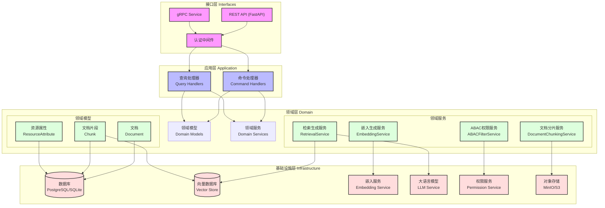
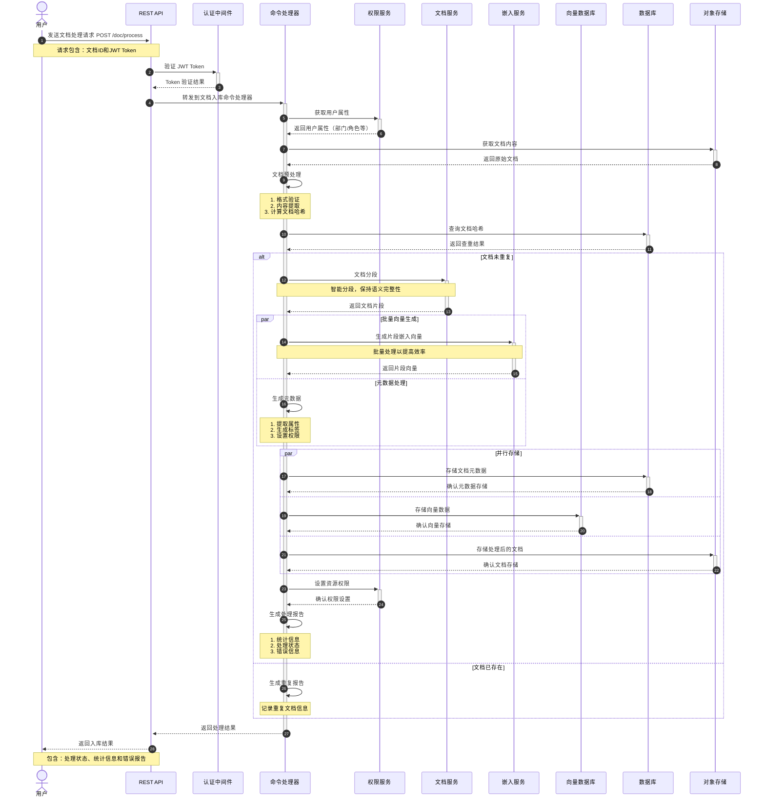
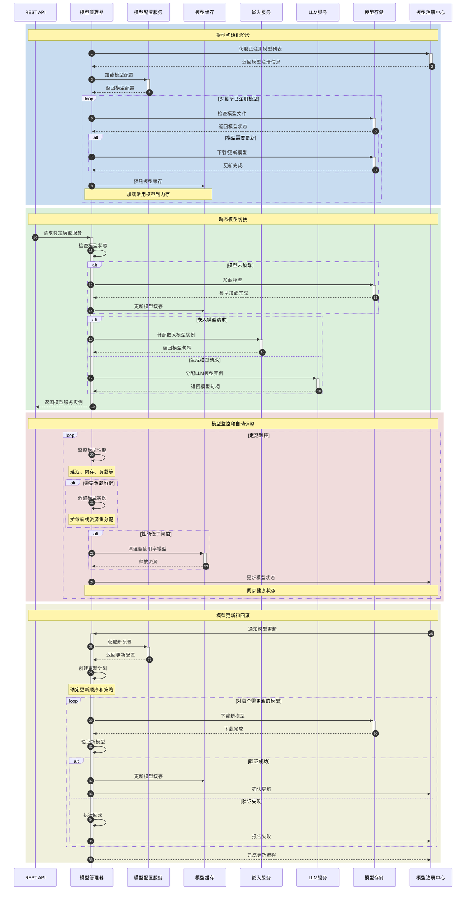

# 知识库RAG智能体架构设计

## 目录结构设计

推荐采用分层、CQRS 和领域驱动设计，目录结构如下：

```
/agents/knowledge_rag_agent/
    /src/
        /interfaces/         # 接口层：REST/gRPC 路由、协议适配、认证中间件
            rest_api.py
            grpc_api.py
        /application/        # 应用层：命令/查询处理器，业务流程编排
            command_handlers.py
            query_handlers.py
        /domain/             # 领域层：领域模型、领域服务、核心业务逻辑
            models.py
            services.py
        /infrastructure/     # 基础设施层：外部服务/存储/适配器
            embedding_adapter.py
            vector_db_adapter.py
            permission_adapter.py
            storage_adapter.py
        /schemas/            # Pydantic 输入/输出模型
            document.py
            chunk.py
            qa.py
        /utils/              # 工具函数、通用中间件
            logging.py
            error_handling.py
        main.py              # FastAPI 应用入口
        config.py            # 配置加载与管理
    .env                  # 环境变量
```

- 每层职责清晰，便于扩展和维护。
- interfaces 层仅做协议适配和认证，业务流程全部下沉到 application 层。
- application 层严格区分命令/查询处理器，依赖注入领域服务。
- domain 层只包含核心模型和业务逻辑，与外部系统解耦。
- infrastructure 层适配所有外部依赖，便于替换和扩展。
- schemas 层统一管理所有 Pydantic 输入/输出模型。
- utils 层放置通用工具和中间件。

---

## 一、系统目标

- 实现基于知识库的高效、可扩展的检索增强生成（RAG）智能问答服务。
- 支持多模型、多后端的嵌入与生成能力，满足企业级知识问答、文档检索、智能客服等场景。
- 保证系统高可用、易维护、易扩展，便于与现有微服务体系集成。
- **严格遵循CQRS（命令查询职责分离）架构，提升系统可维护性与性能。**

---

## 二、CQRS 架构原则

- **命令（Command）**：负责对系统状态产生变更的操作，如文档入库、分段、嵌入生成、属性变更等。
- **查询（Query）**：负责读取数据、检索知识、问答生成等纯读操作，不产生系统状态变更。
- **命令与查询分离**：在接口层、应用层、服务层均明确区分命令与查询，便于独立扩展、优化和权限控制。
- **独立的命令/查询模型**：命令和查询可采用不同的数据模型和优化策略。

---

## 三、架构设计
### 技术架构




### 核心功能时序图


#### **用户问答（QA）**
接收用户问题，返回基于知识库的高质量答案及引用依据。

 ```mermaid
 sequenceDiagram
    autonumber
    actor User as 用户
    participant API as REST API
    participant Auth as 认证中间件
    participant QH as 查询处理器
    participant PS as 权限服务
    participant RS as 检索服务
    participant ES as 嵌入服务
    participant VDB as 向量数据库
    participant LLM as 大语言模型
    
    User->>+API: 发送问答请求 POST /qa
    Note over User,API: 请求包含：问题内容和JWT Token
    
    API->>+Auth: 验证 JWT Token
    Auth-->>-API: Token 验证结果
    
    API->>+QH: 转发到查询处理器
    
    QH->>+PS: 获取用户属性
    PS-->>-QH: 返回用户属性（部门/角色等）
    
    QH->>+ES: 生成问题的嵌入向量
    ES-->>-QH: 返回问题向量
    
    QH->>+VDB: 向量相似度检索
    Note over QH,VDB: 包含用户属性的过滤条件
    VDB-->>-QH: 返回相关文档片段
    
    QH->>+PS: ABAC权限过滤
    PS-->>-QH: 返回过滤后的片段
    
    QH->>QH: 组装上下文
    Note over QH: 合并相关片段和问题
    
    QH->>+LLM: 生成答案请求
    Note over QH,LLM: 发送上下文和问题
    LLM-->>-QH: 返回生成的答案
    
    QH->>QH: 格式化响应
    Note over QH: 组装答案和引用信息
    
    QH-->>-API: 返回处理结果
    
    API-->>User: 返回答案
    Note over User,API: 包含：答案内容、相关片段和来源
 ```
用户问答功能的完整流程：

1. **请求接收与认证**
   - 用户发送问答请求，包含问题内容和JWT Token
   - API层验证Token的有效性

2. **用户权限处理**
   - 查询处理器从权限服务获取用户属性
   - 这些属性将用于后续的数据访问控制

3. **向量检索流程**
   - 使用嵌入服务生成问题的向量表示
   - 在向量数据库中进行相似度检索
   - 检索时包含基于用户属性的过滤条件

4. **权限过滤**
   - 对检索结果进行ABAC权限过滤
   - 确保用户只能访问有权限的内容

5. **答案生成**
   - 组装过滤后的文档片段和用户问题
   - 调用大语言模型生成答案

6. **响应返回**
   - 格式化处理结果，包含答案和引用信息
   - 返回给用户

这个流程体现了以下几个关键特点：
严格的权限控制：在检索和过滤阶段都进行权限验证
CQRS原则：整个流程都在查询处理器中处理，不涉及状态修改
多重安全保障：JWT验证、ABAC过滤等多层次的安全机制
完整的可追溯性：包含答案的来源和引用信息
#### **生成式问答（Generation）**
调用大语言模型（LLM），基于检索内容生成自然语言答案。

 ```mermaid
sequenceDiagram
    autonumber
    actor User as 用户
    participant API as REST API
    participant Auth as 认证中间件
    participant QH as 查询处理器
    participant PS as 权限服务
    participant ES as 嵌入服务
    participant VDB as 向量数据库
    participant DB as 数据库
    participant LLM as 大语言模型
    
    User->>+API: 发送生成式问答请求 POST /rag/qa
    Note over User,API: 请求包含：问题内容和JWT Token
    
    API->>+Auth: 验证 JWT Token
    Auth-->>-API: Token 验证结果
    
    API->>+QH: 转发到RAG查询处理器
    
    QH->>+PS: 获取用户属性
    PS-->>-QH: 返回用户属性（部门/角色等）
    
    par 问题分析
        QH->>QH: 问题预处理
        Note over QH: 提取关键词和意图分析
    and 向量生成
        QH->>+ES: 生成问题的嵌入向量
        ES-->>-QH: 返回问题向量
    end
    
    QH->>+VDB: 多阶段检索
    Note over QH,VDB: 1. 语义相似度检索<br>2. 关键词匹配<br>3. 属性过滤
    VDB-->>-QH: 返回相关片段ID和分数
    
    QH->>+DB: 获取片段详细信息
    Note over QH,DB: 批量查询片段内容和元数据
    DB-->>-QH: 返回完整片段信息
    
    QH->>+PS: ABAC权限过滤
    PS-->>-QH: 返回过滤后的片段
    
    QH->>QH: 上下文组装
    Note over QH: 1. 相关性排序<br>2. 内容去重<br>3. 上下文截断
    
    QH->>+LLM: 生成答案请求
    Note over QH,LLM: 发送：<br>1. 系统提示词<br>2. 上下文片段<br>3. 用户问题
    LLM-->>-QH: 返回生成的答案
    
    QH->>QH: 后处理
    Note over QH: 1. 答案验证<br>2. 引用标注<br>3. 置信度评估
    
    QH-->>-API: 返回完整结果
    
    API-->>User: 返回生成式问答结果
    Note over User,API: 包含：<br>1. 生成的答案<br>2. 引用来源<br>3. 相关片段<br>4. 置信度分数
 ```
生成式问答（RAG）的完整流程：

1. **初始化阶段**
   - 用户发送问答请求
   - 进行Token验证
   - 获取用户权限属性

2. **并行预处理**
   - 问题分析：提取关键词和意图
   - 向量生成：计算问题的嵌入向量
   这种并行处理可以提高响应速度

3. **多阶段检索**
   - 语义相似度检索：使用向量匹配
   - 关键词匹配：提高精确度
   - 属性过滤：确保访问权限

4. **上下文处理**
   - 获取完整片段信息
   - 进行ABAC权限过滤
   - 上下文组装和优化：
     * 相关性排序
     * 内容去重
     * 上下文长度控制

5. **生成答案**
   - 构建完整的提示词
   - 调用大语言模型
   - 包含系统提示词、上下文和用户问题

6. **后处理优化**
   - 答案验证
   - 引用标注
   - 置信度评估

7. **结果返回**
   - 生成的答案
   - 引用来源
   - 相关片段
   - 置信度分数

这个流程的特点：

- **多阶段检索**：结合向量检索和关键词匹配，提高准确性
- **并行处理**：问题分析和向量生成并行执行，优化性能
- **严格的权限控制**：多层次的权限验证和过滤
- **完整的上下文管理**：包括组装、去重和长度控制
- **质量保证**：包含答案验证和置信度评估
- **可追溯性**：提供完整的引用和来源信息

这个设计确保了：
1. 回答的准确性和可靠性
2. 系统的响应性能
3. 数据访问的安全性
4. 答案的可解释性和可追溯性
#### **知识检索（Retrieval）**

通过嵌入模型与向量数据库，检索相关文档片段。

 ```mermaid
 sequenceDiagram
    autonumber
    actor User as 用户
    participant API as REST API
    participant Auth as 认证中间件
    participant QH as 查询处理器
    participant PS as 权限服务
    participant ES as 嵌入服务
    participant VDB as 向量数据库
    participant DB as 数据库
    
    User->>+API: 发送检索请求 POST /search
    Note over User,API: 请求包含：检索关键词、过滤条件和JWT Token
    
    API->>+Auth: 验证 JWT Token
    Auth-->>-API: Token 验证结果
    
    API->>+QH: 转发到检索查询处理器
    
    QH->>+PS: 获取用户属性
    PS-->>-QH: 返回用户属性（部门/角色等）
    
    par 向量检索准备
        QH->>+ES: 生成检索词的嵌入向量
        ES-->>-QH: 返回检索向量
    and 属性过滤准备
        QH->>QH: 构建属性过滤条件
        Note over QH: 合并用户过滤条件和权限属性
    end
    
    QH->>+VDB: 混合检索请求
    Note over QH,VDB: 包含向量相似度和属性过滤
    VDB-->>-QH: 返回候选文档片段ID和相似度分数
    
    QH->>+DB: 获取片段详细信息
    Note over QH,DB: 批量查询片段内容和元数据
    DB-->>-QH: 返回完整片段信息
    
    QH->>+PS: ABAC权限过滤
    PS-->>-QH: 返回过滤后的片段
    
    QH->>QH: 结果排序和处理
    Note over QH: 按相关度排序并格式化
    
    QH->>QH: 添加高亮和摘要
    Note over QH: 处理关键词高亮和上下文摘要
    
    QH-->>-API: 返回处理结果
    
    API-->>User: 返回检索结果
    Note over User,API: 包含：相关片段列表、高亮、来源和元数据
 ```
知识检索功能的完整流程：

1. **请求接收与认证**
   - 用户发送检索请求，包含检索关键词、过滤条件和JWT Token
   - API层验证Token的有效性

2. **用户权限处理**
   - 查询处理器获取用户属性
   - 用于构建权限过滤条件

3. **并行处理准备**
   - 生成检索词的向量表示
   - 同时构建属性过滤条件
   这种并行处理可以提高检索效率

4. **混合检索流程**
   - 在向量数据库中进行混合检索
   - 同时考虑语义相似度和属性过滤
   - 返回初步候选结果

5. **详细信息获取**
   - 从关系数据库获取完整的片段信息
   - 包括内容、元数据等

6. **权限过滤与结果处理**
   - 进行ABAC权限过滤
   - 对结果进行排序
   - 添加关键词高亮和上下文摘要

7. **响应返回**
   - 返回格式化的检索结果
   - 包含相关度排序、高亮显示和元数据信息

这个流程体现了以下特点：
- **混合检索策略**：结合向量相似度和属性过滤
- **并行处理优化**：向量生成和过滤条件准备并行执行
- **多重安全保障**：JWT验证和ABAC权限过滤
- **结果优化**：包含排序、高亮和摘要等增强功能
- **完整元数据**：返回检索结果的完整上下文信息


#### **知识入库（Ingestion）**
读取已上传的文档，进行分段、嵌入生成与入库。



这个时序图展示了知识入库的完整流程：

1. **初始化阶段**
   - 用户发送文档处理请求
   - 验证Token和用户权限
   - 获取原始文档内容

2. **文档预处理**
   - 格式验证和内容提取
   - 计算文档哈希值
   - 文档查重检查

3. **文档分段处理**
   - 智能分段，确保语义完整性
   - 生成文档片段

4. **并行处理**
   - 批量生成向量嵌入
   - 处理文档元数据
   - 生成文档属性和标签

5. **并行存储**
   - 存储文档元数据到数据库
   - 存储向量数据到向量数据库
   - 存储处理后的文档到对象存储
   - 设置资源访问权限

6. **结果处理**
   - 生成处理报告
   - 返回处理结果和统计信息

这个流程的特点：

1. **性能优化**
   - 批量处理向量生成
   - 并行存储多种数据
   - 智能文档分段

2. **数据完整性**
   - 文档查重机制
   - 完整的元数据处理
   - 多重存储保障

3. **安全保障**
   - Token验证
   - 用户权限验证
   - 资源权限设置

4. **可追踪性**
   - 完整的处理报告
   - 错误信息记录
   - 处理状态跟踪

5. **异常处理**
   - 文档重复处理
   - 格式验证
   - 错误报告

这个设计确保了：
1. 入库过程的高效性
2. 数据的完整性和安全性
3. 处理过程的可追踪性
4. 系统的可扩展性
5. 异常情况的优雅处理


#### **多模型支持**
支持多种嵌入模型、生成模型、向量数据库后端。



这个时序图展示了多模型支持的四个主要阶段：

1. **模型初始化阶段**
   - 获取已注册模型列表
   - 加载模型配置
   - 检查模型文件状态
   - 更新必要的模型
   - 预热模型缓存

2. **动态模型切换**
   - 处理特定模型服务请求
   - 检查模型状态
   - 按需加载模型
   - 分配模型实例
   - 管理模型缓存

3. **模型监控和自动调整**
   - 定期监控模型性能
   - 执行负载均衡
   - 清理低使用率模型
   - 更新模型状态

4. **模型更新和回滚**
   - 接收更新通知
   - 获取新配置
   - 创建更新计划
   - 执行更新流程
   - 验证和回滚机制

系统特点：

1. **灵活性**
   - 支持多种模型类型
   - 动态加载和卸载
   - 配置热更新

2. **可靠性**
   - 模型验证机制
   - 自动回滚支持
   - 健康状态监控

3. **性能优化**
   - 模型缓存管理
   - 负载均衡
   - 资源动态调整

4. **可维护性**
   - 集中式配置管理
   - 状态监控和报告
   - 自动化运维

5. **扩展性**
   - 模型注册机制
   - 插件式架构
   - 配置驱动

这个设计确保了：
1. 模型服务的高可用性
2. 资源的高效利用
3. 运维的自动化
4. 系统的可扩展性
5. 故障的快速恢复

---


## 四、技术栈说明

本Agent推荐采用如下技术栈，兼容CQRS、ABAC等架构设计，便于高效开发、扩展和维护：

### 1. 接口层
- **REST接口**：支持RESTful API，推荐使用FastAPI原生REST能力，便于前后端集成与调试。
- **RPC接口**：支持RPC服务，推荐使用gRPC或自定义RPC框架，满足高性能服务间通信需求。
- **服务注册与发现**：RPC服务可集成nacos进行服务注册与发现，便于微服务治理和弹性扩展。

### 2. 编程语言与基础框架
- **Python 3.10+**：主力开发语言，生态丰富，适合AI与微服务场景。
- **FastAPI**：高性能异步Web框架，支持类型提示、依赖注入、自动文档。
- **Pydantic v2**：数据校验与序列化，统一输入输出模型。

### 3. 数据与存储
- **数据库**：支持 sqlite 和 PostgreSQL，适合不同规模和部署需求。
- **异步数据库驱动**：如 asyncpg（PostgreSQL）、aiosqlite（sqlite），支持高并发异步操作。
- **SQLAlchemy 2.0**：ORM框架，便于领域模型与数据库映射。
- **向量数据库**：仅支持 sqlite 扩展和 PostgreSQL 扩展，满足高效向量检索与属性过滤。
- **对象存储/NoSQL**：如 MinIO、MongoDB，用于文档原文、元数据等存储。

### 4. AI与嵌入服务
- 本Agent不直接实现嵌入模型和推理，而是通过API调用已有的嵌入服务，实现向量嵌入和推理。
- 该嵌入服务可支持多模型动态加载，Agent只需关注接口协议和调用方式，实现服务解耦与高可扩展性。

### 5. 权限与认证
- **JWT**：Agent只负责在业务流程中对JWT Token进行基本有效性的校验（如签名、过期、格式等），不在Token中存储或解析具体的权限属性。
- **权限服务/用户中心**：Agent通过API调用专门的权限服务，实时获取用户的权限属性（如部门、角色、标签、密级等）。
- **ABAC权限校验**：Agent基于从权限服务获取的用户属性与资源属性进行ABAC权限校验和数据过滤，确保用户只能访问有权限的数据。
- **OAuth2/OpenID Connect**：可选，支持更复杂的认证授权场景。

### 6. 架构与中间件
- **CQRS**：命令/查询分离，提升可维护性与性能。
  - CQRS 架构实现引用 `libs` 下的 `command-bus-python`、`query-bus-python`、`event-bus-python` 作为命令总线、查询总线、事件总线的基础库，实现命令、查询、事件的解耦与分发。
  - 通过总线机制，命令、查询、事件处理器可灵活注册与扩展，便于业务流程编排和异步事件驱动。
- **ABAC**：基于属性的访问控制，支持细粒度权限。
- **依赖注入**：FastAPI原生支持，便于解耦与测试。
- **异步任务队列**：使用 FastAPI 的 BackgroundTasks 进行批量/异步处理，轻量、易集成，适合本项目的微服务和异步场景。

### 7. 测试与开发工具
- **pytest**：单元测试。
- **httpx**：异步HTTP客户端，便于服务间调用与测试。
- **OpenAPI/Swagger**：自动API文档。

---

## 五、分层结构

### 1. 接口层（Interfaces）
- **命令接口**：如 /doc/process（处理已上传文档）、/attribute/update 等，负责接收变更请求。
- **查询接口**：如 /qa、/search、/doc/detail 等，负责数据检索与问答。
- 参数校验、请求转发、响应封装，命令与查询路由分离。

### 2. 应用层（Application）
- **命令处理器（Command Handlers）**：编排文档入库、分段、嵌入生成、属性变更等流程。
- **查询处理器（Query Handlers）**：编排知识检索、问答生成、详情查询等流程。
- 命令与查询处理逻辑分离，便于独立扩展和性能优化。

### 3. 领域层（Domain）
- 定义领域模型（如 Document、Chunk、ResourceAttribute、AttributeDefinition）、领域服务（如嵌入生成、检索、生成、分段、权限校验）。
- 领域服务可分为命令型服务（如文档分段、属性变更）和查询型服务（如向量检索、问答生成）。
- 只包含核心业务逻辑，与基础设施解耦。

### 4. 基础设施层（Infrastructure）
- 适配外部系统（如嵌入服务、向量数据库、LLM、存储、第三方API、权限服务）。
- 实现命令/查询各自的数据访问和外部服务适配。

---

## 六、接口层设计
- 提供 RESTful API 和 gRPC 服务，统一对外暴露业务能力。
- **RESTful API**：
  - 采用 FastAPI 实现，适合前后端集成、Web/移动端调用、调试和开放平台。
  - 负责参数校验、请求转发、响应封装、认证鉴权、错误处理与日志。
  - 典型接口包括命令接口（如 /doc/process、/attribute/update）和查询接口（如 /qa、/search、/doc/detail）。
- **gRPC 服务**：
  - 采用 grpcio、grpclib 等实现，适合高性能服务间通信、微服务集成、强类型接口。
  - 支持通过 nacos 进行服务注册与发现，便于微服务治理和弹性扩展。
  - gRPC 接口与 REST API 共享应用层和领域层逻辑，参数校验、认证、协议转换等均在接口层完成。
- 接口层负责协议适配、认证鉴权、请求日志等通用中间件，确保服务安全与可观测性。

## 七、应用层设计
- 负责业务流程编排，严格区分命令处理器（Command Handlers）和查询处理器（Query Handlers）。
- 命令处理器：
  - 文档入库（IngestDocumentCommand）：负责接收原始文档内容，完成分片（分段）和嵌入生成，并将片段及其向量写入数据库，保证RAG流程的完整性。
  - 说明：除文档入库及其分片、嵌入生成外，其他写操作（如删除、属性赋值与变更等）均由Java服务负责，Agent不实现。
- 查询处理器：
  - 知识检索（RetrieveChunksQuery）
  - 问答生成（GenerateAnswerQuery）
- RAG Agent 与 Java 服务共享数据库，RAG Agent 通过只读查询数据库获取所需的文档、片段、属性等元数据。所有元数据的写入、变更、权限管理等由 Java 服务负责，RAG Agent 仅聚焦于智能检索与生成。
- 处理器间通过依赖注入和领域服务解耦。

## 八、领域层设计

### 1. 领域模型设计

#### Document（文档）
- **命令场景**：文档入库、分段、嵌入生成。
- **查询场景**：文档详情查询、分段内容查询。
- **主要字段**：
  - `id`：文档唯一标识（主键）
  - `title`：文档标题
  - `source`：文档来源（如上传、爬取、同步等）
  - `created_by`：创建人/上传人
  - `created_at`：创建时间
  - `updated_at`：最后更新时间
  - `status`：文档状态（如有效、无效、待审核等）
  - `description`：文档简要描述
  - `content_hash`：文档内容哈希（唯一值，用于去重与增量处理）
- **关系**：
  - 一个 Document 可包含多个 Chunk
  - 一个 Document 可关联多个 ResourceAttribute

#### Chunk（文档片段）
- **命令场景**：分段生成、嵌入生成。
- **查询场景**：片段内容检索、向量检索。
- **主要字段**：
  - `id`：片段唯一标识（主键）
  - `document_id`：所属文档ID（外键）
  - `content`：片段文本内容
  - `embedding`：嵌入向量（数组/向量字段）
  - `order`：在文档中的顺序
  - `created_at`：创建时间
  - `status`：片段状态（如有效、无效）
- **关系**：
  - 一个 Chunk 归属于一个 Document
  - 一个 Chunk 可关联多个 ResourceAttribute

#### ResourceAttribute（资源属性三元组）
- **查询场景**：属性过滤、权限校验。
- **主要字段**：
  - `id`：唯一标识（主键）
  - `resource_id`：资源ID（可指向 Document 或 Chunk）
  - `attribute_name`：属性英文名
  - `value`：属性值（string，支持多值时可用分隔符或JSON）
  - `resource_type`：资源类型（如"document"、"chunk"）
  - `created_at`：创建时间
- **关系**：
  - ResourceAttribute 通过 `resource_id` 关联 Document 或 Chunk

#### 关系说明（ER视角）
- **Document 1—N Chunk**：一个文档有多个片段
- **Document/Chunk 1—N ResourceAttribute**：每个文档或片段可有多个属性

#### 设计要点
- 属性扩展灵活：新增/变更属性只需操作 AttributeDefinition，无需变更主表结构。
- 多资源支持：ResourceAttribute 可同时支持文档、片段等多种资源类型。
- 高效过滤：可基于属性三元组实现高效的权限过滤、标签检索、分级管理等。
- 与ABAC无缝集成：为权限服务和策略引擎提供统一的属性数据基础。
- 说明：属性定义、属性赋值、变更等服务由Java服务负责，Agent领域层不实现。

---

### 2. 领域服务定义

#### 文档分片与持久化服务（DocumentChunkingService）
- split_document(document_content): 文档内容分片
- save_chunks(document_id, chunks): 持久化片段

#### 嵌入生成服务（EmbeddingService）
- generate_embedding(text): 生成单条文本的向量
- batch_generate_embeddings(text_list): 批量生成文本向量
- save_chunk_embedding(chunk_id, embedding): 持久化片段嵌入向量

#### 检索与生成服务
- retrieve_chunks(query_embedding, filter_params): 基于向量和属性过滤检索片段
- assemble_context(chunks, user_question): 拼接检索片段与用户问题，生成上下文
- generate_answer(context, user_question): 基于上下文和问题生成答案

#### ABAC权限过滤服务（ABACFilterService）
- filter_chunks_by_permission(user_attributes, chunks): 基于用户属性过滤可访问片段

- 说明：属性定义、属性赋值、变更等领域服务由Java服务负责，Agent领域层不实现。

---

### 3. 领域层与基础设施层解耦接口设计

为实现领域层与基础设施层的彻底解耦，提升可维护性与可测试性，推荐采用"端口-适配器（Port-Adapter）"模式：

- **接口（Port/Protocol）定义在领域层**，仅声明所需的外部服务能力，不关心具体实现。
- **基础设施层实现这些接口**，并通过依赖注入方式在应用层传递给领域服务。
- 领域服务仅依赖接口，便于单元测试和后续扩展。

#### 典型接口定义

##### 嵌入服务接口（EmbeddingServicePort）
- embed(text: str) -> List[float]
  - 功能：对单条文本生成嵌入向量。
- batch_embed(texts: List[str]) -> List[List[float]]
  - 功能：对多条文本批量生成嵌入向量。

##### 向量数据库接口（VectorDBPort）
- search(query_embedding: List[float], filter_params: Dict[str, Any]) -> List[Chunk]
  - 功能：根据查询向量和属性过滤条件检索相关片段。

##### 大模型生成接口（LLMServicePort）
- generate(context: str, question: str) -> str
  - 功能：基于检索上下文和用户问题生成自然语言答案。

##### 权限服务接口（PermissionServicePort）
- get_user_attributes(user_id: str) -> Dict[str, Any]
  - 功能：获取指定用户的属性信息（如部门、角色、标签等）。
- filter_chunks(user_attributes: Dict[str, Any], chunks: List[Chunk], chunk_attributes: List[ResourceAttribute]) -> List[Chunk]
  - 功能：基于用户属性和片段属性过滤可访问的片段。

#### 设计要点
- 所有接口均以协议（Protocol）或抽象基类（ABC）方式定义在领域层。
- 具体实现全部放在基础设施层，便于替换和扩展。
- 应用层通过依赖注入将实现传递给领域服务，确保解耦。
- 领域服务函数参数类型应直接声明为接口类型，便于类型检查和依赖注入。

此设计确保了领域层的纯粹性和可移植性，基础设施变化不会影响核心业务逻辑。

---

## 九、基础设施层设计
- 适配外部系统和持久化存储：
  - 嵌入服务（如 @embed_serve）
  - 向量数据库（如 sqlite 扩展、PostgreSQL 扩展）
  - 权限服务、认证服务
  - 关系型/NoSQL数据库、对象存储
- 实现命令/查询各自的数据访问、外部服务适配和性能优化。
- 支持全链路日志、性能监控、异常追踪，与企业级监控平台对接。
- 典型模块：
  - 嵌入服务适配器
  - 向量数据库适配器
  - 权限服务适配器
  - 数据库与存储适配器
  - 日志与监控适配器
- **幂等性和事件总线属于横切关注点，分别在应用层或基础设施层实现和集成，用于保障接口幂等性、分布式事件驱动等技术需求。**

---

## 十、服务交互流程

1. **命令流程**：
   - 用户通过命令接口（如 /doc/process）提交文档。
   - Agent 计算 content_hash，查重。
   - 若内容有变化，执行分段、嵌入生成、属性赋值、入库。
   - 属性定义、赋值、变更等均通过命令接口和命令服务处理。
2. **查询流程**：
   - 用户通过查询接口（如 /qa、/search）发起检索或问答请求。
   - Agent 基于属性三元组和ABAC权限过滤，调用向量数据库检索相关片段。
   - 拼接上下文，调用生成模型生成答案。
   - 返回答案、引用片段及来源信息。

---

## 十一、扩展性与安全性

- **多模型/多后端支持**：通过适配器模式，便于切换嵌入模型、生成模型、向量数据库。
- **高可用与弹性扩展**：各服务可独立扩容，支持负载均衡与容灾。
- **安全机制**：API 认证鉴权、访问控制、数据加密、接口限流。
- **接口契约**：OpenAPI/Swagger 文档，便于前后端协作与自动化测试。

---

## 十二、基于ABAC的数据权限设计

本Agent采用**基于属性的访问控制（ABAC）**进行数据权限校验和过滤，权限管理（如策略配置、用户属性维护等）由专门的权限服务负责，Agent只负责在业务流程中对JWT Token进行基本有效性的校验，并通过权限服务获取具体的用户属性，基于用户属性与资源属性进行ABAC权限校验和数据过滤。保留OAuth2/OpenID Connect为可选项。

### 1. 权限校验流程
- 每个请求需携带用户身份凭证（如JWT），Agent通过调用外部权限服务获取用户属性（如部门、岗位、标签、密级等）。
- 在检索、生成等关键流程前，基于用户属性与资源属性进行权限校验。

### 2. 数据过滤点
- 检索前：根据用户属性构造过滤条件，仅检索用户有权访问的文档/片段。
- 检索后：如底层存储不支持复杂过滤，可在检索结果中二次过滤。
- 生成前：确保参与生成的上下文内容均为用户有权访问。

### 3. 典型属性示例
- 用户属性：部门、岗位、角色、标签、密级、项目组等。
- 资源属性：文档标签、密级、所属部门、创建人、文档类型等。

### 4. 与权限服务协作方式
- Agent通过API或SDK与权限服务集成，实时获取用户属性和可访问资源范围。
- 权限策略的制定、变更、存储和管理均由权限服务负责，Agent只负责执行校验和过滤。

### 5. 设计优势
- 灵活支持多维度、细粒度的数据权限。
- 权限逻辑与业务逻辑解耦，便于维护和扩展。
- 满足企业级合规和安全要求。

---

## 十三、统一可扩展的数据属性模型（三元组结构）

为支持属性的统一扩展和全局变更，Agent采用 `resource_id + attribute_name + value` 三元组模型来描述所有资源的属性。

### 1. 属性定义表（attribute_definitions）
- 统一维护所有可用属性的定义、类型、可选值等元信息。
- 关键字段：
  - `name`：属性英文唯一标识（如"department"、"level"、"label"），与三元组中的 `attribute_name` 一一对应。
  - 其他字段：显示名、类型、可选值、是否必填、是否可检索、描述等。

### 2. 资源属性表（resource_attributes）
- 采用三元组结构：`resource_id` + `attribute_name` + `value`
- `attribute_name` 必须与 `attribute_definitions.name` 对应，保证全局属性一致性。
- 示例：
  | resource_id | attribute_name | value   |
  |-------------|---------------|---------|
  | 1001        | department    | 技术部  |
  | 1001        | level         | 内部    |
  | 1001        | label         | AI      |

### 3. 优势
- 新增、变更、删除属性只需操作属性定义表，无需变更主表结构。
- 支持任意属性扩展和全局统一管理。
- 检索、权限过滤等均可基于三元组灵活实现。

---

## 十四、典型应用场景

- 企业知识库问答、智能客服、文档检索、政策法规解读、内部知识管理等。

---

**说明：文件上传由专门的服务负责，Agent 只负责读取和处理已上传的文件，确保系统职责边界清晰。**

如需更详细的流程图、模块图或具体实现建议，请补充说明。 