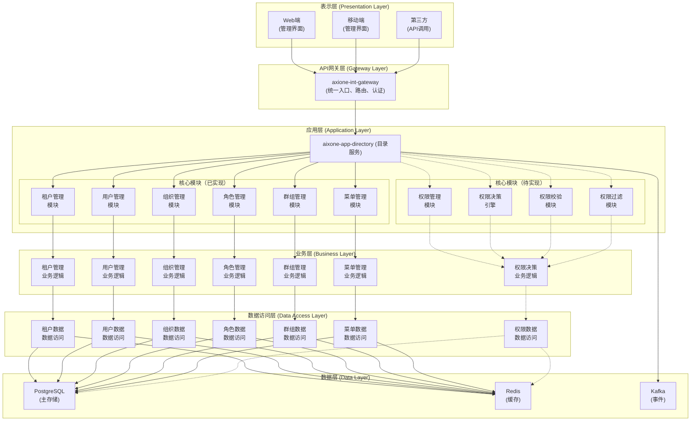
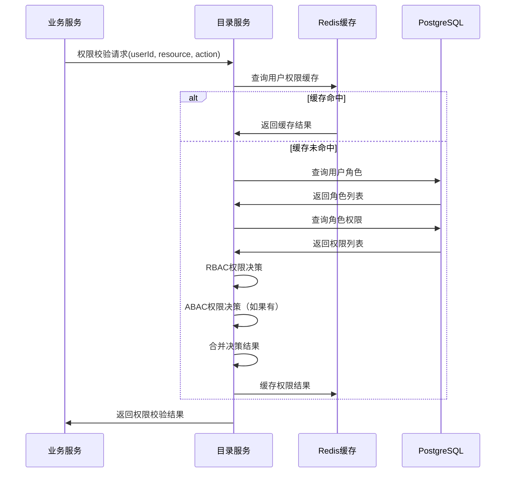

# AixOne目录服务架构设计文档

## 1. 设计概述

### 1.1 目录服务定位

目录服务（Directory Service）作为AixOne应用平台的核心服务之一，是企业级身份和权限管理的基础服务。服务负责管理身份主数据（用户、组织、角色）和业务主数据（菜单），提供统一的权限管理、权限决策、权限校验和权限过滤能力，为整个AixOne生态系统提供标准化的权限支撑。

#### 1.1.1 核心定位

- **身份主数据管理**：管理用户、组织、角色等身份主数据
- **业务主数据管理**：管理菜单主数据，支持菜单的层级结构和配置
- **权限数据管理**：管理权限、角色-权限关系、用户-角色关系等权限数据
- **权限决策引擎**：提供RBAC+ABAC混合权限模型，实现权限决策
- **权限校验接口**：为业务服务提供统一的权限校验接口
- **权限过滤能力**：提供菜单权限过滤、资源权限过滤等能力

#### 1.1.2 业务价值

- **统一权限管理**：为整个平台提供统一的权限管理能力，避免权限分散
- **权限决策集中化**：集中化的权限决策引擎，确保权限决策的一致性
- **主数据管理**：统一管理身份主数据和菜单主数据，确保数据一致性
- **安全合规**：完善的权限控制和审计能力，满足安全合规要求
- **高性能**：通过缓存和优化，提供高性能的权限校验和过滤能力

### 1.2 架构目标

#### 1.2.1 功能目标

- **身份主数据管理**：用户、组织、角色的全生命周期管理
- **菜单主数据管理**：菜单的创建、更新、删除、查询和层级管理
- **权限数据管理**：权限、角色-权限关系、用户-角色关系的管理
- **权限决策**：基于RBAC+ABAC混合模型的权限决策引擎
- **权限校验**：提供统一的权限校验接口，支持功能级、数据级权限校验
- **权限过滤**：提供菜单权限过滤、资源权限过滤等能力
- **多租户支持**：支持多租户的身份和权限隔离

#### 1.2.2 非功能目标

- **性能**：权限校验响应时间不超过50ms，支持高并发访问
- **可用性**：服务可用性不低于99.9%，支持多实例部署
- **可扩展性**：支持水平扩展，支持权限模型的扩展和定制
- **可维护性**：清晰的架构设计和开发规范
- **安全性**：完善的权限控制和数据安全机制

### 1.3 设计原则

#### 1.3.1 核心原则

- **主数据管理**：负责身份主数据和菜单主数据的管理，不涉及业务数据
- **权限统一管理**：所有权限相关功能（权限数据管理、权限决策、权限校验、权限过滤）均由目录服务提供
- **权限决策集中化**：权限决策引擎集中化，确保权限决策的一致性
- **事件驱动**：通过事件总线实现与其他服务的解耦
- **多租户**：支持企业级的多租户需求，实现数据隔离和权限隔离
- **高性能**：通过缓存和优化，提供高性能的权限校验和过滤能力

#### 1.3.2 设计原则

- **高内聚低耦合**：服务内部高内聚，服务间低耦合
- **可扩展性**：支持水平扩展和功能扩展
- **可维护性**：清晰的职责边界和统一的开发规范
- **可观测性**：完善的监控、日志和链路追踪
- **缓存优先**：通过缓存提升查询性能和响应速度

## 2. 目录服务架构

### 2.1 整体架构

#### 2.1.1 分层架构



#### 2.1.2 核心模块

目录服务包含以下核心模块：

| 模块名称 | 模块职责 | 主要功能 | 实现状态 |
|---------|---------|---------|---------|
| **租户管理模块** | 租户、租户组管理 | 租户创建、更新、删除、查询，租户组管理 | ✅ 已实现 |
| **用户管理模块** | 用户管理 | 用户创建、更新、删除、查询，用户-部门/岗位/角色关系管理，用户凭证管理（供认证服务调用） | ✅ 已实现 |
| **组织管理模块** | 组织、部门、岗位管理 | 组织管理、部门管理（支持层级结构）、岗位管理，用户-部门/岗位关系管理 | ✅ 已实现 |
| **角色管理模块** | 角色管理 | 角色创建、更新、删除、查询，用户-角色关系管理，群组-角色关系管理 | ✅ 已实现 |
| **群组管理模块** | 群组管理 | 群组创建、更新、删除、查询，群组-成员关系管理，群组-角色关系管理 | ✅ 已实现 |
| **菜单主数据管理模块** | 菜单主数据管理 | 菜单创建、更新、删除、查询、层级管理，菜单树查询 | ✅ 已实现 |
| **权限数据管理模块** | 权限数据管理 | 权限管理、角色-权限关系管理、权限继承 | ⏳ 待实现（已引入aixone-permission-sdk，待集成） |
| **权限决策引擎模块** | 权限决策 | RBAC权限决策、ABAC权限决策、混合权限决策 | ⏳ 待实现（已引入aixone-permission-sdk，待集成） |
| **权限校验模块** | 权限校验接口 | 功能级权限校验、数据级权限校验、批量权限校验 | ⏳ 待实现（已引入aixone-permission-sdk，待集成） |
| **权限过滤模块** | 权限过滤能力 | 菜单权限过滤、资源权限过滤、数据权限过滤 | ⏳ 待实现（已引入aixone-permission-sdk，待集成） |

### 2.2 领域模型设计

#### 2.2.1 核心实体

**用户实体（User）**：
- id: UUID (用户ID)
- tenant_id: UUID (租户ID)
- email: String (邮箱，唯一)
- hashed_password: String (加密密码)
- profile: Profile (用户档案，包含username、real_name等信息)
- status: UserStatus (状态：ACTIVE/SUSPENDED)
- role_ids: Set<UUID> (角色ID集合)
- group_ids: Set<UUID> (群组ID集合)
- created_at: DateTime (创建时间)
- updated_at: DateTime (更新时间)

**注意**：用户实体包含密码管理功能，供认证服务调用验证用户凭证。

**组织实体（Organization）**：
- id: UUID (组织ID)
- tenant_id: UUID (租户ID)
- name: String (组织名称)
- departments: Set<Department> (部门集合，支持嵌套层级)
- positions: Set<Position> (岗位集合)
- created_at: DateTime (创建时间)
- updated_at: DateTime (更新时间)

**部门实体（Department）**：
- id: UUID (部门ID)
- tenant_id: UUID (租户ID)
- organization_id: UUID (所属组织ID)
- parent_id: UUID (父部门ID，支持层级结构)
- name: String (部门名称)
- created_at: DateTime (创建时间)
- updated_at: DateTime (更新时间)

**岗位实体（Position）**：
- id: UUID (岗位ID)
- tenant_id: UUID (租户ID)
- organization_id: UUID (所属组织ID)
- name: String (岗位名称)
- created_at: DateTime (创建时间)
- updated_at: DateTime (更新时间)

**角色实体（Role）**：
- id: UUID (角色ID)
- tenant_id: UUID (租户ID)
- name: String (角色名称)
- users: Set<UUID> (用户ID集合)
- groups: Set<UUID> (群组ID集合)
- created_at: DateTime (创建时间)
- updated_at: DateTime (更新时间)

**注意**：角色实体通过用户和群组集合管理角色分配关系。权限管理功能待实现。

**菜单实体（Menu）**：
- id: UUID (菜单ID)
- tenant_id: UUID (租户ID)
- parent_id: UUID (父菜单ID)
- name: String (菜单名称)
- title: String (菜单标题)
- path: String (菜单路径)
- icon: String (菜单图标)
- type: String (菜单类型：目录/菜单/按钮)
- render_type: String (渲染类型：tab/iframe等)
- component: String (组件路径)
- url: String (外部URL)
- keepalive: Boolean (是否保持活跃)
- display_order: Integer (显示顺序)
- visible: Boolean (是否可见)
- config: String (菜单配置JSON)
- extend: String (扩展配置JSON)
- created_at: DateTime (创建时间)
- updated_at: DateTime (更新时间)

**注意**：菜单实体现已实现基础管理功能，菜单-角色关系管理待实现。

**群组实体（Group）**：
- id: UUID (群组ID)
- tenant_id: UUID (租户ID)
- name: String (群组名称)
- members: Set<UUID> (成员用户ID集合)
- roles: Set<UUID> (角色ID集合)
- created_at: DateTime (创建时间)
- updated_at: DateTime (更新时间)

**租户实体（Tenant）**：
- id: UUID (租户ID)
- name: String (租户名称)
- group_id: UUID (所属租户组ID)
- status: TenantStatus (状态：ACTIVE/SUSPENDED)
- created_at: DateTime (创建时间)
- updated_at: DateTime (更新时间)

**租户组实体（TenantGroup）**：
- id: UUID (租户组ID)
- name: String (租户组名称)
- parent_id: UUID (父租户组ID，支持层级结构)
- created_at: DateTime (创建时间)
- updated_at: DateTime (更新时间)

**权限实体（Permission）**：
- ⏳ **待实现**：权限实体将在权限模块实现时添加
- 计划包含：permission_id、tenant_id、name、code、resource、action、type、description、abac_conditions等字段

#### 2.2.2 领域服务

**已实现的领域服务**：

**租户管理服务（TenantApplicationService）**：
- 职责：管理租户生命周期
- 方法：
  - createTenant(command): 创建租户
  - updateTenant(tenantId, command): 更新租户
  - deleteTenant(tenantId): 删除租户
  - findTenantById(tenantId): 查询租户
  - findTenants(pageRequest, name, status): 分页查询租户

**租户组管理服务（TenantGroupApplicationService）**：
- 职责：管理租户组
- 方法：
  - createTenantGroup(request): 创建租户组
  - getTenantGroup(id): 查询租户组
  - getAllTenantGroups(): 查询所有租户组

**用户管理服务（UserApplicationService）**：
- 职责：管理用户主数据
- 方法：
  - createUser(tenantId, command): 创建用户（包含密码加密）
  - getUser(tenantId, userId): 查询用户
  - updateUserProfile(tenantId, userId, command): 更新用户档案
  - changePassword(tenantId, userId, command): 修改密码
  - assignRolesToUser(userId, roleIds): 分配用户角色
  - removeRolesFromUser(userId, roleIds): 移除用户角色
  - assignDepartmentsToUser(userId, departmentIds): 分配用户部门
  - assignPositionsToUser(userId, positionIds): 分配用户岗位
  - findUserCredentialsByEmail(tenantId, email): 查询用户凭证（供认证服务调用）

**组织管理服务（OrganizationApplicationService）**：
- 职责：管理组织
- 方法：
  - createOrganization(tenantId, request): 创建组织
  - addDepartmentToOrganization(organizationId, request): 添加部门到组织
  - addPositionToOrganization(organizationId, request): 添加岗位到组织

**部门管理服务（DepartmentApplicationService）**：
- 职责：管理部门
- 方法：
  - assignUsersToDepartment(departmentId, userIds): 分配用户到部门
  - removeUsersFromDepartment(departmentId, userIds): 从部门移除用户

**岗位管理服务（PositionApplicationService）**：
- 职责：管理岗位
- 方法：
  - assignUsersToPosition(positionId, userIds): 分配用户到岗位
  - removeUsersFromPosition(positionId, userIds): 从岗位移除用户

**角色管理服务（RoleApplicationService）**：
- 职责：管理角色
- 方法：
  - createRole(tenantId, request): 创建角色
  - getRole(roleId): 查询角色
  - assignUsersToRole(roleId, userIds): 分配用户到角色
  - removeUsersFromRole(roleId, userIds): 从角色移除用户
  - assignGroupsToRole(roleId, groupIds): 分配群组到角色
  - removeGroupsFromRole(roleId, groupIds): 从角色移除群组
  - addMemberToRole(roleId, request): 添加成员到角色
  - removeMemberFromRole(tenantId, roleId, userId): 从角色移除成员

**群组管理服务（GroupApplicationService）**：
- 职责：管理群组
- 方法：
  - createGroup(tenantId, request): 创建群组
  - getGroup(tenantId, groupId): 查询群组
  - assignUsersToGroup(groupId, userIds): 分配用户到群组
  - removeUsersFromGroup(groupId, userIds): 从群组移除用户
  - assignRolesToGroup(groupId, roleIds): 分配角色到群组
  - removeRolesFromGroup(groupId, roleIds): 从群组移除角色

**菜单管理服务（MenuApplicationService）**：
- 职责：管理菜单主数据
- 方法：
  - createMenu(command): 创建菜单
  - updateMenu(menuId, command): 更新菜单
  - deleteMenu(menuId): 删除菜单
  - findMenuById(menuId): 查询菜单详情
  - findMenus(pageRequest, tenantId, name, title, type): 分页查询菜单
  - findMenusByTenantId(tenantId): 查询租户下所有菜单（树形结构）
  - findRootMenusByTenantId(tenantId): 查询租户下根菜单

**待实现的领域服务**：

**权限管理服务（PermissionManagementService）**：
- ⏳ **待实现**：管理权限数据
- 计划方法：
  - createPermission(permission): 创建权限
  - updatePermission(permissionId, permission): 更新权限
  - deletePermission(permissionId): 删除权限
  - assignRolePermission(roleId, permissionId): 分配角色权限
  - removeRolePermission(roleId, permissionId): 移除角色权限
  - getRolePermissions(roleId): 获取角色权限列表

**权限决策服务（PermissionDecisionService）**：
- ⏳ **待实现**：提供权限决策能力（通过aixone-permission-sdk集成）
- 计划方法：
  - checkPermission(userId, resource, action): 检查用户权限（RBAC）
  - checkPermissionWithABAC(userId, resource, action, context): 检查用户权限（ABAC）
  - checkPermissions(userId, permissions): 批量检查权限
  - filterMenusByPermission(userId, menus): 过滤菜单权限
  - filterResourcesByPermission(userId, resources): 过滤资源权限

**权限校验服务（PermissionValidationService）**：
- ⏳ **待实现**：提供权限校验接口（通过aixone-permission-sdk集成）
- 计划方法：
  - validatePermission(userId, resource, action): 校验权限
  - validatePermissions(userId, permissions): 批量校验权限
  - getUserEffectivePermissions(userId): 获取用户有效权限列表

### 2.3 业务流程设计

#### 2.3.1 权限校验流程

```
1. 业务服务接收请求
2. 业务服务从Token中提取用户ID和租户ID
3. 业务服务调用目录服务的权限校验接口
4. 目录服务权限决策引擎处理：
   a. 获取用户角色列表
   b. 获取角色权限列表
   c. 获取用户ABAC属性
   d. 执行RBAC权限决策
   e. 执行ABAC权限决策
   f. 合并权限决策结果
5. 目录服务返回权限校验结果
6. 业务服务根据权限校验结果决定是否允许访问
```

**流程图**：


#### 2.3.2 菜单权限过滤流程

```
1. 工作台服务调用目录服务的菜单权限过滤接口
2. 目录服务获取菜单主数据
3. 目录服务获取用户权限信息（角色、权限等）
4. 目录服务权限决策引擎处理：
   a. 遍历菜单列表
   b. 检查菜单的可见角色和所需权限
   c. 执行权限决策
   d. 过滤不可见菜单
5. 目录服务返回过滤后的菜单列表
6. 工作台服务应用个性化配置
```

#### 2.3.3 用户角色分配流程

```
1. 管理员分配用户角色
2. 目录服务验证角色存在性和有效性
3. 目录服务创建用户-角色关系
4. 更新用户权限缓存
5. 发布用户角色变更事件
6. 通知相关服务权限变更
```

**事件数据**：
```json
{
  "eventType": "directory.user.role.assigned",
  "userId": "...",
  "roleId": "...",
  "tenantId": "...",
  "timestamp": "..."
}
```

### 2.4 数据模型设计

#### 2.4.1 数据库表设计

**用户表（users）**：
| 字段名 | 类型 | 说明 |
|-------|------|------|
| user_id | UUID | 主键 |
| tenant_id | UUID | 租户ID |
| email | VARCHAR | 邮箱（唯一） |
| hashed_password | VARCHAR | 加密密码 |
| profile | JSONB | 用户档案（包含username、real_name等信息） |
| status | VARCHAR | 状态：ACTIVE/SUSPENDED |
| created_at | TIMESTAMP | 创建时间 |
| updated_at | TIMESTAMP | 更新时间 |

**注意**：用户-部门、用户-岗位、用户-角色关系通过关联表管理。

**组织表（organizations）**：
| 字段名 | 类型 | 说明 |
|-------|------|------|
| organization_id | UUID | 主键 |
| tenant_id | UUID | 租户ID |
| name | VARCHAR | 组织名称 |
| created_at | TIMESTAMP | 创建时间 |
| updated_at | TIMESTAMP | 更新时间 |

**部门表（departments）**：
| 字段名 | 类型 | 说明 |
|-------|------|------|
| department_id | UUID | 主键 |
| tenant_id | UUID | 租户ID |
| organization_id | UUID | 所属组织ID |
| parent_id | UUID | 父部门ID（支持层级结构） |
| name | VARCHAR | 部门名称 |
| created_at | TIMESTAMP | 创建时间 |
| updated_at | TIMESTAMP | 更新时间 |

**岗位表（positions）**：
| 字段名 | 类型 | 说明 |
|-------|------|------|
| position_id | UUID | 主键 |
| tenant_id | UUID | 租户ID |
| organization_id | UUID | 所属组织ID |
| name | VARCHAR | 岗位名称 |
| created_at | TIMESTAMP | 创建时间 |
| updated_at | TIMESTAMP | 更新时间 |

**角色表（roles）**：
| 字段名 | 类型 | 说明 |
|-------|------|------|
| role_id | UUID | 主键 |
| tenant_id | UUID | 租户ID |
| name | VARCHAR | 角色名称 |
| created_at | TIMESTAMP | 创建时间 |
| updated_at | TIMESTAMP | 更新时间 |

**群组表（groups）**：
| 字段名 | 类型 | 说明 |
|-------|------|------|
| group_id | UUID | 主键 |
| tenant_id | UUID | 租户ID |
| name | VARCHAR | 群组名称 |
| created_at | TIMESTAMP | 创建时间 |
| updated_at | TIMESTAMP | 更新时间 |

**租户表（tenants）**：
| 字段名 | 类型 | 说明 |
|-------|------|------|
| tenant_id | UUID | 主键 |
| name | VARCHAR | 租户名称 |
| group_id | UUID | 所属租户组ID |
| status | VARCHAR | 状态：ACTIVE/SUSPENDED |
| created_at | TIMESTAMP | 创建时间 |
| updated_at | TIMESTAMP | 更新时间 |

**租户组表（tenant_groups）**：
| 字段名 | 类型 | 说明 |
|-------|------|------|
| group_id | UUID | 主键 |
| name | VARCHAR | 租户组名称 |
| parent_id | UUID | 父租户组ID（支持层级结构） |
| created_at | TIMESTAMP | 创建时间 |
| updated_at | TIMESTAMP | 更新时间 |

**用户角色关系表（user_roles）**：
| 字段名 | 类型 | 说明 |
|-------|------|------|
| id | UUID | 主键 |
| user_id | UUID | 用户ID |
| role_id | UUID | 角色ID |
| tenant_id | UUID | 租户ID |
| created_at | TIMESTAMP | 创建时间 |

**菜单表（menus）**：
| 字段名 | 类型 | 说明 |
|-------|------|------|
| menu_id | UUID | 主键 |
| tenant_id | UUID | 租户ID |
| parent_id | UUID | 父菜单ID |
| name | VARCHAR | 菜单名称 |
| title | VARCHAR | 菜单标题 |
| path | VARCHAR | 菜单路径 |
| icon | VARCHAR | 菜单图标 |
| type | VARCHAR | 菜单类型：目录/菜单/按钮 |
| render_type | VARCHAR | 渲染类型：tab/iframe等 |
| component | VARCHAR | 组件路径 |
| url | VARCHAR | 外部URL |
| keepalive | BOOLEAN | 是否保持活跃 |
| display_order | INTEGER | 显示顺序 |
| visible | BOOLEAN | 是否可见 |
| config | TEXT | 菜单配置JSON |
| extend | TEXT | 扩展配置JSON |
| created_at | TIMESTAMP | 创建时间 |
| updated_at | TIMESTAMP | 更新时间 |

**用户角色关系表（user_roles）**：
| 字段名 | 类型 | 说明 |
|-------|------|------|
| user_id | UUID | 用户ID |
| role_id | UUID | 角色ID |
| tenant_id | UUID | 租户ID |

**用户部门关系表（user_departments）**：
| 字段名 | 类型 | 说明 |
|-------|------|------|
| user_id | UUID | 用户ID |
| department_id | UUID | 部门ID |
| tenant_id | UUID | 租户ID |

**用户岗位关系表（user_positions）**：
| 字段名 | 类型 | 说明 |
|-------|------|------|
| user_id | UUID | 用户ID |
| position_id | UUID | 岗位ID |
| tenant_id | UUID | 租户ID |

**群组成员关系表（group_members）**：
| 字段名 | 类型 | 说明 |
|-------|------|------|
| group_id | UUID | 群组ID |
| user_id | UUID | 用户ID |
| tenant_id | UUID | 租户ID |

**群组角色关系表（group_roles）**：
| 字段名 | 类型 | 说明 |
|-------|------|------|
| group_id | UUID | 群组ID |
| role_id | UUID | 角色ID |
| tenant_id | UUID | 租户ID |

**菜单角色关系表（menu_roles）**：
| 字段名 | 类型 | 说明 |
|-------|------|------|
| menu_id | UUID | 菜单ID |
| role_id | UUID | 角色ID |
| tenant_id | UUID | 租户ID |

**注意**：菜单-角色关系表已规划，但代码中待实现。

**权限表（permissions）**：
| 字段名 | 类型 | 说明 |
|-------|------|------|
| permission_id | UUID | 主键 |
| tenant_id | UUID | 租户ID |
| name | VARCHAR | 权限名称 |
| code | VARCHAR | 权限编码（唯一） |
| resource | VARCHAR | 资源标识 |
| action | VARCHAR | 操作：READ/WRITE/DELETE等 |
| type | VARCHAR | 权限类型：FUNCTIONAL/DATA |
| description | VARCHAR | 权限描述 |
| abac_conditions | JSONB | ABAC条件 |
| created_at | TIMESTAMP | 创建时间 |
| updated_at | TIMESTAMP | 更新时间 |

**角色权限关系表（role_permissions）**：
| 字段名 | 类型 | 说明 |
|-------|------|------|
| role_id | UUID | 角色ID |
| permission_id | UUID | 权限ID |
| tenant_id | UUID | 租户ID |
| created_at | TIMESTAMP | 创建时间 |

**注意**：权限表和角色权限关系表待实现（权限功能模块实现时创建）。

#### 2.4.2 缓存设计

**Redis缓存策略**：

| 缓存键 | 数据类型 | TTL | 说明 |
|-------|---------|-----|------|
| directory:user:{userId}:{tenantId} | Hash | 24小时 | 用户信息缓存 |
| directory:user:{userId}:roles:{tenantId} | Set | 24小时 | 用户角色缓存 |
| directory:user:{userId}:permissions:{tenantId} | Set | 24小时 | 用户权限缓存 |
| directory:menu:{tenantId}:tree | String | 1小时 | 菜单树缓存 |
| directory:role:{roleId}:permissions:{tenantId} | Set | 24小时 | 角色权限缓存 |
| directory:permission:{permissionId}:{tenantId} | Hash | 24小时 | 权限信息缓存 |
| directory:permission:check:{userId}:{resource}:{action}:{tenantId} | String | 1小时 | 权限校验结果缓存 |

**缓存更新策略**：
- **Cache-Aside模式**：先查缓存，未命中查数据库，并写入缓存
- **主动失效**：数据变更时清除相关缓存
- **定时刷新**：低频率数据定时刷新缓存
- **批量更新**：批量操作时批量更新缓存

## 3. 核心功能设计

### 3.1 身份主数据管理

#### 3.1.1 用户管理

**用户管理功能**：
- 用户创建、更新、删除、查询
- 用户状态管理（启用/禁用）
- 用户组织分配
- 用户角色分配
- 用户ABAC属性管理

**用户查询**：
- 支持按用户名、邮箱、手机号查询
- 支持按组织查询
- 支持按角色查询
- 支持分页和排序

#### 3.1.2 组织管理

**组织管理功能**：
- 组织创建、更新、删除、查询
- 组织层级管理（树形结构）
- 组织路径管理
- 组织用户管理

**组织树结构**：
- 支持多级组织层级
- 支持组织路径查询
- 支持组织树查询
- 支持组织权限继承

#### 3.1.3 角色管理

**角色管理功能**：
- 角色创建、更新、删除、查询
- 角色权限分配
- 角色类型管理（系统角色/业务角色）
- 角色状态管理（启用/禁用）

**角色类型**：
- **系统角色**：系统内置角色，不可删除
- **业务角色**：业务自定义角色，可删除

### 3.2 菜单主数据管理

#### 3.2.1 菜单管理

**菜单管理功能**：
- 菜单创建、更新、删除、查询
- 菜单层级管理（树形结构）
- 菜单顺序管理
- 菜单可见性管理
- 菜单角色关联

**菜单类型**：
- **目录**：菜单目录，用于组织菜单结构
- **菜单**：实际菜单项，对应页面路由
- **按钮**：按钮级权限，对应操作权限

#### 3.2.2 菜单权限关联

**权限关联方式**：
- **角色关联**：菜单关联角色，拥有该角色的用户可见
- **权限关联**：菜单关联权限，拥有该权限的用户可见
- **组合关联**：支持角色和权限的组合关联

### 3.3 权限管理

#### 3.3.1 权限数据管理

**权限管理功能**：
- 权限创建、更新、删除、查询
- 权限类型管理（功能权限/数据权限）
- 权限资源标识管理
- 权限操作管理（read/write/delete等）
- 权限ABAC条件管理

**权限类型**：
- **功能权限**：控制功能访问权限
- **数据权限**：控制数据访问权限

#### 3.3.2 角色权限关系

**关系管理**：
- 角色权限分配
- 角色权限移除
- 角色权限查询
- 权限继承（支持角色权限继承）

### 3.4 权限决策引擎

#### 3.4.1 RBAC权限决策

**RBAC决策流程**：
1. 获取用户角色列表
2. 获取角色权限列表
3. 检查资源所需权限
4. 判断用户是否拥有所需权限
5. 返回决策结果

**权限继承**：
- 支持角色权限继承
- 支持组织权限继承
- 支持权限组合（AND/OR逻辑）

#### 3.4.2 ABAC权限决策

**ABAC决策流程**：
1. 获取用户ABAC属性
2. 获取资源ABAC属性
3. 获取环境ABAC属性
4. 执行ABAC条件判断
5. 返回决策结果

**ABAC属性**：
- **用户属性**：用户ID、组织、角色、自定义属性等
- **资源属性**：资源ID、资源类型、资源所有者等
- **环境属性**：时间、地点、IP等

#### 3.4.3 混合权限决策

**混合决策流程**：
1. 执行RBAC权限决策
2. 执行ABAC权限决策（如果有ABAC条件）
3. 合并决策结果（AND逻辑）
4. 返回最终决策结果

**决策逻辑**：
- RBAC和ABAC结果取交集（AND逻辑）
- 支持权限组合（AND/OR逻辑）
- 支持权限否定（NOT逻辑）

### 3.5 权限校验

#### 3.5.1 功能权限校验

**校验接口**：
- `POST /api/v1/directory/permissions/check`：单权限校验
- `POST /api/v1/directory/permissions/check-batch`：批量权限校验

**校验流程**：
1. 提取用户ID和租户ID
2. 查询用户权限缓存
3. 如果缓存未命中，执行权限决策
4. 返回权限校验结果

#### 3.5.2 数据权限校验

**数据权限校验**：
- 支持基于组织的数据权限
- 支持基于资源所有者的数据权限
- 支持基于ABAC条件的数据权限
- 支持数据权限组合

### 3.6 权限过滤

#### 3.6.1 菜单权限过滤

**过滤接口**：
- `POST /api/v1/directory/menus/filter`：菜单权限过滤

**过滤流程**：
1. 获取菜单主数据
2. 获取用户权限信息
3. 遍历菜单列表
4. 执行权限决策
5. 过滤不可见菜单
6. 返回过滤后的菜单列表

#### 3.6.2 资源权限过滤

**资源权限过滤**：
- 支持列表资源过滤
- 支持树形资源过滤
- 支持批量资源过滤
- 支持基于ABAC条件的资源过滤

## 4. 集成设计

### 4.1 与平台其他服务的集成

#### 4.1.1 与认证服务的集成

**依赖服务**：axione-tech-auth（单向依赖）

**集成方式**：
- Token验证：认证服务验证Token后，目录服务从Token中提取用户ID和租户ID
- 用户关联：认证服务的用户ID和目录服务的用户ID通过邮箱或唯一标识进行关联
- **重要**：认证服务独立运行，不调用目录服务，目录服务也不提供用户凭证查询接口

**接口规范**：
- 无：认证服务不调用目录服务，两者完全独立

**职责划分**：
- **认证服务**：负责身份认证、Token管理，独立维护认证用户信息（用户名、密码等）
- **目录服务**：负责用户主数据管理（姓名、组织、角色等），不管理认证凭证

**数据关联**：
- 认证服务的用户和目录服务的用户通过邮箱或唯一标识进行关联
- Token中的用户ID可以是认证服务的用户ID
- 业务服务可以使用Token中的用户ID去目录服务查询用户详细信息

**注意**：
- 认证服务完全独立，不依赖目录服务
- 认证服务不管理权限，权限完全由目录服务提供（待实现）
- 目录服务不进行Token管理，Token由认证服务管理
- 认证凭证（用户名、密码）由认证服务管理，用户主数据由目录服务管理
- 两者数据完全分离，通过邮箱或唯一标识进行关联

#### 4.1.2 与工作台服务的集成

**依赖服务**：axione-app-workbench

**集成方式**：
- REST API调用
- 菜单主数据提供
- 权限数据提供
- 权限过滤和权限校验

**接口规范**：
- `GET /api/v1/menus/tenant/{tenantId}`：获取菜单主数据（树形结构）
- `GET /api/v1/menus/tenant/{tenantId}/roots`：获取租户下根菜单
- ⏳ `GET /api/v1/directory/users/{userId}/roles`：获取用户角色（待实现）
- ⏳ `GET /api/v1/directory/users/{userId}/permissions`：获取用户权限（待实现）
- ⏳ `POST /api/v1/directory/permissions/check`：权限校验（菜单、资源等）（待实现）
- ⏳ `POST /api/v1/directory/menus/filter`：菜单权限过滤（返回用户可见菜单）（待实现）

**职责划分**：
- **目录服务**：负责菜单主数据管理、权限数据管理、权限决策、权限过滤
- **工作台服务**：负责调用目录服务获取数据和权限过滤结果，应用个性化配置

#### 4.1.3 与业务服务的集成

**依赖服务**：业务服务（如ITSM、Application等）

**集成方式**：
- REST API调用
- 权限校验接口
- 权限过滤接口

**接口规范**：
- ⏳ `POST /api/v1/directory/permissions/check`：权限校验（待实现）
- ⏳ `POST /api/v1/directory/permissions/check-batch`：批量权限校验（待实现）
- ⏳ `POST /api/v1/directory/resources/filter`：资源权限过滤（待实现）

**职责划分**：
- **目录服务**：负责权限数据管理、权限决策、权限校验、权限过滤
- **业务服务**：负责业务逻辑，调用目录服务进行权限校验

#### 4.1.4 与事件中心的集成

**依赖服务**：axione-event-center

**集成方式**：
- 事件发布
- 事件订阅

**发布事件**：
- `directory.user.created`：用户创建事件
- `directory.user.updated`：用户更新事件
- `directory.user.role.assigned`：用户角色分配事件
- `directory.user.role.removed`：用户角色移除事件
- `directory.menu.created`：菜单创建事件
- `directory.menu.updated`：菜单更新事件
- `directory.permission.created`：权限创建事件
- `directory.permission.updated`：权限更新事件

**订阅事件**：
- 订阅其他服务的身份变更事件（如有需要）

### 4.2 多租户设计

#### 4.2.1 租户隔离

**数据隔离**：
- 数据库层面：使用tenant_id作为分区键
- 查询层面：自动添加tenant_id条件
- 缓存层面：tenant_id作为缓存键的一部分

**权限隔离**：
- 租户级权限数据隔离
- 租户级角色数据隔离
- 租户级菜单数据隔离
- 跨租户权限校验禁止

#### 4.2.2 租户管理

**租户初始化**：
1. 创建租户
2. 初始化租户默认组织
3. 初始化租户默认角色
4. 初始化租户默认菜单
5. 初始化租户默认权限

**租户配置**：
- 租户基本信息
- 租户功能模块
- 租户权限配置
- 租户菜单配置

## 5. 安全设计

### 5.1 认证授权

#### 5.1.1 服务认证

- **认证方式**：通过axione-tech-auth统一认证
- **Token验证**：通过Gateway统一验证Token有效性
- **用户标识**：从Token中提取用户ID和租户ID

#### 5.1.2 权限控制

**权限控制职责**：
- **目录服务**：负责所有权限相关功能（权限数据管理、权限决策、权限校验、权限过滤）
- **其他服务**：调用目录服务进行权限校验，不进行权限决策

**权限控制方式**：
- **管理接口权限**：管理接口需要管理员权限
- **数据权限**：基于租户的数据权限控制
- **操作权限**：基于角色的操作权限控制

### 5.2 数据安全

#### 5.2.1 数据传输安全

- **HTTPS**：所有API接口使用HTTPS
- **数据加密**：敏感数据传输加密
- **API签名**：API请求签名验证

#### 5.2.2 数据存储安全

- **数据加密**：敏感数据加密存储
- **数据脱敏**：日志数据脱敏处理
- **访问控制**：基于租户的数据访问控制

### 5.3 审计日志

#### 5.3.1 日志记录

- **操作日志**：记录关键操作（用户创建、角色分配、权限变更等）
- **访问日志**：记录API访问日志
- **权限日志**：记录权限校验日志

#### 5.3.2 日志存储

- **日志格式**：结构化JSON格式
- **日志存储**：Elasticsearch存储
- **日志检索**：支持日志检索和分析

## 6. 性能设计

### 6.1 性能指标

#### 6.1.1 性能目标

| 指标 | 目标值 | 测量方式 |
|------|-------|---------|
| 权限校验响应时间 | < 50ms | API响应时间 |
| 菜单查询响应时间 | < 100ms | API响应时间 |
| 用户查询响应时间 | < 100ms | API响应时间 |
| 缓存命中率 | > 80% | 缓存统计 |
| 并发用户数 | > 1000 | 负载测试 |

#### 6.1.2 性能优化

**缓存优化**：
- 用户权限缓存
- 角色权限缓存
- 菜单树缓存
- 权限校验结果缓存

**查询优化**：
- 索引优化（用户ID、角色ID、权限ID索引）
- 分页查询
- 批量查询
- 懒加载

**异步处理**：
- 权限变更异步通知
- 缓存更新异步处理
- 事件发布异步处理

### 6.2 可扩展性设计

#### 6.2.1 水平扩展

- **无状态设计**：服务无状态，支持水平扩展
- **负载均衡**：通过Gateway实现负载均衡
- **数据分片**：支持数据分片和分布式存储

#### 6.2.2 功能扩展

- **权限模型扩展**：支持权限模型的扩展和定制
- **ABAC条件扩展**：支持ABAC条件的扩展
- **权限决策扩展**：支持权限决策规则的扩展

## 7. 接口设计

### 7.1 REST API设计

#### 7.1.1 租户管理API

**租户管理**：
- `GET /api/v1/tenants`：获取租户列表（分页，支持名称和状态过滤）
- `GET /api/v1/tenants/{tenantId}`：获取租户详情
- `POST /api/v1/tenants`：创建租户
- `PUT /api/v1/tenants/{tenantId}`：更新租户
- `DELETE /api/v1/tenants/{tenantId}`：删除租户
- `POST /api/v1/tenants/batch-delete`：批量删除租户

**租户组管理**：
- `GET /api/v1/tenant-groups`：获取所有租户组
- `GET /api/v1/tenant-groups/{id}`：获取租户组详情
- `GET /api/v1/tenant-groups/parent/{parentId}`：根据父ID获取租户组
- `POST /api/v1/tenant-groups`：创建租户组

#### 7.1.2 用户管理API

**用户管理**：
- `GET /api/v1/tenants/{tenantId}/users/{userId}`：获取用户详情
- `POST /api/v1/tenants/{tenantId}/users`：创建用户
- `PUT /api/v1/tenants/{tenantId}/users/{userId}/profile`：更新用户档案
- `PUT /api/v1/tenants/{tenantId}/users/{userId}/password`：修改密码
- `POST /api/v1/tenants/{tenantId}/users/{userId}/departments`：分配用户部门
- `DELETE /api/v1/tenants/{tenantId}/users/{userId}/departments`：移除用户部门
- `POST /api/v1/tenants/{tenantId}/users/{userId}/positions`：分配用户岗位
- `DELETE /api/v1/tenants/{tenantId}/users/{userId}/positions`：移除用户岗位
- `POST /api/v1/tenants/{tenantId}/users/{userId}/roles`：分配用户角色
- `DELETE /api/v1/tenants/{tenantId}/users/{userId}/roles`：移除用户角色

**内部接口（供认证服务调用）**：
- `GET /internal/v1/tenants/{tenantId}/users/credentials/{email}`：获取用户凭证（用于用户验证）

#### 7.1.3 组织管理API

**组织管理**：
- ⏳ 组织管理接口待实现（代码中已有OrganizationApplicationService，但Controller待补充）

**部门管理**：
- `POST /api/v1/tenants/{tenantId}/organizations/{organizationId}/departments`：创建部门
- `POST /api/v1/tenants/{tenantId}/organizations/{organizationId}/departments/{departmentId}/users`：分配用户到部门
- `DELETE /api/v1/tenants/{tenantId}/organizations/{organizationId}/departments/{departmentId}/users`：从部门移除用户

**岗位管理**：
- `POST /api/v1/tenants/{tenantId}/organizations/{organizationId}/positions`：创建岗位
- `POST /api/v1/tenants/{tenantId}/organizations/{organizationId}/positions/{positionId}/users`：分配用户到岗位
- `DELETE /api/v1/tenants/{tenantId}/organizations/{organizationId}/positions/{positionId}/users`：从岗位移除用户

#### 7.1.4 角色管理API

**角色管理**：
- `GET /api/tenants/{tenantId}/roles/{roleId}`：获取角色详情
- `POST /api/tenants/{tenantId}/roles`：创建角色
- `POST /api/tenants/{tenantId}/roles/{roleId}/members`：添加成员到角色
- `DELETE /api/tenants/{tenantId}/roles/{roleId}/members/{userId}`：从角色移除成员
- `POST /api/tenants/{tenantId}/roles/{roleId}/users`：分配用户到角色
- `DELETE /api/tenants/{tenantId}/roles/{roleId}/users`：从角色移除用户
- `POST /api/tenants/{tenantId}/roles/{roleId}/groups`：分配群组到角色
- `DELETE /api/tenants/{tenantId}/roles/{roleId}/groups`：从角色移除群组

**注意**：角色API路径为 `/api/tenants/{tenantId}/roles`（未包含v1版本号）

#### 7.1.5 群组管理API

**群组管理**：
- `GET /api/v1/tenants/{tenantId}/groups/{groupId}`：获取群组详情
- `POST /api/v1/tenants/{tenantId}/groups`：创建群组
- `POST /api/v1/tenants/{tenantId}/groups/{groupId}/members`：分配用户到群组
- `DELETE /api/v1/tenants/{tenantId}/groups/{groupId}/members`：从群组移除用户
- `POST /api/v1/tenants/{tenantId}/groups/{groupId}/roles`：分配角色到群组
- `DELETE /api/v1/tenants/{tenantId}/groups/{groupId}/roles`：从群组移除角色

#### 7.1.6 菜单管理API

**菜单管理**：
- `GET /api/v1/menus`：获取菜单列表（分页，支持名称、标题、类型过滤和排序）
- `GET /api/v1/menus/{menuId}`：获取菜单详情
- `GET /api/v1/menus/tenant/{tenantId}`：获取租户下所有菜单（树形结构）
- `GET /api/v1/menus/tenant/{tenantId}/roots`：获取租户下根菜单
- `POST /api/v1/menus`：创建菜单
- `PUT /api/v1/menus/{menuId}`：更新菜单
- `DELETE /api/v1/menus/{menuId}`：删除菜单

**注意**：菜单API路径为 `/api/v1/menus`（未包含directory前缀），菜单-角色关系管理待实现。

#### 7.1.7 权限管理API（待实现）

**权限管理**：
- ⏳ `GET /api/v1/directory/permissions`：获取权限列表（待实现）
- ⏳ `GET /api/v1/directory/permissions/{permissionId}`：获取权限详情（待实现）
- ⏳ `POST /api/v1/directory/permissions`：创建权限（待实现）
- ⏳ `PUT /api/v1/directory/permissions/{permissionId}`：更新权限（待实现）
- ⏳ `DELETE /api/v1/directory/permissions/{permissionId}`：删除权限（待实现）
- ⏳ `POST /api/v1/directory/permissions/check`：权限校验（待实现）
- ⏳ `POST /api/v1/directory/permissions/check-batch`：批量权限校验（待实现）
- ⏳ `POST /api/v1/directory/menus/filter`：菜单权限过滤（待实现）

#### 7.1.8 API响应规范

**统一响应格式**：
```json
{
  "code": "SUCCESS",
  "message": "操作成功",
  "data": {
    // 响应数据
  },
  "timestamp": "2024-01-01T00:00:00Z"
}
```

**统一错误码**：
| 错误码 | HTTP状态码 | 说明 |
|-------|-----------|------|
| SUCCESS | 200 | 操作成功 |
| BAD_REQUEST | 400 | 请求参数错误 |
| UNAUTHORIZED | 401 | 未认证 |
| FORBIDDEN | 403 | 无权限 |
| NOT_FOUND | 404 | 资源不存在 |
| INTERNAL_ERROR | 500 | 服务器内部错误 |

## 8. 实施建议

### 8.1 实施计划

#### 8.1.1 第一阶段：核心功能实现（P0）✅ 已完成

**时间**：2024年Q1

**目标**：
1. ✅ 实现身份主数据管理（用户、组织、角色、群组）
2. ✅ 实现菜单主数据管理
3. ✅ 实现租户管理
4. ✅ 实现用户凭证管理（供认证服务调用）
5. ✅ 实现DDD分层架构

**关键里程碑**：
- ✅ 身份主数据管理上线
- ✅ 菜单主数据管理上线
- ✅ 租户管理上线
- ✅ 用户凭证管理上线

#### 8.1.2 第二阶段：权限功能实现（P0）⏳ 进行中

**时间**：2024年Q2

**目标**：
1. ⏳ 集成aixone-permission-sdk，实现UserPermissionProvider
2. ⏳ 实现权限数据管理（权限实体、角色-权限关系）
3. ⏳ 实现基础权限决策引擎（RBAC）
4. ⏳ 实现权限校验接口
5. ⏳ 实现菜单-角色关系管理

**关键里程碑**：
- ⏳ 权限SDK集成完成
- ⏳ 权限决策引擎上线
- ⏳ 权限校验接口上线
- ⏳ 菜单-角色关系管理上线

#### 8.1.3 第三阶段：功能完善（P1）

**时间**：2024年Q3

**目标**：
1. 实现ABAC权限决策
2. 实现混合权限决策（RBAC+ABAC）
3. 实现权限过滤功能
4. 实现事件发布功能
5. 完善缓存策略

**关键里程碑**：
- ABAC权限决策上线
- 权限过滤功能上线
- 事件发布功能上线

#### 8.1.4 第四阶段：优化和扩展（P2）

**时间**：2024年Q4

**目标**：
1. 性能优化（查询优化、索引优化）
2. 权限模型扩展
3. 权限决策规则扩展
4. 完善监控和日志
5. 用户体验优化

**关键里程碑**：
- 性能优化完成
- 权限模型扩展完成
- 监控和日志完善

### 8.2 技术选型

#### 8.2.1 后端技术

| 技术 | 版本 | 用途 |
|------|-----|------|
| Spring Boot | 3.5+ | 应用框架 |
| Spring Cloud | 2023.x | 微服务框架 |
| PostgreSQL | 14+ | 主数据库 |
| Redis | 7.0+ | 缓存 |
| Kafka | 3.5+ | 消息队列 |

#### 8.2.2 前端技术

| 技术 | 版本 | 用途 |
|------|-----|------|
| Vue 3 | 3.4+ | 前端框架 |
| Element Plus | 2.4+ | UI组件库 |
| Pinia | 2.1+ | 状态管理 |

### 8.3 风险管理

#### 8.3.1 技术风险

| 风险类型 | 风险描述 | 缓解措施 |
|---------|---------|---------|
| 性能风险 | 权限校验性能不足 | Redis缓存、索引优化 |
| 可用性风险 | 服务可用性不足 | 多实例部署、故障转移 |
| 数据一致性风险 | 权限数据不一致 | 事件驱动、最终一致性 |
| 依赖风险 | 依赖外部服务失败 | 熔断降级、超时控制 |

#### 8.3.2 实施风险

| 风险类型 | 风险描述 | 缓解措施 |
|---------|---------|---------|
| 进度风险 | 开发进度延期 | 分阶段实施、敏捷开发 |
| 质量风险 | 代码质量不足 | 代码审查、单元测试 |
| 集成风险 | 服务集成问题 | 接口契约、集成测试 |
| 权限模型风险 | 权限模型设计不合理 | 充分调研、专家评审 |

## 9. 代码组织结构

### 9.1 DDD分层结构

```
services/aixone-app-directory/
├── src/main/java/com/aixone/directory/
│   ├── config/                           # 配置类
│   │   ├── SecurityConfig.java          # Spring Security配置
│   │   └── SessionConfig.java           # Session拦截器配置
│   ├── DirectoryServeApplication.java   # 应用启动类
│   │
│   ├── tenant/                          # 租户领域
│   │   ├── application/                 # 应用层
│   │   │   ├── TenantApplicationService.java
│   │   │   ├── TenantGroupApplicationService.java
│   │   │   └── dto/                     # DTO对象
│   │   ├── domain/                     # 领域层
│   │   │   ├── aggregate/              # 聚合根（Tenant、TenantGroup、TenantStatus）
│   │   │   └── repository/             # 仓储接口
│   │   ├── infrastructure/             # 基础设施层
│   │   │   └── persistence/           # 持久化实现（JPA Repository、Mapper、PostgresRepository）
│   │   └── interfaces/                # 接口层
│   │       └── rest/                   # REST控制器（TenantController、TenantGroupController）
│   │
│   ├── user/                           # 用户领域
│   │   ├── application/
│   │   │   ├── UserApplicationService.java
│   │   │   ├── UserDto.java
│   │   │   └── UserDtoMapper.java
│   │   ├── domain/
│   │   │   ├── aggregate/              # User、Profile、UserStatus
│   │   │   └── repository/
│   │   ├── infrastructure/
│   │   │   └── persistence/
│   │   └── interfaces/
│   │       ├── rest/                   # UserController
│   │       └── internal/               # UserInternalController（供认证服务调用）
│   │
│   ├── organization/                   # 组织领域
│   │   ├── application/
│   │   │   ├── OrganizationApplicationService.java
│   │   │   ├── DepartmentApplicationService.java
│   │   │   ├── PositionApplicationService.java
│   │   │   ├── dto/                    # OrganizationDto、DepartmentDto、PositionDto
│   │   │   └── *DtoMapper.java         # MapStruct映射器
│   │   ├── domain/
│   │   │   ├── aggregate/              # Organization、Department、Position
│   │   │   └── repository/
│   │   ├── infrastructure/
│   │   │   └── persistence/
│   │   └── interfaces/
│   │       └── rest/                   # DepartmentController、PositionController
│   │
│   ├── role/                           # 角色领域
│   │   ├── application/
│   │   │   ├── RoleApplicationService.java
│   │   │   └── dto/                    # RoleDto、CreateRoleRequest等
│   │   ├── domain/
│   │   │   ├── aggregate/              # Role
│   │   │   └── repository/
│   │   ├── infrastructure/
│   │   │   └── persistence/
│   │   └── interfaces/
│   │       └── rest/                   # RoleController
│   │
│   ├── group/                          # 群组领域
│   │   ├── application/
│   │   │   ├── GroupApplicationService.java
│   │   │   └── dto/                    # GroupDto、CreateGroupRequest等
│   │   ├── domain/
│   │   │   ├── aggregate/              # Group
│   │   │   └── repository/
│   │   ├── infrastructure/
│   │   │   └── persistence/
│   │   └── interfaces/
│   │       └── rest/                   # GroupController
│   │
│   └── menu/                           # 菜单领域
│       ├── application/
│       │   ├── MenuApplicationService.java
│       │   └── MenuDto.java
│       ├── domain/
│       │   ├── aggregate/              # Menu
│       │   └── repository/
│       ├── infrastructure/
│       │   └── persistence/
│       └── interfaces/
│           └── rest/                   # MenuController
│
├── src/main/resources/
│   ├── application.yml                  # 应用配置
│   └── db/migration/                    # Flyway数据库迁移脚本
│       ├── V1__Create_tenant_groups.sql
│       ├── V5__Create_menus_table.sql
│       └── ...
│
└── src/test/                           # 测试代码
    └── java/com/aixone/directory/
        └── tenant/                     # 测试用例（待完善）
```

### 9.2 DDD分层说明

#### 9.2.1 应用层（Application Layer）
- **职责**：协调领域对象完成业务用例
- **组件**：应用服务（*ApplicationService）、DTO对象、DTO映射器（MapStruct）
- **特点**：无业务逻辑，只做流程编排
- **实现状态**：✅ 各领域模块均已实现应用服务

#### 9.2.2 领域层（Domain Layer）
- **职责**：核心业务逻辑和规则
- **组件**：聚合根（Aggregate）、仓储接口（Repository）
- **特点**：业务核心，不依赖外部技术
- **实现状态**：✅ 各领域模块均已实现聚合根和仓储接口

#### 9.2.3 基础设施层（Infrastructure Layer）
- **职责**：技术实现和外部集成
- **组件**：持久化实现（JPA Repository、MapStruct Mapper、PostgresRepository）、缓存、外部服务
- **特点**：技术实现，依赖领域层接口
- **实现状态**：✅ 各领域模块均已实现持久化层

#### 9.2.4 接口层（Interface Layer）
- **职责**：对外提供API和事件处理
- **组件**：REST控制器（Controller）、内部接口（Internal Controller）、事件监听器
- **特点**：协议适配，调用应用层服务
- **实现状态**：✅ 各领域模块均已实现REST控制器，用户模块实现了内部接口

### 9.3 技术栈

**已实现的技术栈**：
- **框架**：Spring Boot 3.x、Spring Data JPA
- **数据库**：PostgreSQL 14+、Flyway（数据库迁移）
- **缓存**：Redis 7.0+（已配置，待使用）
- **对象映射**：MapStruct（DTO映射）
- **密码加密**：Spring Security BCrypt
- **依赖**：aixone-common-sdk、aixone-permission-sdk（已引入，待集成）

**待集成的技术栈**：
- **消息队列**：Kafka（事件发布，待实现）
- **权限SDK**：aixone-permission-sdk（权限功能集成，待实现）

## 10. 实施状态

### 10.1 已实现功能

#### 10.1.1 核心领域模块
- ✅ **租户管理**：租户和租户组的完整CRUD功能
- ✅ **用户管理**：用户创建、更新、查询、密码管理、用户-部门/岗位/角色关系管理
- ✅ **组织管理**：组织、部门、岗位的创建和管理，支持层级结构
- ✅ **角色管理**：角色创建、查询、用户-角色关系管理、群组-角色关系管理
- ✅ **群组管理**：群组创建、查询、群组-成员关系管理、群组-角色关系管理
- ✅ **菜单管理**：菜单创建、更新、删除、查询、树形结构查询

#### 10.1.2 技术架构
- ✅ DDD四层架构（应用层、领域层、基础设施层、接口层）
- ✅ JPA持久化实现
- ✅ MapStruct DTO映射
- ✅ Flyway数据库迁移
- ✅ 多租户数据隔离（基于tenant_id）
- ✅ 用户凭证管理（供认证服务调用）

### 10.2 待实现功能

#### 10.2.1 权限功能模块
- ⏳ **权限实体管理**：权限的创建、更新、删除、查询
- ⏳ **角色-权限关系**：角色权限分配和查询
- ⏳ **权限决策引擎**：RBAC权限决策、ABAC权限决策、混合权限决策（通过aixone-permission-sdk集成）
- ⏳ **权限校验接口**：功能级权限校验、数据级权限校验、批量权限校验
- ⏳ **权限过滤功能**：菜单权限过滤、资源权限过滤、数据权限过滤

#### 10.2.2 功能完善
- ⏳ **菜单-角色关系**：菜单与角色的关联管理
- ⏳ **组织管理接口**：组织管理的REST API（代码中已有服务，但Controller待补充）
- ⏳ **事件发布**：领域事件发布到Kafka
- ⏳ **缓存策略**：Redis缓存策略实现
- ⏳ **权限SDK集成**：完善aixone-permission-sdk的集成（UserPermissionProvider实现）

#### 10.2.3 性能优化
- ⏳ **查询优化**：索引优化、批量查询优化
- ⏳ **缓存实现**：用户权限缓存、角色权限缓存、菜单树缓存

## 11. 总结

### 11.1 架构特点

目录服务架构设计具有以下特点：

1. **主数据管理**：负责身份主数据和菜单主数据的管理，确保数据一致性
2. **DDD分层架构**：采用领域驱动设计，清晰的职责边界和依赖方向
3. **多租户支持**：支持企业级的多租户需求，实现数据隔离
4. **权限统一管理**：权限相关功能（权限数据管理、权限决策、权限校验、权限过滤）将由目录服务提供（待实现）
5. **权限决策集中化**：权限决策引擎将集中化，确保权限决策的一致性（待实现）
6. **混合权限模型**：计划支持RBAC+ABAC混合权限模型，满足复杂权限需求（待实现）

### 11.2 实施进度

**已完成**：
- ✅ 租户、用户、组织、角色、群组、菜单等核心领域模块的完整实现
- ✅ DDD四层架构的完整实现
- ✅ 用户凭证管理功能（供认证服务调用）
- ✅ 多租户数据隔离

**进行中**：
- ⏳ 权限SDK集成（aixone-permission-sdk）
- ⏳ 权限功能模块实现

**待开始**：
- ⏳ 权限决策引擎实现
- ⏳ 权限校验和过滤功能实现
- ⏳ 事件发布功能实现
- ⏳ 缓存策略实现

### 9.1.1 服务职责边界

**三个核心服务的职责划分**：

| 服务 | 核心职责 | 职责边界 |
|------|---------|---------|
| **认证服务（axione-tech-auth）** | 身份认证、Token管理 | ✅ 用户登录、Token颁发/校验/刷新、用户登出<br>❌ 不管理权限、不提供管理接口 |
| **目录服务（aixone-app-directory）** | 身份主数据、权限管理 | ✅ 用户主数据、菜单主数据、权限数据管理<br>✅ 权限决策、权限校验、权限过滤 |
| **工作台服务（axione-app-workbench）** | 工作台界面、个性化配置、管理功能 | ✅ 菜单聚合、个性化配置、仪表盘<br>✅ 提供认证服务的管理界面和API<br>❌ 不进行权限决策，调用目录服务进行权限过滤 |

### 9.2 关键优势

1. **统一权限管理**：为整个平台提供统一的权限管理能力，避免权限分散
2. **权限决策集中化**：集中化的权限决策引擎，确保权限决策的一致性
3. **主数据管理**：统一管理身份主数据和菜单主数据，确保数据一致性
4. **高性能**：通过缓存和优化，提供高性能的权限校验和过滤能力
5. **可扩展性**：支持权限模型的扩展和定制，满足复杂权限需求

### 9.3 实施建议

1. **分阶段实施**：按照业务优先级分阶段实施，确保核心功能先行
2. **持续优化**：建立持续优化机制，根据用户反馈不断改进
3. **团队协作**：加强与认证服务、工作台服务、业务服务等服务的协作
4. **权限模型设计**：充分调研权限需求，设计合理的权限模型
5. **职责边界**：严格遵守服务职责边界，权限相关功能由目录服务提供，认证相关功能由认证服务提供
6. **接口契约**：与其他服务建立清晰的接口契约，确保服务间集成顺畅

通过以上架构设计，目录服务能够为整个AixOne平台提供统一、高效、可靠的权限管理能力，成为企业数字化运营的安全基石。

