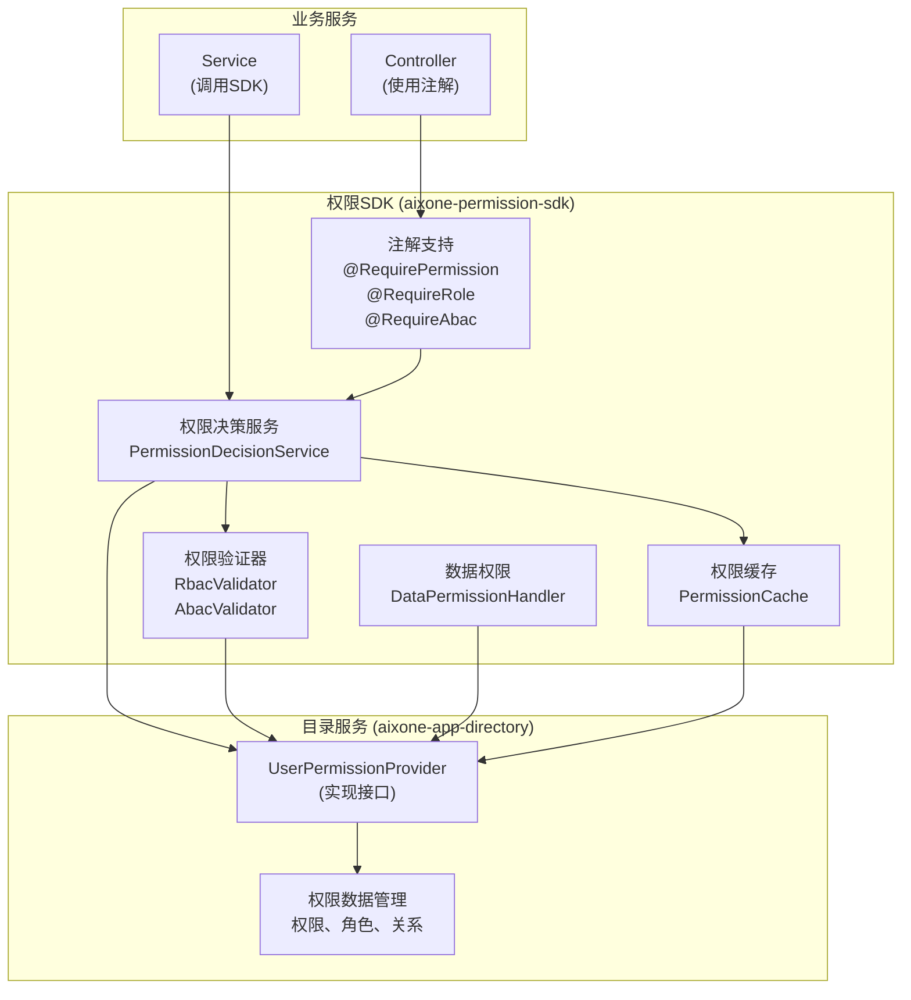
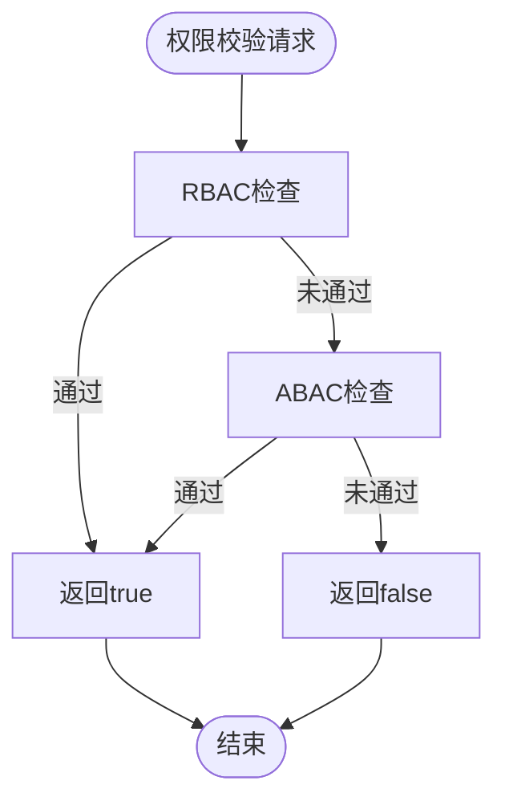

# AixOne权限SDK架构设计文档

## 1. 设计概述

### 1.1 SDK定位

权限SDK（Permission SDK）是AixOne平台的核心基础组件，提供统一的权限决策引擎和权限校验能力。SDK封装了RBAC（基于角色的访问控制）和ABAC（基于属性的访问控制）混合权限模型，为业务服务提供标准化的权限决策接口。

#### 1.1.1 核心定位

- **权限决策引擎**：提供RBAC+ABAC混合权限决策能力
- **权限校验接口**：提供统一的权限校验接口
- **注解式权限控制**：提供注解式权限控制能力
- **数据权限支持**：提供数据权限过滤和SQL条件构建能力
- **缓存支持**：提供权限缓存能力，提升性能

#### 1.1.2 职责边界

**SDK负责**：
- ✅ 权限决策逻辑（RBAC决策、ABAC决策、混合决策）
- ✅ 权限校验接口
- ✅ 注解式权限控制
- ✅ 数据权限过滤
- ✅ 权限缓存管理

**SDK不负责**：
- ❌ 权限数据管理（创建、更新、删除权限）
- ❌ 角色数据管理（创建、更新、删除角色）
- ❌ 用户数据管理
- ❌ 权限数据持久化
- ❌ 权限数据查询（由目录服务通过`UserPermissionProvider`提供）

#### 1.1.3 业务价值

- **统一权限模型**：为整个平台提供统一的权限决策模型
- **决策引擎集中化**：集中化的权限决策逻辑，确保决策一致性
- **易于集成**：通过SDK方式，业务服务可以快速集成权限能力
- **高性能**：通过缓存和优化，提供高性能的权限校验能力
- **灵活扩展**：支持RBAC和ABAC混合模型，满足复杂权限需求

### 1.2 架构目标

#### 1.2.1 功能目标

- **权限决策**：基于RBAC+ABAC混合模型的权限决策
- **权限校验**：提供统一的权限校验接口
- **注解支持**：提供注解式权限控制
- **数据权限**：提供数据权限过滤和SQL条件构建
- **缓存支持**：提供权限缓存能力

#### 1.2.2 非功能目标

- **性能**：权限校验响应时间不超过10ms（缓存命中时）
- **可扩展性**：支持权限模型的扩展和定制
- **可维护性**：清晰的架构设计和开发规范
- **易用性**：提供简洁的API和注解支持

### 1.3 设计原则

#### 1.3.1 核心原则

- **职责单一**：SDK只负责权限决策和校验，不负责数据管理
- **依赖注入**：通过`UserPermissionProvider`接口从目录服务获取权限数据
- **无状态设计**：SDK是无状态的，支持多实例部署
- **缓存优先**：通过缓存提升权限校验性能
- **扩展性**：支持权限模型的扩展和定制

#### 1.3.2 设计原则

- **高内聚低耦合**：SDK内部高内聚，与业务服务低耦合
- **接口隔离**：清晰的接口设计，职责明确
- **依赖倒置**：依赖抽象接口，不依赖具体实现
- **开闭原则**：对扩展开放，对修改关闭

## 2. SDK架构

### 2.1 整体架构



### 2.2 核心组件

#### 2.2.1 权限决策服务（PermissionDecisionService）

**职责**：提供权限决策能力，协调RBAC和ABAC验证器

**核心方法**：
- `hasPermission(user, resource, action)`: 检查用户是否有指定权限
- `hasRole(user, roleName)`: 检查用户是否有指定角色
- `getUserPermissions(userId, tenantId)`: 获取用户权限列表（通过UserPermissionProvider）
- `getUserRoles(userId, tenantId)`: 获取用户角色列表（通过UserPermissionProvider）

**决策流程**：
1. 先进行RBAC检查
2. 如果RBAC通过，返回true
3. 如果RBAC未通过，进行ABAC检查
4. 返回最终决策结果

#### 2.2.2 权限验证器（PermissionValidator）

**RBAC验证器（RbacValidator）**：
- 基于用户角色和权限进行验证
- 通过`UserPermissionProvider`获取用户权限列表
- 检查用户是否拥有所需权限

**ABAC验证器（AbacValidator）**：
- 基于用户属性、资源属性、环境属性进行验证
- 通过`UserPermissionProvider`获取ABAC策略
- 使用表达式工具评估策略条件

#### 2.2.3 用户权限提供者（UserPermissionProvider）

**接口定义**：
```java
public interface UserPermissionProvider {
    // 获取用户权限列表
    List<Permission> getUserPermissions(String userId, String tenantId);
    
    // 获取用户角色列表
    List<Role> getUserRoles(String userId, String tenantId);
    
    // 获取用户信息
    User getUser(String userId);
    
    // 获取ABAC策略列表
    List<Policy> getAbacPolicies(String tenantId, String resource, String action);
}
```

**实现要求**：
- 由目录服务（aixone-app-directory）实现
- 从目录服务的数据库查询权限数据
- 支持缓存，提升性能

#### 2.2.4 权限缓存（PermissionCache）

**缓存策略**：
- 用户权限缓存：缓存用户权限列表，TTL 24小时
- 用户角色缓存：缓存用户角色列表，TTL 24小时
- 权限校验结果缓存：缓存权限校验结果，TTL 1小时

**缓存实现**：
- `RedisPermissionCache`：基于Redis的分布式缓存
- `InMemoryPermissionCache`：基于内存的本地缓存
- `DefaultPermissionCache`：默认缓存实现

#### 2.2.5 注解支持

**@RequirePermission**：
- 功能权限校验注解
- 支持资源标识和操作类型

**@RequireRole**：
- 角色校验注解
- 支持单个或多个角色

**@RequireAbac**：
- ABAC策略校验注解
- 支持资源标识和操作类型

**@DataPermission**：
- 数据权限注解
- 支持数据权限过滤

#### 2.2.6 数据权限处理（DataPermissionHandler）

**数据权限类型**：
- `AllDataPermissionHandler`：全部数据权限
- `SelfDataPermissionHandler`：本人数据权限
- `DeptDataPermissionHandler`：部门数据权限

**SQL条件构建**：
- `SelfSqlConditionBuilder`：本人数据SQL条件构建器
- `DeptSqlConditionBuilder`：部门数据SQL条件构建器

## 3. 核心功能设计

### 3.1 权限决策引擎

#### 3.1.1 RBAC权限决策

**决策流程**：
1. 通过`UserPermissionProvider`获取用户权限列表
2. 检查用户权限列表中是否包含所需权限
3. 如果包含，返回true；否则返回false

**权限匹配规则**：
- 资源标识（resource）必须完全匹配
- 操作类型（action）必须完全匹配
- 支持权限级别（PermissionLevel）继承

#### 3.1.2 ABAC权限决策

**决策流程**：
1. 通过`UserPermissionProvider`获取ABAC策略列表
2. 构建上下文（用户属性、资源属性、环境属性）
3. 使用表达式工具评估策略条件
4. 如果任一策略通过，返回true；否则返回false

**ABAC属性**：
- **用户属性**：用户ID、组织、角色、自定义属性等
- **资源属性**：资源ID、资源类型、资源所有者等
- **环境属性**：时间、地点、IP等

#### 3.1.3 混合权限决策

**决策逻辑**：
- RBAC和ABAC结果取并集（OR逻辑）
- 如果RBAC通过，直接返回true
- 如果RBAC未通过，进行ABAC检查
- 如果ABAC通过，返回true；否则返回false

**决策流程**：


### 3.2 权限校验接口

#### 3.2.1 功能权限校验

**接口方法**：
```java
boolean hasPermission(String userId, String resource, String action);
boolean hasPermission(User user, Permission permission, Resource resource);
```

**校验流程**：
1. 从缓存获取用户权限
2. 如果缓存未命中，通过`UserPermissionProvider`获取
3. 执行权限决策
4. 缓存决策结果
5. 返回决策结果

#### 3.2.2 角色校验

**接口方法**：
```java
boolean hasRole(String userId, String roleName);
boolean hasRole(User user, String roleName);
```

**校验流程**：
1. 从缓存获取用户角色列表
2. 如果缓存未命中，通过`UserPermissionProvider`获取
3. 检查用户角色列表中是否包含所需角色
4. 返回检查结果

### 3.3 注解式权限控制

#### 3.3.1 @RequirePermission注解

**使用示例**：
```java
@RestController
public class UserController {
    
    @RequirePermission(resource = "user", action = "read")
    @GetMapping("/users")
    public List<User> getUsers() {
        // 需要 user:read 权限
    }
}
```

**实现机制**：
- 通过AOP拦截器拦截方法调用
- 从SessionContext获取当前用户
- 调用权限决策服务进行校验
- 如果校验失败，抛出权限异常

#### 3.3.2 @RequireRole注解

**使用示例**：
```java
@RequireRole("ADMIN")
@PostMapping("/users")
public User createUser(@RequestBody User user) {
    // 需要 ADMIN 角色
}
```

#### 3.3.3 @RequireAbac注解

**使用示例**：
```java
@RequireAbac(resource = "user", action = "update")
@PutMapping("/users/{id}")
public User updateUser(@PathVariable String id, @RequestBody User user) {
    // 需要ABAC策略验证
}
```

### 3.4 数据权限处理

#### 3.4.1 数据权限类型

**全部数据权限（AllDataPermissionHandler）**：
- 用户可以访问所有数据
- SQL条件：无限制

**本人数据权限（SelfDataPermissionHandler）**：
- 用户只能访问自己的数据
- SQL条件：`user_id = ?`

**部门数据权限（DeptDataPermissionHandler）**：
- 用户只能访问本部门的数据
- SQL条件：`dept_id IN (?)`

#### 3.4.2 SQL条件构建

**SelfSqlConditionBuilder**：
```java
String condition = builder.build(userId);
// 返回: "user_id = 'userId'"
```

**DeptSqlConditionBuilder**：
```java
String condition = builder.build(userId);
// 返回: "dept_id IN (SELECT dept_id FROM user_departments WHERE user_id = 'userId')"
```

## 4. 与目录服务的集成

### 4.1 集成方式

**依赖关系**：
- SDK依赖目录服务提供的`UserPermissionProvider`实现
- 目录服务实现`UserPermissionProvider`接口
- SDK通过接口获取权限数据，不直接访问数据库

**集成流程**：
1. 目录服务实现`UserPermissionProvider`接口
2. 目录服务注册`UserPermissionProvider` Bean
3. SDK自动注入`UserPermissionProvider`
4. SDK通过接口获取权限数据进行决策

### 4.2 UserPermissionProvider实现

**目录服务实现示例**：
```java
@Component
@Primary
public class DirectoryUserPermissionProvider implements UserPermissionProvider {
    
    private final PermissionApplicationService permissionService;
    private final RoleApplicationService roleService;
    
    @Override
    public List<Permission> getUserPermissions(String userId, String tenantId) {
        // 从目录服务查询用户权限
        return permissionService.getUserPermissions(userId, tenantId);
    }
    
    @Override
    public List<Role> getUserRoles(String userId, String tenantId) {
        // 从目录服务查询用户角色
        return roleService.getUserRoles(userId, tenantId);
    }
    
    @Override
    public List<Policy> getAbacPolicies(String tenantId, String resource, String action) {
        // 从目录服务查询ABAC策略
        return permissionService.getAbacPolicies(tenantId, resource, action);
    }
}
```

### 4.3 职责划分

**目录服务职责**：
- ✅ 实现`UserPermissionProvider`接口
- ✅ 提供权限数据查询能力
- ✅ 管理权限数据（创建、更新、删除）
- ✅ 管理角色数据（创建、更新、删除）
- ✅ 管理权限关系（用户-角色、角色-权限）

**SDK职责**：
- ✅ 权限决策逻辑
- ✅ 权限校验接口
- ✅ 注解式权限控制
- ✅ 权限缓存管理
- ✅ 数据权限处理

**职责边界**：
- 目录服务负责数据管理，SDK负责决策逻辑
- SDK不直接访问数据库，通过接口获取数据
- 目录服务不进行权限决策，只提供数据查询

## 5. 权限模型设计

### 5.1 权限模型（Permission）

**属性**：
- `permissionId`: 权限ID
- `tenantId`: 租户ID
- `name`: 权限名称
- `resource`: 资源标识（如：user、menu、order等）
- `action`: 操作类型（如：read、write、delete等）
- `description`: 权限描述
- `level`: 权限级别（READ、WRITE、DELETE、ADMIN）

**权限匹配规则**：
- 资源标识和操作类型必须完全匹配
- 支持权限级别继承（高级别权限包含低级别权限）

### 5.2 角色模型（Role）

**属性**：
- `roleId`: 角色ID
- `tenantId`: 租户ID
- `name`: 角色名称
- `description`: 角色描述
- `permissionIds`: 权限ID列表

**角色权限关系**：
- 角色通过`permissionIds`关联权限
- 用户通过角色获得权限

### 5.3 用户模型（User）

**属性**：
- `userId`: 用户ID
- `tenantId`: 租户ID
- `username`: 用户名
- `attributes`: 用户属性（ABAC属性，如部门、职位等）
- `roleIds`: 角色ID列表

**用户权限计算**：
- 直接权限：用户直接拥有的权限
- 角色权限：通过角色获得的权限
- 最终权限：直接权限 + 角色权限

### 5.4 ABAC策略模型（Policy）

**属性**：
- `policyId`: 策略ID
- `tenantId`: 租户ID
- `name`: 策略名称
- `resource`: 资源标识
- `action`: 操作类型
- `condition`: 策略条件（表达式）
- `description`: 策略描述

**策略条件表达式**：
- 支持属性比较（如：`user.dept == resource.ownerDept`）
- 支持逻辑运算（AND、OR、NOT）
- 支持函数调用（如：`time() > '09:00'`）

## 6. 缓存设计

### 6.1 缓存策略

**缓存键设计**：
- 用户权限：`permission:user:{userId}:{tenantId}`
- 用户角色：`permission:role:{userId}:{tenantId}`
- 权限校验结果：`permission:check:{userId}:{resource}:{action}:{tenantId}`

**缓存TTL**：
- 用户权限缓存：24小时
- 用户角色缓存：24小时
- 权限校验结果缓存：1小时

### 6.2 缓存更新

**主动失效**：
- 当用户权限变更时，清除相关缓存
- 当角色权限变更时，清除相关用户的权限缓存
- 当权限变更时，清除相关缓存

**缓存刷新**：
- 支持手动刷新缓存
- 支持定时刷新缓存

## 7. 性能设计

### 7.1 性能目标

| 指标 | 目标值 | 测量方式 |
|------|-------|---------|
| 权限校验响应时间（缓存命中） | < 10ms | API响应时间 |
| 权限校验响应时间（缓存未命中） | < 50ms | API响应时间 |
| 缓存命中率 | > 80% | 缓存统计 |
| 并发权限校验 | > 1000 QPS | 负载测试 |

### 7.2 性能优化

**缓存优化**：
- 多级缓存（内存缓存 + Redis缓存）
- 缓存预热
- 缓存异步更新

**查询优化**：
- 批量查询用户权限
- 权限数据预加载
- 权限索引优化（由目录服务提供）

## 8. SDK使用指南

### 8.1 依赖配置

**Maven依赖**：
```xml
<dependency>
    <groupId>com.aixone</groupId>
    <artifactId>aixone-permission-sdk</artifactId>
    <version>1.0.0</version>
</dependency>
```

### 8.2 启用权限功能

**Spring Boot配置**：
```java
@SpringBootApplication
@EnablePermission
public class Application {
    public static void main(String[] args) {
        SpringApplication.run(Application.class, args);
    }
}
```

### 8.3 实现UserPermissionProvider

**目录服务实现**：
```java
@Component
@Primary
public class DirectoryUserPermissionProvider implements UserPermissionProvider {
    // 实现接口方法
}
```

### 8.4 使用权限注解

**Controller示例**：
```java
@RestController
public class UserController {
    
    @RequirePermission(resource = "user", action = "read")
    @GetMapping("/users")
    public List<User> getUsers() {
        // 业务逻辑
    }
}
```

### 8.5 编程式权限校验

**Service示例**：
```java
@Service
public class UserService {
    
    @Autowired
    private PermissionDecisionService permissionService;
    
    public void updateUser(String userId, User user) {
        // 编程式权限校验
        if (!permissionService.hasPermission(userId, "user", "update")) {
            throw new PermissionException("无权限");
        }
        // 业务逻辑
    }
}
```

## 9. 适应性调整建议

### 9.1 当前SDK问题分析

**问题1：PermissionService接口职责不清**
- 当前`PermissionService`接口包含了权限数据管理方法（createPermission、updatePermission等）
- 这些方法在`DefaultPermissionService`中都是空实现，返回false或null
- 根据职责划分，权限数据管理应该由目录服务提供

**问题2：SDK定位不清晰**
- SDK应该只负责权限决策和校验，不应该包含数据管理功能
- 当前SDK包含了权限数据管理的接口定义，但未实现

**问题3：接口设计需要优化**
- `PermissionService`接口应该拆分为决策服务和数据服务
- 数据管理相关的方法应该移除或标记为deprecated

### 9.2 调整建议

#### 9.2.1 接口拆分

**建议**：将`PermissionService`拆分为两个接口

**PermissionDecisionService**（权限决策服务）：
- 保留权限校验方法
- 保留角色校验方法
- 保留用户权限/角色查询方法（通过UserPermissionProvider）
- 移除权限数据管理方法

**PermissionDataService**（权限数据服务，可选）：
- 如果业务服务需要直接管理权限数据，可以保留
- 但建议由目录服务直接提供REST API，业务服务通过HTTP调用

#### 9.2.2 接口方法调整

**保留的方法**：
```java
// 权限校验
boolean hasPermission(String userId, String resource, String action);
boolean hasPermission(User user, Permission permission, Resource resource);
boolean hasRole(String userId, String roleName);
boolean hasRole(User user, String roleName);

// 用户权限查询（通过UserPermissionProvider）
List<Permission> getUserPermissions(String userId);
List<Permission> getUserPermissions(String userId, String tenantId);
List<Role> getUserRoles(String userId);
List<Role> getUserRoles(String userId, String tenantId);
```

**移除或标记为deprecated的方法**：
```java
// 权限数据管理（应该由目录服务提供）
@Deprecated
boolean createPermission(Permission permission);
@Deprecated
boolean updatePermission(Permission permission);
@Deprecated
boolean deletePermission(String permissionId);
@Deprecated
Permission getPermission(String permissionId);

// 角色数据管理（应该由目录服务提供）
@Deprecated
boolean createRole(Role role);
@Deprecated
boolean updateRole(Role role);
@Deprecated
boolean deleteRole(String roleId);
@Deprecated
Role getRole(String roleId);

// 权限关系管理（应该由目录服务提供）
@Deprecated
boolean assignRole(String userId, String roleId);
@Deprecated
boolean removeRole(String userId, String roleId);
@Deprecated
boolean assignPermission(String roleId, String permissionId);
@Deprecated
boolean removePermission(String roleId, String permissionId);
@Deprecated
List<Permission> getRolePermissions(String roleId);
```

#### 9.2.3 UserPermissionProvider接口增强

**建议增强**：
- 添加`getAbacPolicies`方法的明确文档
- 添加批量查询方法（提升性能）
- 添加缓存支持说明

#### 9.2.4 文档更新

**建议更新**：
- README中明确说明SDK不负责权限数据管理
- 明确说明权限数据管理由目录服务提供
- 提供目录服务集成示例

### 9.3 实施建议

#### 9.3.1 阶段性调整

**第一阶段**（向后兼容）：
- 保留`PermissionService`接口，但标记数据管理方法为`@Deprecated`
- 添加`PermissionDecisionService`接口
- `DefaultPermissionService`同时实现两个接口

**第二阶段**（逐步迁移）：
- 新代码使用`PermissionDecisionService`接口
- 旧代码逐步迁移到新接口
- 更新文档和示例

**第三阶段**（完全移除）：
- 移除`PermissionService`中的数据管理方法
- 移除相关的deprecated方法
- 完全切换到`PermissionDecisionService`

#### 9.3.2 目录服务集成

**目录服务需要实现**：
1. 实现`UserPermissionProvider`接口
2. 提供权限数据管理API（REST接口）
3. 提供权限校验API（可选，也可以直接使用SDK）

## 10. 总结

### 10.1 SDK定位

权限SDK是AixOne平台的核心基础组件，提供统一的权限决策引擎和权限校验能力。SDK只负责权限决策逻辑，不负责权限数据管理。

### 10.2 核心职责

- ✅ 权限决策引擎（RBAC+ABAC混合模型）
- ✅ 权限校验接口
- ✅ 注解式权限控制
- ✅ 数据权限处理
- ✅ 权限缓存管理

### 10.3 适应性调整

- ⚠️ 需要将`PermissionService`接口拆分为决策服务和数据服务
- ⚠️ 需要移除或标记权限数据管理方法为deprecated
- ⚠️ 需要明确SDK只负责决策逻辑，数据管理由目录服务提供
- ⚠️ 需要更新文档，明确职责边界

### 10.4 集成建议

- 目录服务实现`UserPermissionProvider`接口
- 目录服务提供权限数据管理API
- 业务服务通过SDK进行权限校验
- 业务服务通过目录服务API管理权限数据

