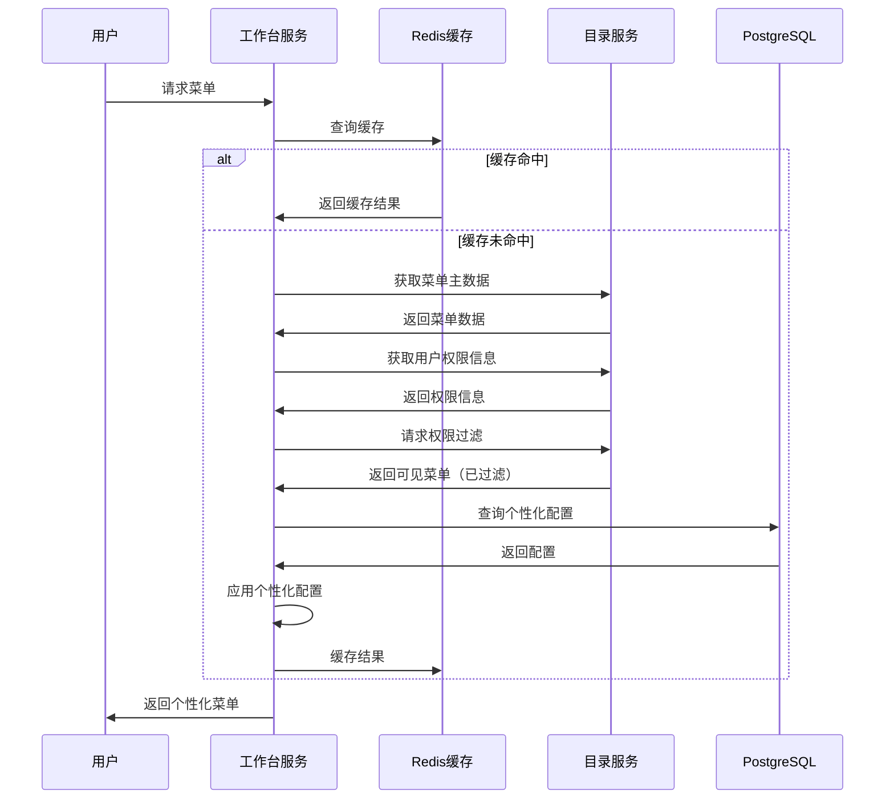

# AixOne工作台服务架构设计文档

## 1. 设计概述

### 1.1 工作台服务定位

工作台服务（Workbench Service）作为AixOne应用平台的核心服务之一，是企业级平台的统一操作入口，为用户提供个性化的工作台界面。服务支持多端访问（Web、移动、桌面），聚合各类业务系统、报表、监控、审批流、消息通知，是用户与平台交互的主要界面。

#### 1.1.1 核心定位

- **统一入口**：为不同角色、不同租户的用户提供统一的工作台界面
- **菜单聚合**：聚合目录服务的菜单主数据，应用个性化配置，通过目录服务进行权限过滤
- **应用集成**：集成各类业务系统，提供一致的用户体验
- **个性化定制**：支持用户级、角色级、租户级的个性化定制
- **消息聚合**：聚合各业务系统的消息、待办、告警
- **数据可视化**：提供组件化仪表盘，支持拖拽布局和自定义组件
- **管理功能**：提供认证服务（Token管理、客户端管理等）的管理界面和API

#### 1.1.2 业务价值

- **提升效率**：统一入口减少用户操作成本，个性化定制提升操作效率
- **用户体验**：统一的界面和交互，提升用户满意度
- **应用治理**：通过菜单管理和权限控制，实现应用的标准化管理
- **快速响应**：支持个性化的快速配置，响应业务需求变化
- **多租户支持**：支持多租户的个性化配置和隔离

### 1.2 架构目标

#### 1.2.1 功能目标

- **菜单聚合**：从目录服务拉取菜单主数据，应用个性化配置，通过目录服务进行权限过滤
- **个性化定制**：支持用户、角色、租户级的个性化定制（菜单顺序、快捷入口、仪表盘布局等）
- **快捷入口**：支持用户常用功能的快速访问配置，权限控制由目录服务提供
- **仪表盘**：提供组件化仪表盘，支持拖拽布局、自定义组件、数据可视化
- **消息聚合**：聚合各业务系统的消息、待办、告警信息
- **多端适配**：支持Web、移动端、桌面端的多端访问
- **管理功能**：提供认证服务（Token管理、客户端管理、审计日志查看等）的管理界面和API

#### 1.2.2 非功能目标

- **性能**：菜单查询响应时间不超过200ms，支持高并发访问
- **可用性**：服务可用性不低于99.9%，支持多实例部署
- **可扩展性**：支持水平扩展，支持新功能模块的快速集成
- **可维护性**：清晰的架构设计和开发规范
- **安全性**：完善的权限控制和数据安全机制

### 1.3 设计原则

#### 1.3.1 核心原则

- **聚合而非管理**：菜单主数据由目录服务管理，权限数据由目录服务管理，工作台服务负责聚合和个性化展示
- **权限由Directory提供**：所有权限相关操作（权限过滤、权限校验）均由目录服务提供，工作台服务不进行权限决策
- **管理功能提供**：提供认证服务的管理功能（Token管理、客户端管理等），但认证核心能力由认证服务提供
- **事件驱动**：通过事件总线实现与其他服务的解耦
- **多租户**：支持企业级的多租户需求，实现数据隔离和配置隔离
- **个性化优先**：优先支持用户的个性化需求，提升用户体验
- **多端一致性**：确保多端体验一致性

#### 1.3.2 设计原则

- **高内聚低耦合**：服务内部高内聚，服务间低耦合
- **可扩展性**：支持水平扩展和功能扩展
- **可维护性**：清晰的职责边界和统一的开发规范
- **可观测性**：完善的监控、日志和链路追踪
- **缓存优先**：通过缓存提升查询性能和响应速度

## 2. 工作台服务架构

### 2.1 整体架构

#### 2.1.1 分层架构

```
工作台服务分层架构
┌─────────────────────────────────────────────────────────────┐
│                     表示层 (Presentation Layer)              │
│                                                              │
│  ┌────────────┐  ┌────────────┐  ┌────────────┐            │
│  │  Web端     │  │  移动端    │  │  桌面端    │            │
│  │ (Vue 3)    │  │ (uni-app)  │  │ (Electron) │            │
│  │工作台界面  │  │  工作台    │  │  工作台    │            │
│  └────────────┘  └────────────┘  └────────────┘            │
└─────────────────────────────────────────────────────────────┘
                           ↓
┌─────────────────────────────────────────────────────────────┐
│                   API网关层 (Gateway Layer)                  │
│                                                              │
│         axione-int-gateway (统一入口、路由、认证)              │
└─────────────────────────────────────────────────────────────┘
                           ↓
┌─────────────────────────────────────────────────────────────┐
│                  应用层 (Application Layer)                  │
│                                                              │
│  ┌──────────────────────────────────────────────────┐      │
│  │      axione-app-workbench (工作台服务)           │      │
│  │  ┌────────────┐  ┌────────────┐  ┌────────────┐│      │
│  │  │ 菜单聚合   │  │ 个性化配置 │  │ 仪表盘管理 ││      │
│  │  │   模块     │  │   模块     │  │   模块     ││      │
│  │  └────────────┘  └────────────┘  └────────────┘│      │
│  │  ┌────────────┐  ┌────────────┐  ┌────────────┐│      │
│  │  │ 快捷入口  │  │ 消息聚合   │  │ 主题配置   ││      │
│  │  │   模块     │  │   模块     │  │   模块     ││      │
│  │  └────────────┘  └────────────┘  └────────────┘│      │
│  └──────────────────────────────────────────────────┘      │
└─────────────────────────────────────────────────────────────┘
                           ↓
┌─────────────────────────────────────────────────────────────┐
│                   业务层 (Business Layer)                    │
│                                                              │
│  ┌────────────┐  ┌────────────┐  ┌────────────┐            │
│  │ 菜单聚合   │  │ 个性化     │  │ 仪表盘     │            │
│  │  业务逻辑  │  │  业务逻辑  │  │  业务逻辑  │            │
│  └────────────┘  └────────────┘  └────────────┘            │
└─────────────────────────────────────────────────────────────┘
                           ↓
┌─────────────────────────────────────────────────────────────┐
│                数据访问层 (Data Access Layer)                │
│                                                              │
│  ┌────────────┐  ┌────────────┐  ┌────────────┐            │
│  │ 个性化配置 │  │ 菜单配置   │  │ 仪表盘配置 │            │
│  │  数据访问  │  │  数据访问  │  │  数据访问  │            │
│  └────────────┘  └────────────┘  └────────────┘            │
└─────────────────────────────────────────────────────────────┘
                           ↓
┌─────────────────────────────────────────────────────────────┐
│                     数据层 (Data Layer)                      │
│                                                              │
│  ┌────────────┐  ┌────────────┐  ┌────────────┐            │
│  │ PostgreSQL │  │  Redis    │  │  Kafka     │            │
│  │  (主存储)  │  │  (缓存)    │  │  (事件)    │            │
│  └────────────┘  └────────────┘  └────────────┘            │
└─────────────────────────────────────────────────────────────┘
```

#### 2.1.2 核心模块

工作台服务包含以下核心模块：

| 模块名称 | 模块职责 | 主要功能 |
|---------|---------|---------|
| **菜单聚合模块** | 菜单主数据聚合和个性化 | 菜单拉取、个性化配置、调用目录服务进行权限过滤、菜单展示 |
| **个性化配置模块** | 用户个性化定制 | 用户级个性化、角色级个性化、租户级个性化 |
| **仪表盘模块** | 仪表盘管理和展示 | 仪表盘配置、组件管理、布局管理、数据可视化 |
| **快捷入口模块** | 快捷入口管理 | 快捷入口配置、排序、调用目录服务进行权限控制 |
| **消息聚合模块** | 消息和待办聚合 | 消息收集、分类、推送、历史记录 |
| **主题配置模块** | 界面主题定制 | 主题切换、颜色配置、样式定制 |
| **认证管理模块** | 认证服务管理功能 | Token管理、客户端管理、审计日志查看等管理界面和API |

### 2.2 领域模型设计

#### 2.2.1 核心实体

**菜单实体（Menu）**：
- menu_id: UUID (菜单ID)
- tenant_id: UUID (租户ID)
- parent_id: UUID (父菜单ID)
- name: String (菜单名称)
- path: String (菜单路径)
- icon: String (菜单图标)
- type: String (菜单类型：目录/菜单/按钮)
- order: Integer (显示顺序)
- visible: Boolean (是否可见)
- roles: List<UUID> (可见角色ID列表)
- config: JSON (菜单配置)

**用户个性化配置实体（UserPersonalization）**：
- user_id: UUID (用户ID)
- tenant_id: UUID (租户ID)
- role_id: UUID (角色ID)
- menu_custom_config: JSON (菜单个性化配置)
  - menu_order: List<UUID> (菜单顺序)
  - hidden_menus: List<UUID> (隐藏的菜单)
  - quick_entries: List<QuickEntry> (快捷入口)
- dashboard_config: JSON (仪表盘配置)
- theme_config: JSON (主题配置)

**快捷入口实体（QuickEntry）**：
- entry_id: UUID (快捷入口ID)
- user_id: UUID (用户ID)
- menu_id: UUID (关联菜单ID)
- name: String (快捷入口名称)
- icon: String (图标)
- order: Integer (显示顺序)
- visible: Boolean (是否可见)

**仪表盘实体（Dashboard）**：
- dashboard_id: UUID (仪表盘ID)
- user_id: UUID (用户ID)
- name: String (仪表盘名称)
- layout: JSON (布局配置)
- components: List<Component> (组件列表)
  - component_type: String (组件类型)
  - component_config: JSON (组件配置)
  - position: Position (位置信息)

**消息实体（Message）**：
- message_id: UUID (消息ID)
- user_id: UUID (用户ID)
- tenant_id: UUID (租户ID)
- message_type: String (消息类型：通知/待办/告警)
- title: String (消息标题)
- content: String (消息内容)
- status: String (消息状态：未读/已读/已处理)
- source: String (消息来源)
- timestamp: DateTime (消息时间戳)

#### 2.2.2 领域服务

**菜单聚合服务（MenuAggregationService）**：
- 职责：聚合菜单主数据和个性化配置，调用目录服务进行权限过滤，返回个性化菜单
- 方法：
  - getVisibleMenus(userId, tenantId): 获取用户可见菜单（调用目录服务进行权限过滤）
  - getUserMenuCustom(userId): 获取用户菜单个性化配置
  - saveUserMenuCustom(userId, config): 保存用户菜单个性化配置
- 注意：权限过滤由目录服务提供，工作台服务不进行权限决策

**个性化服务（PersonalizationService）**：
- 职责：管理用户个性化配置
- 方法：
  - getUserPersonalization(userId): 获取用户个性化配置
  - saveUserPersonalization(userId, config): 保存用户个性化配置
  - inheritPersonalization(userId, roleId): 继承角色个性化配置

**仪表盘服务（DashboardService）**：
- 职责：管理用户仪表盘配置
- 方法：
  - getDashboard(userId): 获取用户仪表盘配置
  - saveDashboard(userId, config): 保存用户仪表盘配置
  - addComponent(userId, component): 添加仪表盘组件
  - removeComponent(userId, componentId): 删除仪表盘组件

**快捷入口服务（QuickEntryService）**：
- 职责：管理用户快捷入口
- 方法：
  - getQuickEntries(userId): 获取用户快捷入口
  - saveQuickEntries(userId, entries): 保存用户快捷入口
  - addQuickEntry(userId, entry): 添加快捷入口
  - removeQuickEntry(userId, entryId): 删除快捷入口

**消息聚合服务（MessageAggregationService）**：
- 职责：聚合各业务系统的消息
- 方法：
  - getMessages(userId): 获取用户消息
  - getTodos(userId): 获取用户待办
  - markAsRead(messageId): 标记消息为已读
  - publishMessage(message): 发布消息

### 2.3 业务流程设计

#### 2.3.1 菜单获取流程

```
1. 用户请求菜单
2. 工作台服务从Redis缓存查询（如果有）
3. 如果缓存未命中：
   a. 调用目录服务（aixone-app-directory）获取菜单主数据
   b. 调用目录服务获取用户权限信息（角色、权限等）
   c. 调用目录服务进行权限过滤，获取用户可见菜单
   d. 查询用户个性化配置
   e. 应用个性化配置（顺序、隐藏、快捷入口等）
   f. 构建个性化菜单树
   g. 缓存结果到Redis（TTL=1小时）
4. 返回个性化菜单

注意：
- 权限过滤完全由目录服务提供，工作台服务不进行权限决策
- 工作台服务只负责聚合菜单数据和个性化配置
```

**流程图**：


#### 2.3.2 个性化配置流程

```
1. 用户修改个性化配置
2. 工作台服务接收配置变更请求
3. 验证配置参数
4. 持久化到PostgreSQL
5. 更新Redis缓存
6. 清除相关缓存
7. 发布个性化配置变更事件到Kafka
8. 返回更新结果

事件数据：
{
  "eventType": "workbench.personalization.updated",
  "userId": "...",
  "tenantId": "...",
  "timestamp": "...",
  "config": {...}
}
```

#### 2.3.3 仪表盘配置流程

```
1. 用户访问仪表盘
2. 工作台服务从缓存查询仪表盘配置
3. 如果缓存未命中：
   a. 从PostgreSQL查询仪表盘配置
   b. 获取组件数据源配置
   c. 加载组件数据
   d. 缓存结果
4. 返回仪表盘数据

仪表盘数据加载：
- 静态组件：直接渲染
- 动态组件：通过API获取数据
- 异步组件：异步加载数据
```

#### 2.3.4 消息聚合流程

```
1. 用户请求消息列表
2. 工作台服务查询本地消息缓存
3. 订阅事件中心的消息事件
4. 接收来自各业务系统的消息事件：
   - 业务系统发布消息事件到事件中心
   - 工作台服务订阅相关事件
   - 接收消息并缓存到本地
5. 聚合消息并按时间排序
6. 返回消息列表

消息事件格式：
{
  "eventType": "message.notification.created",
  "source": "业务系统",
  "userId": "...",
  "message": {...}
}
```

### 2.4 数据模型设计

#### 2.4.1 数据库表设计

**用户菜单个性化配置表（user_menu_custom）**：
| 字段名 | 类型 | 说明 |
|-------|------|------|
| id | UUID | 主键 |
| user_id | UUID | 用户ID |
| tenant_id | UUID | 租户ID |
| menu_id | UUID | 菜单ID |
| config | JSONB | 个性化配置（顺序、快捷入口、隐藏等） |
| created_at | TIMESTAMP | 创建时间 |
| updated_at | TIMESTAMP | 更新时间 |

**用户快捷入口表（user_quick_entry）**：
| 字段名 | 类型 | 说明 |
|-------|------|------|
| id | UUID | 主键 |
| user_id | UUID | 用户ID |
| tenant_id | UUID | 租户ID |
| entry_id | UUID | 快捷入口ID |
| menu_id | UUID | 关联菜单ID |
| name | VARCHAR | 快捷入口名称 |
| icon | VARCHAR | 图标 |
| order | INTEGER | 显示顺序 |
| config | JSONB | 快捷入口配置 |
| created_at | TIMESTAMP | 创建时间 |
| updated_at | TIMESTAMP | 更新时间 |

**用户仪表盘表（user_dashboard）**：
| 字段名 | 类型 | 说明 |
|-------|------|------|
| id | UUID | 主键 |
| user_id | UUID | 用户ID |
| tenant_id | UUID | 租户ID |
| name | VARCHAR | 仪表盘名称 |
| layout | JSONB | 布局配置 |
| components | JSONB | 组件配置 |
| config | JSONB | 仪表盘配置 |
| created_at | TIMESTAMP | 创建时间 |
| updated_at | TIMESTAMP | 更新时间 |

**用户偏好配置表（user_preferences）**：
| 字段名 | 类型 | 说明 |
|-------|------|------|
| id | UUID | 主键 |
| user_id | UUID | 用户ID |
| tenant_id | UUID | 租户ID |
| preference_type | VARCHAR | 偏好类型（theme、language等） |
| preference_value | JSONB | 偏好值 |
| created_at | TIMESTAMP | 创建时间 |
| updated_at | TIMESTAMP | 更新时间 |

#### 2.4.2 缓存设计

**Redis缓存策略**：

| 缓存键 | 数据类型 | TTL | 说明 |
|-------|---------|-----|------|
| workbench:menu:{userId}:{tenantId} | Hash | 1小时 | 用户菜单缓存 |
| workbench:dashboard:{userId} | Hash | 1小时 | 用户仪表盘缓存 |
| workbench:quickentry:{userId} | List | 1小时 | 用户快捷入口缓存 |
| workbench:preferences:{userId} | Hash | 24小时 | 用户偏好配置缓存 |
| workbench:message:{userId} | List | 30分钟 | 用户消息缓存 |

**缓存更新策略**：
- **Cache-Aside模式**：先查缓存，未命中查数据库，并写入缓存
- **主动失效**：配置变更时清除相关缓存
- **定时刷新**：低频率数据定时刷新缓存

### 2.5 接口设计

#### 2.5.1 REST API设计

**菜单聚合API**：
- `GET /api/v1/workbench/menus`：获取当前用户可见菜单
- `PUT /api/v1/workbench/menus/custom`：保存用户菜单个性化配置
- `GET /api/v1/workbench/menus/custom`：获取用户菜单个性化配置

**快捷入口API**：
- `GET /api/v1/workbench/quick-entries`：获取用户快捷入口
- `PUT /api/v1/workbench/quick-entries`：保存快捷入口配置
- `POST /api/v1/workbench/quick-entries`：添加快捷入口
- `DELETE /api/v1/workbench/quick-entries/{entryId}`：删除快捷入口

**仪表盘API**：
- `GET /api/v1/workbench/dashboard`：获取用户仪表盘配置
- `PUT /api/v1/workbench/dashboard`：保存仪表盘配置
- `POST /api/v1/workbench/dashboard/components`：添加仪表盘组件
- `DELETE /api/v1/workbench/dashboard/components/{componentId}`：删除仪表盘组件

**消息聚合API**：
- `GET /api/v1/workbench/messages`：获取用户消息列表
- `GET /api/v1/workbench/todos`：获取用户待办列表
- `PUT /api/v1/workbench/messages/{messageId}/read`：标记消息为已读
- `DELETE /api/v1/workbench/messages/{messageId}`：删除消息

**用户偏好API**：
- `GET /api/v1/workbench/preferences`：获取用户偏好配置
- `PUT /api/v1/workbench/preferences`：保存用户偏好配置
- `PUT /api/v1/workbench/preferences/theme`：更新主题配置
- `PUT /api/v1/workbench/preferences/language`：更新语言配置

**认证管理API**（提供认证服务的管理功能）：
- `GET /api/v1/workbench/auth/tokens`：获取Token列表（调用认证服务内部接口）
- `POST /api/v1/workbench/auth/tokens/{tokenId}/revoke`：撤销Token（调用认证服务内部接口）
- `GET /api/v1/workbench/auth/clients`：获取客户端列表（调用认证服务内部接口）
- `POST /api/v1/workbench/auth/clients`：创建客户端（调用认证服务内部接口）
- `PUT /api/v1/workbench/auth/clients/{clientId}`：更新客户端（调用认证服务内部接口）
- `DELETE /api/v1/workbench/auth/clients/{clientId}`：删除客户端（调用认证服务内部接口）
- `GET /api/v1/workbench/auth/audit-logs`：获取审计日志（调用认证服务内部接口）

**注意**：
- 认证管理API需要调用认证服务的内部接口（`/api/v1/auth/internal/*`）
- 权限控制由目录服务提供，需要调用目录服务进行权限校验
- 认证服务的管理接口为内部接口，不对外直接暴露，由工作台服务统一提供管理界面和API

#### 2.5.2 API响应规范

**统一响应格式**：
```json
{
  "code": "SUCCESS",
  "message": "操作成功",
  "data": {
    // 响应数据
  },
  "timestamp": "2024-01-01T00:00:00Z"
}
```

**统一错误码**：
| 错误码 | HTTP状态码 | 说明 |
|-------|-----------|------|
| SUCCESS | 200 | 操作成功 |
| BAD_REQUEST | 400 | 请求参数错误 |
| UNAUTHORIZED | 401 | 未认证 |
| FORBIDDEN | 403 | 无权限 |
| NOT_FOUND | 404 | 资源不存在 |
| INTERNAL_ERROR | 500 | 服务器内部错误 |

## 3. 核心功能设计

### 3.1 菜单聚合与个性化

#### 3.1.1 菜单聚合逻辑

**聚合流程**：
1. **拉取菜单主数据**：从目录服务（aixone-app-directory）拉取菜单主数据
2. **获取用户权限**：调用目录服务获取用户权限信息（角色、权限等）
3. **权限过滤**：调用目录服务进行权限过滤，获取用户可见菜单（权限过滤由目录服务提供）
4. **查询个性化配置**：查询用户菜单个性化配置
5. **应用个性化**：
   - 调整菜单顺序
   - 隐藏指定菜单
   - 添加快捷入口标识
6. **构建菜单树**：构建层级菜单结构
7. **缓存结果**：缓存到Redis

**个性化配置项**：
- menu_order: 菜单顺序
- hidden_menus: 隐藏的菜单列表
- quick_entries: 快捷入口配置
- custom_icons: 自定义图标
- custom_names: 自定义名称

**注意**：
- 权限过滤完全由目录服务提供，工作台服务不进行权限决策
- 工作台服务只负责聚合菜单数据和应用个性化配置

#### 3.1.2 菜单权限过滤

**权限过滤职责**：
- **目录服务**：负责权限数据管理和权限决策，提供权限过滤接口
- **工作台服务**：调用目录服务的权限过滤接口，不进行权限决策

**权限模型**（由目录服务提供）：
- 基于角色的访问控制（RBAC）
- 菜单关联角色列表
- 用户拥有角色列表
- 权限决策引擎

**过滤流程**：
```
1. 工作台服务调用目录服务获取菜单主数据
2. 工作台服务调用目录服务获取用户权限信息
3. 工作台服务调用目录服务进行权限过滤
4. 目录服务返回用户可见菜单（已过滤）
5. 工作台服务应用个性化配置
```

### 3.2 仪表盘设计与配置

#### 3.2.1 仪表盘架构

**组件类型**：
- **图表组件**：柱状图、折线图、饼图等
- **统计组件**：数据卡片、指标展示
- **列表组件**：数据列表、待办列表
- **自定义组件**：自定义HTML、iframe等

**布局模式**：
- **响应式布局**：自适应屏幕尺寸
- **网格布局**：固定网格布局
- **自由布局**：拖拽自由布局

#### 3.2.2 数据源配置

**数据源类型**：
- **API数据源**：通过REST API获取数据
- **事件数据源**：通过事件订阅获取数据
- **定时数据源**：定时刷新数据
- **静态数据源**：静态数据展示

**数据配置**：
```json
{
  "component": {
    "type": "chart",
    "dataSource": {
      "type": "api",
      "url": "/api/v1/dashboard/data",
      "method": "GET",
      "refresh": 30000
    }
  }
}
```

### 3.3 快捷入口管理

#### 3.3.1 快捷入口配置

**配置规则**：
- 快捷入口关联菜单
- 支持自定义图标和名称
- 支持显示顺序控制
- 权限控制由目录服务提供（调用目录服务进行权限校验）

**快捷入口列表**：
- 用户最多配置10个快捷入口
- 自动根据使用频率推荐
- 支持快速添加和删除

#### 3.3.2 智能推荐

**推荐算法**：
- 基于用户使用频率
- 基于用户角色
- 基于业务重要性
- 实时更新推荐列表

### 3.4 消息聚合与推送

#### 3.4.1 消息类型

| 消息类型 | 说明 | 示例 |
|---------|------|------|
| **通知** | 系统通知消息 | 审批完成、数据变更 |
| **待办** | 待办任务消息 | 待审批、待处理 |
| **告警** | 系统告警消息 | 系统异常、阈值告警 |
| **事件** | 业务事件消息 | 订单创建、工单分配 |

#### 3.4.2 消息聚合策略

**聚合方式**：
- **实时聚合**：通过事件订阅实时接收消息
- **定时聚合**：定时从各业务系统拉取消息
- **缓存策略**：本地缓存最新消息
- **分页加载**：支持分页加载历史消息

**事件订阅**：
```json
{
  "subscribe": [
    "workbench.message.notification",
    "workbench.message.todo",
    "workbench.message.alert"
  ]
}
```

### 3.5 多端适配

#### 3.5.1 响应式设计

**断点设置**：
| 断点 | 屏幕宽度 | 设备类型 |
|------|---------|---------|
| xs | < 576px | 手机 |
| sm | 576px - 768px | 平板 |
| md | 768px - 992px | 小桌面 |
| lg | 992px - 1200px | 桌面 |
| xl | > 1200px | 大桌面 |

**适配策略**：
- 菜单：大屏显示完整菜单，小屏显示简化菜单
- 仪表盘：大屏显示多列布局，小屏显示单列布局
- 快捷入口：大屏显示更多入口，小屏显示核心入口

#### 3.5.2 移动端优化

**移动端特性**：
- 手势操作支持
- 下拉刷新
- 上拉加载更多
- 移动端专用组件

#### 3.5.3 桌面端优化

**桌面端特性**：
- 快捷键支持
- 窗口管理
- 系统通知
- 离线模式

## 4. 集成设计

### 4.1 与平台其他服务的集成

#### 4.1.1 与目录服务的集成

**依赖服务**：aixone-app-directory

**集成方式**：
- REST API调用
- 菜单主数据拉取
- 权限数据获取
- 权限过滤和权限校验

**接口规范**：
- `GET /api/v1/directory/menus?tenantId={tenantId}`：获取菜单主数据
- `GET /api/v1/directory/users/{userId}/roles`：获取用户角色
- `GET /api/v1/directory/users/{userId}/permissions`：获取用户权限
- `POST /api/v1/directory/permissions/check`：权限校验（菜单、资源等）
- `POST /api/v1/directory/menus/filter`：菜单权限过滤（返回用户可见菜单）

**职责划分**：
- **目录服务**：负责菜单主数据管理、权限数据管理、权限决策、权限过滤
- **工作台服务**：负责调用目录服务获取数据和权限过滤结果，应用个性化配置

**缓存策略**：
- 菜单主数据缓存1小时
- 用户权限数据缓存24小时
- 个性化配置缓存1小时
- 配置变更时清除相关缓存

#### 4.1.2 与认证服务的集成

**依赖服务**：axione-tech-auth

**集成方式**：
- 用户认证验证：通过Gateway统一认证
- Token验证：通过Gateway统一验证Token有效性
- 管理功能：提供认证服务的管理界面和API（Token管理、客户端管理等）

**职责划分**：
- **认证服务**：负责身份认证、Token管理（颁发、校验、刷新、黑名单）、用户登出
- **工作台服务**：负责提供认证服务的管理界面和API，调用认证服务的内部接口进行管理操作

**接口规范**：
- Token验证：通过Gateway统一认证和Token验证
- 管理接口：
  - `GET /api/v1/workbench/auth/tokens`：获取Token列表（调用认证服务内部接口）
  - `POST /api/v1/workbench/auth/tokens/{tokenId}/revoke`：撤销Token（调用认证服务内部接口）
  - `GET /api/v1/workbench/auth/clients`：获取客户端列表（调用认证服务内部接口）
  - `POST /api/v1/workbench/auth/clients`：创建客户端（调用认证服务内部接口）
  - `PUT /api/v1/workbench/auth/clients/{clientId}`：更新客户端（调用认证服务内部接口）
  - `DELETE /api/v1/workbench/auth/clients/{clientId}`：删除客户端（调用认证服务内部接口）
  - `GET /api/v1/workbench/auth/audit-logs`：获取审计日志（调用认证服务内部接口）

**注意**：
- 认证服务不提供权限管理，权限完全由目录服务提供
- 认证服务的管理接口为内部接口，由工作台服务对外提供管理界面和API

#### 4.1.3 与事件中心的集成

**依赖服务**：axione-event-center

**集成方式**：
- 事件发布
- 事件订阅
- 消息聚合

**订阅事件**：
- `workbench.message.notification`：通知消息事件
- `workbench.message.todo`：待办消息事件
- `workbench.message.alert`：告警消息事件
- `workbench.personalization.updated`：个性化配置变更事件

**发布事件**：
- `workbench.user.action`：用户操作事件
- `workbench.dashboard.updated`：仪表盘更新事件

#### 4.1.4 与智能服务的集成

**依赖服务**：axione-ai-knowledge

**集成方式**：
- 智能搜索
- 智能推荐
- 智能助手

**应用场景**：
- 菜单智能搜索
- 快捷入口智能推荐
- 仪表盘组件推荐
- 智能助手对话

### 4.2 多租户设计

#### 4.2.1 租户隔离

**数据隔离**：
- 数据库层面：使用tenant_id作为分区键
- 查询层面：自动添加tenant_id条件
- 缓存层面：tenant_id作为缓存键的一部分

**配置隔离**：
- 租户级菜单配置
- 租户级个性化配置
- 租户级主题配置
- 租户级功能开关

#### 4.2.2 租户管理

**租户初始化**：
1. 创建租户
2. 初始化租户菜单
3. 初始化租户用户
4. 配置租户默认设置

**租户配置**：
- 租户基本信息
- 租户功能模块
- 租户个性化默认配置
- 租户主题配置

## 5. 安全设计

### 5.1 认证授权

#### 5.1.1 用户认证

- **认证方式**：通过axione-tech-auth统一认证
- **Token管理**：Token由认证服务管理，存储在Redis
- **会话管理**：支持会话超时和自动续期
- **Token验证**：通过Gateway统一验证Token有效性

#### 5.1.2 权限控制

**权限控制职责划分**：
- **目录服务**：负责所有权限相关功能（权限数据管理、权限决策、权限校验、权限过滤）
- **工作台服务**：调用目录服务进行权限控制和权限过滤，不进行权限决策

**权限控制方式**：
- **菜单权限**：调用目录服务进行菜单权限过滤，目录服务基于RBAC模型进行权限决策
- **数据权限**：基于租户的数据权限控制（工作台服务层面）
- **API权限**：调用目录服务进行API权限校验，目录服务基于RBAC模型进行权限决策
- **快捷入口权限**：调用目录服务进行快捷入口权限校验

**权限校验流程**：
```
1. 工作台服务接收请求
2. 通过Gateway验证Token有效性（认证服务）
3. 调用目录服务进行权限校验（目录服务）
4. 目录服务返回权限校验结果
5. 根据权限校验结果决定是否允许访问
```

### 5.2 数据安全

#### 5.2.1 数据传输安全

- **HTTPS**：所有API接口使用HTTPS
- **数据加密**：敏感数据传输加密
- **API签名**：API请求签名验证

#### 5.2.2 数据存储安全

- **数据加密**：敏感数据加密存储
- **数据脱敏**：日志数据脱敏处理
- **访问控制**：基于租户的数据访问控制

### 5.3 审计日志

#### 5.3.1 日志记录

- **操作日志**：记录关键操作（配置变更、个性化定制等）
- **访问日志**：记录API访问日志
- **性能日志**：记录性能指标

#### 5.3.2 日志存储

- **日志格式**：结构化JSON格式
- **日志存储**：Elasticsearch存储
- **日志检索**：支持日志检索和分析

## 6. 性能设计

### 6.1 性能指标

#### 6.1.1 性能目标

| 指标 | 目标值 | 测量方式 |
|------|-------|---------|
| 菜单查询响应时间 | < 200ms | API响应时间 |
| 仪表盘加载时间 | < 500ms | 页面加载时间 |
| 缓存命中率 | > 80% | 缓存统计 |
| 并发用户数 | > 1000 | 负载测试 |

#### 6.1.2 性能优化

**缓存优化**：
- 菜单数据缓存
- 仪表盘配置缓存
- 用户偏好配置缓存
- 消息数据缓存

**查询优化**：
- 索引优化（菜单ID、用户ID索引）
- 分页查询
- 懒加载
- 批量查询

**异步处理**：
- 消息异步接收
- 仪表盘数据异步加载
- 事件异步处理

### 6.2 可扩展性设计

#### 6.2.1 水平扩展

- **无状态设计**：服务无状态，支持水平扩展
- **负载均衡**：通过Gateway实现负载均衡
- **数据分片**：支持数据分片和分布式存储

#### 6.2.2 功能扩展

- **插件机制**：支持仪表盘组件插件
- **主题扩展**：支持自定义主题
- **消息类型扩展**：支持新的消息类型

## 7. 实施建议

### 7.1 实施计划

#### 7.1.1 第一阶段：核心功能实现（P0）

**时间**：2024年Q1

**目标**：
1. 实现菜单聚合功能
2. 实现基础个性化配置功能
3. 实现快捷入口功能
4. 实现基础仪表盘功能

**关键里程碑**：
- 菜单聚合上线
- 个性化配置上线
- 快捷入口上线

#### 7.1.2 第二阶段：功能完善（P1）

**时间**：2024年Q2

**目标**：
1. 完善仪表盘功能（拖拽、组件管理）
2. 实现消息聚合功能
3. 实现主题配置功能
4. 实现多端适配

**关键里程碑**：
- 仪表盘功能完善
- 消息聚合上线
- 多端适配完成

#### 7.1.3 第三阶段：智能化升级（P2）

**时间**：2024年Q3-Q4

**目标**：
1. 集成智能搜索
2. 实现智能推荐
3. 实现智能助手
4. 优化用户体验

**关键里程碑**：
- 智能搜索上线
- 智能推荐上线
- 用户体验优化完成

### 7.2 技术选型

#### 7.2.1 后端技术

| 技术 | 版本 | 用途 |
|------|-----|------|
| Spring Boot | 3.5+ | 应用框架 |
| Spring Cloud | 2023.x | 微服务框架 |
| PostgreSQL | 14+ | 主数据库 |
| Redis | 7.0+ | 缓存 |
| Kafka | 3.5+ | 消息队列 |

#### 7.2.2 前端技术

| 技术 | 版本 | 用途 |
|------|-----|------|
| Vue 3 | 3.4+ | 前端框架 |
| Element Plus | 2.4+ | UI组件库 |
| Pinia | 2.1+ | 状态管理 |
| ECharts | 5.4+ | 图表库 |

### 7.3 风险管理

#### 7.3.1 技术风险

| 风险类型 | 风险描述 | 缓解措施 |
|---------|---------|---------|
| 性能风险 | 菜单查询性能不足 | Redis缓存、索引优化 |
| 可用性风险 | 服务可用性不足 | 多实例部署、故障转移 |
| 数据一致性风险 | 配置数据不一致 | 事件驱动、最终一致性 |
| 依赖风险 | 依赖外部服务失败 | 熔断降级、超时控制 |

#### 7.3.2 实施风险

| 风险类型 | 风险描述 | 缓解措施 |
|---------|---------|---------|
| 进度风险 | 开发进度延期 | 分阶段实施、敏捷开发 |
| 质量风险 | 代码质量不足 | 代码审查、单元测试 |
| 集成风险 | 服务集成问题 | 接口契约、集成测试 |
| 用户体验风险 | 用户体验不佳 | 用户测试、持续优化 |

## 8. 总结

### 8.1 架构特点

工作台服务架构设计具有以下特点：

1. **聚合而非管理**：菜单主数据由目录服务管理，权限数据由目录服务管理，工作台负责聚合和个性化展示
2. **权限由Directory提供**：所有权限相关操作（权限过滤、权限校验）均由目录服务提供，工作台服务不进行权限决策
3. **管理功能提供**：提供认证服务的管理功能（Token管理、客户端管理等），但认证核心能力由认证服务提供
4. **事件驱动**：通过事件总线实现与其他服务的解耦
5. **多租户**：支持企业级的多租户需求，实现数据隔离和配置隔离
6. **个性化优先**：优先支持用户的个性化需求，提升用户体验
7. **缓存优先**：通过缓存提升查询性能和响应速度

### 8.1.1 服务职责边界

**三个服务的职责划分**：

| 服务 | 核心职责 | 职责边界 |
|------|---------|---------|
| **认证服务（axione-tech-auth）** | 身份认证、Token管理 | ✅ 用户登录、Token颁发/校验/刷新、用户登出<br>❌ 不管理权限、不提供管理接口 |
| **目录服务（aixone-app-directory）** | 身份主数据、权限管理 | ✅ 用户主数据、菜单主数据、权限数据管理<br>✅ 权限决策、权限校验、权限过滤 |
| **工作台服务（axione-app-workbench）** | 工作台界面、个性化配置、管理功能 | ✅ 菜单聚合、个性化配置、仪表盘<br>✅ 提供认证服务的管理界面和API<br>❌ 不进行权限决策，调用目录服务进行权限过滤 |

### 8.2 关键优势

1. **统一入口**：提供统一的工作台界面，提升用户体验
2. **个性化定制**：支持多维度个性化定制，提升操作效率
3. **消息聚合**：聚合各业务系统消息，提升信息获取效率
4. **多端适配**：支持多端访问，保证体验一致性
5. **高性能**：通过缓存和异步处理，保证高性能响应

### 8.3 实施建议

1. **分阶段实施**：按照业务优先级分阶段实施，确保核心功能先行
2. **持续优化**：建立持续优化机制，根据用户反馈不断改进
3. **团队协作**：加强与目录服务、认证服务、事件中心等服务的协作
4. **用户体验**：重视用户体验，通过用户测试和反馈持续优化
5. **职责边界**：严格遵守服务职责边界，权限相关功能由目录服务提供，认证相关功能由认证服务提供，工作台服务负责聚合和管理功能提供
6. **接口契约**：与目录服务和认证服务建立清晰的接口契约，确保服务间集成顺畅

通过以上架构设计，工作台服务能够为用户提供统一、个性化、高性能的工作台体验，成为企业数字化运营的中枢。

