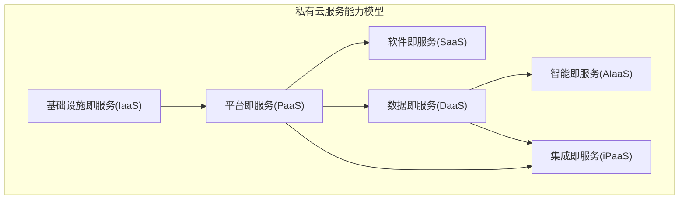
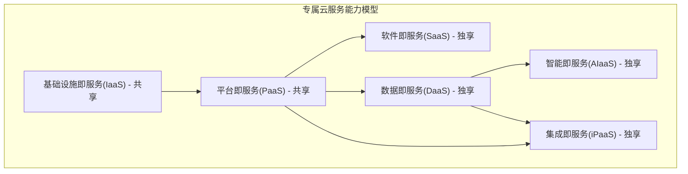
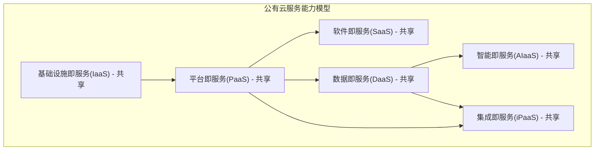

# AixOne企业级平台架构设计

## 1. 架构目标与原则

### 1.1 架构目标

AixOne企业级平台旨在构建一个统一的企业级业务平台，以TOGAF为理论指导，以ITIL 4框架作为最佳实践，通过"**平台+领域**"的分层架构，为各业务领域（财务、供应链、人力资源等）提供统一的基础平台支撑。

#### 1.1.1 核心目标

- **统一平台**：构建统一的企业级业务平台，避免重复建设
- **ITIL最佳实践**：以ITIL 4框架作为服务管理的最佳实践
- **领域扩展**：支持各业务领域基于平台能力进行定制化扩展开发
- **平台化发展**：支持技术平台、数据平台、智能平台、应用平台的逐步发展

#### 1.1.2 业务目标

- **提升效率**：通过标准化流程和自动化减少人工操作
- **降低成本**：通过平台复用减少重复开发成本
- **提高质量**：通过ITIL最佳实践提升服务质量
- **快速响应**：通过平台能力快速响应业务需求变化

### 1.2 架构原则

#### 1.2.1 核心原则

- **事件驱动**：通过事件总线实现服务间解耦
- **共享数据**：通过共享数据层实现数据一致性
- **领域驱动**：按ITIL领域划分微服务边界
- **平台化**：提供统一的基础平台能力
- **ITIL最佳实践**：AixOne作为ITIL 4的最佳实践实现

#### 1.2.2 设计原则

- **高内聚低耦合**：服务内部高内聚，服务间低耦合
- **可扩展性**：支持水平扩展和功能扩展
- **可维护性**：清晰的职责边界和统一的开发规范
- **可观测性**：完善的监控、日志和链路追踪
- **安全性**：多层次的安全防护机制

## 2. 业务架构

### 2.1 平台业务能力

AixOne企业级平台提供统一的基础平台能力，包含七个核心平台：


| 平台类型                          | 核心能力           | 详细功能                                                 |
| ----------------------------------- | -------------------- | ---------------------------------------------------------- |
| **技术平台**<br/>（基础设施层）   | 认证授权           | 用户认证、权限管理、单点登录、OAuth2.0、JWT              |
|                                   | API网关            | 路由、负载均衡、限流、熔断、安全控制                     |
|                                   | 服务发现           | 服务注册、服务发现、健康检查、服务治理                   |
|                                   | 事件中心           | 事件发布、订阅、路由、存储、事件处理                     |
|                                   | 通知服务           | 消息推送、邮件、短信、微信、钉钉等通知渠道               |
|                                   | 系统配置管理       | 系统配置中心、配置分发、配置版本管理、环境配置           |
|                                   | 服务网格           | 服务间通信、流量管理、安全策略、可观测性                 |
|                                   | 基础设施和平台管理 | 基础设施监控、平台资源管理、资源优化建议、平台性能分析   |
|                                   | 安全技术防护       | 网络安全、数据加密、访问控制、安全审计                   |
| **数据平台**<br/>（数据服务层）   | 数据存储           | 关系数据库、NoSQL、数据仓库、数据湖、时序数据库          |
|                                   | 数据处理           | ETL、数据清洗、数据转换、数据建模、数据质量治理          |
|                                   | 数据分析           | OLAP、数据挖掘、统计分析、实时分析、离线分析             |
|                                   | 数据服务           | 数据API、数据查询、数据报表、数据可视化                  |
|                                   | 数据安全           | 数据加密、数据脱敏、数据权限、数据审计、数据备份         |
|                                   | 主数据管理         | 主数据定义、主数据服务、数据标准化、数据质量             |
|                                   | 元数据管理         | 元数据定义、元数据服务、数据血缘、数据目录               |
| **应用平台**<br/>（应用服务层）   | 工作台服务         | 统一用户界面、应用集成、用户体验管理、个性化定制         |
|                                   | 用户门户           | 个性化门户、权限控制、导航管理、主题定制、多租户支持     |
|                                   | 应用管理           | 应用部署、应用配置、应用监控、应用生命周期管理           |
|                                   | 应用商店           | 应用市场、应用分发、应用版本管理、应用评价               |
|                                   | 用户体验管理       | 界面设计、交互优化、用户反馈、可用性测试                 |
|                                   | 多租户管理         | 租户隔离、租户配置、租户监控、租户计费                   |
|                                   | 服务配置管理       | 业务配置项管理、服务关系维护、配置基线管理、配置审计检查 |
| **集成平台**<br/>（集成服务层）   | API管理            | API设计、API文档、API版本管理、API监控、API安全          |
|                                   | 消息集成           | 消息队列、消息路由、消息转换、消息监控、消息安全         |
|                                   | 数据集成           | 数据同步、数据映射、数据转换、数据质量、批量同步         |
|                                   | 流程集成           | 工作流集成、业务流程编排、流程监控、流程优化             |
|                                   | 文件集成           | 文件传输、文件转换、文件监控、文件安全、文件版本         |
|                                   | 服务集成           | 服务编排、服务组合、服务监控、服务治理                   |
|                                   | 集成治理           | 集成标准、集成安全、集成监控、集成审计、集成测试         |
| **智能平台**<br/>（AI服务层）     | AI能力服务         | 机器学习、自然语言处理、图像识别、语音识别               |
|                                   | 智能算法服务       | 智能审批算法、智能分派算法、智能预警算法、智能推荐算法   |
|                                   | 知识管理           | 知识库、经验积累、智能问答、知识图谱                     |
|                                   | 预测分析服务       | 趋势预测模型、异常检测模型、风险评估模型、业务预测模型   |
| **开发平台**<br/>（DevOps层）     | 开发工具链         | IDE集成、代码编辑器、调试工具、开发环境管理              |
|                                   | 版本控制           | Git管理、分支策略、代码合并、代码审查                    |
|                                   | 代码质量           | 静态分析、代码审查、质量门禁、技术债务管理               |
|                                   | 构建管理           | 构建工具、构建环境、构建优化、依赖管理                   |
|                                   | 测试管理           | 单元测试、集成测试、自动化测试、测试覆盖率               |
|                                   | 开发环境           | 环境管理、环境隔离、环境配置、开发数据                   |
|                                   | 开发协作           | 代码协作、团队协作、知识分享、最佳实践                   |
|                                   | 开发流程           | 开发流程管理、代码提交流程、发布流程                     |
|                                   | 持续集成（CI）     | 代码构建、自动化测试、代码质量检查、开发环境部署         |
|                                   | 开发配置管理       | 开发环境配置、应用配置、测试配置、开发工具配置           |
|                                   | 质量保证           | 测试管理、安全扫描、性能测试、合规检查                   |
| **运维平台**<br/>（Operations层） | 服务监控告警       | 应用服务监控、业务指标监控、告警管理、故障响应、SLA管理  |
|                                   | 日志管理           | 日志收集、日志分析、日志存储、日志检索、日志审计         |
|                                   | 持续部署（CD）     | 生产环境部署、发布管理、环境管理、部署监控               |
|                                   | 部署管理           | 部署策略、环境管理、回滚管理、蓝绿部署、灰度发布         |
|                                   | IT资产管理         | 资产信息管理、资产状态跟踪、资产关系维护、资产审计报告   |
|                                   | 运维自动化         | 自动化运维脚本、故障自愈、容量自动调整、运维流程自动化   |

### 2.2 业务领域划分与业务能力模型


| 业务领域                                                               | ITIL实践支撑                                                     | 核心能力                                                                                                                                                                                                                                                                                                                                                                                                                                                                                                                                                                                                                                                                                                                                                                                                          | 平台依赖                                                                                                                                                                             |
| ------------------------------------------------------------------------ | ------------------------------------------------------------------ | ------------------------------------------------------------------------------------------------------------------------------------------------------------------------------------------------------------------------------------------------------------------------------------------------------------------------------------------------------------------------------------------------------------------------------------------------------------------------------------------------------------------------------------------------------------------------------------------------------------------------------------------------------------------------------------------------------------------------------------------------------------------------------------------------------------------- | -------------------------------------------------------------------------------------------------------------------------------------------------------------------------------------- |
| **财务管理领域**<br/>（Financial Management）                          | 服务财务管理、风险管理、测量与报告、服务级别管理                 | •**财务会计**：总账管理、应收应付账款、固定资产管理、财务报表生成<br/>• **管理会计**：成本中心会计、利润中心会计、预算管理、成本控制<br/>• **资金管理**：现金流管理、银行对账、融资管理、投资管理<br/>• **税务管理**：税务申报、合规检查、税务筹划、税务分析                                                                                                                                                                                                                                                                                                                                                                                                                                                                                                                                                  | 数据平台（财务分析）、技术平台（工作流引擎）、应用平台（财务应用、业务落地）、智能平台（财务预测能力服务、风险分析能力服务）                                                         |
| **人力资源管理领域**<br/>（Human Resource Management）                 | 劳动力和人才管理、组织变更管理、项目管理、知识管理               | •**组织管理**：组织结构管理、职位管理、岗位职责定义、组织架构分析<br/>• **人员管理**：员工信息管理、薪酬管理、福利管理、员工关系管理<br/>• **人才发展**：招聘管理、培训管理、绩效管理、职业发展规划<br/>• **时间管理**：考勤管理、休假管理、工时统计、排班管理                                                                                                                                                                                                                                                                                                                                                                                                                                                                                                                                                | 应用平台（HR应用、人才管理业务落地）、技术平台（工作流引擎）、智能平台（人才分析能力服务、智能推荐能力服务）                                                                         |
| **采购与供应链管理领域**<br/>（Procurement & Supply Chain Management） | 供应商管理、关系管理、风险管理、服务配置管理、变更启用           | **A. 供应链战略管理**<br/>• 供应链规划：战略规划、网络设计、合作伙伴选择、风险管控<br/>• 供应链优化：成本优化、效率提升、质量改进、可持续发展<br/><br/>**B. 采购管理**（供应链核心环节）<br/>• 采购需求管理：需求分析、需求审批、需求汇总、需求优化<br/>• 采购执行：采购订单管理、合同管理、采购跟踪、采购验收<br/>• 采购分析：采购成本分析、采购效率分析、供应商分析、采购优化<br/><br/>**C. 供应商关系管理**（采购管理子集）<br/>• 供应商准入：供应商认证、资质审核、准入评估<br/>• 供应商评估：绩效评估、质量评估、服务评估<br/>• 供应商协同：协同计划、信息共享、联合创新<br/><br/>**D. 库存与物流管理**<br/>• 库存管理：库存控制、物料需求计划、仓储管理、库存优化<br/>• 物流管理：运输管理、配送管理、物流跟踪、物流成本控制                                                                      | 应用平台（供应链应用、业务落地）、技术平台（工作流引擎）、数据平台（供应链分析）、智能平台（供应链优化能力服务、需求预测能力服务）                                                   |
| **营销管理领域**<br/>（Marketing Management）                          | 关系管理、服务台、服务请求管理、知识管理                         | •**市场分析**：市场调研、竞争分析、客户分析、市场趋势分析<br/>• **营销活动管理**：活动策划、活动执行、活动效果分析、营销预算管理<br/>• **品牌管理**：品牌策略、品牌传播、品牌监控、品牌价值评估<br/>• **数字营销**：社交媒体营销、内容营销、搜索引擎营销、营销自动化                                                                                                                                                                                                                                                                                                                                                                                                                                                                                                                                          | 智能平台（营销分析能力服务、智能推荐能力服务、客户画像能力服务）、应用平台（营销应用、营销自动化业务落地）、数据平台（客户数据）                                                     |
| **制造管理领域**<br/>（Manufacturing Management）                      | 服务配置管理、IT资产管理、监控和事态管理、变更启用               | •**生产计划**：主生产计划、物料需求计划、生产调度、产能规划<br/>• **生产执行**：生产订单管理、车间管理、生产控制、生产监控<br/>• **质量管理**：质量计划、质量检验、质量控制、质量改进<br/>• **设备管理**：设备主数据、维护计划、故障管理、设备分析                                                                                                                                                                                                                                                                                                                                                                                                                                                                                                                                                            | 技术平台（元数据管理）、运维平台（监控告警、IT资产管理）、数据平台（生产分析）、智能平台（生产优化能力服务、质量预测能力服务）、应用平台（制造应用、业务落地）                       |
| **项目管理领域**<br/>（Project Management）                            | 项目管理、变更启用、发布管理、服务验证和测试、知识管理、服务设计 | **A. 通用项目管理**<br/>• 项目规划：项目立项、范围定义、资源分配、进度计划<br/>• 项目执行：进度管理、成本控制、质量管理、风险管理<br/>• 项目收尾：验收管理、文档归档、经验总结、项目评价<br/>• 项目组合管理：项目组合规划、资源优化、投资决策、绩效监控<br/><br/>**B. 专业项目管理**（通用项目管理的专业化应用）<br/>**B1. 研发项目管理**（专业项目管理子集）<br/>• 产品研发：需求分析、产品设计、开发管理、测试验证<br/>• 技术创新：技术研究、专利管理、技术转移、技术评估<br/>• 研发计划：研发计划、研发执行、研发监控、研发交付<br/>• 知识管理：知识库建设、知识分享、知识创新、知识保护<br/><br/>**B2. IT项目管理**（专业项目管理子集）<br/>• 系统开发：需求分析、系统设计、开发实施、测试部署<br/>• 基础设施项目：网络建设、服务器部署、安全配置<br/>• 数据项目：数据迁移、数据治理、数据平台建设 | 技术平台（工作流引擎）、运维平台（部署管理）、数据平台（项目分析）、智能平台（知识管理能力服务、智能分析能力服务、项目预测能力服务、资源优化能力服务）、应用平台（项目管理业务落地） |
| **资产管理领域**<br/>（Asset Management）                              | IT资产管理、服务配置管理、监控和事态管理                         | •**资产全生命周期管理**：资产采购、资产配置、资产维护、资产处置<br/>• **维护管理**：预防性维护、纠正性维护、维护计划、维护分析<br/>• **资产分析**：资产价值分析、维护成本分析、资产绩效分析<br/>• **资产优化**：资产配置优化、维护策略优化、资产利用率提升                                                                                                                                                                                                                                                                                                                                                                                                                                                                                                                                                    | 技术平台（元数据管理）、运维平台（监控告警）、数据平台（资产分析）、智能平台（资产优化能力服务、维护预测能力服务）、应用平台（资产管理业务落地）                                     |
| **协同办公领域**<br/>（Collaboration & Office）                        | 服务台、服务请求管理、知识管理、信息安全管理                     | •**文档管理**：文档存储、文档版本控制、文档协作、文档安全<br/>• **工作流管理**：流程设计、流程执行、流程监控、流程优化<br/>• **沟通协作**：即时通讯、视频会议、团队协作、信息共享<br/>• **办公自动化**：审批流程、日程管理、任务管理、会议管理                                                                                                                                                                                                                                                                                                                                                                                                                                                                                                                                                                | 应用平台（协同应用、协作业务落地）、技术平台（工作流引擎）、智能平台（智能协作能力服务、智能推荐能力服务）                                                                           |
| **合规与风险管理领域**<br/>（Compliance & Risk Management）            | 风险管理、信息安全管理、服务连续性管理、审计管理                 | •**合规管理**：法规遵从、合规检查、合规报告、合规培训<br/>• **风险管理**：风险识别、风险评估、风险控制、风险监控<br/>• **内部审计**：审计计划、审计执行、审计报告、审计跟踪<br/>• **信息安全**：安全策略、安全监控、安全事件响应、安全培训                                                                                                                                                                                                                                                                                                                                                                                                                                                                                                                                                                    | 技术平台（认证授权）、运维平台（监控告警）、数据平台（风险分析）、智能平台（风险预测能力服务、合规智能分析能力服务）、应用平台（合规管理业务落地）                                   |

### 2.3 服务管理实践能力

基于ITIL 4实践的服务管理能力，为各业务领域提供标准化的服务管理支撑：

**ITIL 4通用管理实践（14个）**


| 实践名称         | 核心能力                                                     | 提供方               | 协作模式                                                                                                                                                                                                    | 应用场景                                                                                   |
| ------------------ | -------------------------------------------------------------- | ---------------------- | ------------------------------------------------------------------------------------------------------------------------------------------------------------------------------------------------------------- | -------------------------------------------------------------------------------------------- |
| 战略管理         | 战略规划制定、战略目标分解、战略执行监控、战略调整优化       | 应用平台             | **数据平台**：提供战略数据存储、分析工具<br/>**技术平台**：提供系统集成、数据收集<br/>**智能平台**：提供战略分析、预测模型                                                                                  | 通过应用平台提供战略管理工具，数据平台提供分析支撑，支持企业级战略决策                     |
| 组合管理         | 服务组合规划、投资决策支持、资源分配优化、组合绩效监控       | 应用平台             | **数据平台**：提供投资数据存储、分析工具<br/>**技术平台**：提供系统集成、数据收集<br/>**智能平台**：提供投资分析、风险评估                                                                                  | 通过应用平台提供组合管理工具，数据平台提供分析支撑，支持投资决策                           |
| 架构管理         | 架构设计规划、架构标准制定、架构变更管理、架构合规检查       | 技术平台             | **数据平台**：提供架构数据存储、关系分析。<br>**运维平台**：提供架构监控、性能数据<br>**应用平台**：提供架构管理界面、可视化展示。                                                                          | 通过技术平台提供架构管理工具，支撑所有业务领域                                             |
| 服务财务管理     | 成本核算管理、预算制定控制、投资回报分析、财务报告生成       | 财务管理领域         | **数据平台**：提供IT成本数据模型、核算引擎、分析工具<br/>**应用平台**：提供成本管理界面、预算流程、报表展示<br/>**技术平台**：提供数据收集、系统集成、安全控制                                              | 通过财务管理领域提供IT服务财务管理能力，数据平台提供分析支撑，支持IT服务成本核算和投资决策 |
| 劳动力和人才管理 | 人员招聘配置、技能培训发展、绩效评估激励、人才发展规划       | 人力资源管理领域     | **数据平台**：提供人员数据存储、分析工具<br/>**应用平台**：提供人员管理界面、培训管理工具、业务落地<br/>**智能平台**：提供人才画像能力服务、智能推荐能力服务<br/>**技术平台**：提供系统集成、数据收集       | 通过人力资源管理领域提供劳动力和人才管理能力，数据平台提供分析支撑，支持人才战略规划       |
| 持续改进         | 改进机会识别、改进计划制定、改进实施跟踪、改进效果评估       | 应用平台             | **数据平台**：提供绩效数据存储、分析工具<br/>**运维平台**：提供监控数据、性能指标<br/>**智能平台**：提供改进建议、智能分析                                                                                  | 通过应用平台提供持续改进工具，数据平台提供分析支撑，支持所有业务领域的持续改进             |
| 测量与报告       | 指标定义收集、报告模板设计、数据分析展示、绩效监控评估       | 数据平台             | **应用平台**：提供报告界面、可视化展示<br/>**技术平台**：提供数据收集、系统集成<br/>**智能平台**：提供智能分析、预测报告                                                                                    | 通过数据平台提供测量与报告能力，支撑所有业务领域的绩效监控和报告需求                       |
| 风险管理         | 风险识别评估、风险应对策略、风险监控预警、风险报告分析       | 合规与风险管理领域   | **数据平台**：提供风险数据存储、分析工具<br/>**应用平台**：提供风险管理界面、可视化展示<br/>**技术平台**：提供数据收集、系统集成                                                                            | 通过合规与风险管理领域提供风险管理能力，数据平台提供分析支撑，支持企业级风险管理           |
| 信息安全管理     | 安全策略制定、安全威胁防护、安全事件响应、安全合规审计       | 合规与风险管理领域   | **技术平台**：提供安全技术工具、防护措施<br/>**运维平台**：提供安全监控、威胁检测<br/>**应用平台**：提供安全管理界面、可视化展示<br/>**数据平台**：提供安全数据存储、分析工具                               | 通过合规与风险管理领域提供信息安全管理能力，技术平台提供安全技术支撑，支撑所有业务领域     |
| 知识管理         | 知识库建设、知识分类管理、知识搜索检索、知识质量评估         | 智能平台             | **数据平台**：提供知识数据存储、检索索引。<br>**应用平台**：提供知识管理界面、搜索界面。<br>**技术平台**：提供系统集成、API接口。                                                                           | 通过智能平台提供知识管理工具，支撑所有业务领域                                             |
| 组织变更管理     | 组织变革规划、变更影响评估、变更实施支持、变更效果验证       | 人力资源管理领域     | **数据平台**：提供组织数据存储、分析工具<br/>**应用平台**：提供变更管理界面、流程管理、业务落地<br/>**技术平台**：提供系统集成、数据收集<br/>**智能平台**：提供组织分析能力服务、智能推荐能力服务           | 通过人力资源管理领域提供组织变更管理能力，数据平台提供分析支撑，支持组织变革管理           |
| 项目管理         | 项目规划制定、项目进度控制、项目资源管理、项目风险控制       | 项目管理领域         | **数据平台**：提供项目数据存储、分析工具。<br>**应用平台**：提供项目管理界面、甘特图展示。<br>**技术平台**：提供系统集成、数据收集。                                                                        | 通过项目管理领域提供项目管理能力，数据平台提供分析支撑，支持项目全生命周期管理             |
| 关系管理         | 客户关系维护、供应商关系管理、合作伙伴协作、关系绩效评估     | 营销管理领域         | **数据平台**：提供关系数据存储、分析工具<br/>**应用平台**：提供关系管理界面、协作工具、业务落地<br/>**智能平台**：提供客户画像能力服务、关系分析能力服务<br/>**技术平台**：提供系统集成、数据收集           | 通过营销管理领域提供关系管理能力，数据平台提供分析支撑，支持客户和合作伙伴关系管理         |
| 供应商管理       | 供应商选择评估、合同谈判管理、供应商绩效监控、供应商关系维护 | 采购与供应链管理领域 | **数据平台**：提供供应商数据存储、分析工具<br/>**应用平台**：提供供应商管理界面、合同管理工具、业务落地<br/>**技术平台**：提供系统集成、数据收集<br/>**智能平台**：提供供应商分析能力服务、智能推荐能力服务 | 通过采购与供应链管理领域提供供应商管理能力，数据平台提供分析支撑，支持供应商全生命周期管理 |

##### **ITIL 4服务管理实践（17个）**


| 实践名称       | 核心能力                                                   | 提供方   | 协作模式                                                                                                                                                                                    | 应用场景                                                                                         |
| ---------------- | ------------------------------------------------------------ | ---------- | --------------------------------------------------------------------------------------------------------------------------------------------------------------------------------------------- | -------------------------------------------------------------------------------------------------- |
| 业务分析       | 业务需求分析、价值识别评估、业务影响分析、需求优先级排序   | 应用平台 | **数据平台**：提供业务数据存储、分析工具<br/>**智能平台**：提供价值分析能力服务、智能推荐能力服务<br/>**技术平台**：提供系统集成、数据收集                                                  | 通过应用平台提供业务分析工具，数据平台提供分析支撑，支持所有业务领域的价值识别                   |
| 服务目录管理   | 服务目录维护、服务分类管理、服务级别定义、服务可用性管理   | 应用平台 | **数据平台**：提供服务目录数据存储、分类管理<br>**技术平台**：提供系统集成、API接口                                                                                                         | 通过应用平台提供目录管理工具，管理所有业务领域的服务目录                                         |
| 服务设计       | 服务设计规划、服务模型构建、服务组合设计、服务体验优化     | 应用平台 | **数据平台**：提供服务设计数据存储、模型管理<br>**技术平台**：提供系统集成、API接口                                                                                                         | 通过应用平台提供设计工具，设计所有业务领域的服务模型                                             |
| 服务级别管理   | SLA定义监控、性能指标收集、服务级别报告、违约处理          | 应用平台 | **数据平台**：提供SLA数据存储、分析工具<br>**运维平台**：提供性能监控数据、告警信息                                                                                                         | 通过应用平台提供SLA管理工具，管理所有业务领域的服务级别                                          |
| 可用性管理     | 可用性指标监控、故障分析诊断、可用性报告生成、改进建议提供 | 运维平台 | **数据平台**：提供可用性数据存储、分析工具<br>**技术平台**：提供监控数据收集、系统集成                                                                                                      | 通过运维平台提供监控工具，监控所有业务领域的服务可用性                                           |
| 容量和性能管理 | 容量规划制定、性能指标监控、性能优化建议、容量预警管理     | 运维平台 | **数据平台**：提供容量数据存储、分析工具<br>**技术平台**：提供性能数据收集、系统集成                                                                                                        | 通过运维平台提供监控工具，管理所有业务领域的容量和性能                                           |
| 服务连续性管理 | 业务影响分析、恢复时间目标管理、灾难恢复计划、连续性测试   | 运维平台 | **数据平台**：提供连续性数据存储、分析工具<br>**应用平台**：提供连续性管理界面、流程管理                                                                                                    | 通过运维平台提供连续性管理工具，管理所有业务领域的服务连续性                                     |
| 监控和事态管理 | 系统指标监控、告警规则配置、告警响应处理、监控仪表盘       | 运维平台 | **数据平台**：提供监控数据存储、分析工具<br>**技术平台**：提供监控数据收集、系统集成                                                                                                        | 通过运维平台提供监控工具，监控所有业务领域的系统状态                                             |
| 服务台         | 统一服务入口、用户支持服务、服务请求处理、用户满意度管理   | 应用平台 | **数据平台**：提供服务台数据存储、分析工具<br>**技术平台**：提供系统集成、API接口                                                                                                           | 通过应用平台提供服务台工具，为所有业务领域提供统一服务入口                                       |
| 事件管理       | 事件记录分类、事件分派升级、事件解决跟踪、事件关闭验证     | 应用平台 | **数据平台**：提供事件数据存储、历史数据查询<br>**运维平台**：提供监控数据、告警信息                                                                                                        | 通过应用平台提供事件管理工具，处理所有业务领域的事件                                             |
| 服务请求管理   | 服务请求处理、审批流程管理、请求执行跟踪、请求状态更新     | 应用平台 | **数据平台**：提供请求数据存储、流程管理<br>**技术平台**：提供系统集成、API接口                                                                                                             | 通过应用平台提供请求管理工具，处理所有业务领域的服务请求                                         |
| 问题管理       | 问题识别记录、根本原因分析、问题解决方案、已知错误管理     | 应用平台 | **数据平台**：提供问题数据存储、历史数据查询<br/>**智能平台**：提供根本原因分析能力服务、智能诊断能力服务<br/>**运维平台**：提供故障数据、监控信息<br/>**技术平台**：提供系统集成、数据收集 | 通过应用平台提供问题管理工具，管理所有业务领域的问题                                             |
| 发布管理       | 发布计划制定、发布包管理、部署流程控制、发布验证回滚       | 运维平台 | **数据平台**：提供发布数据存储、版本管理<br>**技术平台**：提供部署工具、系统集成<br>**开发平台**：提供发布包构建、版本管理                                                                  | 通过运维平台提供发布工具，管理所有业务领域的发布                                                 |
| 变更启用       | 变更请求管理、变更审批流程、变更实施跟踪、变更回滚处理     | 应用平台 | **数据平台**：提供变更数据存储、流程管理<br>**技术平台**：提供系统集成、API接口<br>**开发平台**：提供代码变更、测试验证<br>**运维平台**：提供变更实施、环境管理                             | 通过应用平台提供变更管理工具，管理所有业务领域的变更                                             |
| 服务验证和测试 | 服务测试计划、测试用例管理、测试执行跟踪、质量保证报告     | 开发平台 | **数据平台**：提供测试数据存储、结果分析<br>**技术平台**：提供测试工具、系统集成<br>**运维平台**：提供生产环境测试、部署验证                                                                | 通过开发平台提供测试工具，管理所有业务领域的服务验证                                             |
| 服务配置管理   | 配置项管理、配置关系维护、配置基线管理、配置审计检查       | 应用平台 | **数据平台**：提供CMDB数据存储、关系管理<br/>**技术平台**：提供配置发现、系统集成、API接口<br/>**运维平台**：提供自动化验证、监控工具、配置数据收集                                         | 通过应用平台提供配置管理服务，数据平台提供CMDB支撑，技术平台提供集成能力，运维平台提供自动化支撑 |
| IT资产管理     | 资产信息管理、资产状态跟踪、资产关系维护、资产审计报告     | 运维平台 | **数据平台**：提供资产数据存储、关系管理<br/>**技术平台**：提供资产发现、系统集成<br/>**应用平台**：提供资产管理界面、报告展示                                                              | 通过运维平台提供资产管理服务，数据平台提供资产数据库支撑，管理所有业务领域的IT资产               |

##### **ITIL 4技术管理实践（3个）**


| 实践名称           | 核心能力                                                 | 提供方   | 协作模式                                                                                                                                                               | 应用场景                                                                 |
| -------------------- | ---------------------------------------------------------- | ---------- | ------------------------------------------------------------------------------------------------------------------------------------------------------------------------ | -------------------------------------------------------------------------- |
| 部署管理           | 部署策略制定、自动化部署流程、环境管理配置、部署状态监控 | 运维平台 | **数据平台**：提供部署数据存储、状态管理<br>**技术平台**：提供部署工具、环境管理                                                                                       | 通过运维平台提供部署工具，管理所有业务领域的部署                         |
| 基础设施和平台管理 | 基础设施监控、平台资源管理、资源优化建议、平台性能分析   | 技术平台 | **数据平台**：提供基础设施数据存储、分析工具<br>**运维平台**：提供监控数据、性能指标                                                                                   | 通过技术平台提供基础设施管理工具，支撑所有业务领域                       |
| 软件开发和管理     | 开发流程管理、代码版本控制、代码质量检查、开发团队协作   | 开发平台 | **技术平台**：提供开发工具链、代码仓库<br>**数据平台**：提供开发数据存储、版本管理<br>**应用平台**：提供开发管理界面、业务落地<br>**运维平台**：提供部署环境、测试环境 | 通过开发平台提供开发管理服务，技术平台提供工具链支撑，支撑研发和项目管理 |

#### 2.1.4 行业化应用

基于核心业务领域和支撑业务领域，针对不同行业的专业化应用能力：

**制造业专业领域**

- **专业能力**：精益生产、智能制造、工业4.0、供应链协同、质量体系
- **ITIL实践支撑**：服务配置管理、IT资产管理、监控和事态管理
- **平台依赖**：技术平台（元数据管理）、运维平台（监控告警）、智能平台（智能制造）

**金融业专业领域**

- **专业能力**：风险管理、合规管理、交易管理、投资管理、客户服务、反洗钱
- **ITIL实践支撑**：信息安全管理、风险管理、服务连续性管理、审计管理
- **平台依赖**：技术平台（认证授权）、运维平台（备份服务）、数据平台（风险分析）

**医疗健康专业领域**

- **专业能力**：患者管理、医疗记录管理、药品管理、设备管理、合规管理、临床决策
- **ITIL实践支撑**：信息安全管理、知识管理、服务验证和测试、审计管理
- **平台依赖**：智能平台（知识管理）、技术平台（认证授权）、数据平台（医疗分析）

**教育行业专业领域**

- **专业能力**：学生管理、课程管理、教学管理、考试管理、资源管理、学习分析
- **ITIL实践支撑**：知识管理、服务目录管理、服务请求管理、项目管理
- **平台依赖**：智能平台（知识管理）、应用平台（应用商店）、数据平台（学习分析）

**政府公共领域**

- **专业能力**：政务服务、公共资源管理、政策管理、公民服务、数据治理
- **ITIL实践支撑**：服务台、服务请求管理、知识管理、信息安全管理
- **平台依赖**：应用平台（政务服务）、技术平台（服务台）、数据平台（政务分析）

### 2.4 平台服务模式

AixOne企业级平台支持多种服务模式，满足不同业务场景的服务共享和独享需求：

#### 2.2.0 服务分层架构原则

**设计原则**：

- **单向依赖**：确保上层服务依赖下层服务，避免"反转依赖"问题
- **平台统一承载**：PaaS作为统一承载底座，提供运行环境和中间件
- **横向协同**：DaaS、AIaaS、iPaaS作为横向服务层，基于PaaS提供专业能力
- **服务独立性**：各服务层保持相对独立，便于单独扩展和维护

**依赖关系模型**：

```
IaaS (基础设施层)
  ↓
PaaS (平台层) ← 统一承载底座
  ↓
SaaS (应用层)
  ↓
DaaS (数据层) ← 基于PaaS提供数据服务
  ↓
AIaaS (智能层) ← 基于DaaS和PaaS提供智能服务
  ↓
iPaaS (集成层) ← 基于PaaS和DaaS提供集成服务
```

**避免的反转依赖问题**：

- ❌ DaaS直接依赖IaaS，绕过PaaS统一管理
- ❌ AIaaS反向依赖SaaS获取数据
- ❌ iPaaS反向依赖应用层进行数据流转

#### 2.2.1 私有云服务模式

**业务价值**：

- **完全控制**：企业拥有对基础设施和数据的完全控制权
- **高度定制**：可根据特定业务需求进行深度定制和优化
- **合规保障**：满足严格的行业法规和合规性要求

**目标用户**：

- **大型企业**：对数据安全和业务连续性要求极高的大型企业
- **政府机构**：需要处理敏感政务数据的政府部门
- **金融机构**：对数据安全和合规性有严格要求的银行、保险等机构
- **医疗组织**：需要保护患者隐私数据的医院和医疗机构

**典型场景**：

- **核心业务系统**：ERP、财务系统、人力资源系统等关键业务应用
- **敏感数据处理**：涉及商业机密、个人隐私的敏感数据管理
- **合规要求**：需要满足GDPR、SOX、HIPAA等严格合规要求
- **定制化需求**：需要特定硬件配置或软件环境的专业应用

**服务能力模型**



**架构说明**：

- **IaaS**：提供底层基础设施支撑
- **PaaS**：作为统一承载底座，提供运行环境和中间件
- **SaaS**：基于PaaS构建的应用服务
- **DaaS**：基于PaaS提供数据服务，避免直接依赖IaaS
- **AIaaS**：依赖DaaS和PaaS，确保数据访问和计算环境统一
- **iPaaS**：基于PaaS和DaaS提供集成服务，避免反向依赖

#### 2.2.2 专属云服务模式

**业务价值**：

- **平衡成本与安全**：在保证数据安全的同时，降低基础设施成本
- **灵活扩展**：结合公有云的弹性扩展能力和私有云的安全性
- **专业服务**：享受云服务商的专业运维和技术支持

**目标用户**：

- **中型企业**：有一定规模但预算有限的企业
- **分支机构**：大型企业的区域分支机构或子公司
- **行业客户**：需要特定行业解决方案的客户
- **混合需求**：既需要安全性又需要成本效益的企业

**典型场景**：

- **混合工作负载**：核心业务独享，非核心业务共享
- **数据分级管理**：敏感数据独享，一般数据共享
- **成本优化**：在保证关键业务安全的前提下优化IT成本
- **快速部署**：需要快速上线但又要保证数据隔离的项目

**服务能力模型**：



**架构说明**：

- **共享层**：IaaS和PaaS采用共享模式，降低基础设施成本
- **独享层**：SaaS、DaaS、AIaaS、iPaaS采用独享模式，保证数据隔离
- **依赖关系**：遵循单向依赖原则，避免上层服务反向依赖下层

#### 2.2.3 公有云服务模式

**业务价值**：

- **成本效益**：按需付费，降低初始投资和运维成本
- **快速部署**：快速上线，缩短业务创新周期
- **弹性扩展**：根据业务需求自动扩展或缩减资源
- **全球覆盖**：利用云服务商的全球基础设施

**目标用户**：

- **初创企业**：预算有限，需要快速验证商业模式
- **中小企业**：希望专注于核心业务，减少IT投入
- **互联网公司**：需要快速迭代和弹性扩展的互联网企业
- **项目团队**：临时项目或短期业务需求

**典型场景**：

- **Web应用**：网站、电商平台、移动应用后端
- **开发测试**：软件开发、测试环境、CI/CD流水线
- **数据分析**：大数据处理、机器学习、商业智能
- **内容分发**：CDN、媒体存储、内容管理

**服务能力模型**：



**架构说明**：

- **完全共享**：所有服务层采用共享模式，最大化资源利用效率
- **成本优化**：通过共享降低单位成本，提高投资回报率
- **弹性扩展**：基于统一平台实现快速扩展和收缩

## 3. 应用架构

基于TOGAF 9.2应用架构设计标准，AixOne平台采用分层应用架构，确保业务功能与技术实现的清晰分离。

### 3.1 应用架构概览

#### 3.1.1 应用架构原则


| 原则类别       | 原则描述                             | 实施要求                                            |
| ---------------- | -------------------------------------- | ----------------------------------------------------- |
| **业务对齐**   | 应用架构必须与业务战略和需求保持一致 | • 业务驱动设计<br/>• 需求可追溯<br/>• 价值导向   |
| **技术标准化** | 采用统一的技术标准和规范             | • 技术栈统一<br/>• 接口标准化<br/>• 开发规范统一 |
| **模块化设计** | 应用组件高度模块化，低耦合高内聚     | • 组件独立<br/>• 接口清晰<br/>• 可复用性强       |
| **可扩展性**   | 支持业务增长和技术演进               | • 水平扩展<br/>• 垂直扩展<br/>• 技术演进         |
| **安全性**     | 内置安全机制，确保数据和应用安全     | • 安全设计<br/>• 权限控制<br/>• 数据保护         |

#### 3.1.2 应用分层架构

基于TOGAF分层架构模式，AixOne平台采用六层应用架构：


| 架构层次                                      | 职责描述     | 主要组件                                                    | 技术特点                                        |
| ----------------------------------------------- | -------------- | ------------------------------------------------------------- | ------------------------------------------------- |
| **表示层**<br/>（Presentation Layer）         | 用户交互界面 | • Web应用<br/>• 移动应用<br/>• API网关<br/>• 第三方接口 | • 多端适配<br/>• 响应式设计<br/>• 统一认证   |
| **应用层**<br/>（Application Layer）          | 业务流程编排 | • 应用服务<br/>• 工作流引擎<br/>• 事件处理器             | • 无状态设计<br/>• 事务管理<br/>• 事件驱动   |
| **业务层**<br/>（Business Layer）             | 核心业务逻辑 | • 领域服务<br/>• 业务规则<br/>• 业务实体                 | • 业务封装<br/>• 规则引擎<br/>• 领域模型     |
| **数据访问层**<br/>（Data Access Layer）      | 数据访问抽象 | • 数据访问对象<br/>• 数据映射<br/>• 缓存管理             | • 数据抽象<br/>• 性能优化<br/>• 缓存策略     |
| **平台服务层**<br/>（Platform Service Layer） | 平台通用服务 | • 认证授权<br/>• 配置管理<br/>• 监控告警                 | • 平台能力<br/>• 通用服务<br/>• 技术支撑     |
| **数据层**<br/>（Data Layer）                 | 数据存储管理 | • 关系数据库<br/>• 文档数据库<br/>• 文件存储             | • 数据持久化<br/>• 数据一致性<br/>• 数据安全 |


### 3.2 应用组件架构

#### 3.2.1 应用组件分类

基于TOGAF应用组件分类标准，AixOne平台应用组件分为以下类别：


| 组件类别         | 组件描述               | 典型组件                                                | 设计原则                                        |
| ------------------ | ------------------------ | --------------------------------------------------------- | ------------------------------------------------- |
| **业务应用组件** | 实现具体业务功能的应用 | • 用户管理应用<br/>• 财务管理应用<br/>• 项目管理应用 | • 业务领域驱动<br/>• 功能完整<br/>• 用户友好 |
| **集成应用组件** | 实现系统间集成的应用   | • API网关<br/>• 消息中间件<br/>• 数据同步服务        | • 标准化接口<br/>• 高可用<br/>• 可监控       |
| **平台应用组件** | 提供平台基础能力的应用 | • 认证服务<br/>• 配置服务<br/>• 监控服务             | • 通用性强<br/>• 性能稳定<br/>• 易于扩展     |
| **数据应用组件** | 处理数据相关功能的应用 | • 数据仓库<br/>• 报表服务<br/>• 分析服务             | • 数据一致性<br/>• 查询性能<br/>• 数据安全   |
| **基础库组件**   | 作为基础库提供通用能力 | • 事务管理库<br/>• 调度任务库<br/>• 工具类库<br/>• 中间件SDK | • 高复用性<br/>• 轻量级<br/>• 易集成<br/>• 版本兼容 |

#### 3.2.2 微服务与应用组件关系

微服务架构是应用组件架构的具体实现方式，每个微服务对应一个或多个应用组件。

##### 微服务编码规则

微服务编码采用 `axione-[平台/领域编码]-[功能编码]` 格式，具体规则如下：

**编码格式说明：**
- **axione**：企业品牌标识
- **[平台/领域编码]**：平台或业务领域的英文缩写
- **[功能编码]**：微服务具体功能的英文描述

**7个平台编码定义：**

| 平台名称 | 编码 | 说明 | 示例 |
|---------|------|------|------|
| **技术平台** | `tech` | Technical Platform | `axione-tech-auth` |
| **数据平台** | `data` | Data Platform | `axione-data-warehouse` |
| **应用平台** | `app` | Application Platform | `axione-app-service-desk` |
| **集成平台** | `int` | Integration Platform | `axione-int-gateway` |
| **智能平台** | `ai` | AI Platform | `axione-ai-knowledge` |
| **开发平台** | `dev` | Development Platform | `axione-dev-toolchain` |
| **运维平台** | `ops` | Operations Platform | `axione-ops-monitor` |

**9个业务领域编码定义：**

| 业务领域名称 | 编码 | 说明 | 示例 |
|-------------|------|------|------|
| **财务管理领域** | `finance` | Financial Management | `axione-finance` |
| **人力资源管理领域** | `hr` | Human Resource Management | `axione-hr` |
| **采购与供应链管理领域** | `supply` | Procurement & Supply Chain Management | `axione-supply` |
| **营销管理领域** | `marketing` | Marketing Management | `axione-marketing` |
| **制造管理领域** | `manufacturing` | Manufacturing Management | `axione-manufacturing` |
| **项目管理领域** | `project` | Project Management | `axione-project` |
| **资产管理领域** | `asset` | Asset Management | `axione-asset` |
| **协同办公领域** | `collab` | Collaboration & Office | `axione-collab` |
| **合规与风险管理领域** | `compliance` | Compliance & Risk Management | `axione-compliance` |

**编码规则特点：**
- **业务领域微服务**：使用 `[领域名]` 格式，体现完整的业务领域服务
- **平台微服务**：使用 `[平台名]-[功能名]` 格式，体现平台服务特性
- **ITIL实践微服务**：根据提供方归属到相应平台，体现服务管理实践的平台支撑
- **功能编码**：使用有意义的英文单词，直观反映微服务功能

以下是微服务与应用组件的映射关系：


| 微服务编码 | 微服务名称           | 所属领域     | 应用组件分类 | 应用组件 | 组件职责                                           |
| ---------- | ---------------------- | -------------- | -------------- | ---------- | ---------------------------------------------------- |
| axione-finance | 财务管理服务         | 财务管理领域 | 业务应用组件 | 财务会计组件、管理会计组件、资金管理组件、税务管理组件 | 财务会计、管理会计、资金管理、税务管理、IT服务成本核算、预算制定控制、投资回报分析、财务报告生成 |
| axione-hr | 人力资源管理服务     | 人力资源管理领域 | 业务应用组件 | 组织管理组件、人员管理组件、人才发展组件、时间管理组件 | 组织管理、人员管理、人才发展、时间管理、人员招聘配置、技能培训发展、绩效评估激励、人才发展规划 |
| axione-supply | 采购与供应链管理服务 | 采购与供应链管理领域 | 业务应用组件 | 供应链规划组件、采购管理组件、供应商关系管理组件、库存物流管理组件 | 供应链规划、采购管理、供应商关系管理、库存物流管理、供应商选择评估、合同谈判管理、供应商绩效监控、供应商关系维护 |
| axione-marketing | 营销管理服务         | 营销管理领域 | 业务应用组件 | 市场分析组件、营销活动管理组件、品牌管理组件、数字营销组件 | 市场分析、营销活动管理、品牌管理、数字营销         |
| axione-manufacturing | 制造管理服务         | 制造管理领域 | 业务应用组件 | 生产计划组件、生产执行组件、质量管理组件、设备管理组件 | 生产计划、生产执行、质量管理、设备管理             |
| axione-project | 项目管理服务         | 项目管理领域 | 业务应用组件 | 项目规划组件、项目执行组件、项目收尾组件、项目组合管理组件 | 项目规划、项目执行、项目收尾、项目组合管理         |
| axione-asset | 资产管理服务         | 资产管理领域 | 业务应用组件 | 资产登记组件、资产跟踪组件、资产维护组件、资产处置组件 | 资产全生命周期管理、维护管理、资产分析、资产优化、资产登记、资产跟踪、资产维护、资产处置 |
| axione-collab | 协同办公服务         | 协同办公领域 | 业务应用组件 | 文档管理组件、工作流管理组件、沟通协作组件、办公自动化组件 | 文档管理、工作流管理、沟通协作、办公自动化         |
| axione-compliance | 合规与风险管理服务   | 合规与风险管理领域 | 业务应用组件 | 合规管理组件、风险管理组件、内部审计组件、信息安全组件 | 合规管理、风险管理、内部审计、信息安全             |
| axione-app-itsm | IT服务管理服务       | 应用平台 | 平台应用组件 | 服务台组件、事件管理组件、问题管理组件、变更管理组件、配置管理组件 | 服务台、事件管理、问题管理、服务目录管理、服务请求管理、变更管理、发布管理、配置管理、CMDB管理、服务设计、SLA管理、可用性管理、容量管理、服务连续性管理 |
| axione-app-workbench | 工作台服务           | 应用平台 | 平台应用组件 | 统一用户界面组件、应用集成组件、个性化定制组件、多租户支持组件 | 统一用户界面、应用集成、个性化定制、界面设计、交互优化、用户反馈、可用性测试、个性化门户、导航管理、主题定制、权限控制、多租户支持、租户隔离、租户配置、租户监控、租户计费 |
| axione-app-application | 应用管理服务         | 应用平台 | 平台应用组件 | 应用生命周期管理组件、应用市场组件、应用分发组件、应用版本管理组件 | 应用生命周期管理、应用市场、应用分发、应用版本管理、应用评价、应用服务管理、应用依赖管理 |
| axione-int-gateway | API网关服务          | 集成平台 | 集成应用组件 | 统一入口组件、路由转发组件、限流组件、安全控制组件 | 统一入口、路由转发、限流、安全控制                 |
| axione-int-message | 消息中间件服务       | 集成平台 | 集成应用组件 | 异步消息传递组件、事件发布组件、消息路由组件 | 异步消息传递、事件发布、消息路由                   |
| axione-int-data | 数据集成服务         | 集成平台 | 集成应用组件 | 数据同步组件、数据转换组件、数据质量检查组件 | 数据同步、数据转换、数据质量检查                   |
| axione-tech-auth | 认证授权服务         | 技术平台 | 平台应用组件 | 统一认证组件、单点登录组件、权限控制组件、多因子认证组件 | 统一认证、单点登录、权限控制、多因子认证           |
| axione-tech-config | 配置管理服务         | 技术平台 | 平台应用组件 | 配置中心组件、环境管理组件、动态配置组件、版本控制组件 | 配置中心、环境管理、动态配置、版本控制、应用配置管理 |
| axione-tech-monitor | 监控告警服务         | 技术平台 | 平台应用组件 | 性能监控组件、日志收集组件、告警通知组件、健康检查组件 | 性能监控、日志收集、告警通知、健康检查             |
| axione-tech-workflow | 工作流引擎服务       | 技术平台 | 平台应用组件 | 流程设计组件、流程执行组件、流程监控组件、流程优化组件 | 流程设计、流程执行、流程监控、流程优化、架构管理     |
| axione-tech-discovery | 服务发现服务         | 技术平台 | 平台应用组件 | 服务注册组件、服务发现组件、健康检查组件、负载均衡组件 | 服务注册、服务发现、健康检查、负载均衡             |
| axione-tech-event | 事件中心服务         | 技术平台 | 平台应用组件 | 事件发布组件、事件订阅组件、事件路由组件、事件存储组件 | 事件发布、事件订阅、事件路由、事件存储             |
| axione-tech-mesh | 服务网格服务         | 技术平台 | 平台应用组件 | 服务治理组件、流量管理组件、安全策略组件、可观测性组件 | 服务治理、流量管理、安全策略、可观测性             |
| axione-tech-notify | 通知服务             | 技术平台 | 平台应用组件 | 消息通知组件、邮件通知组件、短信通知组件、推送通知组件 | 消息通知、邮件通知、短信通知、推送通知             |
| axione-tech-file | 文件管理服务         | 技术平台 | 平台应用组件 | 文件上传组件、文件存储组件、文件下载组件、文件安全组件 | 文件上传、文件存储、文件下载、文件安全             |
| axione-tech-cache | 缓存服务             | 技术平台 | 平台应用组件 | 数据缓存组件、会话缓存组件、分布式缓存组件、缓存策略组件 | 数据缓存、会话缓存、分布式缓存、缓存策略           |
| axione-data-warehouse | 数据仓库服务         | 数据平台 | 数据应用组件 | 数据ETL组件、数据建模组件、数据存储组件、主数据管理组件、元数据管理组件 | 数据ETL、数据建模、数据存储、主数据管理、元数据管理 |
| axione-data-analytics | 数据分析服务         | 数据平台 | 数据应用组件 | 报表分析组件、数据质量组件、测量与报告组件、可视化组件、仪表板组件 | 报表分析、数据质量、测量与报告、可视化、仪表板、业务分析 |
| axione-data-security | 数据安全服务         | 数据平台 | 数据应用组件 | 数据加密组件、数据脱敏组件、访问控制组件、审计日志组件 | 数据加密、数据脱敏、访问控制、审计日志             |
| axione-ai-knowledge | 知识管理服务         | 智能平台 | 智能应用组件 | 知识库建设组件、知识分类组件、知识搜索组件、知识推荐组件 | 知识库建设、知识分类、知识搜索、知识推荐           |
| axione-ai-analysis | 智能分析服务         | 智能平台 | 智能应用组件 | 数据分析组件、预测分析组件、智能推荐组件、决策支持组件、智能协作组件 | 数据分析、预测分析、智能推荐、决策支持、智能协作   |
| axione-ai-ml-platform | AI算法平台服务       | 智能平台 | 智能应用组件 | 机器学习组件、NLP组件、计算机视觉组件、模型训练组件、模型推理组件 | 机器学习、NLP、计算机视觉、模型训练、模型推理       |
| axione-dev-toolchain | 开发工具链服务       | 开发平台 | 开发应用组件 | IDE集成组件、代码编辑器组件、版本控制组件、代码质量组件、调试工具组件 | IDE集成、代码编辑器、版本控制、代码质量、调试工具   |
| axione-dev-build | 构建测试服务         | 开发平台 | 开发应用组件 | 构建管理组件、测试管理组件、持续集成组件、构建优化组件、依赖管理组件 | 构建管理、测试管理、持续集成、构建优化、依赖管理    |
| axione-dev-environment | 开发环境服务         | 开发平台 | 开发应用组件 | 环境管理组件、环境隔离组件、环境配置组件、开发数据组件 | 环境管理、环境隔离、环境配置、开发数据              |
| axione-ops-monitoring | 监控运维服务         | 运维平台 | 运维应用组件 | 服务监控组件、日志管理组件、告警管理组件、故障响应组件、事态分析组件 | 服务监控、日志管理、告警管理、故障响应、事态分析、应用监控 |
| axione-ops-deployment | 部署运维服务         | 运维平台 | 运维应用组件 | 持续部署组件、运维自动化组件、IT资产管理组件、环境管理组件、应用部署组件 | 持续部署、运维自动化、IT资产管理、环境管理、应用部署 |

**微服务组件映射原则：**


| 映射原则       | 说明                                   | 应用场景                           |
| ---------------- | ---------------------------------------- | ------------------------------------ |
| **一对一映射** | 一个微服务对应一个应用组件             | 功能单一、职责明确的微服务         |
| **一对多映射** | 一个微服务包含多个应用组件             | 功能复杂、需要多个组件协作的微服务 |
| **多对一映射** | 多个微服务共同实现一个应用组件         | 大型应用组件需要多个微服务协作     |
| **分层映射**   | 不同层次的微服务对应不同层级的应用组件 | 分层架构中的微服务组织             |

#### 3.2.3 平台基础组件清单

基于AixOne企业级平台架构，需要提供以下基础组件以支撑整个平台运行：

**基础库组件清单**：

| 组件类别 | 组件名称 | 功能描述 | 技术实现 | 版本要求 |
|---------|----------|----------|----------|----------|
| **事务管理** | axione-common-transaction | 分布式事务管理、事务补偿、事务监控 | Spring Transaction + Seata | 1.0+ |
| **任务调度** | axione-common-scheduler | 定时任务、分布式调度、任务监控 | Quartz + XXL-Job | 1.0+ |
| **缓存管理** | axione-common-cache | 多级缓存、缓存策略、缓存监控 | Spring Cache + Redis | 1.0+ |
| **消息队列** | axione-common-message | 消息发送、消息消费、消息监控 | Spring Cloud Stream + Kafka | 1.0+ |
| **数据访问** | axione-common-data | 数据访问抽象、分页、批量操作 | Spring Data JPA + MyBatis | 1.0+ |
| **工具类库** | axione-common-utils | 通用工具类、字符串处理、日期处理 | 自研工具类 | 1.0+ |
| **配置管理** | axione-common-config | 配置读取、配置刷新、配置加密 | Spring Cloud Config | 1.0+ |
| **日志管理** | axione-common-logging | 日志记录、日志收集、日志分析 | Logback + ELK | 1.0+ |
| **监控指标** | axione-common-metrics | 指标收集、指标上报、指标展示 | Micrometer + Prometheus | 1.0+ |
| **安全工具** | axione-common-security | 加密解密、签名验证、安全工具 | Spring Security + JWT | 1.0+ |
| **文件处理** | axione-common-file | 文件上传、文件下载、文件存储 | Spring Boot + MinIO | 1.0+ |
| **数据校验** | axione-common-validation | 参数校验、数据校验、校验规则 | Hibernate Validator | 1.0+ |

**中间件SDK组件清单**：

| 组件类别 | 组件名称 | 功能描述 | 技术实现 | 版本要求 |
|---------|----------|----------|----------|----------|
| **数据库SDK** | axione-sdk-database | 数据库连接、连接池、事务管理 | HikariCP + Druid | 1.0+ |
| **缓存SDK** | axione-sdk-cache | Redis客户端、缓存操作、集群支持 | Lettuce + Redisson | 1.0+ |
| **消息SDK** | axione-sdk-message | Kafka客户端、消息生产消费 | Spring Kafka | 1.0+ |
| **搜索SDK** | axione-sdk-search | 全文搜索、索引管理、查询构建 | Elasticsearch Client | 1.0+ |
| **存储SDK** | axione-sdk-storage | 对象存储、文件管理、CDN | MinIO + Aliyun OSS | 1.0+ |
| **通知SDK** | axione-sdk-notification | 邮件通知、短信通知、推送通知 | Spring Boot Mail + 阿里云SMS | 1.0+ |

**组件集成规范**：

| 集成方式 | 说明 | 示例 |
|---------|------|------|
| **Maven依赖** | Java项目通过Maven引入基础库组件 | `<dependency><groupId>com.axione</groupId><artifactId>axione-common-transaction</artifactId></dependency>` |
| **NPM包** | 前端项目通过NPM引入工具库 | `npm install @axione/common-utils` |
| **Docker镜像** | 容器化部署时通过基础镜像提供组件 | `FROM axione/base:1.0` |
| **配置注入** | 通过配置文件或环境变量配置组件 | `axione.common.transaction.enabled=true` |

#### 3.2.4 应用组件交互与依赖关系

##### 3.2.4.1 组件交互模式

| 交互模式     | 描述                 | 适用场景                    | 技术实现                                  |
| -------------- | ---------------------- | ----------------------------- | ------------------------------------------- |
| **同步调用** | 直接调用，等待响应   | • 实时查询<br/>• 事务处理 | • REST API<br/>• gRPC<br/>• GraphQL    |
| **异步消息** | 通过消息队列通信     | • 事件通知<br/>• 批量处理 | • Kafka<br/>• RabbitMQ<br/>• ActiveMQ  |
| **事件驱动** | 基于事件的松耦合交互 | • 业务流程<br/>• 状态变更 | • 事件总线<br/>• 发布订阅<br/>• CQRS   |
| **数据共享** | 通过共享数据存储交互 | • 数据同步<br/>• 状态共享 | • 共享数据库<br/>• 缓存<br/>• 文件系统 |

##### 3.2.4.2 平台间依赖关系解决

**设计原则**：
- 技术平台提供认证、日志、消息、存储等通用能力
- 应用平台通过 API/SDK 或事件订阅调用技术平台能力
- 技术平台提供可配置的插件或管理 API，但不依赖应用平台前端
- 应用平台实现工作台界面和运营功能，通过标准化接口接入技术平台
- 双向依赖通过契约、接口、事件、插件解耦

**依赖关系解决策略**：

| 问题 | 行业实践策略 |
|------|-------------|
| **应用平台需要技术平台认证能力** | 技术平台提供 API/SDK 或事件服务，应用平台通过接口使用 |
| **技术平台需要应用平台工作台能力** | 技术平台只提供管理 API 或插件接口，工作台由应用平台实现 |
| **运维平台需要监控所有平台** | 各平台提供监控接口和指标数据，运维平台通过统一接口收集，运维平台实现独立的运维工作台，提供运维操作和监控界面  |
| **各平台需要运维平台能力** | 运维平台提供 API/SDK 或事件服务，各平台通过接口使用运维能力 |
| **双向依赖** | 通过接口契约、插件化、事件驱动、依赖层级划分解耦 |
| **架构目标** | 依赖清晰、可扩展、可复用、易维护 |

**平台职责划分**：

**技术平台职责**：
- **提供通用能力**：认证、日志、消息、存储、配置等基础设施服务
- **提供管理接口**：通过 API/SDK 或事件服务对外提供能力
- **提供插件机制**：支持可配置的插件或管理 API
- **不依赖前端**：技术平台不依赖应用平台的前端界面

**应用平台职责**：
- **实现工作台界面**：基于技术平台能力构建用户界面
- **实现运营功能**：通过标准化接口接入技术平台能力
- **管理业务逻辑**：处理具体的业务场景和用户交互
- **集成技术能力**：通过 API/SDK 或事件订阅使用技术平台服务

**运维平台职责**：
- **提供运维能力**：监控、告警、部署、日志分析等运维服务
- **提供运维接口**：通过 API/SDK 为其他平台提供运维能力
- **实现运维工作台**：独立的运维管理界面，提供运维操作和监控视图
- **监控所有平台**：对技术平台、应用平台、数据平台等进行统一监控
- **运维数据收集**：收集各平台的运行状态、性能指标、错误日志等数据

**解耦机制**：

| 解耦方式 | 实现机制 | 应用场景 |
|---------|----------|----------|
| **接口契约** | 定义标准化的 API 接口规范 | 平台间服务调用、运维监控接口 |
| **插件化** | 提供可插拔的组件机制 | 功能扩展和定制、运维插件 |
| **事件驱动** | 通过事件总线进行异步通信 | 解耦平台间直接依赖、运维事件通知 |
| **依赖层级划分** | 明确平台间的依赖层次关系 | 避免循环依赖、运维平台独立监控 |

### 3.3 应用接口设计

#### 3.3.1 接口分类标准


| 接口类型     | 接口描述           | 设计标准                        | 示例                                          |
| -------------- | -------------------- | --------------------------------- | ----------------------------------------------- |
| **用户接口** | 面向最终用户的接口 | • 易用性优先<br/>• 响应式设计 | • Web界面<br/>• 移动应用<br/>• 桌面应用    |
| **应用接口** | 应用间交互的接口   | • 标准化<br/>• 版本管理       | • REST API<br/>• GraphQL<br/>• gRPC        |
| **数据接口** | 数据访问和交换接口 | • 数据一致性<br/>• 性能优化   | • 数据库接口<br/>• 文件接口<br/>• 流式接口 |
| **平台接口** | 平台服务提供的接口 | • 通用性<br/>• 高可用         | • 认证接口<br/>• 配置接口<br/>• 监控接口   |

#### 3.3.2 接口设计原则


| 设计原则     | 原则描述           | 实施要求                                             |
| -------------- | -------------------- | ------------------------------------------------------ |
| **标准化**   | 采用统一的接口标准 | • RESTful设计<br/>• 统一错误码<br/>• 统一响应格式 |
| **版本管理** | 支持接口版本演进   | • 向后兼容<br/>• 版本标识<br/>• 废弃策略          |
| **安全性**   | 确保接口安全访问   | • 身份认证<br/>• 权限控制<br/>• 数据加密          |
| **可监控**   | 支持接口监控和审计 | • 调用日志<br/>• 性能指标<br/>• 错误统计          |

### 3.4 前后端架构关系


AixOne平台根据不同的终端类型采用差异化的协作模式：

**Web端协作模式**：
- **一对一模式**：每个Web应用对应一个专门的后端服务
- **设计原则**：Web应用与后端服务紧密耦合，提供最佳性能和用户体验
- **适用场景**：核心业务系统、管理后台、专业工具等

**桌面端协作模式**：
- **一对多模式**：一个桌面应用调用多个后端服务
- **设计原则**：桌面应用作为统一工作台，集成多个业务功能
- **适用场景**：企业级工作台、综合管理平台、多业务域集成应用

**移动端协作模式**：
- **一对多模式**：一个移动应用调用多个后端服务
- **设计原则**：移动应用提供移动化的工作体验，集成核心业务功能
- **适用场景**：移动办公、现场作业、移动审批等

**统一API网关**：
- 所有前端应用通过统一API网关访问后端服务
- 网关负责路由、认证、限流、监控等横切关注点
- 支持不同协作模式的统一治理


## 4. 数据架构

### 4.1 数据分类体系

#### 4.1.1 主数据（Master Data）

主数据是企业的核心业务实体，具有唯一性、稳定性和共享性特征：

| 主数据类型 | 数据内容 | 归属平台 | 微服务 | 应用组件 | 更新频率 |
|-----------|----------|----------|--------|----------|----------|
| **用户主数据** | 用户信息、身份标识、权限角色 | 技术平台 | axione-tech-auth | 统一认证组件、单点登录组件、权限控制组件 | 实时更新 |
| **组织主数据** | 组织架构、部门信息、岗位设置 | 技术平台 | axione-tech-org | 组织管理组件、权限管理组件 | 定期更新 |
| **产品主数据** | 产品信息、规格参数、价格体系 | 应用平台 | axione-app-product | 产品管理组件、价格管理组件 | 定期更新 |
| **客户主数据** | 客户信息、联系方式、信用等级 | 应用平台 | axione-app-customer | 客户管理组件、信用评估组件 | 实时更新 |
| **供应商主数据** | 供应商信息、资质认证、合作状态 | 应用平台 | axione-app-supplier | 供应商管理组件、资质管理组件 | 定期更新 |
| **资产主数据** | 资产信息、配置参数、状态信息 | 应用平台 | axione-app-asset | 资产登记组件、资产跟踪组件 | 实时更新 |
| **财务主数据** | 科目信息、成本中心、预算科目 | 应用平台 | axione-finance | 财务会计组件、管理会计组件 | 定期更新 |

#### 4.1.2 元数据（Metadata）

元数据是描述数据的数据，提供数据的结构、含义和关系信息：

| 元数据类型 | 数据内容 | 归属平台 | 微服务 | 应用组件 | 更新频率 |
|-----------|----------|----------|--------|----------|----------|
| **技术元数据** | 表结构、字段定义、索引信息 | 数据平台 | axione-data-governance | 数据ETL组件、数据建模组件、元数据管理组件 | 实时更新 |
| **业务元数据** | 业务规则、数据字典、业务术语 | 应用平台 | axione-app-business | 业务规则组件、数据字典组件 | 定期更新 |
| **操作元数据** | 数据血缘、ETL过程、数据质量 | 数据平台 | axione-data-governance | 数据ETL组件、数据质量组件 | 实时更新 |
| **安全元数据** | 数据分类、访问权限、加密信息 | 技术平台 | axione-tech-security | 数据加密组件、访问控制组件 | 实时更新 |
| **质量元数据** | 数据质量规则、校验结果、质量指标 | 数据平台 | axione-data-quality | 数据质量组件、质量指标组件 | 定期更新 |

#### 4.1.3 参考数据（Reference Data）

参考数据是用于分类、编码和标准化的数据，具有相对稳定性：

| 参考数据类型 | 数据内容 | 归属平台 | 微服务 | 应用组件 | 更新频率 |
|-------------|----------|----------|--------|----------|----------|
| **代码表数据** | 国家代码、货币代码、行业分类 | 技术平台 | axione-tech-base | 基础数据组件、代码管理组件 | 年度更新 |
| **枚举数据** | 状态枚举、类型枚举、级别枚举 | 技术平台 | axione-tech-base | 基础数据组件、枚举管理组件 | 季度更新 |
| **配置数据** | 系统参数、业务规则、阈值设置 | 技术平台 | axione-tech-config | 配置中心组件、环境管理组件 | 按需更新 |
| **标准数据** | 行业标准、技术标准、管理标准 | 应用平台 | axione-app-standard | 标准管理组件、规范管理组件 | 年度更新 |
| **字典数据** | 数据字典、术语词典、分类词典 | 应用平台 | axione-app-dictionary | 字典管理组件、术语管理组件 | 季度更新 |

### 4.2 数据归属管理

#### 4.2.1 数据归属原则

| 归属原则 | 说明 | 应用场景 |
|---------|------|----------|
| **按平台职责归属** | 数据归属到负责该数据管理的平台 | 主数据按业务领域归属到相应平台 |
| **按数据特性归属** | 根据数据的特性和用途确定归属 | 元数据归属到数据平台，参考数据归属到技术平台 |
| **按访问频率归属** | 高频访问数据归属到性能更好的平台 | 热点数据归属到缓存平台 |
| **按安全等级归属** | 根据数据安全等级确定归属平台 | 敏感数据归属到安全等级更高的平台 |

#### 4.2.2 数据归属矩阵

| 数据类型 | 技术平台 | 应用平台 | 数据平台 | 运维平台 | 说明 |
|---------|----------|----------|----------|----------|------|
| **用户主数据** | ✓ | - | - | - | 技术平台统一管理用户身份 |
| **组织主数据** | ✓ | - | - | - | 技术平台统一管理组织架构 |
| **业务主数据** | - | ✓ | - | - | 应用平台按业务领域管理 |
| **元数据** | - | - | ✓ | - | 数据平台统一管理元数据 |
| **参考数据** | ✓ | ✓ | - | - | 技术平台管理基础参考数据，应用平台管理业务参考数据 |
| **日志数据** | - | - | - | ✓ | 运维平台统一管理日志数据 |
| **监控数据** | - | - | - | ✓ | 运维平台统一管理监控数据 |
| **配置数据** | ✓ | ✓ | - | ✓ | 各平台管理自己的配置数据 |

### 4.3 数据分层设计

#### 4.3.1 数据分层架构

```
┌─────────────────────────────────────┐
│           数据应用层                │
│  ┌─────────────┐  ┌─────────────┐   │
│  │  报表数据   │  │  分析数据   │   │
│  └─────────────┘  └─────────────┘   │
├─────────────────────────────────────┤
│           数据服务层                │
│  ┌─────────────┐  ┌─────────────┐   │
│  │  数据API    │  │  数据服务   │   │
│  └─────────────┘  └─────────────┘   │
├─────────────────────────────────────┤
│           数据存储层                │
│  ┌─────────────┐  ┌─────────────┐   │
│  │  主数据     │  │  业务数据   │   │
│  └─────────────┘  └─────────────┘   │
│  ┌─────────────┐  ┌─────────────┐   │
│  │  元数据     │  │  参考数据   │   │
│  └─────────────┘  └─────────────┘   │
└─────────────────────────────────────┘
```
 
#### 4.3.2 数据一致性要求

| 一致性类型 | 适用场景 | 业务要求 | 性能要求 |
|-----------|----------|----------|----------|
| **强一致性** | 主数据、财务数据 | 数据必须实时一致，不允许脏读 | 高可靠性，可接受性能损失 |
| **最终一致性** | 业务数据、日志数据 | 数据最终达到一致状态 | 高性能，允许短暂不一致 |
| **弱一致性** | 缓存数据、统计数据 | 数据可以存在一定延迟 | 高性能，允许数据延迟 |
| **因果一致性** | 用户行为数据 | 相关数据必须保持因果关系 | 中等性能，保证逻辑正确性 |


## 5. 技术架构

### 5.1 技术架构原则

#### 5.1.1 设计原则

| 原则类别 | 原则名称 | 原则描述 | 实施要求 |
|---------|----------|----------|----------|
| **技术选型** | 标准化优先 | 优先选择行业标准技术，避免过度定制 | • 采用主流开源技术<br/>• 遵循技术标准规范<br/>• 避免技术孤岛 |
| **技术选型** | 成熟度优先 | 选择经过验证的成熟技术，降低技术风险 | • 技术社区活跃度高<br/>• 有成功案例验证<br/>• 技术文档完善 |
| **技术选型** | 生态兼容 | 技术选型要考虑与现有生态的兼容性 | • 与Spring生态兼容<br/>• 支持云原生架构<br/>• 便于集成扩展 |
| **架构设计** | 分层解耦 | 采用分层架构，降低系统耦合度 | • 明确层次边界<br/>• 定义接口规范<br/>• 避免跨层调用 |
| **架构设计** | 高内聚低耦合 | 模块内部高内聚，模块间低耦合 | • 单一职责原则<br/>• 接口隔离原则<br/>• 依赖倒置原则 |
| **架构设计** | 可扩展性 | 支持水平和垂直扩展 | • 无状态设计<br/>• 支持负载均衡<br/>• 支持弹性伸缩 |
| **架构设计** | 可维护性 | 便于开发、测试、部署和维护 | • 代码结构清晰<br/>• 文档完善<br/>• 自动化程度高 |
| **架构设计** | 可观测性 | 支持监控、日志、链路追踪 | • 全链路监控<br/>• 结构化日志<br/>• 性能指标收集 |

#### 5.1.2 技术标准规范

| 标准类别 | 标准名称 | 标准描述 | 技术要求 |
|---------|----------|----------|----------|
| **开发标准** | 代码规范 | 统一的代码编写和格式化标准 | • Java代码遵循阿里巴巴规范<br/>• TypeScript遵循ESLint规范<br/>• 统一代码格式化工具 |
| **开发标准** | 接口规范 | 统一的API设计和文档标准 | • RESTful API设计<br/>• OpenAPI 3.0规范<br/>• 统一错误码和响应格式 |
| **开发标准** | 数据库规范 | 统一的数据库设计和操作标准 | • 表命名规范<br/>• 字段命名规范<br/>• 索引设计规范 |
| **部署标准** | 容器化标准 | 统一的容器化部署标准 | • Docker镜像标准<br/>• Kubernetes部署规范<br/>• 环境配置管理 |
| **部署标准** | 监控标准 | 统一的监控和告警标准 | • 指标命名规范<br/>• 日志格式标准<br/>• 告警规则定义 |
| **安全标准** | 安全规范 | 统一的安全设计和实现标准 | • 认证授权标准<br/>• 数据加密标准<br/>• 安全审计规范 |

#### 5.1.3 技术架构约束

| 约束类型 | 约束条件 | 约束描述 | 影响范围 |
|---------|----------|----------|----------|
| **性能约束** | 响应时间 | API响应时间不超过200ms | 所有对外接口 |
| **性能约束** | 并发能力 | 支持1000+并发用户 | 核心业务系统 |
| **性能约束** | 可用性 | 系统可用性不低于99.9% | 生产环境 |
| **安全约束** | 数据加密 | 敏感数据必须加密存储 | 用户数据、财务数据 |
| **安全约束** | 访问控制 | 所有接口必须进行身份认证 | 所有业务接口 |
| **安全约束** | 审计日志 | 关键操作必须记录审计日志 | 数据修改、权限变更 |
| **技术约束** | 数据库版本 | 必须使用PostgreSQL 14+ | 所有数据存储 |
| **技术约束** | Java版本 | 必须使用JDK 21+ | 所有Java服务 |
| **技术约束** | 容器化 | 所有服务必须容器化部署 | 所有微服务 |
| **技术约束** | 服务发现 | 必须使用Nacos进行服务发现 | 所有微服务 |

### 5.2 技术栈

#### 5.2.1 后端技术栈

- **语言**：Java 21+ (主要), Python 3.8+ (AI服务)
- **框架**：Spring Boot 3.5+, Spring Cloud 2023.x
- **数据库**：PostgreSQL (主存储), Redis (缓存)
- **消息队列**：Kafka
- **服务发现**：Nacos
- **监控**：Prometheus + Grafana

#### 5.2.2 前端技术栈

- **框架**：Vue 3.x + TypeScript
- **构建工具**：Vite
- **UI组件库**：Element Plus / Ant Design Vue
- **状态管理**：Pinia
- **路由管理**：Vue Router
- **HTTP客户端**：Axios
- **图表库**：ECharts
- **富文本编辑器**：TinyMCE / Quill
- **文件上传**：Element Plus Upload
- **国际化**：Vue I18n
- **代码规范**：ESLint + Prettier

#### 5.2.3 全栈技术栈

- **容器化**：Docker + Docker Compose
- **编排**：Kubernetes
- **CI/CD**：GitLab CI / GitHub Actions
- **代码管理**：Git + GitLab

### 5.3 技术组件关系

#### 5.3.1 技术组件依赖关系

```
┌─────────────────────────────────────────────────────────────────┐
│                        前端技术栈                              │
│  ┌─────────────┐  ┌─────────────┐  ┌─────────────┐            │
│  │   Vue 3.x   │  │  TypeScript │  │   Vite      │            │
│  └─────────────┘  └─────────────┘  └─────────────┘            │
│  ┌─────────────┐  ┌─────────────┐  ┌─────────────┐            │
│  │ Element Plus│  │    Pinia    │  │ Vue Router  │            │
│  └─────────────┘  └─────────────┘  └─────────────┘            │
└─────────────────────────────────────────────────────────────────┘
                                │
                                ▼
┌─────────────────────────────────────────────────────────────────┐
│                        API网关层                               │
│  ┌─────────────────────────────────────────────────────────────┐ │
│  │              Spring Cloud Gateway                          │ │
│  │  ┌─────────────┐  ┌─────────────┐  ┌─────────────┐        │ │
│  │  │   路由      │  │   认证      │  │   限流      │        │ │
│  │  └─────────────┘  └─────────────┘  └─────────────┘        │ │
│  └─────────────────────────────────────────────────────────────┘ │
└─────────────────────────────────────────────────────────────────┘
                                │
                                ▼
┌─────────────────────────────────────────────────────────────────┐
│                        微服务层                               │
│  ┌─────────────┐  ┌─────────────┐  ┌─────────────┐            │
│  │ Spring Boot │  │ Spring Cloud│  │   Nacos     │            │
│  └─────────────┘  └─────────────┘  └─────────────┘            │
│  ┌─────────────┐  ┌─────────────┐  ┌─────────────┐            │
│  │   Ribbon    │  │   Hystrix   │  │   Sleuth    │            │
│  └─────────────┘  └─────────────┘  └─────────────┘            │
└─────────────────────────────────────────────────────────────────┘
                                │
                                ▼
┌─────────────────────────────────────────────────────────────────┐
│                        数据层                                 │
│  ┌─────────────┐  ┌─────────────┐  ┌─────────────┐            │
│  │ PostgreSQL  │  │    Redis    │  │    Kafka    │            │
│  └─────────────┘  └─────────────┘  └─────────────┘            │
│  ┌─────────────┐  ┌─────────────┐  ┌─────────────┐            │
│  │Elasticsearch│  │  InfluxDB   │  │    MinIO    │            │
│  └─────────────┘  └─────────────┘  └─────────────┘            │
└─────────────────────────────────────────────────────────────────┘
                                │
                                ▼
┌─────────────────────────────────────────────────────────────────┐
│                      基础设施层                               │
│  ┌─────────────┐  ┌─────────────┐  ┌─────────────┐            │
│  │   Docker    │  │Kubernetes   │  │    Istio    │            │
│  └─────────────┘  └─────────────┘  └─────────────┘            │
│  ┌─────────────┐  ┌─────────────┐  ┌─────────────┐            │
│  │ Prometheus  │  │   Grafana   │  │    Jaeger   │            │
│  └─────────────┘  └─────────────┘  └─────────────┘            │
└─────────────────────────────────────────────────────────────────┘
```

#### 5.3.2 技术组件接口规范

| 组件层次 | 组件名称 | 接口类型 | 接口规范 | 依赖关系 |
|---------|----------|----------|----------|----------|
| **前端层** | Vue 3.x | HTTP API | RESTful API | 依赖API网关 |
| **网关层** | Spring Cloud Gateway | HTTP API | OpenAPI 3.0 | 依赖微服务层 |
| **微服务层** | Spring Boot | HTTP API | RESTful API | 依赖数据层 |
| **微服务层** | Spring Cloud | 服务调用 | Feign Client | 依赖服务发现 |
| **数据层** | PostgreSQL | 数据库接口 | JDBC/SQL | 被微服务层调用 |
| **数据层** | Redis | 缓存接口 | Redis Protocol | 被微服务层调用 |
| **数据层** | Kafka | 消息接口 | Kafka Protocol | 被微服务层调用 |
| **基础设施层** | Kubernetes | 容器接口 | Kubernetes API | 被所有层调用 |

### 5.4 技术选型决策

#### 5.4.1 技术选型决策记录

| 技术领域 | 选择方案 | 备选方案 | 决策依据 | 风险评估 | 决策时间 |
|---------|----------|----------|----------|----------|----------|
| **后端框架** | Spring Boot 3.5+ | Quarkus, Micronaut | • 生态成熟<br/>• 社区活跃<br/>• 学习成本低 | 低风险 | 2024-01 |
| **前端框架** | Vue 3.x | React, Angular | • 学习曲线平缓<br/>• 中文文档完善<br/>• 组件生态丰富 | 低风险 | 2024-01 |
| **数据库** | PostgreSQL | MySQL, Oracle | • 开源免费<br/>• 功能强大<br/>• 性能优秀 | 低风险 | 2024-01 |
| **缓存** | Redis | Memcached, Hazelcast | • 数据结构丰富<br/>• 持久化支持<br/>• 集群支持 | 低风险 | 2024-01 |
| **消息队列** | Kafka | RabbitMQ, RocketMQ | • 高吞吐量<br/>• 分布式支持<br/>• 持久化存储 | 中风险 | 2024-01 |
| **服务发现** | Nacos | Consul, Eureka | • 配置管理<br/>• 服务发现<br/>• 中文支持 | 低风险 | 2024-01 |
| **容器化** | Docker | Podman, Containerd | • 生态成熟<br/>• 工具丰富<br/>• 社区支持 | 低风险 | 2024-01 |
| **编排** | Kubernetes | Docker Swarm, OpenShift | • 云原生标准<br/>• 功能强大<br/>• 生态丰富 | 中风险 | 2024-01 |
| **监控** | Prometheus | Zabbix, Nagios | • 云原生监控<br/>• 指标丰富<br/>• 告警灵活 | 低风险 | 2024-01 |

#### 5.4.2 技术风险评估

| 风险类型 | 风险描述 | 影响程度 | 发生概率 | 缓解措施 |
|---------|----------|----------|----------|----------|
| **技术风险** | 新版本兼容性问题 | 中 | 中 | • 版本锁定<br/>• 充分测试<br/>• 渐进升级 |
| **技术风险** | 第三方依赖安全漏洞 | 高 | 中 | • 定期扫描<br/>• 及时更新<br/>• 安全监控 |
| **技术风险** | 性能瓶颈 | 中 | 低 | • 性能测试<br/>• 监控告警<br/>• 弹性扩展 |
| **技术风险** | 数据丢失风险 | 高 | 低 | • 数据备份<br/>• 容灾方案<br/>• 定期演练 |
| **技术风险** | 服务不可用 | 高 | 中 | • 高可用部署<br/>• 故障转移<br/>• 监控告警 |
| **技术风险** | 技术债务积累 | 中 | 高 | • 代码审查<br/>• 重构计划<br/>• 技术规范 |

### 5.5 技术架构演进

#### 5.5.1 技术路线图

| 阶段 | 时间 | 主要目标 | 技术重点 | 关键里程碑 |
|------|------|----------|----------|------------|
| **第一阶段** | 2024 Q1-Q2 | 基础平台搭建 | • 微服务架构<br/>• 容器化部署<br/>• 基础监控 | • 核心服务上线<br/>• 监控体系建立 |
| **第二阶段** | 2024 Q3-Q4 | 功能完善 | • 服务治理<br/>• 性能优化<br/>• 安全加固 | • 全功能上线<br/>• 性能达标 |
| **第三阶段** | 2025 Q1-Q2 | 智能化升级 | • AI能力集成<br/>• 自动化运维<br/>• 智能监控 | • AI功能上线<br/>• 运维自动化 |
| **第四阶段** | 2025 Q3-Q4 | 生态扩展 | • 开放平台<br/>• 第三方集成<br/>• 多租户支持 | • 开放API<br/>• 生态完善 |

#### 5.5.2 技术迁移策略

| 迁移类型 | 迁移策略 | 实施步骤 | 风险控制 |
|---------|----------|----------|----------|
| **数据库迁移** | 渐进式迁移 | 1. 数据同步<br/>2. 应用切换<br/>3. 数据验证 | • 数据备份<br/>• 回滚方案<br/>• 监控验证 |
| **服务迁移** | 蓝绿部署 | 1. 新环境部署<br/>2. 流量切换<br/>3. 旧环境下线 | • 流量监控<br/>• 快速回滚<br/>• 性能对比 |
| **技术栈升级** | 分阶段升级 | 1. 兼容性测试<br/>2. 小范围试点<br/>3. 全面推广 | • 充分测试<br/>• 灰度发布<br/>• 回滚准备 |

### 5.6 数据存储策略

#### 5.6.1 存储选型

| 数据类型 | 存储方案 | 技术实现 | 性能要求 | 容量规划 |
|---------|----------|----------|----------|----------|
| **主数据** | PostgreSQL | 关系型数据库 | 高并发读写 | 100GB |
| **业务数据** | PostgreSQL | 关系型数据库 | 高并发读写 | 1TB |
| **元数据** | PostgreSQL | 关系型数据库 | 中并发读写 | 10GB |
| **参考数据** | Redis | 内存数据库 | 高并发读取 | 1GB |
| **日志数据** | Elasticsearch | 搜索引擎 | 高写入性能 | 100GB/月 |
| **监控数据** | InfluxDB | 时序数据库 | 高写入性能 | 50GB/月 |
| **文件数据** | MinIO | 对象存储 | 高可用 | 10TB |

#### 5.6.2 数据备份与恢复

| 数据类型 | 备份策略 | 恢复时间目标 | 恢复点目标 | 存储位置 |
|---------|----------|-------------|-----------|----------|
| **主数据** | 实时备份 | 1小时 | 15分钟 | 本地+异地 |
| **业务数据** | 每日备份 | 4小时 | 1小时 | 本地+异地 |
| **元数据** | 每日备份 | 2小时 | 30分钟 | 本地+异地 |
| **参考数据** | 每周备份 | 1小时 | 1小时 | 本地 |
| **日志数据** | 每月备份 | 8小时 | 4小时 | 本地 |
| **监控数据** | 每月备份 | 8小时 | 4小时 | 本地 |

### 5.7 数据一致性保障

#### 5.7.1 一致性实现机制

| 一致性类型 | 适用场景 | 实现机制 | 技术方案 |
|-----------|----------|----------|----------|
| **强一致性** | 主数据、财务数据 | 分布式事务 | Seata + 2PC |
| **最终一致性** | 业务数据、日志数据 | 事件驱动 | Kafka + 事件总线 |
| **弱一致性** | 缓存数据、统计数据 | 异步同步 | Redis + 定时任务 |
| **因果一致性** | 用户行为数据 | 版本控制 | 数据版本号 |

#### 5.7.2 事务管理策略

| 事务类型 | 实现方案 | 技术组件 | 适用场景 |
|---------|----------|----------|----------|
| **本地事务** | 单数据库事务 | Spring Transaction | 单服务内数据操作 |
| **分布式事务** | 两阶段提交 | Seata AT模式 | 跨服务数据一致性 |
| **补偿事务** | Saga模式 | Seata Saga | 长时间业务流程 |
| **消息事务** | 最终一致性 | Kafka事务消息 | 异步数据同步 |

### 5.8 微服务架构

#### 5.8.1 服务划分原则

- **单一职责**：每个服务只负责一个业务领域
- **高内聚**：服务内部功能高度相关
- **低耦合**：服务间依赖最小化
- **可独立部署**：服务可以独立开发、测试、部署

#### 5.8.2 服务治理

- **服务注册与发现**：基于Nacos的服务注册与发现
- **负载均衡**：基于Ribbon的客户端负载均衡
- **熔断降级**：基于Hystrix的熔断降级机制
- **配置管理**：基于Nacos的配置中心
- **链路追踪**：基于Sleuth的分布式链路追踪

### 5.5 部署架构

#### 5.5.1 部署策略

- **容器化**：所有服务采用Docker容器化部署
- **编排平台**：基于Kubernetes进行服务编排
- **服务网格**：使用Istio实现服务间通信治理
- **高可用**：关键服务多副本部署，支持自动故障转移

### 5.6 环境规划


| 环境         | 用途     | 配置               |
| -------------- | ---------- | -------------------- |
| **开发环境** | 开发测试 | 单节点，最小配置   |
| **测试环境** | 功能验证 | 3节点，标准配置    |
| **生产环境** | 正式运行 | 多节点，高可用配置 |

### 5.7 部署模式选择


| 部署模式       | 描述                   | 适用场景                      | 优势                        | 劣势                          |
| ---------------- | ------------------------ | ------------------------------- | ----------------------------- | ------------------------------- |
| **单体部署**   | 所有功能打包部署       | • 小型应用<br/>• 快速开发   | • 部署简单<br/>• 调试方便 | • 扩展困难<br/>• 技术栈单一 |
| **微服务部署** | 服务独立部署           | • 大型应用<br/>• 团队协作   | • 独立扩展<br/>• 技术灵活 | • 复杂度高<br/>• 运维复杂   |
| **混合部署**   | 核心微服务化，辅助单体 | • 渐进式改造<br/>• 中型应用 | • 风险可控<br/>• 逐步演进 | • 架构复杂<br/>• 管理困难   |

### 5.8 容器化策略


| 容器化层次         | 描述               | 技术栈                            | 管理方式                        |
| -------------------- | -------------------- | ----------------------------------- | --------------------------------- |
| **应用容器化**     | 应用服务容器化     | • Docker<br/>• Podman           | • 镜像管理<br/>• 版本控制     |
| **平台容器化**     | 平台服务容器化     | • Kubernetes<br/>• Docker Swarm | • 编排管理<br/>• 自动扩缩容   |
| **基础设施容器化** | 基础设施服务容器化 | • OpenShift<br/>• Rancher       | • 企业级管理<br/>• 多租户支持 |

### 5.9 运维与可观测性

#### 5.9.1 监控体系


| 监控层次         | 监控内容                 | 监控工具                                        | 告警策略                            |
| ------------------ | -------------------------- | ------------------------------------------------- | ------------------------------------- |
| **基础设施监控** | CPU、内存、磁盘、网络    | • Prometheus<br/>• Grafana<br/>• Zabbix      | • 资源阈值告警<br/>• 性能趋势分析 |
| **应用性能监控** | 响应时间、吞吐量、错误率 | • APM工具<br/>• 链路追踪<br/>• 性能分析      | • SLA监控<br/>• 性能瓶颈识别      |
| **业务监控**     | 业务指标、用户行为       | • 自定义指标<br/>• 业务仪表板<br/>• 数据分析 | • 业务异常告警<br/>• 用户行为分析 |
| **日志监控**     | 应用日志、系统日志       | • ELK Stack<br/>• Fluentd<br/>• 日志分析     | • 错误日志告警<br/>• 安全事件监控 |

#### 5.9.2 监控数据管理


| 数据类型     | 数据来源       | 存储方式                      | 保留策略                         |
| -------------- | ---------------- | ------------------------------- | ---------------------------------- |
| **指标数据** | 系统性能指标   | • 时序数据库<br/>• 内存存储 | • 热数据7天<br/>• 冷数据1年    |
| **日志数据** | 应用和系统日志 | • 日志存储<br/>• 对象存储   | • 热数据30天<br/>• 冷数据6个月 |
| **事件数据** | 业务和系统事件 | • 事件存储<br/>• 消息队列   | • 实时处理<br/>• 历史保留3个月 |

#### 5.9.3 运维自动化

- **CI/CD流水线**：Git版本控制、Maven/Gradle自动构建、测试自动化、Kubernetes自动部署
- **配置管理**：Ansible自动化配置、环境一致性管理
- **容器编排**：Kubernetes容器编排、Istio服务治理
- **监控告警**：Prometheus + AlertManager、实时告警通知

#### 5.9.4 可观测性

- **日志管理**：Fluentd日志收集、Elasticsearch存储、Kibana分析
- **链路追踪**：Jaeger分布式追踪、性能分析、依赖分析
- **指标收集**：业务指标 + 技术指标、实时监控、历史分析

## 6. 架构演进与治理

### 7.1 API设计规范

#### 7.1.1 RESTful API设计

- **版本控制**：RESTful API，版本号/api/v1/
- **认证方式**：Bearer Token认证
- **响应格式**：统一的JSON响应格式
- **错误处理**：标准HTTP状态码，详细错误信息

#### 7.1.2 API网关

- **统一入口**：所有外部请求通过API网关
- **路由转发**：基于路径和方法的智能路由
- **限流熔断**：基于令牌桶的限流机制
- **安全认证**：统一的身份认证和授权

### 7.2 服务间通信

#### 7.2.1 同步通信

- **HTTP/REST**：服务间同步调用
- **负载均衡**：基于Ribbon的客户端负载均衡
- **超时控制**：设置合理的超时时间

#### 7.2.2 异步通信

- **消息队列**：基于Kafka的异步消息传递
- **事件驱动**：基于事件的松耦合通信
- **重试机制**：失败消息的重试和死信处理

## 7. 安全架构

### 7.1 认证授权

#### 7.1.1 身份认证

- **认证方式**：JWT Token + OAuth2/OpenID Connect
- **多因子认证**：支持MFA增强安全性
- **单点登录**：支持SSO统一登录

#### 7.1.2 权限控制

- **授权模型**：基于角色的访问控制(RBAC)
- **权限管理**：细粒度的资源级权限控制
- **权限继承**：支持权限的继承和委托

### 7.2 数据安全

#### 7.2.1 数据加密

- **传输加密**：TLS 1.3加密传输
- **存储加密**：AES-256加密存储
- **密钥管理**：基于HSM的密钥管理

#### 7.2.2 数据保护

- **访问控制**：行级安全、列级加密
- **数据脱敏**：敏感数据脱敏处理
- **审计日志**：完整的操作审计和日志记录

### 7.3 应用安全架构

#### 7.3.1 安全分层设计


| 安全层次     | 安全措施           | 技术实现                                      | 防护目标                          |
| -------------- | -------------------- | ----------------------------------------------- | ----------------------------------- |
| **网络安全** | 网络隔离和访问控制 | • 防火墙<br/>• VPN<br/>• 网络分段          | • 网络攻击防护<br/>• 访问控制   |
| **应用安全** | 应用层安全防护     | • WAF<br/>• 输入验证<br/>• 输出编码        | • 注入攻击防护<br/>• XSS防护    |
| **数据安全** | 数据加密和访问控制 | • 数据加密<br/>• 访问控制<br/>• 数据脱敏   | • 数据泄露防护<br/>• 数据完整性 |
| **身份安全** | 身份认证和授权     | • 多因子认证<br/>• 单点登录<br/>• 权限管理 | • 身份验证<br/>• 访问授权       |

#### 7.3.2 安全控制措施


| 控制类型     | 控制措施         | 实施要求                                    |
| -------------- | ------------------ | --------------------------------------------- |
| **预防控制** | 防止安全事件发生 | • 身份认证<br/>• 权限控制<br/>• 输入验证 |
| **检测控制** | 及时发现安全威胁 | • 安全监控<br/>• 异常检测<br/>• 日志分析 |
| **响应控制** | 快速响应安全事件 | • 事件响应<br/>• 自动阻断<br/>• 恢复机制 |

### 7.4 网络安全

#### 7.4.1 网络安全防护

- **防火墙**：网络层防火墙防护
- **WAF**：Web应用防火墙
- **DDoS防护**：分布式拒绝服务攻击防护

#### 7.4.2 安全监控

- **入侵检测**：基于规则的入侵检测
- **异常监控**：基于机器学习的异常检测
- **安全告警**：实时安全事件告警

## 总结

AixOne企业级平台架构通过"平台+领域"的分层设计，结合"共享模型+共享数据"的协作模式，以ITIL 4框架作为最佳实践，实现了技术平台、数据平台、智能平台、应用平台的完整体系。该架构具有以下优势：

1. **高内聚低耦合**：通过事件驱动避免服务间直接调用
2. **可扩展性强**：支持水平扩展和功能扩展
3. **维护性好**：清晰的职责边界和统一的开发规范
4. **ITIL最佳实践**：AixOne作为ITIL 4的最佳实践实现，为各领域提供标准化服务管理能力
5. **平台化发展**：支持技术平台、数据平台、智能平台、应用平台的逐步发展
6. **领域扩展开发**：各业务领域（财务、供应链、人力资源等）基于平台能力进行定制化扩展开发
7. **技术先进**：采用现代化的技术栈和架构模式

该架构为企业级平台提供了坚实的技术基础，支撑ITIL实践应用和各业务领域应用的快速开发和灵活配置，满足不同行业和业务场景的多样化需求。
