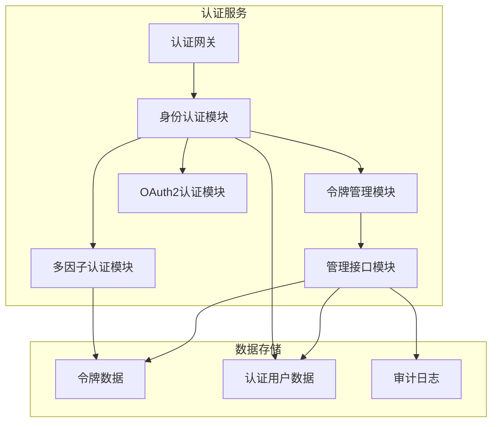
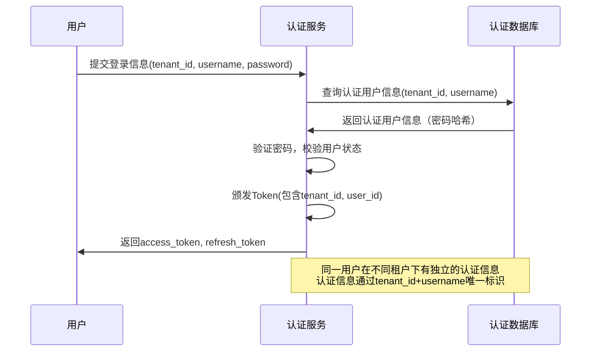
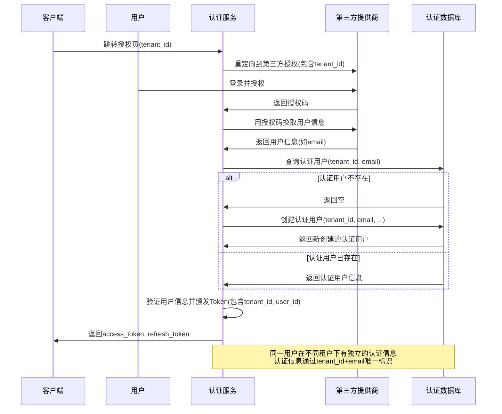
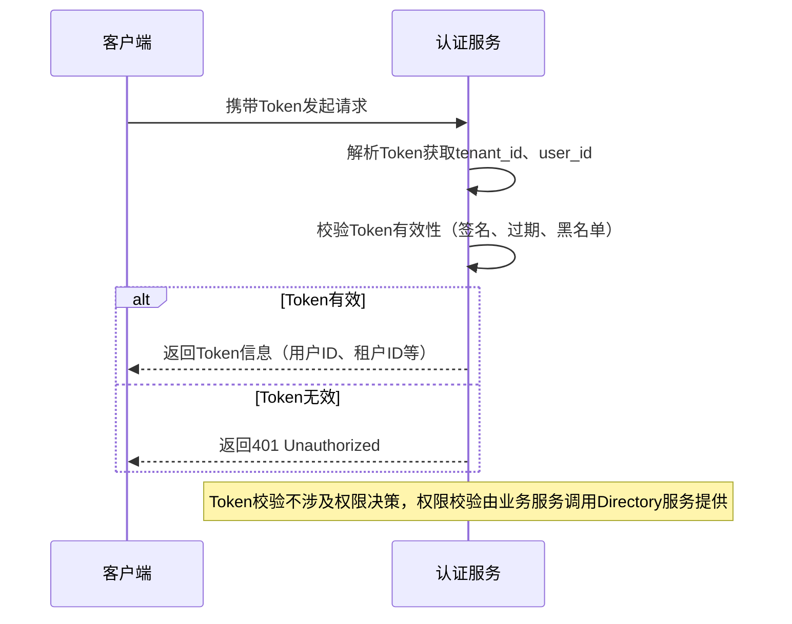
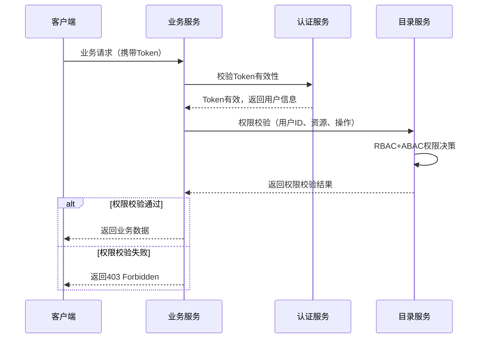

# 认证授权服务（axione-tech-auth）架构设计

## 术语表

| 名称         | 说明                                                         |
|--------------|--------------------------------------------------------------|
| 用户         | 需要认证的身份主体                                           |
| 客户端       | 访问认证服务的应用（如 Web、App、第三方系统）               |
| Token        | 访问令牌，JWT 格式                                           |
| Refresh Token| 用于刷新 Access Token 的长效令牌                             |
| OAuth2       | 开放授权协议，支持第三方应用接入                             |
| JWT          | JSON Web Token，标准的无状态令牌格式                         |
| 授权码       | OAuth2 授权流程中的临时凭证                                 |
| 租户         | 平台的逻辑隔离单元，支持多租户架构                           |

## 一、服务概述

认证服务是AixOne技术平台的核心安全服务，提供统一的身份认证和Token管理能力。作为技术平台的基础设施服务，为整个AixOne生态系统提供标准化的安全认证支撑。

### 1.1 服务定位

认证服务是技术平台的核心安全服务，专注于**身份认证**和**Token管理**，不包含业务权限决策功能。为所有微服务提供安全、标准的认证能力，支持 JWT、OAuth2 等主流协议，并支持多种认证方式和多租户架构。

**职责边界**：
- ✅ **身份认证**：用户登录、多因子认证、OAuth2流程
- ✅ **Token管理**：Token颁发、校验、刷新、黑名单管理、用户登出
- ✅ **管理接口**：提供内部管理接口（不直接对外暴露，由Workbench服务统一封装对外提供管理界面）

### 1.2 核心价值

- **统一身份认证**：为整个平台提供统一的身份认证入口
- **安全Token管理**：提供安全、标准的Token管理能力
- **安全防护**：多层次安全机制，保障平台安全
- **高可用保障**：支持高并发、高可用的认证服务
- **可扩展性**：支持多种认证方式和第三方集成

---

## 二、核心功能

### 2.1 身份认证
- **多方式认证**：支持用户名密码、短信验证码、邮箱验证码、OAuth2第三方登录
- **多因子认证**：支持MFA增强安全性
- **单点登录**：支持SSO统一登录体验
- **多租户认证**：支持租户级身份隔离和认证
- **独立认证管理**：认证服务独立维护认证用户信息（用户名、密码等），不依赖其他服务

### 2.2 令牌管理
- **JWT令牌**：标准的无状态令牌格式
- **令牌颁发**：Access Token和Refresh Token管理
- **令牌校验**：令牌有效性验证和黑名单管理
- **令牌刷新**：支持令牌自动刷新机制
- **用户登出**：用户下线时将令牌加入黑名单
- **多租户令牌**：支持租户级令牌隔离和管理

### 2.3 OAuth2认证
- **标准协议**：支持OAuth2授权码、密码、客户端等授权模式
- **第三方集成**：支持支付宝、微信、阿里云等第三方登录
- **授权范围**：支持细粒度授权范围控制
- **安全回调**：安全的授权回调处理
- **多租户OAuth2**：支持租户级OAuth2客户端管理

**注意**：OAuth2的"授权"是指第三方应用的授权，不是业务权限决策。业务权限决策由Directory服务提供。

---

## 三、技术架构

### 3.1 技术选型

- **语言与框架**：Java 21+，Spring Boot 3.5+，Spring Security 6.x
- **认证协议**：OAuth2.0 + OpenID Connect，JWT (JSON Web Token)
- **数据库**：PostgreSQL（主存储）+ Redis（缓存和会话）
- **加密算法**：AES-256 + RSA-2048，BCrypt密码加密
- **依赖组件**：Spring Authorization Server，Spring Cloud，JJWT
- **权限控制**：Spring Security + JWT权限信息（从Token中提取权限进行访问控制，可在yaml中配置）

### 3.2 技术架构图



---

## 四、数据架构

### 4.1 数据分类

| 数据类型 | 数据内容 | 存储方案 | 更新频率 | 安全等级 | 多租户隔离 |
|---------|----------|----------|----------|----------|------------|
| **令牌数据** | JWT Token、Refresh Token | Redis | 实时更新 | 高 | 租户级隔离 |
| **审计数据** | 登录日志、操作记录 | PostgreSQL | 实时更新 | 中 | 租户级隔离 |
| **会话数据** | 用户会话、临时状态 | Redis | 实时更新 | 中 | 租户级隔离 |
| **多租户适配** | 租户级数据隔离、多租户查询过滤 | 逻辑隔离 | 实时 | 高 | 租户级隔离 |

### 4.2 数据安全

#### 4.2.1 数据加密
- **传输加密**：TLS 1.3
- **存储加密**：AES-256
- **密钥管理**：HSM + KMS
- **密码加密**：BCrypt

#### 4.2.2 访问控制
- **身份认证**：多因子认证
- **Token校验**：Token有效性验证（签名、过期、黑名单）
- **数据分类**：按敏感级别分类
- **审计日志**：完整的操作审计

### 4.3 实体模型

#### 4.3.1 Client（客户端）
| 字段         | 类型    | 说明         | 必填 |
|--------------|---------|--------------|------|
| client_id    | String  | 客户端ID     | 是   |
| tenant_id    | String  | 所属租户     | 是   |
| client_secret| String  | 客户端密钥   | 是   |
| redirect_uri | String  | 回调地址     | 是   |
| scopes       | String  | 授权范围     | 是   |
| grant_types  | String  | 授权类型     | 是   |

#### 4.3.2 Token（令牌）
| 字段         | 类型    | 说明         | 必填 |
|--------------|---------|--------------|------|
| token        | String  | JWT Token    | 是   |
| tenant_id    | String  | 所属租户     | 是   |
| user_id      | String  | 用户ID       | 是   |
| client_id    | String  | 客户端ID     | 是   |
| expires_at   | DateTime| 过期时间     | 是   |
| type         | String  | access/refresh| 是   |

#### 4.3.3 AuditLog（审计日志）
| 字段         | 类型    | 说明         | 必填 |
|--------------|---------|--------------|------|
| log_id       | String  | 日志ID       | 是   |
| tenant_id    | String  | 所属租户     | 是   |
| user_id      | String  | 用户ID       | 是   |
| action       | String  | 操作类型     | 是   |
| resource     | String  | 资源         | 否   |
| result       | String  | 操作结果     | 是   |
| timestamp    | DateTime| 操作时间     | 是   |

#### 4.3.4 AuthUser（认证用户）
| 字段         | 类型    | 说明         | 必填 |
|--------------|---------|--------------|------|
| id           | UUID    | 用户ID       | 是   |
| username     | String  | 用户名       | 是   |
| email        | String  | 邮箱         | 否   |
| phone        | String  | 手机号       | 否   |
| hashed_password | String | 密码哈希     | 是   |
| tenant_id    | String  | 所属租户     | 是   |
| status       | String  | 用户状态     | 是   |
| created_at   | DateTime| 创建时间     | 是   |
| updated_at   | DateTime| 更新时间     | 是   |

**注意**：认证用户与Directory服务的用户主数据是分离的，通过邮箱或唯一标识进行关联，但不直接依赖。

### 4.4 关联关系
- 客户端与 Token：一对多（按租户隔离）
- 认证用户与 Token：一对多（认证用户数据由认证服务独立管理，按租户隔离）
- 认证用户与审计日志：一对多（按租户隔离）

**注意**：认证服务不管理租户配置，仅做多租户数据适配（通过tenant_id进行数据隔离）。

---

## 五、API接口设计

### 5.1 认证接口

#### 5.1.1 用户名密码登录
- **接口**：POST /api/v1/auth/login
- **参数**：tenant_id, username, password
- **返回**：access_token, refresh_token

#### 5.1.2 短信验证码登录
- **发送验证码**：POST /api/v1/auth/sms/send
- **验证码登录**：POST /api/v1/auth/sms/login
- **参数**：tenant_id, phone, sms_code

#### 5.1.3 邮箱验证码登录
- **发送验证码**：POST /api/v1/auth/email/send
- **验证码登录**：POST /api/v1/auth/email/login
- **参数**：tenant_id, email, email_code

#### 5.1.4 第三方OAuth2登录
- **授权页面**：GET /api/v1/auth/{provider}/authorize
- **回调处理**：GET /api/v1/auth/{provider}/callback
- **支持提供商**：alipay, wechat, aliyun
- **参数**：tenant_id（在授权URL中传递）

### 5.2 令牌管理接口

#### 5.2.1 令牌刷新
- **接口**：POST /api/v1/auth/refresh
- **参数**：tenant_id, refresh_token
- **返回**：新的 access_token, refresh_token

#### 5.2.2 令牌校验
- **接口**：POST /api/v1/auth/validate
- **参数**：token（JWT中包含tenant_id）
- **返回**：令牌有效性信息

#### 5.2.3 用户登出
- **接口**：POST /api/v1/auth/logout
- **参数**：token（JWT中包含tenant_id）
- **说明**：将令牌加入黑名单，用户下线

**注意**：
- 业务权限校验由Directory服务提供，请调用 `POST /api/v1/directory/check-permission`
- Token中可以包含权限信息（由业务服务在生成Token时添加），但Auth服务不管理权限

### 5.3 管理接口（内部接口，不直接对外暴露）

**重要说明**：
- 本节列出的所有管理接口均为Auth服务的内部接口，不直接对前端提供服务。前端应通过Workbench服务提供的接口访问管理功能。
- **权限校验**：
  - 所有管理接口使用Spring Security进行权限校验，从Token中提取用户权限信息进行访问控制
  - 权限信息在生成Token时由业务服务添加到Token中（权限数据由Directory服务管理）
  - 使用Spring Security的`@PreAuthorize`注解或配置文件进行权限检查，不依赖Directory服务
  - 权限点定义如下（可在yaml配置文件中配置）：
    - 用户管理：`auth:user:read`、`auth:user:create`、`auth:user:update`、`auth:user:delete`、`auth:user:password:reset`
    - Token管理：`auth:token:read`、`auth:token:revoke`
    - 客户端管理：`auth:client:read`、`auth:client:create`、`auth:client:update`、`auth:client:delete`
    - 审计日志：`auth:audit:read`
    - 登录设备管理：`auth:device:read`、`auth:device:logout`

#### 5.3.1 已登录用户查询
- **接口**：GET /api/v1/auth/internal/users/active
- **参数**：tenant_id（必填），user_id（可选），page, size
- **返回**：已登录用户列表（包含用户ID、登录时间、设备信息、Token数量等）
- **说明**：查询当前活跃的已登录用户

#### 5.3.2 用户登录设备查询
- **接口**：GET /api/v1/auth/internal/users/{userId}/devices
- **参数**：tenant_id（必填），user_id（路径参数）
- **返回**：用户所有登录设备列表（设备ID、设备类型、登录IP、登录时间、最后活跃时间等）
- **说明**：查询同一用户在多台设备上的登录情况

#### 5.3.3 强制用户下线
- **接口**：POST /api/v1/auth/internal/users/{userId}/logout-all
- **参数**：tenant_id（必填），user_id（路径参数）
- **返回**：下线结果（下线设备数量）
- **说明**：强制用户所有设备下线，将所有Token加入黑名单

#### 5.3.4 指定设备下线
- **接口**：POST /api/v1/auth/internal/users/{userId}/devices/{deviceId}/logout
- **参数**：tenant_id（必填），user_id（路径参数），device_id（路径参数）
- **返回**：下线结果
- **说明**：强制指定设备下线，将相关Token加入黑名单

#### 5.3.5 认证用户管理接口

##### 5.3.5.1 创建认证用户
- **接口**：POST /api/v1/auth/internal/users
- **参数**：tenant_id, username, password, email, phone
- **返回**：认证用户信息（不含密码）
- **说明**：创建新的认证用户

##### 5.3.5.2 查询认证用户
- **接口**：GET /api/v1/auth/internal/users/{userId}
- **参数**：tenant_id（必填），user_id（路径参数）
- **返回**：认证用户信息（不含密码）

##### 5.3.5.3 查询认证用户列表
- **接口**：GET /api/v1/auth/internal/users
- **参数**：tenant_id（必填），username（可选），email（可选），status（可选），page, size
- **返回**：认证用户列表（不含密码）

##### 5.3.5.4 更新认证用户
- **接口**：PUT /api/v1/auth/internal/users/{userId}
- **参数**：tenant_id（必填），user_id（路径参数），username, email, phone, status
- **返回**：更新后的认证用户信息
- **说明**：更新认证用户信息（不包括密码，密码通过单独接口修改）

##### 5.3.5.5 修改用户密码
- **接口**：PUT /api/v1/auth/internal/users/{userId}/password
- **参数**：tenant_id（必填），user_id（路径参数），old_password, new_password
- **返回**：修改结果
- **说明**：修改认证用户密码

##### 5.3.5.6 重置用户密码
- **接口**：POST /api/v1/auth/internal/users/{userId}/password/reset
- **参数**：tenant_id（必填），user_id（路径参数），new_password
- **返回**：重置结果
- **说明**：管理员重置用户密码（不需要旧密码）

##### 5.3.5.7 删除认证用户
- **接口**：DELETE /api/v1/auth/internal/users/{userId}
- **参数**：tenant_id（必填），user_id（路径参数）
- **返回**：删除结果
- **说明**：删除认证用户（同时将用户所有Token加入黑名单）

#### 5.3.6 Token管理接口

##### 5.3.6.1 查询用户Token列表
- **接口**：GET /api/v1/auth/internal/tokens
- **参数**：tenant_id（必填），user_id（可选），client_id（可选），type（可选），page, size
- **返回**：Token列表（Token值、类型、过期时间、创建时间等）

##### 5.3.6.2 撤销Token
- **接口**：POST /api/v1/auth/internal/tokens/{token}/revoke
- **参数**：tenant_id（必填），token（路径参数）
- **返回**：撤销结果
- **说明**：将指定Token加入黑名单

##### 5.3.6.3 批量撤销用户Token
- **接口**：POST /api/v1/auth/internal/users/{userId}/tokens/revoke-all
- **参数**：tenant_id（必填），user_id（路径参数）
- **返回**：撤销结果（撤销Token数量）
- **说明**：撤销用户所有Token

#### 5.3.7 客户端管理接口

##### 5.3.7.1 创建OAuth2客户端
- **接口**：POST /api/v1/auth/internal/clients
- **参数**：tenant_id, client_id, client_secret, redirect_uri, scopes, grant_types
- **返回**：客户端信息

##### 5.3.7.2 查询客户端列表
- **接口**：GET /api/v1/auth/internal/clients
- **参数**：tenant_id（必填），page, size
- **返回**：客户端列表

##### 5.3.7.3 查询客户端详情
- **接口**：GET /api/v1/auth/internal/clients/{clientId}
- **参数**：tenant_id（必填），client_id（路径参数）
- **返回**：客户端信息

##### 5.3.7.4 更新客户端
- **接口**：PUT /api/v1/auth/internal/clients/{clientId}
- **参数**：tenant_id（必填），client_id（路径参数），redirect_uri, scopes, grant_types
- **返回**：更新后的客户端信息

##### 5.3.7.5 删除客户端
- **接口**：DELETE /api/v1/auth/internal/clients/{clientId}
- **参数**：tenant_id（必填），client_id（路径参数）
- **返回**：删除结果

### 5.4 审计日志接口

#### 5.4.1 查询审计日志
- **接口**：GET /api/v1/auth/internal/audit-logs
- **参数**：tenant_id（必填），user_id（可选），action（可选），start_time（可选），end_time（可选），page, size
- **返回**：审计日志列表（日志ID、用户ID、操作类型、资源、结果、时间、客户端IP、User-Agent等）

#### 5.4.2 查询用户审计日志
- **接口**：GET /api/v1/auth/internal/users/{userId}/audit-logs
- **参数**：tenant_id（必填），user_id（路径参数），action（可选），start_time（可选），end_time（可选），page, size
- **返回**：用户审计日志列表

#### 5.4.3 查询登录日志
- **接口**：GET /api/v1/auth/internal/audit-logs/login
- **参数**：tenant_id（必填），user_id（可选），start_time（可选），end_time（可选），result（可选：SUCCESS/FAILURE），page, size
- **返回**：登录日志列表

#### 5.4.4 查询登出日志
- **接口**：GET /api/v1/auth/internal/audit-logs/logout
- **参数**：tenant_id（必填），user_id（可选），start_time（可选），end_time（可选），page, size
- **返回**：登出日志列表

**重要说明**：
- **内部接口不直接对外暴露**：所有管理接口均为内部接口（路径包含`/internal`），需要服务间认证，**不直接对前端提供服务**
- **统一由Workbench封装**：Auth服务的管理接口由Workbench服务统一调用，Workbench服务负责封装、权限校验、数据转换后对外提供管理界面和API
- **接口访问路径**：
  - Auth服务内部接口：`/api/v1/auth/internal/*`（仅服务间调用）
  - Workbench对外接口：`/api/v1/workbench/auth/*`（前端调用）
- **权限校验**：
  - **Auth服务层面**：管理接口使用Spring Security从Token中提取权限信息进行访问控制，不依赖Directory服务。权限信息在生成Token时已包含在Token中（由业务服务从Directory获取后添加到Token）
  - **Workbench服务层面**：在对外接口层面也进行权限校验（双重保护）
  - **权限数据管理**：权限数据完全由Directory服务管理，Auth服务只从Token中读取权限信息进行访问控制
- **职责划分**：
  - Auth服务：提供内部管理接口，负责认证数据管理，使用Spring Security从Token中提取权限信息进行访问控制
  - Workbench服务：调用Auth内部接口，对外提供统一的管理界面和API，负责权限校验、数据封装、前端适配
  - Directory服务：管理权限数据，业务服务从Directory获取权限信息后添加到Token中

---

## 六、错误处理与安全

### 6.1 统一错误码设计

| code      | message           | 说明                     |
|-----------|-------------------|--------------------------|
| 0         | success           | 成功                     |
| 40001     | invalid_param     | 参数错误                 |
| 40101     | unauthorized      | 未认证/Token无效         |
| 40301     | forbidden         | 没有权限/注册关闭        |
| 40401     | not_found         | 资源不存在               |
| 50001     | internal_error    | 服务器内部错误           |

### 6.2 响应格式

所有接口返回格式：
```json
{ 
  "code": 0, 
  "message": "success", 
  "data": { ... } 
}
```

### 6.3 接口安全与权限

- **认证要求**：所有接口默认需认证（除注册、登录、授权码获取等开放接口）
- **认证方式**：Spring Security + JWT/OAuth2 统一认证
- **令牌传递**：Token 需通过 Authorization: Bearer <token> 头部传递
- **权限控制**：
  - 权限数据管理：Auth服务不管理权限数据，权限完全由Directory服务管理
  - 权限校验：Auth服务的管理接口使用Spring Security从Token中提取权限信息进行访问控制，不依赖Directory服务
  - 权限点定义：管理接口的权限点可在yaml配置文件中配置（如`auth:user:read`、`auth:user:create`、`auth:token:revoke`等）
  - 权限信息来源：Token中的权限信息由业务服务在生成Token时添加（从Directory服务获取）
- **管理功能**：Auth服务提供内部管理接口（不直接对外暴露），Workbench服务统一封装对外提供管理界面和API
- **安全机制**：Token 黑名单、过期、刷新等安全机制完善
- **防护措施**：注册、验证码等接口需防刷、限流

---

## 七、业务流程设计

### 7.1 多租户用户登录流程



**多租户认证信息隔离说明**：
- **同一用户在不同租户下的认证信息是多份独立的**：同一个用户（如用户名为`user1`）在不同租户（如`tenant1`和`tenant2`）下，在认证服务中会创建两套独立的认证用户记录
- **唯一标识**：认证用户通过`tenant_id + username`（或`tenant_id + email`）唯一标识
- **数据隔离**：不同租户下的认证用户数据完全隔离，互不影响
- **Token隔离**：同一用户在租户A下的Token无法在租户B下使用，Token中包含tenant_id进行验证

### 7.2 多租户OAuth2登录流程



**多租户认证信息隔离说明**：
- **同一用户在不同租户下的认证信息是多份独立的**：同一个用户（如邮箱为`user@example.com`）在不同租户（如`tenant1`和`tenant2`）下，在认证服务中会创建两套独立的认证用户记录
- **唯一标识**：认证用户通过`tenant_id + email`（或`tenant_id + username`）唯一标识
- **数据隔离**：不同租户下的认证用户数据完全隔离，互不影响
- **Token隔离**：同一用户在租户A下的Token无法在租户B下使用，Token中包含tenant_id进行验证

### 7.3 Token校验流程


<｜tool▁calls▁begin｜><｜tool▁call▁begin｜>
read_file

### 7.4 业务权限校验流程（已迁移到Directory服务）

业务权限校验已迁移到Directory服务，业务服务应调用Directory的权限校验接口：



---

## 八、数据库设计

### 8.1 表结构设计

#### 8.1.1 客户端表（clients）
- client_id (String, PK) - 客户端ID
- tenant_id (String) - 所属租户
- client_secret (String) - 客户端密钥
- redirect_uri (String) - 回调地址
- scopes (String) - 授权范围
- grant_types (String) - 授权类型
- created_at (DateTime) - 创建时间

#### 8.1.2 令牌表（tokens）
- token (String, PK) - JWT Token
- tenant_id (String) - 所属租户
- user_id (String) - 用户ID
- client_id (String) - 客户端ID
- expires_at (DateTime) - 过期时间
- type (String) - access/refresh
- created_at (DateTime) - 创建时间

#### 8.1.3 令牌黑名单表（token_blacklist）
- token (String, PK) - 黑名单Token
- tenant_id (String) - 所属租户
- expires_at (DateTime) - 过期时间
- created_at (DateTime) - 加入时间

#### 8.1.4 审计日志表（audit_logs）
- log_id (String, PK) - 日志ID
- tenant_id (String) - 所属租户
- user_id (String) - 用户ID
- action (String) - 操作类型
- resource (String) - 资源
- result (String) - 操作结果
- timestamp (DateTime) - 操作时间

#### 8.1.5 验证码表（verification_codes）
- phone (String) - 手机号
- email (String) - 邮箱
- tenant_id (String) - 所属租户
- code (String) - 验证码
- expires_at (DateTime) - 过期时间
- created_at (DateTime) - 创建时间

#### 8.1.6 认证用户表（auth_users）
- id (UUID, PK) - 用户ID
- username (String) - 用户名
- email (String) - 邮箱（可选，用于关联Directory服务用户）
- phone (String) - 手机号（可选）
- hashed_password (String) - 密码哈希（BCrypt）
- tenant_id (String) - 所属租户
- status (String) - 用户状态（ACTIVE, INACTIVE, LOCKED）
- created_at (DateTime) - 创建时间
- updated_at (DateTime) - 更新时间
- 索引：username + tenant_id（唯一），email + tenant_id（唯一）

**注意**：
- 认证用户表由认证服务独立管理，不依赖Directory服务
- 认证用户与Directory服务的用户主数据通过邮箱或唯一标识关联，但两者完全独立
- 认证服务只负责身份认证，不管理用户详细信息（姓名、组织等）

**注意**：
- Auth服务独立运行，不依赖Directory服务
- Auth服务不管理权限数据，权限数据由Directory服务管理
- 认证用户信息和用户主数据信息完全分离，通过邮箱或唯一标识进行关联
- Auth服务不管理租户配置，仅做多租户数据适配（通过tenant_id进行数据隔离）

### 8.2 多租户数据隔离策略

#### 8.2.1 数据隔离方式
- **逻辑隔离**：所有表都包含tenant_id字段
- **索引优化**：在tenant_id上建立复合索引
- **查询过滤**：所有查询都自动添加tenant_id过滤条件

#### 8.2.2 缓存隔离策略
- **Redis Key前缀**：使用tenant_id作为Key前缀
- **缓存命名空间**：不同租户使用不同的缓存命名空间
- **缓存清理**：支持按租户清理缓存

---

## 九、代码组织结构

### 9.1 DDD分层结构

```
services/axione-tech-auth/
├── src/main/java/com/aixone/tech/auth/
│   ├── application/               # 应用层
│   │   ├── command/              # 命令对象
│   │   ├── query/                # 查询对象
│   │   ├── dto/                  # 数据传输对象
│   │   └── service/              # 应用服务
│   ├── domain/                   # 领域层
│   │   ├── model/                # 领域模型
│   │   ├── service/              # 领域服务
│   │   ├── repository/           # 仓储接口
│   │   └── event/                # 领域事件
│   ├── infrastructure/            # 基础设施层
│   │   ├── persistence/          # 持久化
│   │   ├── external/             # 外部服务
│   │   ├── cache/                # 缓存
│   │   └── security/             # 安全配置
│   └── interfaces/               # 接口层
│       ├── rest/                 # REST API
│       ├── event/                # 事件监听
│       └── grpc/                  # gRPC接口（可选）
├── src/test/                     # 测试代码
└── pom.xml                       # Maven配置
```

### 9.2 DDD分层说明

#### 9.2.1 应用层（Application Layer）
- **职责**：协调领域对象完成业务用例
- **组件**：应用服务、命令对象、查询对象、DTO
- **特点**：无业务逻辑，只做流程编排

#### 9.2.2 领域层（Domain Layer）
- **职责**：核心业务逻辑和规则
- **组件**：领域模型、领域服务、仓储接口、领域事件
- **特点**：业务核心，不依赖外部技术

#### 9.2.3 基础设施层（Infrastructure Layer）
- **职责**：技术实现和外部集成
- **组件**：持久化、外部服务、缓存、安全配置
- **特点**：技术实现，依赖领域层接口

#### 9.2.4 接口层（Interface Layer）
- **职责**：对外提供API和事件处理
- **组件**：REST控制器、事件监听器、gRPC服务
- **特点**：协议适配，调用应用层服务

### 9.3 Spring Security权限配置

#### 9.3.1 权限校验方式

管理接口使用Spring Security进行权限校验，从Token中提取权限信息进行访问控制：

**方式一：使用`@PreAuthorize`注解**
```java
@PreAuthorize("hasAuthority('auth:user:read')")
@GetMapping("/internal/users/active")
public ResponseEntity<List<User>> getActiveUsers(...) {
    // ...
}
```

**方式二：在yaml配置文件中配置**
```yaml
spring:
  security:
    oauth2:
      resourceserver:
        jwt:
          # JWT配置
    authorization:
      # 权限配置
      rules:
        - path: /api/v1/auth/internal/users/**
          permissions: 
            - auth:user:read
            - auth:user:create
        - path: /api/v1/auth/internal/tokens/**
          permissions:
            - auth:token:read
            - auth:token:revoke
```

#### 9.3.2 Token权限信息提取

- **权限信息来源**：Token中的`permissions`字段（由业务服务在生成Token时从Directory服务获取后添加）
- **权限提取**：Spring Security自动从Token的Claims中提取权限信息
- **权限匹配**：使用Spring Security的权限表达式进行匹配

#### 9.3.3 权限点配置

管理接口的权限点可在yaml配置文件中配置，便于统一管理和维护：

```yaml
auth:
  permissions:
    user:
      read: auth:user:read
      create: auth:user:create
      update: auth:user:update
      delete: auth:user:delete
      password-reset: auth:user:password:reset
    token:
      read: auth:token:read
      revoke: auth:token:revoke
    client:
      read: auth:client:read
      create: auth:client:create
      update: auth:client:update
      delete: auth:client:delete
    audit:
      read: auth:audit:read
    device:
      read: auth:device:read
      logout: auth:device:logout
```

---

## 十、权限与Token设计

### 10.1 权限管理职责

Auth服务**不管理任何权限**，权限完全由Directory服务提供：

- ✅ **Token信息**：Token中可以包含权限信息（由业务服务在生成Token时添加）

### 10.2 Token中的权限信息

业务服务在生成Token时，可以将用户权限信息添加到Token中：

```java
// Token生成示例（业务服务调用Auth服务生成Token时）
TokenResponse tokenResponse = authService.generateToken(
    userId,
    tenantId,
    clientId,
    roles,        // 从Directory服务获取
    permissions,  // 从Directory服务获取
    abacAttributes // 从Directory服务获取
);
```

**注意**：
- Auth服务仅负责生成和校验Token，不验证Token中的权限信息
- Token中的权限信息由业务服务从Directory服务获取后添加
- 权限校验由Directory服务提供，业务服务应调用Directory的权限校验接口

### 10.3 权限校验流程

```
权限校验流程：

1. 业务服务接收请求：
   业务服务 → 提取Token → 调用Auth服务校验Token有效性

2. 权限校验（由Directory服务提供）：
   业务服务 → Directory服务（权限校验）
   Note: Directory服务如需验证Token，可调用Auth服务的Token校验接口

3. 权限决策：
   Directory服务 → RBAC+ABAC权限决策
   Directory服务 → 返回权限校验结果
```

### 10.4 管理功能提供

认证服务提供内部管理接口，Workbench服务统一封装对外提供管理界面：

- **Auth服务内部接口**：
  - 提供已登录用户查询、多设备登录管理、认证用户CRUD、Token管理、客户端管理、审计日志查询等内部接口（`/api/v1/auth/internal/*`路径）
  - **不直接对外暴露**：内部接口需要服务间认证，不直接对前端提供服务
  - **仅服务间调用**：只能由其他服务（如Workbench）通过服务间认证调用
  - **权限校验**：管理接口使用Spring Security从Token中提取权限信息进行访问控制，不依赖Directory服务。权限信息在生成Token时已包含在Token中
- **Workbench服务**：
  - 调用Auth服务的内部接口获取数据
  - 进行权限校验、数据转换、前端适配
  - 对外提供统一的管理界面和API（`/api/v1/workbench/auth/*`路径）
  - 前端统一通过Workbench服务访问管理功能
- **Directory服务**：提供权限校验能力

### 10.5 服务职责总结

| 服务 | 职责 |
|------|------|
| **Auth服务** | 身份认证、Token管理、用户登出、认证用户管理、内部管理接口 |
| **Directory服务** | 权限数据管理、权限决策、权限校验 |
| **Workbench服务** | 调用Auth内部接口，对外提供管理界面和API |
| **业务服务** | 业务逻辑、调用Directory进行权限校验 |

