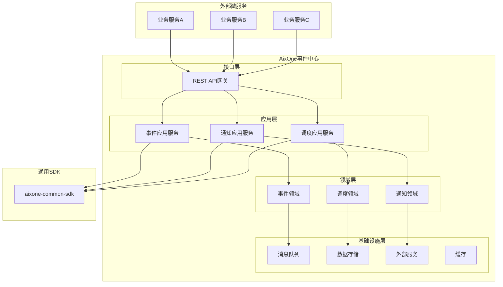
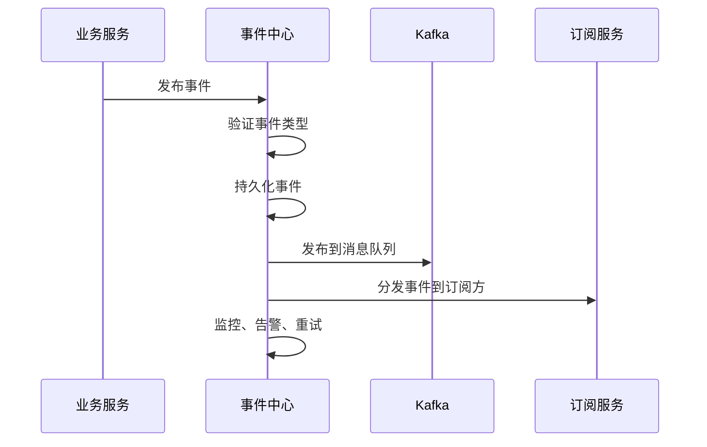
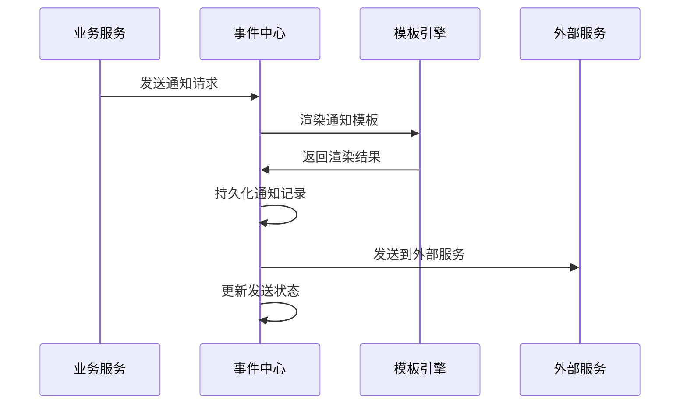
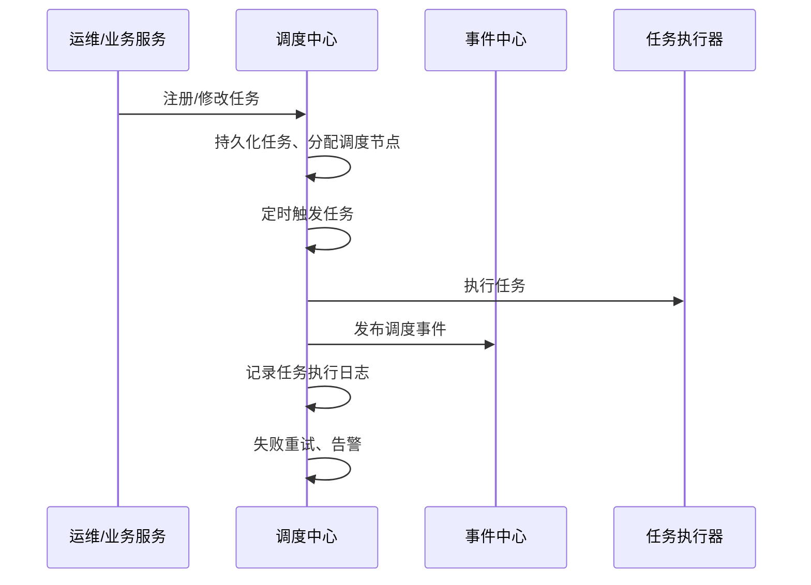

# AixOne事件中心架构设计

## 术语表

| 名称         | 说明                                                         |
|--------------|--------------------------------------------------------------|
| 事件         | 业务或系统中发生的可观测动作（如用户操作、系统状态变更等）     |
| 订阅         | 业务服务/模块声明对某类事件感兴趣，需被通知                   |
| 发布         | 事件源将事件推送到事件中心                                   |
| 通知         | 面向最终用户的消息推送（邮件、短信、推送等）                 |
| 模板         | 可配置的消息模板，支持变量替换和格式化                       |
| 调度任务     | 平台内定时/周期/分布式执行的任务                             |
| 调度节点     | 参与任务调度的服务实例                                       |
| 租户         | 平台的逻辑隔离单元，支持多租户架构                           |

## 一、服务概述

### 1.1 服务定位

AixOne事件中心是技术平台的核心基础设施服务，提供统一的事件治理、通知管理和任务调度能力。作为平台级的事件基础设施，为整个AixOne生态系统提供标准化的事件发布、订阅、通知和调度支撑。

### 1.2 核心价值

- **统一事件治理**：提供统一的事件发布、订阅、路由和存储能力
- **多渠道通知**：支持邮件、短信、推送等多种通知方式
- **任务调度**：提供分布式任务调度和定时任务管理
- **高可用保障**：支持高并发、高可用的事件处理
- **可扩展性**：支持水平扩展和功能扩展

### 1.3 设计原则

- **DDD分层架构**：采用领域驱动设计，便于后期微服务拆分
- **模块化设计**：事件模块和通知模块相对独立，便于独立演进
- **服务化接口**：提供统一的API接口和SDK
- **高内聚低耦合**：模块内部高内聚，模块间低耦合
- **可观测性**：提供完善的监控、日志和链路追踪能力

## 二、技术架构

### 2.1 技术选型

- **语言与框架**：Java 21+，Spring Boot 3.5+，Spring Cloud 2023.x
- **消息队列**：Apache Kafka（事件分发）+ Redis Pub/Sub（通知分发）
- **数据库**：PostgreSQL（主存储）+ Redis（缓存和会话）
- **任务调度**：Quartz + Redis（分布式协调）
- **依赖组件**：Spring Cloud Stream，Spring Cache，Micrometer

### 2.2 技术架构图



### 2.3 依赖说明

- **通用基础设施SDK**：统一使用 `aixone-common-sdk` 提供DDD基础组件、API响应包装、异常处理、工具类、会话上下文管理等通用能力
- **共享组件**：所有跨模块的通用组件统一通过 `aixone-common-sdk` 提供，事件中心内部不维护独立的shared模块

### 2.4 模块划分

| 模块名称 | 核心职责 | 主要功能 | 技术特点 |
|---------|----------|----------|----------|
| **事件模块** | 事件治理和管理 | 事件发布、订阅、路由、存储、检索 | 高性能、低延迟 |
| **通知模块** | 多渠道通知 | 邮件、短信、推送、模板管理 | 多渠道、可配置 |
| **调度模块** | 任务调度 | 定时任务、分布式调度、监控 | 分布式、高可用 |

## 三、核心功能

### 3.1 事件治理

#### 3.1.1 事件发布
- **多方式发布**：支持同步发布、异步发布、批量发布
- **事件验证**：事件类型注册验证、数据格式验证
- **事件路由**：基于事件类型的智能路由和分发
- **多租户支持**：支持租户级事件隔离和管理

#### 3.1.2 事件订阅
- **订阅管理**：支持动态订阅、取消订阅、订阅配置
- **过滤机制**：支持基于事件内容的条件过滤
- **重试策略**：支持可配置的重试机制和失败处理
- **多租户订阅**：支持租户级订阅隔离和管理

#### 3.1.3 事件存储
- **持久化存储**：事件数据持久化到PostgreSQL
- **索引优化**：基于租户和事件类型的复合索引
- **数据归档**：支持历史事件数据归档和清理
- **查询能力**：支持复杂条件的事件查询和检索

### 3.2 通知管理

#### 3.2.1 多渠道通知
- **邮件通知**：支持SMTP邮件发送，支持HTML和文本格式
- **短信通知**：集成阿里云SMS、腾讯云SMS等短信服务
- **推送通知**：支持极光推送、个推等移动推送服务
- **即时通讯**：支持微信、钉钉等即时通讯平台

#### 3.2.2 模板管理
- **模板引擎**：支持变量替换、条件判断、循环等模板功能
- **多格式支持**：支持HTML、文本、Markdown等多种格式
- **版本管理**：支持模板版本控制和回滚
- **多租户模板**：支持租户级模板隔离和管理

#### 3.2.3 通知调度
- **定时发送**：支持指定时间发送通知
- **批量发送**：支持批量通知发送和进度跟踪
- **发送策略**：支持优先级、限流、重试等发送策略
- **状态跟踪**：支持通知发送状态的实时跟踪

### 3.3 任务调度

#### 3.3.1 任务管理
- **任务注册**：支持动态任务注册、修改、删除
- **调度策略**：支持Cron表达式、固定间隔、一次性任务
- **任务类型**：支持HTTP回调、消息发送、数据处理等任务类型
- **多租户任务**：支持租户级任务隔离和管理

#### 3.3.2 分布式调度
- **节点管理**：支持调度节点的注册、心跳、故障转移
- **任务分片**：支持大任务的分片处理和并行执行
- **负载均衡**：支持任务在多个节点间的负载均衡
- **故障恢复**：支持节点故障时的任务自动迁移

#### 3.3.3 执行监控
- **执行日志**：记录任务执行的详细日志和结果
- **性能监控**：监控任务执行时间、成功率等指标
- **异常处理**：支持任务执行异常的重试和告警
- **审计追踪**：支持任务操作的完整审计追踪

## 四、数据架构

### 4.1 数据分类

| 数据类型 | 数据内容 | 存储方案 | 更新频率 | 安全等级 | 多租户隔离 |
|---------|----------|----------|----------|----------|------------|
| **事件数据** | 事件记录、事件历史 | PostgreSQL + Kafka | 实时更新 | 中 | 租户级隔离 |
| **通知数据** | 通知记录、模板数据 | PostgreSQL | 实时更新 | 中 | 租户级隔离 |
| **调度数据** | 任务配置、执行记录 | PostgreSQL | 实时更新 | 中 | 租户级隔离 |
| **缓存数据** | 临时数据、会话数据 | Redis | 实时更新 | 低 | 租户级隔离 |

### 4.2 数据安全

#### 4.2.1 数据加密
- **传输加密**：TLS 1.3
- **存储加密**：AES-256
- **密钥管理**：HSM + KMS
- **数据脱敏**：敏感数据脱敏处理

#### 4.2.2 访问控制
- **身份认证**：多因子认证
- **权限控制**：RBAC + ABAC
- **数据分类**：按敏感级别分类
- **审计日志**：完整的操作审计

### 4.3 实体模型

#### 4.3.1 Event（事件）
| 字段         | 类型    | 说明         | 必填 |
|--------------|---------|--------------|------|
| event_id     | String  | 事件ID       | 是   |
| tenant_id    | String  | 所属租户     | 是   |
| event_type   | String  | 事件类型     | 是   |
| event_source | String  | 事件源       | 是   |
| event_data   | JSONB   | 事件数据     | 是   |
| status       | String  | 事件状态     | 是   |
| created_at   | DateTime| 创建时间     | 是   |

#### 4.3.2 Subscription（订阅）
| 字段         | 类型    | 说明         | 必填 |
|--------------|---------|--------------|------|
| subscription_id | String | 订阅ID     | 是   |
| tenant_id    | String  | 所属租户     | 是   |
| event_type   | String  | 事件类型     | 是   |
| subscriber_service | String | 订阅服务 | 是   |
| subscriber_endpoint | String | 订阅端点 | 是   |
| status       | String  | 订阅状态     | 是   |
| created_at   | DateTime| 创建时间     | 是   |

#### 4.3.3 Notification（通知）
| 字段         | 类型    | 说明         | 必填 |
|--------------|---------|--------------|------|
| notification_id | String | 通知ID     | 是   |
| tenant_id    | String  | 所属租户     | 是   |
| notification_type | String | 通知类型 | 是   |
| recipient_info | JSONB | 接收者信息 | 是   |
| notification_content | JSONB | 通知内容 | 是   |
| status       | String  | 通知状态     | 是   |
| created_at   | DateTime| 创建时间     | 是   |

#### 4.3.4 ScheduledTask（调度任务）
| 字段         | 类型    | 说明         | 必填 |
|--------------|---------|--------------|------|
| task_id      | String  | 任务ID       | 是   |
| tenant_id    | String  | 所属租户     | 是   |
| task_name    | String  | 任务名称     | 是   |
| task_type    | String  | 任务类型     | 是   |
| schedule_config | JSONB | 调度配置 | 是   |
| task_payload | JSONB   | 任务载荷     | 否   |
| status       | String  | 任务状态     | 是   |
| created_at   | DateTime| 创建时间     | 是   |

### 4.4 关联关系
- 事件与订阅：一对多（按租户隔离）
- 通知与模板：多对一（按租户隔离）
- 任务与执行记录：一对多（按租户隔离）
- 租户与配置：一对一

## 五、API接口设计

### 5.0 设计原则

#### 5.0.1 安全原则
- **租户ID从token获取**：所有业务接口的租户ID从JWT token的`SessionContext`中自动获取，不在URL或参数中暴露
- **数据隔离**：普通用户只能访问自己租户的数据，通过`tenantId`自动过滤

#### 5.0.2 资源划分
- **业务接口**：`/api/v1/{resource}` - 普通用户使用，租户ID自动过滤
- **管理接口**：`/api/v1/admin/{resource}` - 管理员使用，可以跨租户操作，需要权限验证

#### 5.0.3 RESTful规范
- 使用标准HTTP方法：GET（查询）、POST（创建）、PUT（更新/替换）、DELETE（删除）
- 使用复数名词作为资源名：`/events`、`/notifications`、`/tasks`
- 使用路径参数标识资源：`/events/{eventId}`
- 使用查询参数进行过滤和分页：`?pageNum=1&pageSize=20&eventType=xxx`

#### 5.0.4 权限控制
- **业务接口**：自动从token获取`tenantId`，无需额外权限验证
- **管理接口**：通过权限模块进行动态权限验证

---

### 5.1 事件模块（Event）

#### 5.1.1 业务接口（租户隔离）

| 接口路径 | HTTP方法 | 功能描述 | 请求参数 | 请求体 | 返回数据 | 租户ID来源 |
|---------|---------|---------|---------|--------|---------|-----------|
| `/api/v1/events` | POST | 发布事件 | - | `PublishEventCommand` | `EventDto` | Token |
| `/api/v1/events` | GET | 获取当前租户的事件列表（分页） | `pageNum`, `pageSize`, `eventType`, `startTime`, `endTime` | - | `PageResult<EventDto>` | Token |
| `/api/v1/events/{eventId}` | GET | 获取事件详情 | `eventId` (路径) | - | `EventDto` | Token |
| `/api/v1/events/{eventId}` | DELETE | 删除事件 | `eventId` (路径) | - | `Void` | Token |
| `/api/v1/events/subscriptions` | POST | 创建事件订阅 | - | `CreateSubscriptionCommand` | `SubscriptionDto` | Token |
| `/api/v1/events/subscriptions` | GET | 获取当前租户的订阅列表（分页） | `pageNum`, `pageSize`, `eventType` | - | `PageResult<SubscriptionDto>` | Token |
| `/api/v1/events/subscriptions/{subscriptionId}` | GET | 获取订阅详情 | `subscriptionId` (路径) | - | `SubscriptionDto` | Token |
| `/api/v1/events/subscriptions/{subscriptionId}` | PUT | 更新订阅 | `subscriptionId` (路径) | `UpdateSubscriptionCommand` | `SubscriptionDto` | Token |
| `/api/v1/events/subscriptions/{subscriptionId}` | DELETE | 取消订阅 | `subscriptionId` (路径) | - | `Void` | Token |
| `/api/v1/topics` | GET | 获取当前租户的Topic列表（分页） | `pageNum`, `pageSize`, `name`, `status` | - | `PageResult<TopicDto>` | Token |
| `/api/v1/topics/{topicName}` | GET | 获取Topic详情 | `topicName` (路径) | - | `TopicDto` | Token |
| `/api/v1/topics` | POST | 注册Topic | - | `RegisterTopicCommand` | `TopicDto` | Token |
| `/api/v1/topics/{topicName}` | PUT | 更新Topic | `topicName` (路径) | `UpdateTopicCommand` | `TopicDto` | Token |
| `/api/v1/topics/{topicName}` | DELETE | 删除Topic | `topicName` (路径) | - | `Void` | Token |

**说明**：
- 所有接口的`tenantId`从`SessionContext.getTenantId()`自动获取
- 查询接口自动过滤当前租户的数据
- 创建/更新接口自动设置`tenantId`为当前租户

#### 5.1.2 管理接口（跨租户）

| 接口路径 | HTTP方法 | 功能描述 | 请求参数 | 请求体 | 返回数据 | 权限要求 |
|---------|---------|---------|---------|--------|---------|---------|
| `/api/v1/admin/events` | GET | 管理员查询事件列表（可跨租户） | `tenantId` (查询参数), `pageNum`, `pageSize`, `eventType`, `startTime`, `endTime` | - | `PageResult<EventDto>` | `admin:event:read` |
| `/api/v1/admin/events/{eventId}` | GET | 管理员查询事件详情（可跨租户） | `eventId` (路径), `tenantId` (查询参数, 可选) | - | `EventDto` | `admin:event:read` |
| `/api/v1/admin/events/{eventId}` | DELETE | 管理员删除事件 | `eventId` (路径), `tenantId` (查询参数, 可选) | - | `Void` | `admin:event:delete` |
| `/api/v1/admin/events/subscriptions` | GET | 管理员查询订阅列表（可跨租户） | `tenantId` (查询参数), `pageNum`, `pageSize`, `eventType` | - | `PageResult<SubscriptionDto>` | `admin:subscription:read` |
| `/api/v1/admin/events/subscriptions/{subscriptionId}` | GET | 管理员查询订阅详情（可跨租户） | `subscriptionId` (路径), `tenantId` (查询参数, 可选) | - | `SubscriptionDto` | `admin:subscription:read` |
| `/api/v1/admin/topics` | GET | 管理员查询Topic列表（可跨租户） | `tenantId` (查询参数), `pageNum`, `pageSize`, `name`, `status` | - | `PageResult<TopicDto>` | `admin:topic:read` |
| `/api/v1/admin/topics/{topicName}` | GET | 管理员查询Topic详情（可跨租户） | `topicName` (路径), `tenantId` (查询参数, 可选) | - | `TopicDto` | `admin:topic:read` |
| `/api/v1/admin/topics/{topicName}` | DELETE | 管理员删除Topic | `topicName` (路径), `tenantId` (查询参数, 可选) | - | `Void` | `admin:topic:delete` |

**说明**：
- 管理员接口使用 `/api/v1/admin/{resource}`，tenantId通过查询参数传递
- 权限要求通过权限模块动态检查，权限规则存储在数据库中，无需在Controller中硬编码

---

### 5.2 通知模块（Notification）

#### 5.2.1 业务接口（租户隔离）

| 接口路径 | HTTP方法 | 功能描述 | 请求参数 | 请求体 | 返回数据 | 租户ID来源 |
|---------|---------|---------|---------|--------|---------|-----------|
| `/api/v1/notifications` | POST | 发送通知 | - | `SendNotificationCommand` | `NotificationDto` | Token |
| `/api/v1/notifications` | GET | 获取当前租户的通知列表（分页） | `pageNum`, `pageSize`, `notificationType`, `status`, `startTime`, `endTime` | - | `PageResult<NotificationDto>` | Token |
| `/api/v1/notifications/{notificationId}` | GET | 获取通知详情 | `notificationId` (路径) | - | `NotificationDto` | Token |
| `/api/v1/notifications/templates` | GET | 获取当前租户的模板列表（分页） | `pageNum`, `pageSize`, `templateName`, `notificationType` | - | `PageResult<NotificationTemplateDto>` | Token |
| `/api/v1/notifications/templates/{templateId}` | GET | 获取模板详情 | `templateId` (路径) | - | `NotificationTemplateDto` | Token |
| `/api/v1/notifications/templates` | POST | 创建通知模板 | - | `CreateTemplateCommand` | `NotificationTemplateDto` | Token |
| `/api/v1/notifications/templates/{templateId}` | PUT | 更新通知模板 | `templateId` (路径) | `UpdateTemplateCommand` | `NotificationTemplateDto` | Token |
| `/api/v1/notifications/templates/{templateId}` | DELETE | 删除通知模板 | `templateId` (路径) | - | `Void` | Token |

**说明**：
- 所有接口的`tenantId`从`SessionContext.getTenantId()`自动获取
- 查询接口自动过滤当前租户的数据
- 创建/更新接口自动设置`tenantId`为当前租户

#### 5.2.2 管理接口（跨租户）

| 接口路径 | HTTP方法 | 功能描述 | 请求参数 | 请求体 | 返回数据 | 权限要求 |
|---------|---------|---------|---------|--------|---------|---------|
| `/api/v1/admin/notifications` | GET | 管理员查询通知列表（可跨租户） | `tenantId` (查询参数), `pageNum`, `pageSize`, `notificationType`, `status` | - | `PageResult<NotificationDto>` | `admin:notification:read` |
| `/api/v1/admin/notifications/{notificationId}` | GET | 管理员查询通知详情（可跨租户） | `notificationId` (路径), `tenantId` (查询参数, 可选) | - | `NotificationDto` | `admin:notification:read` |
| `/api/v1/admin/notifications/templates` | GET | 管理员查询模板列表（可跨租户） | `tenantId` (查询参数), `pageNum`, `pageSize`, `templateName` | - | `PageResult<NotificationTemplateDto>` | `admin:template:read` |
| `/api/v1/admin/notifications/templates/{templateId}` | GET | 管理员查询模板详情（可跨租户） | `templateId` (路径), `tenantId` (查询参数, 可选) | - | `NotificationTemplateDto` | `admin:template:read` |
| `/api/v1/admin/notifications/templates/{templateId}` | DELETE | 管理员删除模板 | `templateId` (路径), `tenantId` (查询参数, 可选) | - | `Void` | `admin:template:delete` |

**说明**：
- 管理员接口使用 `/api/v1/admin/{resource}`，tenantId通过查询参数传递
- 权限要求通过权限模块动态检查

---

### 5.3 调度模块（Schedule）

#### 5.3.1 业务接口（租户隔离）

| 接口路径 | HTTP方法 | 功能描述 | 请求参数 | 请求体 | 返回数据 | 租户ID来源 |
|---------|---------|---------|---------|--------|---------|-----------|
| `/api/v1/schedule/tasks` | POST | 创建调度任务 | - | `CreateTaskCommand` | `TaskDto` | Token |
| `/api/v1/schedule/tasks` | GET | 获取当前租户的任务列表（分页） | `pageNum`, `pageSize`, `taskType`, `status` | - | `PageResult<TaskDto>` | Token |
| `/api/v1/schedule/tasks/{taskId}` | GET | 获取任务详情 | `taskId` (路径) | - | `TaskDto` | Token |
| `/api/v1/schedule/tasks/{taskId}` | PUT | 更新任务 | `taskId` (路径) | `UpdateTaskCommand` | `TaskDto` | Token |
| `/api/v1/schedule/tasks/{taskId}` | DELETE | 删除任务 | `taskId` (路径) | - | `Void` | Token |
| `/api/v1/schedule/tasks/{taskId}/pause` | POST | 暂停任务 | `taskId` (路径) | - | `Void` | Token |
| `/api/v1/schedule/tasks/{taskId}/resume` | POST | 恢复任务 | `taskId` (路径) | - | `Void` | Token |
| `/api/v1/schedule/tasks/{taskId}/cancel` | POST | 取消任务 | `taskId` (路径) | - | `Void` | Token |
| `/api/v1/schedule/tasks/{taskId}/execute` | POST | 立即执行任务 | `taskId` (路径) | - | `Void` | Token |
| `/api/v1/schedule/tasks/{taskId}/logs` | GET | 获取任务执行日志（分页） | `taskId` (路径), `pageNum`, `pageSize` | - | `PageResult<TaskLogDto>` | Token |
| `/api/v1/schedule/tasks/{taskId}/statistics` | GET | 获取任务统计信息 | `taskId` (路径) | - | `TaskStatisticsDto` | Token |
| `/api/v1/schedule/monitor/status` | GET | 获取调度中心状态 | - | - | `ScheduleStatusDto` | Token |
| `/api/v1/schedule/monitor/pending-tasks` | GET | 获取待执行任务列表 | - | - | `List<TaskDto>` | Token |
| `/api/v1/schedule/monitor/health` | GET | 获取调度中心健康状态 | - | - | `HealthDto` | Token |

**说明**：
- 所有接口的`tenantId`从`SessionContext.getTenantId()`自动获取
- 查询接口自动过滤当前租户的数据
- 创建/更新接口自动设置`tenantId`为当前租户

#### 5.3.2 管理接口（跨租户）

| 接口路径 | HTTP方法 | 功能描述 | 请求参数 | 请求体 | 返回数据 | 权限要求 |
|---------|---------|---------|---------|--------|---------|---------|
| `/api/v1/admin/schedule/tasks` | GET | 管理员查询任务列表（可跨租户） | `tenantId` (查询参数), `pageNum`, `pageSize`, `taskType`, `status` | - | `PageResult<TaskDto>` | `admin:task:read` |
| `/api/v1/admin/schedule/tasks/{taskId}` | GET | 管理员查询任务详情（可跨租户） | `taskId` (路径), `tenantId` (查询参数, 可选) | - | `TaskDto` | `admin:task:read` |
| `/api/v1/admin/schedule/tasks/{taskId}` | PUT | 管理员更新任务 | `taskId` (路径), `tenantId` (查询参数, 可选) | `UpdateTaskCommand` | `TaskDto` | `admin:task:update` |
| `/api/v1/admin/schedule/tasks/{taskId}` | DELETE | 管理员删除任务 | `taskId` (路径), `tenantId` (查询参数, 可选) | - | `Void` | `admin:task:delete` |
| `/api/v1/admin/schedule/tasks/{taskId}/logs` | GET | 管理员查询任务执行日志（可跨租户） | `taskId` (路径), `tenantId` (查询参数, 可选), `pageNum`, `pageSize` | - | `PageResult<TaskLogDto>` | `admin:task:read` |

**说明**：
- 管理员接口使用 `/api/v1/admin/{resource}`，tenantId通过查询参数传递
- 权限要求通过权限模块动态检查

---

### 5.4 注意事项

1. **SessionInterceptor配置**：确保`/api/v1/**`路径不被排除，以便从token获取tenantId
2. **数据隔离**：所有业务接口必须自动过滤tenantId，防止数据泄露
3. **权限验证**：管理接口通过权限模块进行动态权限验证
4. **批量操作**：批量操作时，需要验证所有资源都属于当前租户
5. **分页参数**：统一使用`pageNum`和`pageSize`作为分页参数

## 六、错误处理与安全

### 6.1 统一错误码设计

| code      | message           | 说明                     |
|-----------|-------------------|--------------------------|
| 0         | success           | 成功                     |
| 40001     | invalid_param     | 参数错误                 |
| 40101     | unauthorized      | 未认证/Token无效         |
| 40301     | forbidden         | 没有权限/注册关闭        |
| 40401     | not_found         | 资源不存在               |
| 50001     | internal_error    | 服务器内部错误           |

### 6.2 响应格式

所有接口返回格式：
```json
{ 
  "code": 0, 
  "message": "success", 
  "data": { ... } 
}
```

### 6.3 接口安全与权限

- **认证要求**：所有接口默认需认证（除健康检查等开放接口）
- **认证方式**：Spring Security + JWT/OAuth2 统一认证
- **令牌传递**：Token 需通过 Authorization: Bearer <token> 头部传递
- **权限控制**：支持基于角色/权限的访问控制（如 @PreAuthorize）
- **安全机制**：Token 黑名单、过期、刷新等安全机制完善
- **防护措施**：事件发布、通知发送等接口需防刷、限流

## 七、业务流程设计

### 7.1 事件发布与分发流程



### 7.2 通知发送流程



### 7.3 任务调度执行流程



## 八、代码组织结构

### 8.1 DDD分层结构

```
aixone-event-center/
├── src/main/java/com/aixone/eventcenter/
│   ├── event/                    # 事件模块
│   │   ├── application/          # 应用层
│   │   │   ├── command/         # 命令对象
│   │   │   ├── query/           # 查询对象
│   │   │   ├── dto/             # 数据传输对象
│   │   │   └── service/         # 应用服务
│   │   ├── domain/              # 领域层
│   │   │   ├── model/           # 领域模型
│   │   │   ├── service/         # 领域服务
│   │   │   ├── repository/      # 仓储接口
│   │   │   └── event/           # 领域事件
│   │   └── infrastructure/       # 基础设施层
│   │       ├── persistence/     # 持久化
│   │       ├── messaging/       # 消息队列
│   │       └── cache/           # 缓存
│   ├── notification/            # 通知模块
│   │   ├── application/         # 应用层
│   │   ├── domain/             # 领域层
│   │   └── infrastructure/      # 基础设施层
│   │       └── external/       # 外部服务适配器
│   ├── schedule/                # 调度模块
│   │   ├── application/        # 应用层
│   │   ├── domain/            # 领域层
│   │   └── infrastructure/     # 基础设施层
│   └── interfaces/             # 接口层
│       ├── rest/              # REST API
│       ├── event/             # 事件监听
│       └── grpc/              # gRPC接口
├── src/test/                  # 测试代码
└── pom.xml                    # Maven配置
```

**说明**：
- 所有通用基础设施能力统一通过 `aixone-common-sdk` 提供，包括DDD基础组件、API响应包装、异常处理、工具类、会话上下文管理等
- 事件中心内部不维护独立的shared模块，避免重复实现和维护成本

### 8.2 DDD分层说明

#### 8.2.1 应用层（Application Layer）
- **职责**：协调领域对象完成业务用例
- **组件**：应用服务、命令对象、查询对象、DTO
- **特点**：无业务逻辑，只做流程编排

#### 8.2.2 领域层（Domain Layer）
- **职责**：核心业务逻辑和规则
- **组件**：领域模型、领域服务、仓储接口、领域事件
- **特点**：业务核心，不依赖外部技术

#### 8.2.3 基础设施层（Infrastructure Layer）
- **职责**：技术实现和外部集成
- **组件**：持久化、外部服务、缓存、安全配置
- **特点**：技术实现，依赖领域层接口

#### 8.2.4 接口层（Interface Layer）
- **职责**：对外提供API和事件处理
- **组件**：REST控制器、事件监听器、gRPC服务
- **特点**：协议适配，调用应用层服务

## 九、多租户（Multi-Tenancy）支持

### 9.1 多租户定义与应用场景
多租户是指平台支持为多个独立客户（租户）提供逻辑隔离的数据、配置和权限，常见于SaaS、平台化、合规隔离等场景。每个租户的事件、通知、任务、审计日志等互相隔离，保障安全与隐私。

### 9.2 领域模型与接口扩展建议
- 所有核心实体（如 Event、Subscription、Notification、ScheduledTask、TaskExecution 等）建议增加 `tenant_id` 字段，标识所属租户。
- 所有 REST API 支持按租户维度的查询、操作，建议通过请求头、参数或Token传递租户ID。
- 事件发布、通知发送、任务调度等流程均需考虑租户隔离。

### 9.3 数据隔离与安全性
- **逻辑隔离**：通过租户ID字段实现数据隔离，所有查询、写入均需带上租户条件。
- **物理隔离（可选）**：如有更高安全需求，可采用分库分表、独立Schema等方式实现物理隔离。
- **权限隔离**：结合认证鉴权，确保租户间权限互不干扰。

### 9.4 技术实现建议
- Spring Security/Spring Cloud 支持多租户上下文传递与校验。
- 可通过拦截器、Filter、AOP等方式自动注入和校验租户ID。
- 数据库层可用MyBatis/Spring Data JPA等实现租户条件自动拼接。
- Token中携带租户信息，或通过请求头（如 X-Tenant-Id）传递。

### 9.5 推荐做法与演进
- 初期可采用逻辑隔离（租户ID字段+权限校验），满足大部分业务需求。
- 随业务发展可平滑升级为物理隔离（分库分表、独立Schema等）。
- 所有接口、日志、监控、告警等均建议支持租户维度的统计与隔离。

### 9.6 结论
本项目建议自设计之初即支持多租户能力，保障平台安全、合规与可扩展性。具体实现可根据实际业务需求逐步演进。

## 十、研发计划与执行步骤

### 10.1 项目现状

- **项目状态**：全新项目，需要从头开发
- **架构基础**：已确定DDD四层架构和项目结构
- **技术选型**：Spring Boot 3.5+ + Spring Cloud + PostgreSQL + Redis + Kafka
- **多租户支持**：完整的多租户架构设计

### 10.2 开发阶段规划

#### 10.2.1 第一阶段：基础架构搭建（2-3周）
- [ ] 搭建项目结构
- [ ] 实现DDD四层架构基础框架
- [ ] 配置Spring Boot + Spring Cloud基础环境
- [ ] 搭建PostgreSQL + Redis + Kafka环境
- [ ] 实现基础的事件发布和订阅功能

#### 10.2.2 第二阶段：核心功能开发（4-5周）
- [ ] 实现多租户数据隔离和配置管理
- [ ] 开发事件治理功能（发布、订阅、路由、存储）
- [ ] 实现通知管理功能（多渠道通知、模板管理）
- [ ] 开发任务调度功能（定时任务、分布式调度）
- [ ] 实现基础权限校验功能

#### 10.2.3 第三阶段：高级功能开发（3-4周）
- [ ] 实现事件过滤和重试机制
- [ ] 开发通知模板引擎和变量替换
- [ ] 实现任务分片和负载均衡
- [ ] 开发多级缓存策略（多租户缓存隔离）
- [ ] 实现审计日志和监控功能

#### 10.2.4 第四阶段：测试与优化（2-3周）
- [ ] 编写单元测试和集成测试
- [ ] 性能测试和优化
- [ ] 安全测试和加固
- [ ] 文档完善和API文档生成
- [ ] 部署和运维文档

### 10.3 技术实现重点

#### 10.3.1 DDD架构实现
- **领域层**：建立事件、通知、调度等聚合根
- **应用层**：实现CQRS模式，分离命令和查询
- **基础设施层**：实现仓储模式和数据持久化
- **接口层**：实现REST API和事件监听

#### 10.3.2 多租户支持
- **数据隔离**：所有表包含tenant_id字段
- **缓存隔离**：Redis Key使用tenant_id前缀
- **配置管理**：支持租户级事件中心配置
- **安全隔离**：租户级权限校验和审计

#### 10.3.3 外部服务集成
- **认证服务**：用户认证和权限校验
- **消息队列**：Kafka事件分发和Redis通知分发
- **外部通知**：邮件、短信、推送等外部服务

### 10.4 开发规范

#### 10.4.1 代码规范
- **DDD分层**：严格遵循四层架构，保持依赖方向正确
- **命名规范**：使用清晰的领域术语和业务语言
- **注释规范**：关键业务逻辑必须有详细注释
- **测试规范**：测试覆盖率不低于80%

#### 10.4.2 质量保证
- **代码审查**：所有代码必须经过同行审查
- **持续集成**：自动化构建、测试、部署
- **性能监控**：关键指标监控和告警
- **安全扫描**：定期进行安全漏洞扫描

### 10.5 风险控制

#### 10.5.1 技术风险
- **多租户数据隔离**：确保租户间数据完全隔离
- **性能优化**：缓存策略和数据库查询优化
- **安全加固**：防止SQL注入、XSS等安全漏洞

#### 10.5.2 项目风险
- **进度控制**：按阶段里程碑进行进度跟踪
- **质量保证**：每个阶段完成后进行质量评审
- **团队协作**：建立有效的沟通和协作机制

### 10.6 成功标准

#### 10.6.1 功能标准
- [ ] 支持多租户事件治理和通知管理
- [ ] 实现完整的任务调度功能
- [ ] 支持多种事件类型和通知渠道
- [ ] 与认证服务完整集成

#### 10.6.2 性能标准
- [ ] 事件发布响应时间 < 100ms
- [ ] 通知发送响应时间 < 200ms
- [ ] 支持1000+并发用户
- [ ] 系统可用性 > 99.9%

#### 10.6.3 质量标准
- [ ] 代码测试覆盖率 > 80%
- [ ] 无严重安全漏洞
- [ ] 完整的API文档
- [ ] 完善的运维文档

> 本研发计划作为项目开发的执行指南，建议每完成一个阶段及时评审和调整，确保项目按时高质量交付。

## 十一、总结

AixOne事件中心采用DDD分层架构设计，包含事件、通知、调度三个核心模块。通过模块化设计和清晰的领域边界，既满足初期少微服务的需求，又为后期微服务拆分做好准备。所有通用基础设施能力统一通过 `aixone-common-sdk` 提供，确保技术栈一致性和可维护性。

### 11.1 核心优势

1. **统一事件治理**：提供统一的事件发布、订阅、路由和存储能力
2. **多渠道通知**：支持邮件、短信、推送等多种通知方式
3. **分布式调度**：提供可靠的任务调度和定时任务管理
4. **高可用保障**：支持高并发、高可用的事件处理
5. **可扩展性**：支持水平扩展和功能扩展
6. **统一SDK**：统一使用 `aixone-common-sdk` 提供通用基础设施能力

### 11.2 技术特色

1. **DDD分层架构**：清晰的领域边界和职责分离
2. **模块化设计**：便于独立演进和微服务拆分
3. **多租户支持**：完整的多租户架构设计
4. **可观测性**：完善的监控、日志和链路追踪
5. **安全性**：多层次的安全防护机制
6. **统一基础设施**：通过 `aixone-common-sdk` 提供统一的DDD基础组件、API响应、异常处理等能力

### 11.3 发展展望

事件中心将继续演进，支持更多事件类型和通知渠道，提升平台的事件处理能力和用户体验，为AixOne生态系统的持续发展提供坚实的事件基础设施支撑。通过统一的 `aixone-common-sdk` 提供通用基础设施能力，确保整个平台的技术栈一致性和可维护性。

