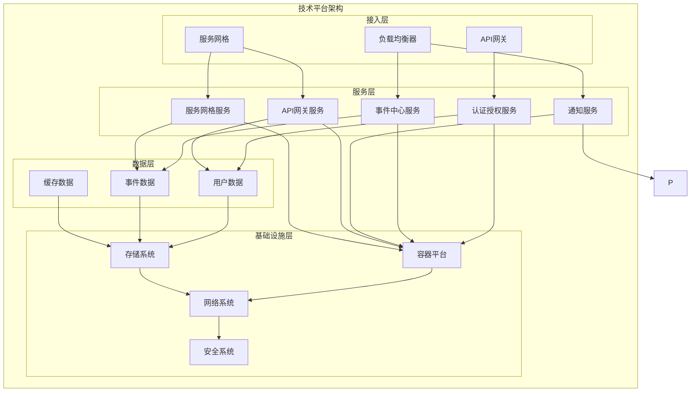
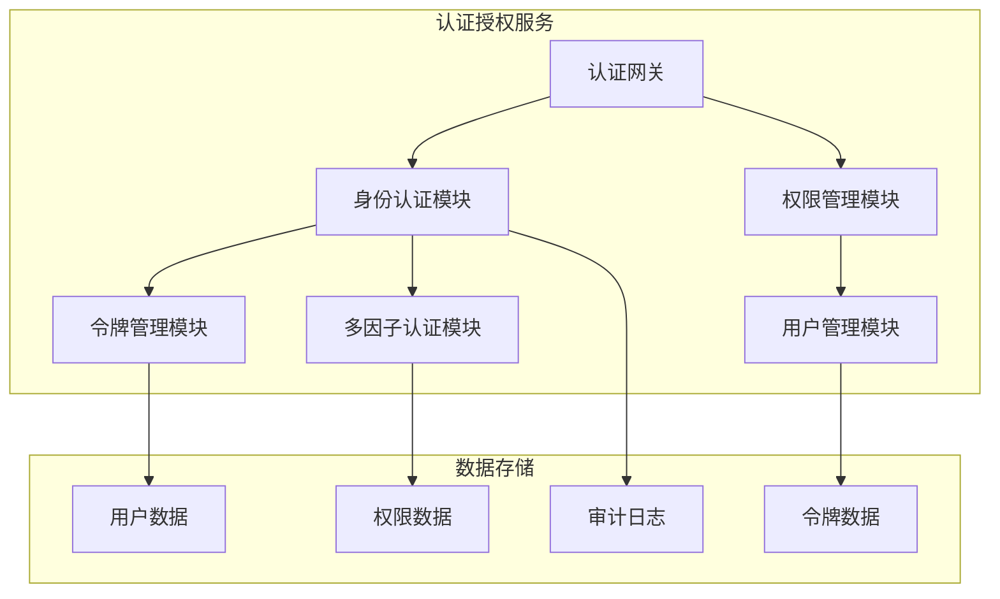
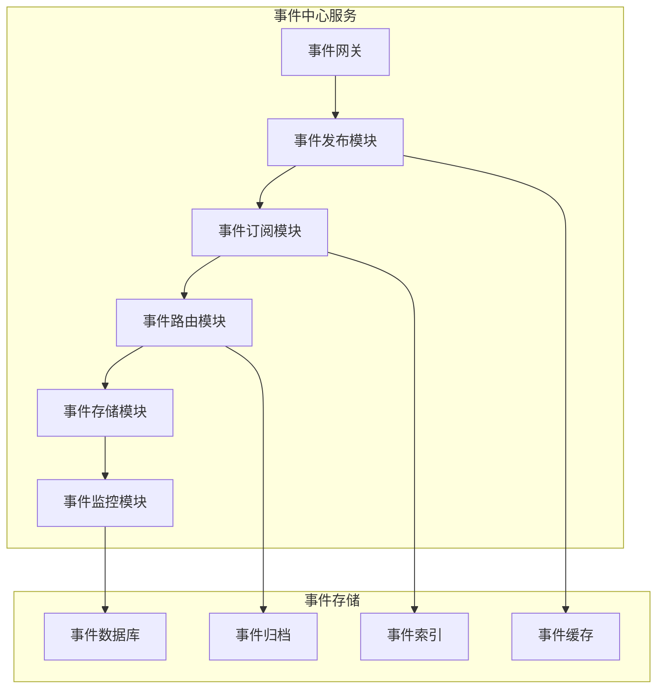
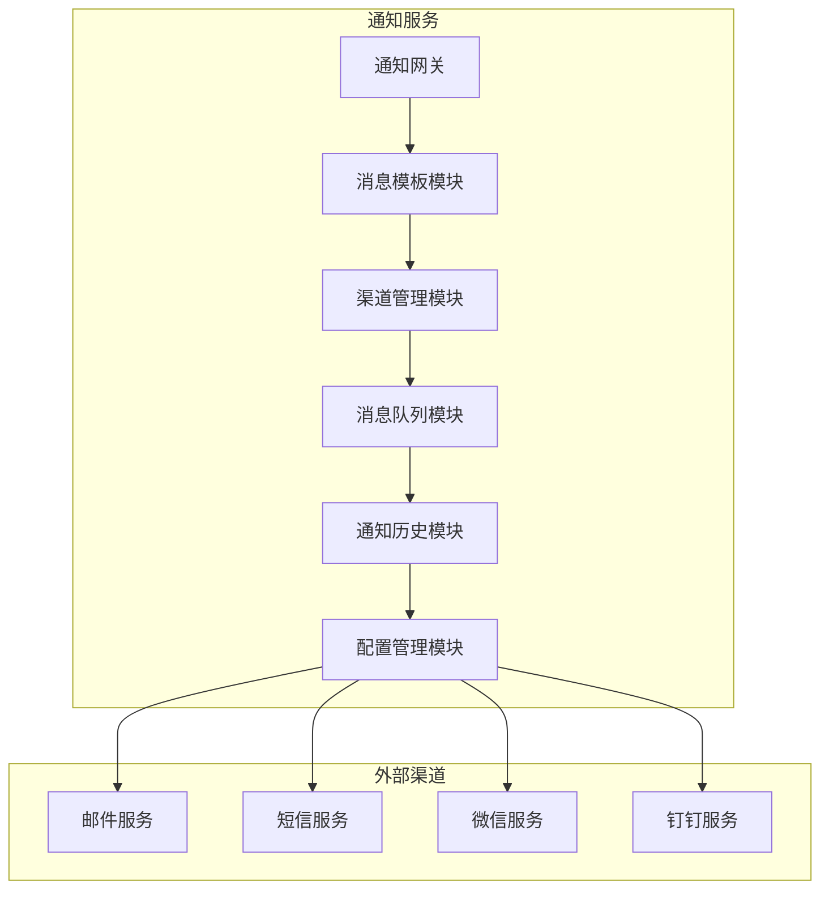
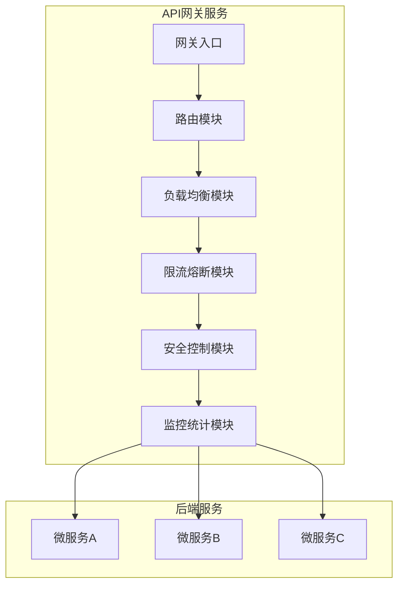
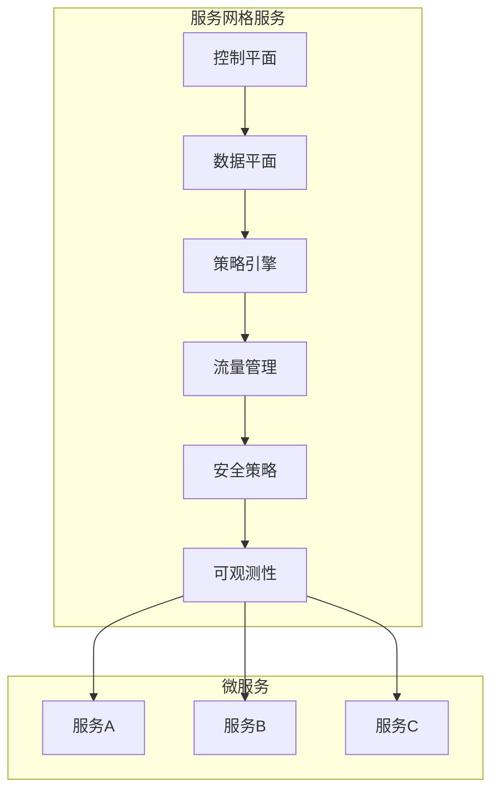

# AixOne技术平台架构设计

## 1. 技术平台概述

### 1.1 平台定位

AixOne技术平台作为企业级平台的基础设施层，为整个AixOne生态系统提供统一的技术基础能力。技术平台遵循"**基础设施即服务**"的理念，为应用平台、数据平台、智能平台等上层平台提供标准化的技术支撑服务。

### 1.2 核心价值

- **统一技术底座**：提供统一的技术基础设施，避免重复建设
- **标准化服务**：通过标准化接口和规范，确保服务的一致性和可维护性
- **高可用保障**：提供高可用、高性能的技术服务支撑
- **安全防护**：提供多层次的安全防护机制，保障平台安全
- **可扩展性**：支持水平扩展和功能扩展，适应业务增长需求

### 1.3 设计原则

- **服务化设计**：所有技术能力以微服务形式提供
- **标准化接口**：提供统一的API接口和SDK
- **高内聚低耦合**：服务内部高内聚，服务间低耦合
- **可观测性**：提供完善的监控、日志和链路追踪能力
- **安全性优先**：内置安全机制，确保平台安全

## 2. 技术平台架构

### 2.1 整体架构

### 2.2 分层架构

| 架构层次 | 职责描述 | 主要组件 | 技术特点 |
|---------|----------|----------|----------|
| **接入层** | 统一入口和流量管理 | API网关、负载均衡器、服务网格 | 高可用、高性能、安全控制 |
| **服务层** | 核心技术服务 | 认证、配置、发现、事件、通知等微服务 | 无状态、可扩展、标准化 |
| **数据层** | 数据存储和管理 | 用户数据、配置数据、事件数据等 | 高可用、数据一致性、安全 |
| **基础设施层** | 底层基础设施 | 容器平台、存储、网络、安全 | 云原生、自动化、可观测 |

## 3. 核心服务架构

### 3.1 认证授权服务（axione-tech-auth）

#### 3.1.1 服务概述

认证授权服务是技术平台的核心安全服务，提供统一的身份认证、授权管理和单点登录能力。

#### 3.1.2 核心功能

- **身份认证**：支持多种认证方式（用户名密码、OAuth2.0、LDAP等）
- **权限管理**：基于RBAC的细粒度权限控制
- **单点登录**：支持SSO统一登录体验
- **多因子认证**：支持MFA增强安全性
- **令牌管理**：JWT令牌的生成、验证和刷新

#### 3.1.3 技术架构

#### 3.1.4 技术实现

- **框架**：Spring Boot 3.5+ + Spring Security
- **认证协议**：OAuth2.0 + OpenID Connect
- **令牌格式**：JWT (JSON Web Token)
- **数据库**：PostgreSQL + Redis
- **加密算法**：AES-256 + RSA-2048

### 3.2 事件中心服务（axione-tech-event）

#### 3.2.1 服务概述

事件中心服务提供事件驱动的架构支撑，实现服务间的异步通信和解耦。

#### 3.2.2 核心功能

- **事件发布**：支持事件的发布和广播
- **事件订阅**：支持基于主题的事件订阅
- **事件路由**：智能的事件路由和分发
- **事件存储**：事件的持久化存储和重放
- **事件监控**：事件流的监控和分析

#### 3.2.3 技术架构

#### 3.2.4 技术实现

- **消息队列**：Apache Kafka
- **事件存储**：PostgreSQL + Elasticsearch
- **序列化**：JSON + Avro
- **监控**：Kafka Manager + Prometheus
- **框架**：Spring Cloud Stream

### 3.3 通知服务（axione-tech-notify）

#### 3.3.1 服务概述

通知服务提供多渠道的消息通知能力，支持邮件、短信、推送等多种通知方式。

#### 3.3.2 核心功能

- **多渠道通知**：支持邮件、短信、微信、钉钉等
- **消息模板**：可配置的消息模板管理
- **消息队列**：异步消息处理和重试机制
- **通知历史**：通知记录的查询和统计
- **通知配置**：灵活的通知规则配置

#### 3.3.3 技术架构

#### 3.3.4 技术实现

- **消息队列**：Kafka
- **邮件服务**：Spring Boot Mail + SMTP
- **短信服务**：阿里云SMS + 腾讯云SMS
- **推送服务**：极光推送 + 个推
- **数据库**：PostgreSQL

### 3.4 存储基础设施

#### 3.4.1 基础设施概述

存储基础设施为技术平台提供统一的对象存储能力，通过SDK和中间件的方式为其他服务提供存储支持。

#### 3.4.2 核心能力

- **统一存储接口**：提供统一的对象存储抽象
- **多存储后端**：支持MinIO、阿里云OSS等多种存储后端
- **存储SDK**：为其他服务提供存储操作SDK
- **存储中间件**：统一的存储访问中间件
- **存储监控**：存储性能和使用情况监控

#### 3.4.3 技术实现

- **对象存储**：MinIO + 阿里云OSS
- **存储SDK**：Spring Cloud Storage
- **序列化**：Jackson + Kryo
- **监控**：Micrometer + Prometheus

#### 3.4.4 使用方式

- **SDK集成**：通过Maven依赖引入存储SDK
- **注解支持**：通过@StorageOperation等注解使用存储
- **配置管理**：通过配置文件管理存储策略
- **监控集成**：自动集成到监控体系

### 3.5 缓存基础设施

#### 3.5.1 基础设施概述

缓存基础设施为技术平台提供统一的多级缓存能力，通过SDK和中间件的方式为其他服务提供缓存支持。

#### 3.5.2 核心能力

- **多级缓存**：本地缓存 + 分布式缓存
- **缓存策略**：LRU、LFU、TTL等缓存策略
- **缓存SDK**：为其他服务提供缓存操作SDK
- **缓存中间件**：统一的缓存访问中间件
- **缓存监控**：缓存命中率、性能监控

#### 3.5.3 技术实现

- **本地缓存**：Caffeine
- **分布式缓存**：Redis Cluster
- **缓存框架**：Spring Cache
- **序列化**：Jackson + Kryo
- **监控**：Micrometer + Prometheus

#### 3.5.4 使用方式

- **SDK集成**：通过Maven依赖引入缓存SDK
- **注解支持**：通过@Cacheable等注解使用缓存
- **配置管理**：通过配置文件管理缓存策略
- **监控集成**：自动集成到监控体系

### 3.6 API网关服务（axione-tech-gateway）

#### 3.6.1 服务概述

API网关服务作为技术平台的统一入口，提供路由、负载均衡、限流、熔断和安全控制能力。

#### 3.6.2 核心功能

- **统一入口**：所有外部请求的统一接入点
- **路由转发**：基于路径和方法的智能路由
- **负载均衡**：多级负载均衡和流量分发
- **限流熔断**：基于令牌桶的限流和熔断机制
- **安全控制**：统一的身份认证和授权
- **监控统计**：API调用统计和性能监控

#### 3.6.3 技术架构

#### 3.6.4 技术实现

- **网关框架**：Spring Cloud Gateway
- **负载均衡**：Spring Cloud LoadBalancer
- **限流熔断**：Sentinel
- **安全认证**：Spring Security + JWT
- **监控**：Micrometer + Prometheus

### 3.7 服务网格服务（axione-tech-mesh）

#### 3.7.1 服务概述

服务网格服务提供微服务间的通信治理、流量管理和安全策略能力。

#### 3.7.2 核心功能

- **服务治理**：服务间通信的治理和管理
- **流量管理**：智能流量路由和分发
- **安全策略**：服务间安全通信策略
- **可观测性**：服务间通信的可观测性
- **策略配置**：动态策略配置和管理

#### 3.7.3 技术架构

#### 3.7.4 技术实现

- **服务网格**：Istio
- **代理**：Envoy Proxy
- **控制平面**：Istio Control Plane
- **监控**：Prometheus + Grafana
- **追踪**：Jaeger

## 4. 数据架构

### 4.1 数据分类

| 数据类型 | 数据内容 | 存储方案 | 更新频率 | 安全等级 |
|---------|----------|----------|----------|----------|
| **用户数据** | 用户信息、权限、角色 | PostgreSQL | 实时更新 | 高 |
| **事件数据** | 事件记录、事件历史 | PostgreSQL + Kafka | 实时更新 | 中 |
| **缓存数据** | 临时数据、会话数据 | Redis | 实时更新 | 低 |

### 4.2 数据安全

#### 4.2.1 数据加密

- **传输加密**：TLS 1.3
- **存储加密**：AES-256
- **密钥管理**：HSM + KMS
- **数据脱敏**：敏感数据脱敏处理

#### 4.2.2 访问控制

- **身份认证**：多因子认证
- **权限控制**：RBAC + ABAC
- **数据分类**：按敏感级别分类
- **审计日志**：完整的操作审计

### 4.3 数据一致性

| 一致性类型 | 适用场景 | 实现机制 | 技术方案 |
|-----------|----------|----------|----------|
| **强一致性** | 用户数据、权限数据 | 分布式事务 | Seata + 2PC |
| **最终一致性** | 事件数据、配置数据 | 事件驱动 | Kafka + 事件总线 |
| **弱一致性** | 缓存数据、监控数据 | 异步同步 | Redis + 定时任务 |

## 5. 安全架构

### 5.1 安全分层

| 安全层次 | 安全措施 | 技术实现 | 防护目标 |
|---------|----------|----------|----------|
| **网络安全** | 网络隔离、访问控制 | 防火墙、VPN、网络分段 | 网络攻击防护 |
| **应用安全** | 应用层安全防护 | WAF、输入验证、输出编码 | 注入攻击防护 |
| **数据安全** | 数据加密、访问控制 | 数据加密、访问控制、数据脱敏 | 数据泄露防护 |
| **身份安全** | 身份认证和授权 | 多因子认证、单点登录、权限管理 | 身份验证 |

### 5.2 安全控制

#### 5.2.1 预防控制

- **身份认证**：多因子认证、单点登录
- **权限控制**：RBAC、细粒度权限
- **输入验证**：参数校验、SQL注入防护
- **安全配置**：安全基线、配置管理

#### 5.2.2 检测控制

- **安全监控**：实时监控、异常检测
- **日志分析**：安全日志、行为分析
- **漏洞扫描**：定期扫描、漏洞管理
- **威胁情报**：威胁检测、情报分析

#### 5.2.3 响应控制

- **事件响应**：安全事件响应流程
- **自动阻断**：异常行为自动阻断
- **恢复机制**：数据恢复、服务恢复
- **应急处理**：应急预案、应急演练

## 6. 部署架构

### 6.1 部署模式

| 部署模式 | 描述 | 适用场景 | 优势 | 劣势 |
|---------|------|----------|------|------|
| **容器化部署** | Docker + Kubernetes | 云原生环境 | 弹性扩展、资源隔离 | 复杂度高 |
| **虚拟机部署** | 传统VM部署 | 传统环境 | 简单稳定 | 资源利用率低 |
| **混合部署** | 容器 + VM混合 | 渐进式迁移 | 风险可控 | 管理复杂 |

### 6.2 环境规划

| 环境 | 用途 | 配置 | 高可用 |
|------|------|------|--------|
| **开发环境** | 开发测试 | 单节点，最小配置 | 无 |
| **测试环境** | 功能验证 | 3节点，标准配置 | 基础 |
| **预生产环境** | 生产验证 | 多节点，生产配置 | 完整 |
| **生产环境** | 正式运行 | 多节点，高可用配置 | 完整 |

### 6.3 高可用设计

#### 6.3.1 服务高可用

- **多副本部署**：关键服务多副本部署
- **负载均衡**：多级负载均衡
- **故障转移**：自动故障检测和转移
- **健康检查**：定期健康检查

#### 6.3.2 数据高可用

- **数据备份**：定期数据备份
- **数据复制**：主从复制、读写分离
- **容灾方案**：异地容灾、数据同步
- **恢复策略**：RTO/RPO目标

## 7. 运维架构

### 7.1 监控体系

| 监控层次 | 监控内容 | 监控工具 | 告警策略 |
|---------|----------|----------|----------|
| **基础设施监控** | CPU、内存、磁盘、网络 | Prometheus + Grafana | 资源阈值告警 |
| **应用性能监控** | 响应时间、吞吐量、错误率 | Micrometer + APM | SLA监控 |
| **业务监控** | 业务指标、用户行为 | 自定义指标 | 业务异常告警 |
| **日志监控** | 应用日志、系统日志 | ELK Stack | 错误日志告警 |

### 7.2 运维自动化

#### 7.2.1 CI/CD流水线

- **代码管理**：Git + GitLab
- **构建管理**：Maven + Gradle
- **测试管理**：单元测试 + 集成测试
- **部署管理**：Kubernetes + Helm

#### 7.2.2 运维自动化

- **配置管理**：Ansible + Terraform
- **监控告警**：Prometheus + AlertManager
- **日志管理**：Fluentd + Elasticsearch
- **备份恢复**：自动化备份和恢复

### 7.3 可观测性

#### 7.3.1 指标监控

- **系统指标**：CPU、内存、磁盘、网络
- **应用指标**：响应时间、吞吐量、错误率
- **业务指标**：用户数、订单数、收入等
- **自定义指标**：业务特定指标

#### 7.3.2 日志管理

- **日志收集**：Fluentd + Filebeat
- **日志存储**：Elasticsearch
- **日志分析**：Kibana + 自定义分析
- **日志告警**：基于日志的告警

#### 7.3.3 链路追踪

- **分布式追踪**：Jaeger + OpenTelemetry
- **性能分析**：调用链分析、性能瓶颈
- **依赖分析**：服务依赖关系分析
- **故障定位**：快速定位故障根因

## 8. 技术选型

### 8.1 技术栈

| 技术领域 | 选择方案 | 备选方案 | 选择理由 |
|---------|----------|----------|----------|
| **后端框架** | Spring Boot 3.5+ | Quarkus, Micronaut | 生态成熟、社区活跃 |
| **微服务框架** | Spring Cloud 2023.x | Dubbo, gRPC | 与Spring Boot集成好 |
| **数据库** | PostgreSQL | MySQL, Oracle | 开源免费、功能强大 |
| **缓存** | Redis | Memcached, Hazelcast | 数据结构丰富、持久化 |
| **消息队列** | Kafka | RabbitMQ, RocketMQ | 高吞吐量、分布式 |
| **配置中心** | Nacos | Consul, Apollo | 配置管理、服务发现 |
| **容器化** | Docker | Podman, Containerd | 生态成熟、工具丰富 |
| **编排** | Kubernetes | Docker Swarm, OpenShift | 云原生标准、功能强大 |
| **服务网格** | Istio | Linkerd, Consul Connect | 云原生标准、功能强大 |

### 8.2 技术决策记录

| 决策编号 | 决策内容 | 决策时间 | 决策依据 | 影响评估 |
|---------|----------|----------|----------|----------|
| TDR-001 | 选择Spring Boot作为后端框架 | 2024-01 | 生态成熟、学习成本低 | 低风险 |
| TDR-002 | 选择PostgreSQL作为主数据库 | 2024-01 | 开源免费、功能强大 | 低风险 |
| TDR-003 | 选择Kafka作为消息队列 | 2024-01 | 高吞吐量、分布式支持 | 中风险 |
| TDR-004 | 选择Kubernetes作为容器编排 | 2024-01 | 云原生标准、功能强大 | 中风险 |
| TDR-005 | 选择Istio作为服务网格 | 2024-01 | 云原生标准、功能强大 | 中风险 |

## 9. 性能设计

### 9.1 性能目标

| 性能指标 | 目标值 | 测量方法 | 优化策略 |
|---------|--------|----------|----------|
| **响应时间** | API响应时间 < 200ms | APM监控 | 缓存优化、数据库优化 |
| **吞吐量** | 支持1000+并发用户 | 压力测试 | 水平扩展、负载均衡 |
| **可用性** | 系统可用性 > 99.9% | 监控统计 | 高可用部署、故障转移 |
| **扩展性** | 支持水平扩展 | 弹性测试 | 无状态设计、容器化 |

### 9.2 性能优化

#### 9.2.1 应用层优化

- **缓存策略**：多级缓存、缓存预热
- **数据库优化**：索引优化、查询优化
- **代码优化**：算法优化、内存优化
- **异步处理**：异步任务、消息队列

#### 9.2.2 基础设施优化

- **网络优化**：CDN、负载均衡
- **存储优化**：SSD、RAID配置
- **计算优化**：CPU优化、内存优化
- **监控优化**：性能监控、瓶颈分析

## 10. 安全设计

### 10.1 安全目标

- **数据安全**：敏感数据加密存储和传输
- **访问安全**：严格的身份认证和权限控制
- **网络安全**：网络隔离和攻击防护
- **应用安全**：应用层安全防护和漏洞修复

### 10.2 安全措施

#### 10.2.1 数据安全

- **加密存储**：AES-256加密存储
- **传输加密**：TLS 1.3加密传输
- **密钥管理**：HSM密钥管理
- **数据脱敏**：敏感数据脱敏处理

#### 10.2.2 访问安全

- **身份认证**：多因子认证、单点登录
- **权限控制**：RBAC、细粒度权限
- **会话管理**：会话超时、并发控制
- **审计日志**：完整的操作审计

#### 10.2.3 网络安全

- **网络隔离**：VPC、子网隔离
- **防火墙**：网络层防火墙
- **WAF**：Web应用防火墙
- **DDoS防护**：DDoS攻击防护

## 11. 总结

AixOne技术平台作为企业级平台的基础设施层，通过微服务架构和云原生技术，为整个AixOne生态系统提供了统一、标准、安全、高效的技术基础能力。

### 11.1 核心优势

1. **统一技术底座**：提供统一的技术基础设施，避免重复建设
2. **标准化服务**：通过标准化接口和规范，确保服务的一致性
3. **高可用保障**：提供高可用、高性能的技术服务支撑
4. **安全防护**：提供多层次的安全防护机制
5. **可扩展性**：支持水平扩展和功能扩展

### 11.2 技术特色

1. **微服务架构**：基于Spring Cloud的微服务架构
2. **云原生**：基于Kubernetes的云原生部署
3. **可观测性**：完善的监控、日志和链路追踪
4. **安全性**：多层次的安全防护机制
5. **自动化**：完善的CI/CD和运维自动化

### 11.3 发展展望

技术平台将继续演进，支持更多技术能力，提升平台的技术先进性和竞争力，为AixOne生态系统的持续发展提供坚实的技术基础。
