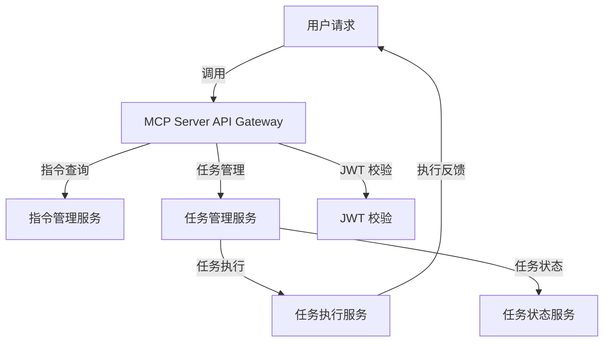

## 总体架构

MCP Server 提供的 API 以统一的标准进行管理，减少暴露的接口数量。核心功能包括指令管理、任务管理、任务执行和状态追踪。所有的接口都采用 **RESTful API** 形式，且仅暴露任务相关的操作，保持接口简洁且易于扩展。**JWT 校验模块**确保了用户认证，**任务状态服务**使用 **Redis** 来缓存和实时更新任务的状态。




### 模块划分

#### 1. **API Gateway (API 网关)**
   - **功能**：作为统一接入点，所有请求通过该网关进行路由。只有任务管理、指令查询、任务执行和状态相关的 API 会被暴露。
   - **职责**：
     - 校验请求中的 **JWT Token**。
     - 路由任务管理、指令管理和任务执行等请求。
     - 确保其他的 API 只涉及核心任务操作，减少对外暴露的接口。
   - **技术栈**：使用 **FastAPI** 实现，支持异步请求处理。

#### 2. **JWT 校验模块 (JWT Validation)**
   - **功能**：每次用户请求时，校验请求中的 **JWT Token** 是否有效。
   - **职责**：
     - 通过 **FastAPI** 中的 **Depends** 注入机制对 API 请求进行验证。
     - 确保只有已认证的用户可以访问任务管理和任务执行等敏感接口。
   - **技术栈**：使用 **PyJWT** 进行 JWT 校验。

#### 3. **指令管理服务 (Command Management Service)**
   - **功能**：提供指令的查询和创建功能。
   - **职责**：
     - 查询已定义的指令。
     - 创建新的指令并存储到本地文件系统中（如 JSON 或 YAML 格式）。
   - **技术栈**：
     - **FastAPI** 提供 RESTful API 接口。
     - 本地文件系统（如 JSON 文件）用于存储指令数据。
   
   **指令查询和创建的 API**：
   - **GET /commands**：查询所有指令。
   - **POST /commands**：创建新的指令。

#### 4. **任务管理服务 (Task Management Service)**
   - **功能**：任务的增、删、改、查功能。
   - **职责**：
     - 提供任务的增、删、改、查接口。
     - 任务的生命周期管理。
     - 任务的数据会存储在数据库中，并与任务状态服务结合使用。
   - **技术栈**：
     - **FastAPI** 提供 RESTful API 接口。
     - **SQLAlchemy** 用于与 **PostgreSQL** 进行交互。

   **任务增删改查的 API**：
   - **GET /tasks**：查询任务列表。
   - **POST /tasks**：创建新的任务。
   - **PUT /tasks/{task_id}**：更新任务。
   - **DELETE /tasks/{task_id}**：删除任务。

#### 5. **任务执行服务 (Task Execution Service)**
   - **功能**：任务的执行接口，用于启动和管理任务的执行。
   - **职责**：
     - 根据任务参数启动任务执行。
     - 在任务执行时，更新任务的状态并进行反馈。
   - **技术栈**：
     - **FastAPI** 提供 API 接口。
     - 通过调用其他模块来执行任务（如调用不同的代理或服务进行实际的任务执行）。

   **任务执行 API**：
   - **POST /tasks/{task_id}/execute**：启动任务执行。

#### 6. **任务状态服务 (Task Status Service)**
   - **功能**：提供任务执行状态查询的功能。
   - **职责**：
     - 在任务执行过程中实时更新任务状态。
     - 提供接口查询任务的当前执行状态。
   - **技术栈**：
     - **Redis** 用于缓存任务状态。
     - **FastAPI** 提供查询接口。

   **任务状态查询 API**：
   - **GET /tasks/{task_id}/status**：查询任务的当前执行状态。

### 技术栈

1. **FastAPI**：Web 框架，用于构建 RESTful API。
2. **SQLAlchemy**：ORM，用于任务和任务历史的数据库交互。
3. **Alembic**：数据库迁移工具，用于管理数据库架构变更。
4. **PostgreSQL**：关系型数据库，存储任务信息。
5. **Redis**：用于实时缓存和任务状态更新。
6. **PyJWT**：用于 **JWT** Token 校验，确保用户认证。
7. **本地文件系统（如 JSON）**：用于存储指令数据，简化管理。

### 核心功能实现

#### 1. **指令查询与创建 API**

指令可以通过本地文件（如 JSON 或 YAML 文件）存储，便于管理和查询。以下是 API 示例：

- **GET /commands**：
  查询所有已存储的指令。

  示例：
  ```python
  @app.get("/commands")
  def get_commands():
      with open('commands.json', 'r') as file:
          commands = json.load(file)
      return {"commands": commands}
  ```

- **POST /commands**：
  创建新的指令。

  示例：
  ```python
  @app.post("/commands")
  def create_command(command: Command):
      with open('commands.json', 'r+') as file:
          commands = json.load(file)
          commands.append(command.dict())
          file.seek(0)
          json.dump(commands, file)
      return {"message": "Command created successfully"}
  ```

#### 2. **任务增删改查 API**

任务通过 **PostgreSQL** 存储，并提供增、删、改、查接口。

- **GET /tasks**：查询任务列表。

  示例：
  ```python
  @app.get("/tasks")
  def get_tasks(db: Session = Depends(get_db)):
      tasks = db.query(Task).all()
      return {"tasks": tasks}
  ```

- **POST /tasks**：创建任务。

  示例：
  ```python
  @app.post("/tasks")
  def create_task(task: TaskCreate, db: Session = Depends(get_db)):
      db_task = Task(**task.dict())
      db.add(db_task)
      db.commit()
      db.refresh(db_task)
      return {"task": db_task}
  ```

#### 3. **任务执行 API**

- **POST /tasks/{task_id}/execute**：发起任务执行。

  示例：
  ```python
  @app.post("/tasks/{task_id}/execute")
  def execute_task(task_id: int, db: Session = Depends(get_db)):
      task = db.query(Task).filter(Task.id == task_id).first()
      if not task:
          raise HTTPException(status_code=404, detail="Task not found")
      # 启动任务执行逻辑
      return {"message": "Task execution started"}
  ```

#### 4. **任务状态查询 API**

- **GET /tasks/{task_id}/status**：查询任务的执行状态。

  示例：
  ```python
  @app.get("/tasks/{task_id}/status")
  def get_task_status(task_id: int, db: Session = Depends(get_db)):
      task = db.query(Task).filter(Task.id == task_id).first()
      if not task:
          raise HTTPException(status_code=404, detail="Task not found")
      return {"status": task.status}
  ```
