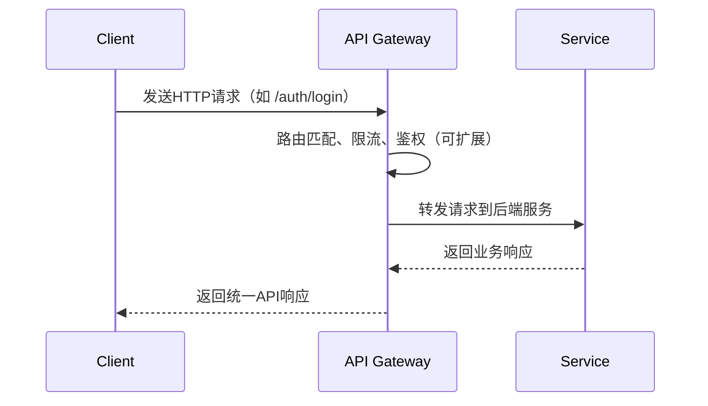

# API Gateway 架构设计文档

## 一、系统定位

API Gateway（API 网关）是平台微服务架构的统一入口，负责请求路由、服务聚合、协议转换、统一认证、限流熔断等。它屏蔽了后端服务的复杂性，为前端和第三方提供一致、安全、高可用的 API 接入点。

---

## 二、技术选型

- **核心框架**：Spring Cloud Gateway
- **服务注册/发现**：Nacos
- **配置中心**：Nacos Config
- **限流与熔断**：Sentinel
- **健康检查与监控**：Spring Boot Actuator
- **构建工具**：Maven
- **运行环境**：Java 17+/Spring Boot 3+

---

## 三、核心功能

1. **动态路由转发**：基于 Path、服务名等规则，将请求转发到后端微服务。
2. **服务发现**：自动感知 Nacos 注册的服务实例，实现高可用负载均衡。
3. **统一限流与熔断**：集成 Sentinel，支持多维度限流、熔断、降级。
4. **统一健康检查**：通过 Actuator 暴露健康检查、监控指标。
5. **配置热更新**：依赖 Nacos Config，支持网关路由、限流等配置动态刷新。
6. **安全扩展点**：支持自定义过滤器，可扩展认证、鉴权、日志、灰度发布等。

---

## 四、路由与服务发现

### 1. 路由配置（application.yml 示例）

```yaml
spring:
  cloud:
    gateway:
      discovery:
        locator:
          enabled: true
          lower-case-service-id: true
      routes:
        - id: auth-service
          uri: lb://auth-service
          predicates:
            - Path=/auth/**
          filters:
            - StripPrefix=1
        - id: user-service
          uri: lb://user-service
          predicates:
            - Path=/users/**
          filters:
            - StripPrefix=1
        # ... 其他服务
```

- **服务发现**：通过 Nacos 自动注册与发现服务实例，`lb://` 代表负载均衡。
- **路由规则**：基于 Path 前缀匹配，支持多服务接入。
- **StripPrefix**：去除路径前缀，简化后端服务路由。

---

## 五、限流与熔断

- **Sentinel 集成**：通过 `spring-cloud-starter-alibaba-sentinel` 和 `sentinel-gateway-adapter` 实现网关级限流、熔断。
- **配置方式**：支持控制台动态配置、Nacos 配置、或本地规则。
- **常见限流维度**：IP、用户、接口、服务等。
- **熔断降级**：支持自定义降级处理逻辑，保障系统稳定性。

---

## 六、健康检查与监控

- **Actuator 集成**：通过 `/actuator/health`、`/actuator/metrics` 等端点暴露健康与监控信息。
- **管理配置**：
  ```yaml
  management:
    endpoints:
      web:
        exposure:
          include: '*'
    endpoint:
      health:
        show-details: always
  ```
- **可对接 Prometheus、Grafana 等监控系统。**

---

## 七、典型请求流程



---

## 八、扩展点与最佳实践

- **自定义过滤器**：可实现统一认证、日志、灰度发布等。
- **安全加固**：建议集成统一认证、IP黑名单、接口签名等。
- **灰度与蓝绿发布**：可通过自定义路由/过滤器实现。
- **配置热更新**：推荐所有路由、限流、降级规则均通过 Nacos 配置中心管理。
- **高可用部署**：建议多实例部署，配合注册中心实现无单点。

---

## 九、参考依赖与配置

- 主要依赖：
  - spring-cloud-starter-gateway
  - spring-cloud-starter-alibaba-nacos-discovery
  - spring-cloud-starter-alibaba-nacos-config
  - spring-cloud-starter-alibaba-sentinel
  - spring-cloud-alibaba-sentinel-gateway
  - spring-boot-starter-actuator

- 参考配置见 `application.yml`，建议结合 Nacos 进行集中管理。

---

## 十、后续可扩展方向

- 接入统一认证与权限校验
- 接入API签名与防重放
- 接入全链路追踪与日志
- 支持多租户、灰度发布等高级特性

---

> 本文档结合当前代码与配置自动生成，后续如有自定义过滤器、鉴权、日志等扩展，请及时补充文档说明。 