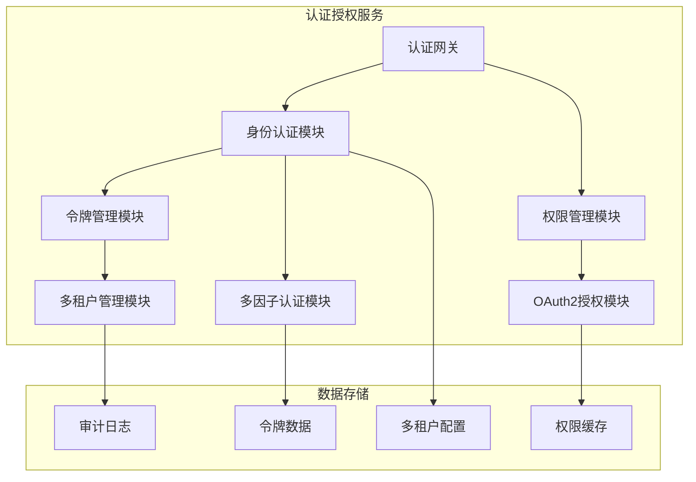
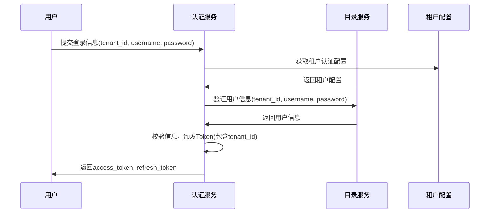
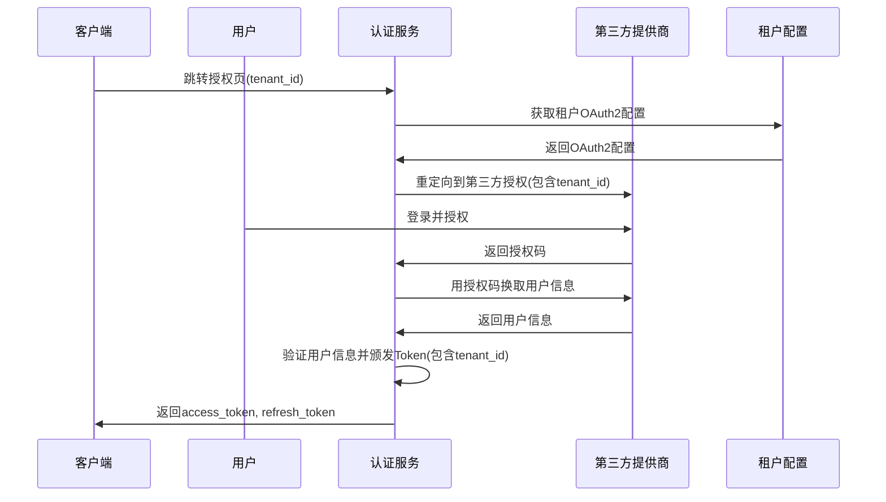
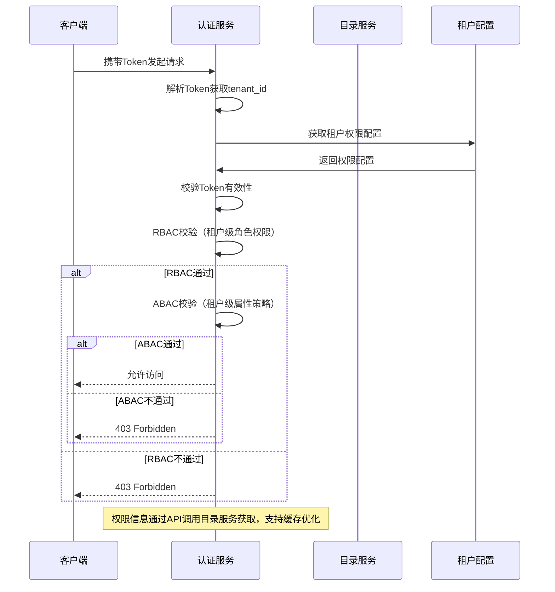

# 认证授权服务（axione-tech-auth）架构设计

## 术语表

| 名称         | 说明                                                         |
|--------------|--------------------------------------------------------------|
| 用户         | 需要认证的身份主体                                           |
| 客户端       | 访问认证服务的应用（如 Web、App、第三方系统）               |
| Token        | 访问令牌，JWT 格式                                           |
| Refresh Token| 用于刷新 Access Token 的长效令牌                             |
| OAuth2       | 开放授权协议，支持第三方应用接入                             |
| JWT          | JSON Web Token，标准的无状态令牌格式                         |
| 授权码       | OAuth2 授权流程中的临时凭证                                 |
| 租户         | 平台的逻辑隔离单元，支持多租户架构                           |

## 一、服务概述

认证授权服务是AixOne技术平台的核心安全服务，提供统一的身份认证、授权管理和单点登录能力。作为技术平台的基础设施服务，为整个AixOne生态系统提供标准化的安全认证支撑。

### 1.1 服务定位

认证授权服务是技术平台的核心安全服务，负责用户登录、Token 颁发、校验、OAuth2 授权、权限控制等。为所有微服务提供安全、标准的认证能力，支持 JWT、OAuth2 等主流协议，并支持多种认证方式和多租户架构。

### 1.2 核心价值

- **统一身份认证**：为整个平台提供统一的身份认证入口
- **标准化授权**：基于RBAC+ABAC混合权限模型，提供细粒度权限控制
- **安全防护**：多层次安全机制，保障平台安全
- **高可用保障**：支持高并发、高可用的认证服务
- **可扩展性**：支持多种认证方式和第三方集成

---

## 二、核心功能

### 2.1 身份认证
- **多方式认证**：支持用户名密码、短信验证码、邮箱验证码、OAuth2第三方登录
- **多因子认证**：支持MFA增强安全性
- **单点登录**：支持SSO统一登录体验
- **多租户认证**：支持租户级身份隔离和认证

### 2.2 授权管理
- **权限控制**：基于RBAC+ABAC混合权限模型
- **角色管理**：支持角色分配和权限继承
- **细粒度控制**：支持资源级、操作级权限控制
- **动态权限**：支持基于上下文的动态权限决策
- **多租户授权**：支持租户级权限隔离和授权

### 2.3 令牌管理
- **JWT令牌**：标准的无状态令牌格式
- **令牌颁发**：Access Token和Refresh Token管理
- **令牌校验**：令牌有效性验证和黑名单管理
- **令牌刷新**：支持令牌自动刷新机制
- **多租户令牌**：支持租户级令牌隔离和管理

### 2.4 OAuth2授权
- **标准协议**：支持OAuth2授权码、密码、客户端等授权模式
- **第三方集成**：支持支付宝、微信、阿里云等第三方登录
- **授权范围**：支持细粒度授权范围控制
- **安全回调**：安全的授权回调处理
- **多租户OAuth2**：支持租户级OAuth2客户端管理

---

## 三、技术架构

### 3.1 技术选型

- **语言与框架**：Java 21+，Spring Boot 3.5+，Spring Security 6.x
- **认证协议**：OAuth2.0 + OpenID Connect，JWT (JSON Web Token)
- **数据库**：PostgreSQL（主存储）+ Redis（缓存和会话）
- **加密算法**：AES-256 + RSA-2048，BCrypt密码加密
- **依赖组件**：Spring Authorization Server，Spring Cloud，JJWT

### 3.2 技术架构图



---

## 四、数据架构

### 4.1 数据分类

| 数据类型 | 数据内容 | 存储方案 | 更新频率 | 安全等级 | 多租户隔离 |
|---------|----------|----------|----------|----------|------------|
| **令牌数据** | JWT Token、Refresh Token | Redis | 实时更新 | 高 | 租户级隔离 |
| **权限缓存** | 用户角色权限缓存 | Redis | 实时更新 | 高 | 租户级隔离 |
| **审计数据** | 登录日志、操作记录 | PostgreSQL | 实时更新 | 中 | 租户级隔离 |
| **会话数据** | 用户会话、临时状态 | Redis | 实时更新 | 中 | 租户级隔离 |
| **多租户配置** | 租户认证配置、OAuth2配置 | PostgreSQL | 按需更新 | 高 | 租户级隔离 |

### 4.2 数据安全

#### 4.2.1 数据加密
- **传输加密**：TLS 1.3
- **存储加密**：AES-256
- **密钥管理**：HSM + KMS
- **密码加密**：BCrypt

#### 4.2.2 访问控制
- **身份认证**：多因子认证
- **权限控制**：RBAC + ABAC
- **数据分类**：按敏感级别分类
- **审计日志**：完整的操作审计

### 4.3 实体模型

#### 4.3.1 Client（客户端）
| 字段         | 类型    | 说明         | 必填 |
|--------------|---------|--------------|------|
| client_id    | String  | 客户端ID     | 是   |
| tenant_id    | String  | 所属租户     | 是   |
| client_secret| String  | 客户端密钥   | 是   |
| redirect_uri | String  | 回调地址     | 是   |
| scopes       | String  | 授权范围     | 是   |
| grant_types  | String  | 授权类型     | 是   |

#### 4.3.2 Token（令牌）
| 字段         | 类型    | 说明         | 必填 |
|--------------|---------|--------------|------|
| token        | String  | JWT Token    | 是   |
| tenant_id    | String  | 所属租户     | 是   |
| user_id      | String  | 用户ID       | 是   |
| client_id    | String  | 客户端ID     | 是   |
| expires_at   | DateTime| 过期时间     | 是   |
| type         | String  | access/refresh| 是   |

#### 4.3.3 AuditLog（审计日志）
| 字段         | 类型    | 说明         | 必填 |
|--------------|---------|--------------|------|
| log_id       | String  | 日志ID       | 是   |
| tenant_id    | String  | 所属租户     | 是   |
| user_id      | String  | 用户ID       | 是   |
| action       | String  | 操作类型     | 是   |
| resource     | String  | 资源         | 否   |
| result       | String  | 操作结果     | 是   |
| timestamp    | DateTime| 操作时间     | 是   |

#### 4.3.4 TenantConfig（租户配置）
| 字段         | 类型    | 说明         | 必填 |
|--------------|---------|--------------|------|
| tenant_id    | String  | 租户ID       | 是   |
| auth_config  | String  | 认证配置     | 否   |
| oauth_config | String  | OAuth2配置   | 否   |
| security_config | String | 安全配置     | 否   |
| created_at   | DateTime| 创建时间     | 是   |

### 4.4 关联关系
- 客户端与 Token：一对多（按租户隔离）
- 用户与 Token：一对多（用户数据来自目录服务，按租户隔离）
- 用户与审计日志：一对多（按租户隔离）
- 租户与配置：一对一

---

## 五、API接口设计

### 5.1 认证接口

#### 5.1.1 用户名密码登录
- **接口**：POST /api/v1/auth/login
- **参数**：tenant_id, username, password
- **返回**：access_token, refresh_token

#### 5.1.2 短信验证码登录
- **发送验证码**：POST /api/v1/auth/sms/send
- **验证码登录**：POST /api/v1/auth/sms/login
- **参数**：tenant_id, phone, sms_code

#### 5.1.3 邮箱验证码登录
- **发送验证码**：POST /api/v1/auth/email/send
- **验证码登录**：POST /api/v1/auth/email/login
- **参数**：tenant_id, email, email_code

#### 5.1.4 第三方OAuth2登录
- **授权页面**：GET /api/v1/auth/{provider}/authorize
- **回调处理**：GET /api/v1/auth/{provider}/callback
- **支持提供商**：alipay, wechat, aliyun
- **参数**：tenant_id（在授权URL中传递）

### 5.2 令牌管理接口

#### 5.2.1 令牌刷新
- **接口**：POST /api/v1/auth/refresh
- **参数**：tenant_id, refresh_token
- **返回**：新的 access_token, refresh_token

#### 5.2.2 令牌校验
- **接口**：POST /api/v1/auth/validate
- **参数**：token（JWT中包含tenant_id）
- **返回**：令牌有效性信息

#### 5.2.3 用户登出
- **接口**：POST /api/v1/auth/logout
- **参数**：token（JWT中包含tenant_id）
- **说明**：将令牌加入黑名单

### 5.3 权限校验接口

#### 5.3.1 权限校验
- **接口**：POST /api/v1/auth/check-permission
- **参数**：tenant_id, user_id, resource, action
- **返回**：权限校验结果

### 5.4 多租户配置接口

#### 5.4.1 租户配置查询
- **接口**：GET /api/v1/auth/tenant/{tenantId}/config
- **返回**：租户认证配置

#### 5.4.2 租户配置更新
- **接口**：PUT /api/v1/auth/tenant/{tenantId}/config
- **参数**：auth_config, oauth_config, security_config
- **说明**：更新租户级认证配置

---

## 六、错误处理与安全

### 6.1 统一错误码设计

| code      | message           | 说明                     |
|-----------|-------------------|--------------------------|
| 0         | success           | 成功                     |
| 40001     | invalid_param     | 参数错误                 |
| 40101     | unauthorized      | 未认证/Token无效         |
| 40301     | forbidden         | 没有权限/注册关闭        |
| 40401     | not_found         | 资源不存在               |
| 50001     | internal_error    | 服务器内部错误           |

### 6.2 响应格式

所有接口返回格式：
```json
{ 
  "code": 0, 
  "message": "success", 
  "data": { ... } 
}
```

### 6.3 接口安全与权限

- **认证要求**：所有接口默认需认证（除注册、登录、授权码获取等开放接口）
- **认证方式**：Spring Security + JWT/OAuth2 统一认证
- **令牌传递**：Token 需通过 Authorization: Bearer <token> 头部传递
- **权限控制**：支持基于角色/权限的访问控制（如 @PreAuthorize）
- **安全机制**：Token 黑名单、过期、刷新等安全机制完善
- **防护措施**：注册、验证码等接口需防刷、限流

---

## 七、业务流程设计

### 7.1 多租户用户登录流程



### 7.2 多租户OAuth2登录流程



### 7.3 多租户权限校验流程



---

## 八、数据库设计

### 8.1 表结构设计

#### 8.1.1 客户端表（clients）
- client_id (String, PK) - 客户端ID
- tenant_id (String) - 所属租户
- client_secret (String) - 客户端密钥
- redirect_uri (String) - 回调地址
- scopes (String) - 授权范围
- grant_types (String) - 授权类型
- created_at (DateTime) - 创建时间

#### 8.1.2 令牌表（tokens）
- token (String, PK) - JWT Token
- tenant_id (String) - 所属租户
- user_id (String) - 用户ID
- client_id (String) - 客户端ID
- expires_at (DateTime) - 过期时间
- type (String) - access/refresh
- created_at (DateTime) - 创建时间

#### 8.1.3 令牌黑名单表（token_blacklist）
- token (String, PK) - 黑名单Token
- tenant_id (String) - 所属租户
- expires_at (DateTime) - 过期时间
- created_at (DateTime) - 加入时间

#### 8.1.4 审计日志表（audit_logs）
- log_id (String, PK) - 日志ID
- tenant_id (String) - 所属租户
- user_id (String) - 用户ID
- action (String) - 操作类型
- resource (String) - 资源
- result (String) - 操作结果
- timestamp (DateTime) - 操作时间

#### 8.1.5 验证码表（verification_codes）
- phone (String) - 手机号
- email (String) - 邮箱
- tenant_id (String) - 所属租户
- code (String) - 验证码
- expires_at (DateTime) - 过期时间
- created_at (DateTime) - 创建时间

#### 8.1.6 租户配置表（tenant_configs）
- tenant_id (String, PK) - 租户ID
- auth_config (String) - 认证配置JSON
- oauth_config (String) - OAuth2配置JSON
- security_config (String) - 安全配置JSON
- created_at (DateTime) - 创建时间
- updated_at (DateTime) - 更新时间

### 8.2 多租户数据隔离策略

#### 8.2.1 数据隔离方式
- **逻辑隔离**：所有表都包含tenant_id字段
- **索引优化**：在tenant_id上建立复合索引
- **查询过滤**：所有查询都自动添加tenant_id过滤条件

#### 8.2.2 缓存隔离策略
- **Redis Key前缀**：使用tenant_id作为Key前缀
- **缓存命名空间**：不同租户使用不同的缓存命名空间
- **缓存清理**：支持按租户清理缓存

---

## 九、代码组织结构

### 9.1 DDD分层结构

```
services/axione-tech-auth/
├── src/main/java/com/aixone/tech/auth/
│   ├── application/               # 应用层
│   │   ├── command/              # 命令对象
│   │   ├── query/                # 查询对象
│   │   ├── dto/                  # 数据传输对象
│   │   └── service/              # 应用服务
│   ├── domain/                   # 领域层
│   │   ├── model/                # 领域模型
│   │   ├── service/              # 领域服务
│   │   ├── repository/           # 仓储接口
│   │   └── event/                # 领域事件
│   ├── infrastructure/            # 基础设施层
│   │   ├── persistence/          # 持久化
│   │   ├── external/             # 外部服务
│   │   ├── cache/                # 缓存
│   │   └── security/             # 安全配置
│   └── interfaces/               # 接口层
│       ├── rest/                 # REST API
│       ├── event/                # 事件监听
│       └── grpc/                  # gRPC接口（可选）
├── src/test/                     # 测试代码
└── pom.xml                       # Maven配置
```

### 9.2 DDD分层说明

#### 9.2.1 应用层（Application Layer）
- **职责**：协调领域对象完成业务用例
- **组件**：应用服务、命令对象、查询对象、DTO
- **特点**：无业务逻辑，只做流程编排

#### 9.2.2 领域层（Domain Layer）
- **职责**：核心业务逻辑和规则
- **组件**：领域模型、领域服务、仓储接口、领域事件
- **特点**：业务核心，不依赖外部技术

#### 9.2.3 基础设施层（Infrastructure Layer）
- **职责**：技术实现和外部集成
- **组件**：持久化、外部服务、缓存、安全配置
- **特点**：技术实现，依赖领域层接口

#### 9.2.4 接口层（Interface Layer）
- **职责**：对外提供API和事件处理
- **组件**：REST控制器、事件监听器、gRPC服务
- **特点**：协议适配，调用应用层服务

---

## 十、RBAC+ABAC混合权限模型

### 10.1 模型原理

- **RBAC（基于角色的访问控制）**：用户通过角色获得基础权限，适合大部分通用权限场景，结构清晰、易于管理。
- **ABAC（基于属性的访问控制）**：权限决策基于用户、资源、环境等多维属性和策略表达式，支持细粒度、动态、上下文相关的权限需求。
- **混合模型**：先用RBAC判定用户是否具备基础访问权限，再用ABAC策略进行更细粒度的动态校验。

### 10.2 权限决策流程

1. **RBAC校验**：判断用户是否具备访问资源的基础角色权限。
2. **ABAC校验**：在RBAC通过后，进一步根据请求上下文、资源属性、环境属性等，应用ABAC策略表达式进行判定。
3. **最终决策**：两者都通过才允许访问，否则拒绝。

### 10.3 典型ABAC策略示例

- 用户属性：部门、岗位、级别、标签
- 资源属性：归属租户、敏感级别、创建人
- 环境属性：请求IP、时间、设备类型
- 策略表达式示例：
  - 用户部门=资源部门 且 访问时间在9-18点 且 资源敏感级别<2
  - 用户级别>=资源要求级别

### 10.4 伪代码示例

```java
boolean checkAccess(User user, Resource resource, Action action, Context ctx) {
    // 1. RBAC校验
    if (!rbacService.hasRolePermission(user, resource, action)) {
        return false;
    }
    // 2. ABAC校验
    if (!abacService.evaluate(user, resource, action, ctx)) {
        return false;
    }
    return true;
}
```

### 10.5 架构设计建议

- **主数据管理**：用户、角色、资源、属性等主数据由 directory-serve 维护，认证服务通过API调用获取权限信息
- **权限决策引擎**：支持RBAC+ABAC组合判定，可内嵌于认证服务或独立部署
- **策略管理**：支持表达式配置、热更新（如数据库、配置中心、策略DSL等）
- **审计与监控**：记录每次权限决策的详细上下文，便于追溯和合规
- **性能优化**：权限信息缓存，减少对目录服务的频繁调用

### 10.6 行业参考

- 阿里云、AWS、Google Cloud等主流云平台均采用RBAC+ABAC混合模型，兼顾企业级权限管理和灵活的细粒度控制。

> 通过RBAC+ABAC混合模型，平台可实现既规范又灵活的权限体系，满足复杂业务和安全合规需求。

---

## 十一、研发计划与执行步骤

### 11.1 项目现状

- **项目状态**：全新项目，需要从头开发
- **架构基础**：已确定DDD四层架构和项目结构
- **技术选型**：Spring Boot 3.5+ + Spring Security + PostgreSQL + Redis
- **多租户支持**：完整的多租户架构设计

### 11.2 开发阶段规划

#### 11.2.1 第一阶段：基础架构搭建（2-3周）
- [ ] 搭建项目结构
- [ ] 实现DDD四层架构基础框架
- [ ] 配置Spring Boot + Spring Security基础环境
- [ ] 搭建PostgreSQL + Redis数据库环境
- [ ] 实现基础的JWT令牌生成和校验

#### 11.2.2 第二阶段：核心功能开发（4-5周）
- [ ] 实现多租户数据隔离和配置管理
- [ ] 开发用户认证功能（用户名密码、短信、邮箱、OAuth2）
- [ ] 实现令牌管理（生成、校验、刷新、黑名单）
- [ ] 开发OAuth2客户端管理（多租户支持）
- [ ] 实现基础权限校验功能

#### 11.2.3 第三阶段：高级功能开发（3-4周）
- [ ] 实现RBAC+ABAC混合权限模型
- [ ] 开发领域事件和事件驱动架构
- [ ] 实现与目录服务的集成
- [ ] 开发多级缓存策略（多租户缓存隔离）
- [ ] 实现审计日志和监控功能

#### 11.2.4 第四阶段：测试与优化（2-3周）
- [ ] 编写单元测试和集成测试
- [ ] 性能测试和优化
- [ ] 安全测试和加固
- [ ] 文档完善和API文档生成
- [ ] 部署和运维文档

### 11.3 技术实现重点

#### 11.3.1 DDD架构实现
- **领域层**：建立认证、授权、令牌等聚合根
- **应用层**：实现CQRS模式，分离命令和查询
- **基础设施层**：实现仓储模式和数据持久化
- **接口层**：实现REST API和事件监听

#### 11.3.2 多租户支持
- **数据隔离**：所有表包含tenant_id字段
- **缓存隔离**：Redis Key使用tenant_id前缀
- **配置管理**：支持租户级认证配置
- **安全隔离**：租户级权限校验和审计

#### 11.3.3 外部服务集成
- **目录服务**：用户、角色、权限主数据同步
- **事件中心**：领域事件发布和订阅
- **通知服务**：验证码发送和通知

### 11.4 开发规范

#### 11.4.1 代码规范
- **DDD分层**：严格遵循四层架构，保持依赖方向正确
- **命名规范**：使用清晰的领域术语和业务语言
- **注释规范**：关键业务逻辑必须有详细注释
- **测试规范**：测试覆盖率不低于80%

#### 11.4.2 质量保证
- **代码审查**：所有代码必须经过同行审查
- **持续集成**：自动化构建、测试、部署
- **性能监控**：关键指标监控和告警
- **安全扫描**：定期进行安全漏洞扫描

### 11.5 风险控制

#### 11.5.1 技术风险
- **多租户数据隔离**：确保租户间数据完全隔离
- **性能优化**：缓存策略和数据库查询优化
- **安全加固**：防止SQL注入、XSS等安全漏洞

#### 11.5.2 项目风险
- **进度控制**：按阶段里程碑进行进度跟踪
- **质量保证**：每个阶段完成后进行质量评审
- **团队协作**：建立有效的沟通和协作机制

### 11.6 成功标准

#### 11.6.1 功能标准
- [ ] 支持多租户认证和授权
- [ ] 实现完整的OAuth2流程
- [ ] 支持RBAC+ABAC混合权限模型
- [ ] 与目录服务完整集成

#### 11.6.2 性能标准
- [ ] 认证响应时间 < 100ms
- [ ] 权限校验响应时间 < 50ms
- [ ] 支持1000+并发用户
- [ ] 系统可用性 > 99.9%

#### 11.6.3 质量标准
- [ ] 代码测试覆盖率 > 80%
- [ ] 无严重安全漏洞
- [ ] 完整的API文档
- [ ] 完善的运维文档

> 本研发计划作为项目开发的执行指南，建议每完成一个阶段及时评审和调整，确保项目按时高质量交付。
