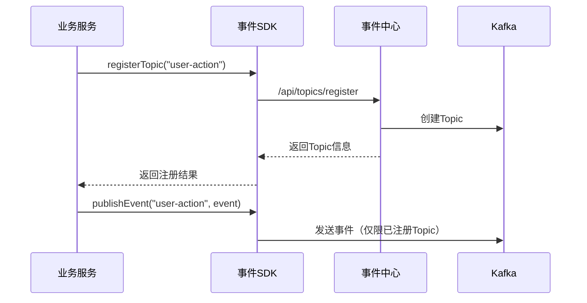
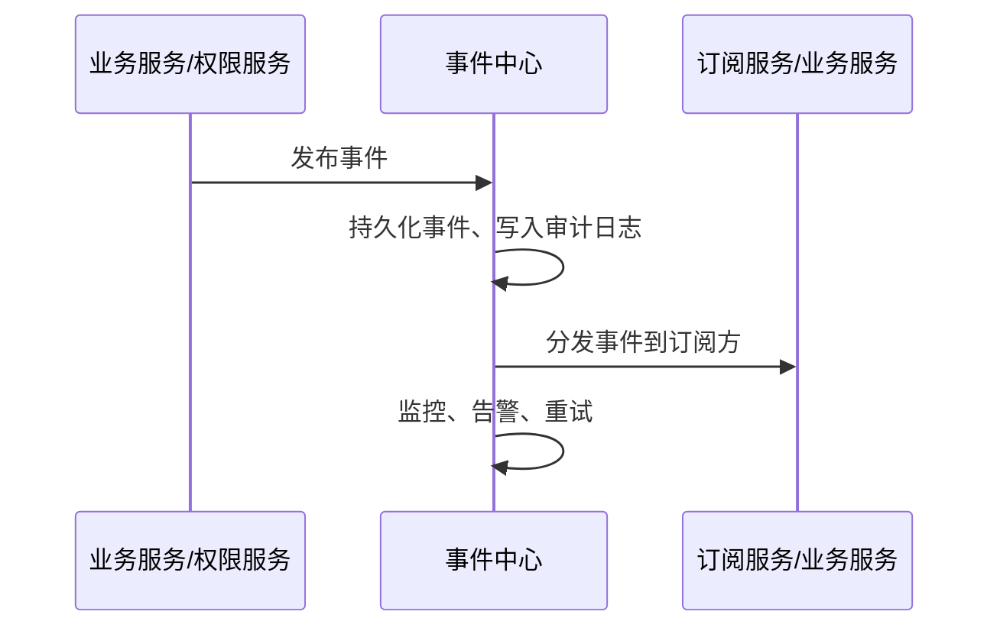
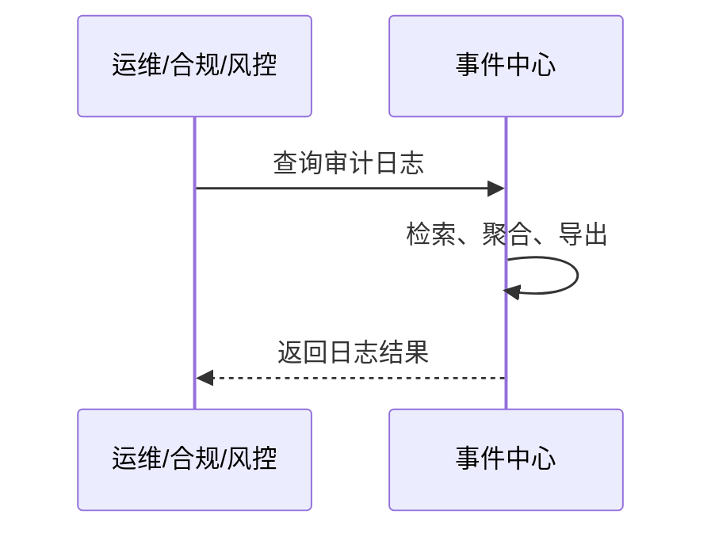
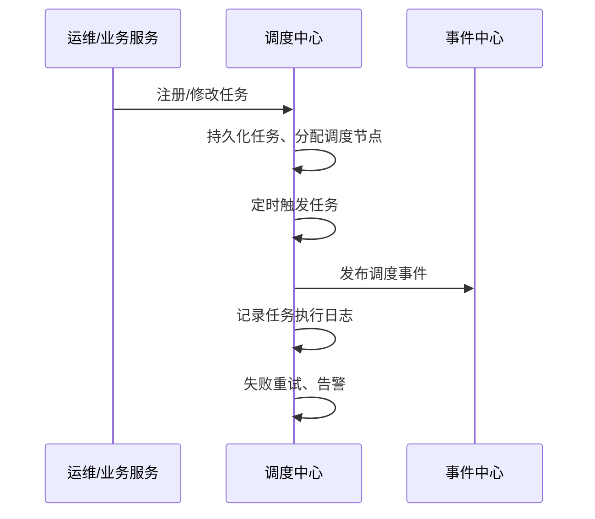

# 事件中心（event-center）架构设计

## 一、系统定位

事件中心（event-center）是平台级的统一事件治理与合规基础设施，聚焦于事件的管理、检索、监控、审计、合规与任务调度。**业务事件流转（发布/订阅/分发）主要通过高性能消息中间件（如 Kafka、RocketMQ、Redis 等）完成**，事件中心负责对事件流进行采集、治理、审计与管理，为各业务模块、微服务、运维与风控系统提供统一的事件审计、检索、监控与调度支撑。

---

## 新增：事件SDK（aixone-event-sdk）设计

### 1. 定位
- 事件SDK为所有业务服务提供统一的事件发布、订阅能力，**直接对接消息中间件（如Kafka）**，实现高性能、低延迟的事件流转。
- SDK与事件中心解耦，业务流量不经过事件中心，事件中心专注于治理和管理。
- **事件Topic的注册/变更/删除必须统一通过事件中心API进行，SDK只允许操作已注册Topic，保证事件中心的治理和合规。**

### 2. 能力
- 提供事件发布、订阅API，支持多种消息中间件（Kafka、RocketMQ等）。
- 支持事件DTO、订阅DTO、审计DTO等统一数据结构。
- 支持Topic注册、查询、审批、变更、删除等接口，所有Topic生命周期由事件中心统一管理。
- SDK发布/订阅事件前，自动校验Topic是否已注册，未注册则拒绝操作。
- 可选：支持事件同步/上报到事件中心（用于审计、检索、监控等治理能力）。
- 支持多通道适配与配置。

### 3. 典型用法
- 业务服务通过SDK发布事件到Kafka，或订阅Kafka事件。
- 事件中心通过订阅Kafka主题采集事件流，进行管理、审计、监控。
- 业务服务如需新建Topic，必须通过SDK调用事件中心注册接口，由事件中心审批后统一创建。
- SDK只允许向事件中心已注册的Topic发布/订阅事件，未注册Topic拒绝操作。
- 业务服务如需审计/检索/监控能力，可通过SDK或异步方式将事件同步到事件中心。

### 4. 架构关系与流程示意


---

## 二、术语表
| 名称         | 说明                                                         |
|--------------|--------------------------------------------------------------|
| 事件         | 业务或系统中发生的可观测动作（如权限变更、登录、操作等）     |
| 订阅         | 业务服务/模块声明对某类事件感兴趣，需被通知                   |
| 发布         | 事件源将事件推送到事件中心                                   |
| 审计日志     | 对关键事件的持久化记录，便于合规、追溯、风控                 |
| 事件分发     | 事件中心将事件推送到所有订阅方                               |
| 监控/告警    | 对事件流转、异常、延迟等进行监控与自动告警                   |
| 调度任务     | 平台内定时/周期/分布式执行的任务                             |
| 调度节点     | 参与任务调度的服务实例                                       |

---

## 三、核心职责
1. 事件发布、订阅、分发、重试
2. 事件持久化、索引、检索
3. 审计日志存储、查询、导出、合规接口
4. 事件监控、告警、风控对接
5. 统一任务调度、分布式任务管理、执行监控
6. 支持多种事件类型与分发方式

---

## 四、技术选型
- **JDK**：Java 21+
- **主框架**：Spring Boot 3.x，Spring Cloud 2023.x
- **分布式协调**：Redis（任务分片、节点选举、分布式锁等）
- **事件分发**：Redis Pub/Sub、HTTP回调
- **持久化**：PostgreSQL / MySQL
- **监控告警**：Prometheus、Grafana、Spring Boot Actuator
- **API**：RESTful，OpenAPI 3.0
- **部署**：Docker/K8s

---

## 五、领域模型

### 5.1 事件模块
| 实体         | 主要字段/说明                                               |
|--------------|------------------------------------------------------------|
| Event        | event_id, event_type, source, data, timestamp              |
| Subscription | subscription_id, event_type, callback_url, subscriber      |

### 5.2 审计模块
| 实体         | 主要字段/说明                                               |
|--------------|------------------------------------------------------------|
| AuditLog     | log_id, event_id, user_id, event_type, data, timestamp     |

### 5.3 调度模块
| 实体         | 主要字段/说明                                               |
|--------------|------------------------------------------------------------|
| ScheduleTask | task_id, name, cron, type, status, payload, created_at     |
| JobLog       | log_id, task_id, status, result, start_time, end_time      |
| Scheduler    | scheduler_id, node, status, last_heartbeat                 |

---

## 六、接口设计

### 6.1 事件接口
| 接口                | 方法 | 路径                        | 说明               |
|---------------------|------|-----------------------------|--------------------|
| 发布事件            | POST | /api/events                 | 发布新事件         |
| 订阅事件            | POST | /api/subscriptions          | 注册事件订阅       |
| 查询事件            | GET  | /api/events                 | 分页/条件查询事件   |
| 查询订阅            | GET  | /api/subscriptions          | 查询订阅列表       |

### 6.2 审计接口
| 接口                | 方法 | 路径                        | 说明               |
|---------------------|------|-----------------------------|--------------------|
| 查询审计日志        | GET  | /api/audit/logs             | 查询审计日志       |
| 导出审计日志        | GET  | /api/audit/logs/export      | 导出审计日志       |

### 6.3 调度接口
| 接口                | 方法 | 路径                        | 说明               |
|---------------------|------|-----------------------------|--------------------|
| 注册任务            | POST | /api/schedule/tasks         | 新建定时/周期任务   |
| 修改任务            | PUT  | /api/schedule/tasks/{id}    | 修改任务配置       |
| 启停/删除任务       | PATCH/DELETE | /api/schedule/tasks/{id} | 启动/暂停/删除任务 |
| 查询任务            | GET  | /api/schedule/tasks         | 分页/条件查询任务   |
| 查询任务日志        | GET  | /api/schedule/job-logs      | 查询任务执行日志   |
| 手动触发任务        | POST | /api/schedule/tasks/{id}/trigger | 立即执行一次任务 |
| 查询调度节点        | GET  | /api/schedule/nodes         | 查看调度节点状态   |

---

## 七、统一错误码设计
| code      | message           | 说明                     |
|-----------|-------------------|--------------------------|
| 0         | success           | 成功                     |
| 40001     | invalid_param     | 参数错误                 |
| 40401     | not_found         | 资源不存在               |
| 40301     | forbidden         | 没有权限                 |
| 50001     | internal_error    | 服务器内部错误           |

- 所有接口返回格式：
  ```json
  { "code": 0, "message": "success", "data": { ... } }
  ```

---

## 八、接口安全与权限说明
- 所有写操作（POST/PUT/DELETE）需鉴权，需携带有效Token。
- 只读操作（GET）可根据业务需求开放部分匿名访问。
- 任务调度、审计日志等敏感操作需更高权限。
- 订阅回调、监控接口可根据业务需求开放部分匿名访问。

---

## 九、典型业务流程图

### 9.1 事件发布与分发流程


### 9.2 审计日志查询流程


### 9.3 任务注册与调度执行


---

## 十、数据库表结构

### 10.1 事件表
- events (event_id, event_type, source, data, timestamp)
- subscriptions (subscription_id, event_type, callback_url, subscriber)

### 10.2 审计表
- audit_logs (log_id, event_id, user_id, event_type, data, timestamp)

### 10.3 调度表
- schedule_tasks (task_id, name, cron, type, status, payload, created_at)
- job_logs (log_id, task_id, status, result, start_time, end_time)
- schedulers (scheduler_id, node, status, last_heartbeat)

---

## 十一、代码组织结构
```
event-center/
└── src/main/java/com/aixone/eventcenter/
    ├── event/         // 事件模型、发布、分发
    ├── subscription/  // 订阅管理
    ├── audit/         // 审计日志管理
    ├── monitor/       // 监控与告警
    ├── schedule/      // 调度中心（任务、日志、分布式调度）
    └── EventCenterApplication.java
```

---

## 十二、研发计划与执行步骤
- [ ] 完善事件发布、订阅、分发、重试等主流程
- [ ] 实现事件持久化、审计日志存储与检索
- [ ] 实现调度中心任务注册、分布式调度、日志、监控等主流程
- [ ] 补充和完善监控、告警、审计查询等接口
- [ ] 完善单元测试、集成测试
- [ ] 接口规范化与文档同步
- [ ] 后续扩展与优化（如多通道分发、合规导出、性能等）

---

## 十三、扩展性与演进
- 支持多种事件分发通道（Redis、HTTP、MQ等），可平滑升级为Kafka等专业消息队列。
- 审计能力可独立扩展为合规、风控、报表等子系统。
- 调度中心支持多种调度引擎（如Quartz、xxl-job等）与分布式扩展。
- 支持多租户、权限隔离、事件/任务加密等高级特性。
- 支持工作流编排（DAG）、任务依赖、条件触发等高级能力。
- 支持多云/多集群调度，提升弹性与容灾能力。
- 事件中心、审计、调度可根据业务发展平滑拆分为独立服务。

---

## 十四、参考与致谢
- 参考业界主流事件中心、审计平台、调度平台（如Kafka、EventBridge、ELK、阿里云审计、Quartz、xxl-job等）设计。

---

## 十五、调度中心设计

### 1. 系统定位
调度中心作为事件中心（event-center）的子模块，负责统一管理平台内的定时任务、分布式任务调度、任务执行监控与告警。它为各业务模块、微服务提供可靠的任务调度、触发、失败重试、审计追溯等能力，提升平台自动化与运维效率。

### 2. 领域模型
| 实体         | 主要字段/说明                                               |
|--------------|------------------------------------------------------------|
| ScheduleTask | task_id, name, cron, type, status, payload, created_at     |
| JobLog       | log_id, task_id, status, result, start_time, end_time      |
| Scheduler    | scheduler_id, node, status, last_heartbeat                 |

### 3. 主要功能
1. 任务注册、修改、删除、启停
2. 支持Cron表达式、定时/周期/一次性任务
3. 分布式任务调度与节点选举
4. 任务执行、失败重试、超时处理
5. 任务执行日志、审计追溯
6. 任务监控、告警、健康检查
7. 与事件中心集成：调度事件发布、调度日志审计

### 4. 集成关系
- 调度中心作为 event-center 的 schedule 子模块，与事件、审计、监控等能力深度集成。
- 任务执行、状态变更等均可作为事件发布，供订阅方消费。
- 任务执行日志纳入审计体系，便于合规与追溯。

### 5. 代码组织结构建议
```
event-center/
└── src/main/java/com/aixone/eventcenter/
    ├── event/         // 事件模型、发布、分发
    ├── subscription/  // 订阅管理
    ├── audit/         // 审计日志管理
    ├── monitor/       // 监控与告警
    ├── schedule/      // 调度中心（任务、日志、分布式调度）
    └── EventCenterApplication.java
```

### 6. 数据库表结构（简化版）
- schedule_tasks (task_id, name, cron, type, status, payload, created_at)
- job_logs (log_id, task_id, status, result, start_time, end_time)
- schedulers (scheduler_id, node, status, last_heartbeat)

### 7. 典型流程图
#### 任务注册与调度执行


### 8. 扩展性与演进
- 支持多种调度引擎（如Quartz、xxl-job等）与分布式扩展
- 任务类型、调度策略可扩展
- 支持多租户、权限隔离、任务加密等高级特性
- 调度中心可根据业务发展平滑拆分为独立服务

### 9. 典型接口设计（REST API 示例）

| 接口                | 方法 | 路径                        | 说明               |
|---------------------|------|-----------------------------|--------------------|
| 注册任务            | POST | /api/schedule/tasks         | 新建定时/周期任务   |
| 修改任务            | PUT  | /api/schedule/tasks/{id}    | 修改任务配置       |
| 启停/删除任务       | PATCH/DELETE | /api/schedule/tasks/{id} | 启动/暂停/删除任务 |
| 查询任务            | GET  | /api/schedule/tasks         | 分页/条件查询任务   |
| 查询任务日志        | GET  | /api/schedule/job-logs      | 查询任务执行日志   |
| 手动触发任务        | POST | /api/schedule/tasks/{id}/trigger | 立即执行一次任务 |
| 查询调度节点        | GET  | /api/schedule/nodes         | 查看调度节点状态   |

- 所有接口需鉴权，部分敏感操作需更高权限。
- 任务注册/修改支持多种调度类型（cron、fixed rate、一次性等）。

### 10. 关键技术选型与实现建议

- **调度引擎**：可选用Quartz、xxl-job等，支持分布式部署与高可用。
- **分布式协调**：可结合数据库、Redis、ZooKeeper等实现节点选举与任务分片。
- **任务幂等性**：任务执行需保证幂等，避免重复调度带来副作用。
- **失败重试与告警**：支持最大重试次数、失败告警（邮件、短信、Webhook等）。
- **任务隔离与限流**：支持任务分组、并发数限制，防止单类任务拖垮系统。
- **安全与合规**：所有操作均有审计日志，关键变更需二次确认。

### 11. 典型场景与用例

- **定时数据同步**：如每日凌晨自动同步主数据。
- **定时事件推送**：如定时汇总并推送业务事件。
- **分布式批量任务**：如大批量数据分片处理，自动分配到多节点。
- **运维自动化**：如定时健康检查、自动重启异常服务。

### 12. 监控与运维

- 提供任务执行统计、失败率、平均耗时等监控指标。
- 支持Prometheus、Grafana等主流监控系统对接。
- 任务状态、节点心跳、异常告警等可视化展示。

### 13. 未来演进方向

- 支持工作流编排（DAG）、任务依赖、条件触发等高级能力。
- 支持多云/多集群调度，提升弹性与容灾能力。
- 任务模板、参数化、动态扩缩容等。

--- 

## 十六、监控与告警设计原则

### 1. 职责分离
事件中心服务只负责暴露健康检查、运行时指标、告警事件等标准接口（如 /actuator/metrics、/api/monitor/metrics、日志等），**不主动采集、存储或聚合自身监控数据**。

### 2. 采集与告警由外部系统负责
- 监控数据的采集、存储、聚合、分析和可视化由 Prometheus、ELK、SkyWalking 等专业监控系统定期拉取或接收推送，并负责数据的持久化和告警通知。
- 服务端只需在关键异常、失败等场景输出标准日志或暴露告警事件，具体的告警规则、通知、聚合等由外部系统完成。

### 3. 这样设计的原因
- 避免高频采集、存储、聚合对服务性能的影响，保证主业务性能。
- 便于横向扩展和分布式部署，解耦业务与监控。
- 充分利用专业监控平台的数据处理、压缩、聚合、可视化和告警能力。
- 服务专注于业务和标准接口，监控采集和告警交给专业平台，便于后期升级和维护。

### 4. 推荐做法
- 服务端只暴露健康、指标、告警等接口，不做数据采集和持久化。
- 采集端由 Prometheus、ELK、SkyWalking 等外部系统定期采集、聚合、分析和告警。
- 告警通知由外部系统根据规则触发，无需服务端实现。

### 5. 结论
本项目监控与告警设计遵循云原生和分布式最佳实践，**服务只需暴露监控与告警能力，不做采集和存储**，既保证了性能，又便于后续扩展和维护。 

## 十七、多租户（Multi-Tenancy）支持

### 1. 多租户定义与应用场景
多租户是指平台支持为多个独立客户（租户）提供逻辑隔离的数据、配置和权限，常见于SaaS、平台化、合规隔离等场景。每个租户的数据、事件、任务、审计日志等互相隔离，保障安全与隐私。

### 2. 领域模型与接口扩展建议
- 所有核心实体（如 Event、Subscription、AuditLog、ScheduleTask、JobLog、Scheduler 等）建议增加 `tenant_id` 字段，标识所属租户。
- 所有 REST API 支持按租户维度的查询、操作，建议通过请求头、参数或Token传递租户ID。
- 订阅、分发、调度等流程均需考虑租户隔离。

### 3. 数据隔离与安全性
- 逻辑隔离：通过租户ID字段实现数据隔离，所有查询、写入均需带上租户条件。
- 物理隔离（可选）：如有更高安全需求，可采用分库分表、独立Schema等方式实现物理隔离。
- 权限隔离：结合认证鉴权，确保租户间权限互不干扰。

### 4. 技术实现建议
- Spring Security/Spring Cloud 支持多租户上下文传递与校验。
- 可通过拦截器、Filter、AOP等方式自动注入和校验租户ID。
- 数据库层可用MyBatis/Spring Data JPA等实现租户条件自动拼接。
- Token中携带租户信息，或通过请求头（如 X-Tenant-Id）传递。

### 5. 推荐做法与演进
- 初期可采用逻辑隔离（租户ID字段+权限校验），满足大部分业务需求。
- 随业务发展可平滑升级为物理隔离（分库分表、独立Schema等）。
- 所有接口、日志、监控、告警等均建议支持租户维度的统计与隔离。

### 6. 结论
本项目建议自设计之初即支持多租户能力，保障平台安全、合规与可扩展性。具体实现可根据实际业务需求逐步演进。 