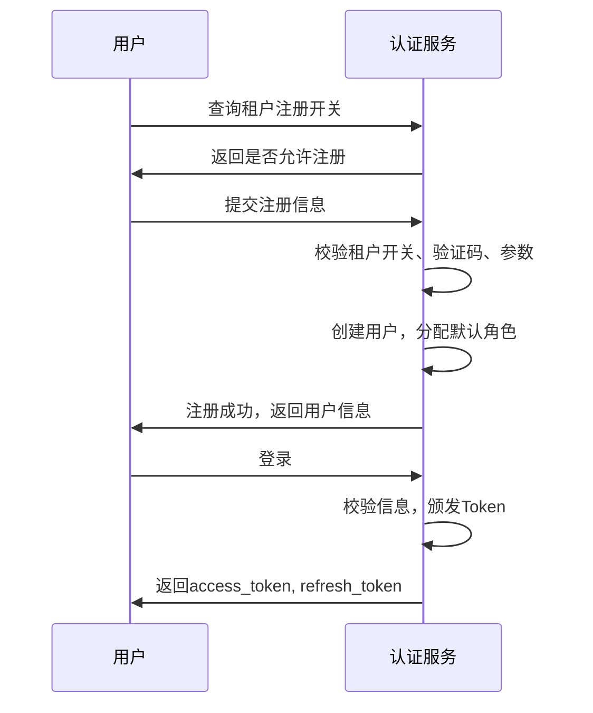
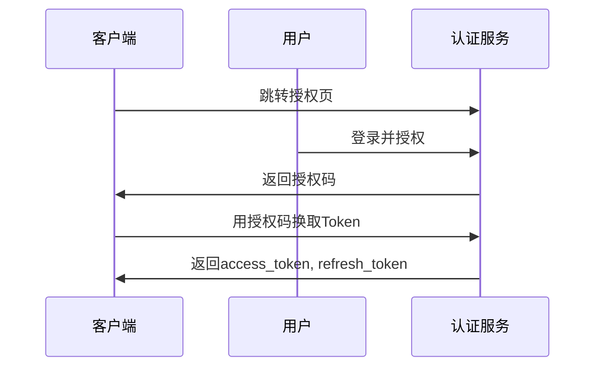

# 认证服务（Auth Service）架构设计

## 一、系统定位

认证服务是平台的统一身份认证与授权中心，负责用户登录、Token 颁发、校验、OAuth2 授权、权限控制等。为所有微服务提供安全、标准的认证能力，支持 JWT、OAuth2 等主流协议，并支持多种认证方式和租户级注册开关。

---

## 术语表
| 名称         | 说明                                                         |
|--------------|--------------------------------------------------------------|
| 用户         | 需要认证的身份主体                                           |
| 客户端       | 访问认证服务的应用（如 Web、App、第三方系统）               |
| Token        | 访问令牌，JWT 格式                                           |
| Refresh Token| 用于刷新 Access Token 的长效令牌                             |
| OAuth2       | 开放授权协议，支持第三方应用接入                             |
| JWT          | JSON Web Token，标准的无状态令牌格式                         |
| 授权码       | OAuth2 授权流程中的临时凭证                                 |
| 租户         | 平台的逻辑隔离单元，支持注册开关                             |

---

## 二、核心职责

1. 用户认证：支持用户名密码、短信、邮箱、支付宝、微信、阿里云等多种认证方式。
2. Token 颁发与校验：颁发 JWT Access Token、Refresh Token，支持 Token 校验与续签。
3. OAuth2 授权：支持标准 OAuth2 授权码、密码、客户端等授权模式。
4. 权限控制：集成 Spring Security，支持基于角色/权限的访问控制。
5. 用户注册：支持多方式注册，按租户配置是否开放注册。
6. 单点登录（SSO）：支持多系统统一认证。
7. 安全审计：记录登录、登出、Token 操作等安全事件。

---

## 三、技术选型

- 语言与框架：Java 21+，Spring Boot 3.x，Spring Security 6.x
- 认证协议：JWT、OAuth2（Spring Authorization Server）
- 存储：PostgreSQL / Redis（存储 Refresh Token、验证码、黑名单等）
- 加密：BCrypt 密码加密
- 依赖：spring-boot-starter-security, spring-authorization-server, spring-data-redis, jjwt

---

## 四、领域模型

### 1. 实体及字段说明

#### User（用户）
| 字段         | 类型    | 说明         | 必填 |
|--------------|---------|--------------|------|
| user_id      | String  | 主键         | 是   |
| tenant_id    | String  | 所属租户     | 是   |
| username     | String  | 用户名       | 是   |
| password     | String  | 加密密码     | 是   |
| status       | String  | 状态（启用/禁用） | 是   |
| email        | String  | 邮箱         | 否   |
| phone        | String  | 手机号       | 否   |

#### Client（客户端）
| 字段         | 类型    | 说明         | 必填 |
|--------------|---------|--------------|------|
| client_id    | String  | 客户端ID     | 是   |
| client_secret| String  | 客户端密钥   | 是   |
| redirect_uri | String  | 回调地址     | 是   |
| scopes       | String  | 授权范围     | 是   |
| grant_types  | String  | 授权类型     | 是   |

#### Token（令牌）
| 字段         | 类型    | 说明         | 必填 |
|--------------|---------|--------------|------|
| token        | String  | JWT Token    | 是   |
| user_id      | String  | 用户ID       | 是   |
| client_id    | String  | 客户端ID     | 是   |
| expires_at   | DateTime| 过期时间     | 是   |
| type         | String  | access/refresh| 是   |

#### Tenant（租户）
| 字段         | 类型    | 说明         | 必填 |
|--------------|---------|--------------|------|
| tenant_id    | String  | 主键         | 是   |
| name         | String  | 租户名称     | 是   |
| allow_register | Boolean | 是否允许注册 | 是   |

---

### 2. 关联关系
- 用户与 Token：一对多
- 客户端与 Token：一对多
- 租户与用户：一对多

---

## 五、认证与注册方式

### 1. 用户名密码登录
- POST /api/v1/auth/login
- 参数：username, password

### 2. 短信验证码登录
- POST /api/v1/auth/sms/send
- POST /api/v1/auth/sms/login
- 参数：phone, sms_code

### 3. 邮箱验证码登录
- POST /api/v1/auth/email/send
- POST /api/v1/auth/email/login
- 参数：email, email_code

### 4. 支付宝/微信/阿里云登录（OAuth2）
- GET /api/v1/auth/alipay/authorize, /wechat/authorize, /aliyun/authorize
- GET /api/v1/auth/alipay/callback, /wechat/callback, /aliyun/callback

### 5. 用户注册（支持多方式，按租户开关）
- POST /api/v1/auth/register
- 参数：tenant_id, username, password, email, phone, sms_code, email_code
- 注册前先校验租户 allow_register 配置

### 6. 查询/配置租户注册开关
- GET /api/v1/tenants/{tenantId}/register-enabled
- PUT /api/v1/tenants/{tenantId}/register-enabled

---

## 六、统一错误码设计
| code      | message           | 说明                     |
|-----------|-------------------|--------------------------|
| 0         | success           | 成功                     |
| 40001     | invalid_param     | 参数错误                 |
| 40101     | unauthorized      | 未认证/Token无效         |
| 40301     | forbidden         | 没有权限/注册关闭        |
| 40401     | not_found         | 资源不存在               |
| 50001     | internal_error    | 服务器内部错误           |

- 所有接口返回格式：
  ```json
  { "code": 0, "message": "success", "data": { ... } }
  ```

---

## 七、接口安全与权限说明
- 所有接口默认需认证（除注册、登录、授权码获取等开放接口）。
- 采用 Spring Security + JWT/OAuth2 统一认证，Token 需通过 Authorization: Bearer <token> 头部传递。
- 支持基于角色/权限的访问控制（如 @PreAuthorize）。
- Token 黑名单、过期、刷新等安全机制完善。
- 注册、验证码等接口需防刷、限流。

---

## 八、典型业务流程图

### 用户注册与登录


### 第三方登录（以支付宝为例）


---

## 九、数据库表结构（简化版）
- users (user_id, tenant_id, username, password, status, email, phone)
- clients (client_id, client_secret, redirect_uri, scopes, grant_types)
- tokens (token, user_id, client_id, expires_at, type)
- tenants (tenant_id, name, allow_register)
- token_blacklist (token, expires_at)
- sms_code (phone, code, expires_at)
- email_code (email, code, expires_at)

---

## 十、代码组织结构
```
auth-serve/
└── src/main/java/com/aixone/auth/
    ├── user/
    ├── client/
    ├── token/
    ├── tenant/
    ├── security/   // Spring Security 配置
    ├── controller/ // REST API
    ├── service/    // 业务逻辑
    └── AuthServeApplication.java
```

---

## 十一、研发计划与执行步骤

### 1. 当前实现情况总结
- 已集成 Spring Security、Spring Authorization Server。
- 支持 JWT Token 颁发与校验，基础 OAuth2 流程。
- 用户、客户端、Token、租户持久化已实现。
- 基础 REST API 已具备，支持多认证方式、注册、刷新、登出等。

### 2. 开发流程与执行清单
- [ ] 完善多认证方式与注册流程
- [ ] 实现租户注册开关配置与校验
- [ ] 补充单元测试、集成测试
- [ ] 完善接口文档与错误码
- [ ] 安全加固（如防爆破、验证码、IP 限流等）

### 3. 注意事项与建议
- 认证服务需与目录服务、用户中心等解耦，接口标准化。
- 重点关注 Token 安全、权限边界、接口幂等性。
- 及时同步文档与代码，便于团队协作和后续扩展。

> 本研发计划作为后续开发的唯一执行清单，建议每完成一项及时勾选并同步文档进度。
