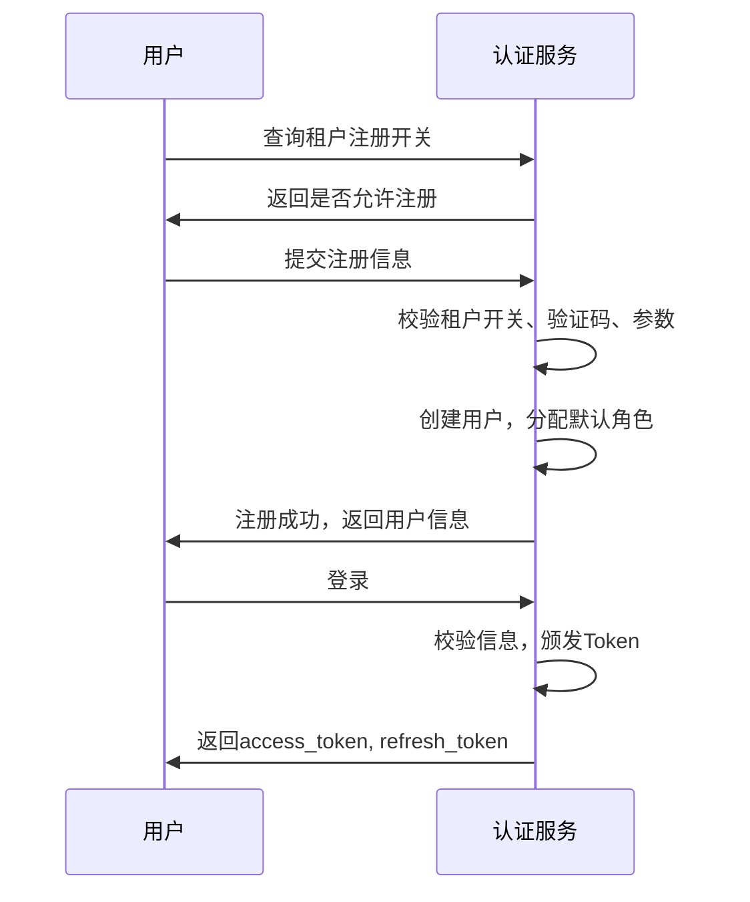
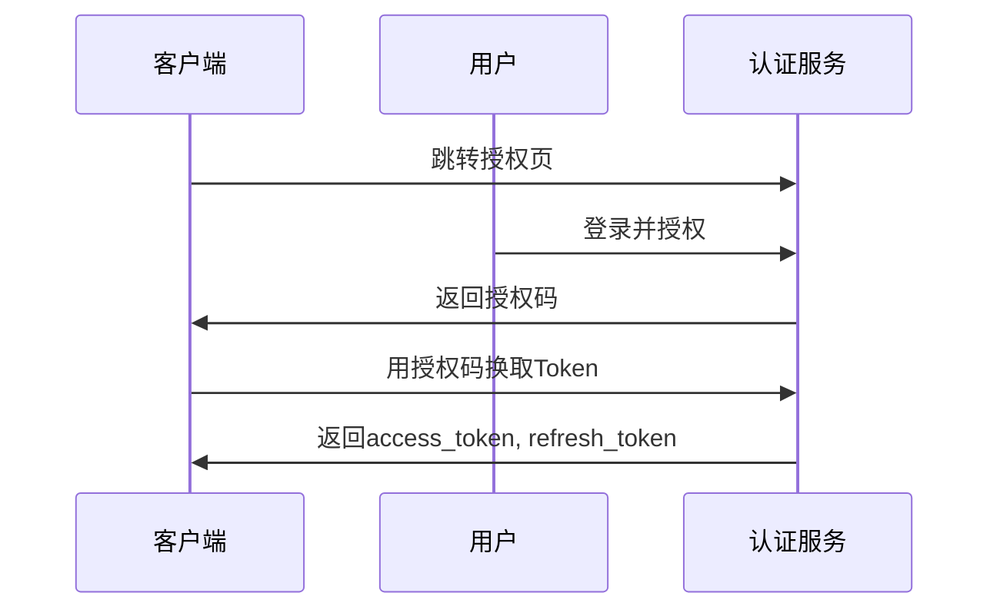
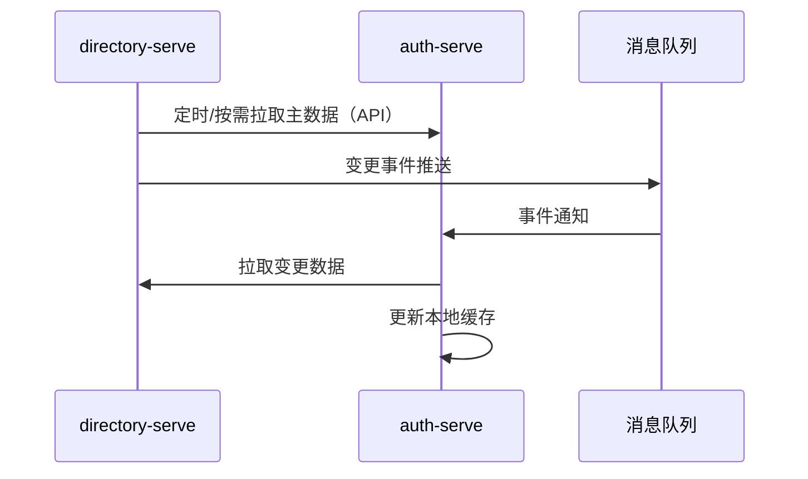
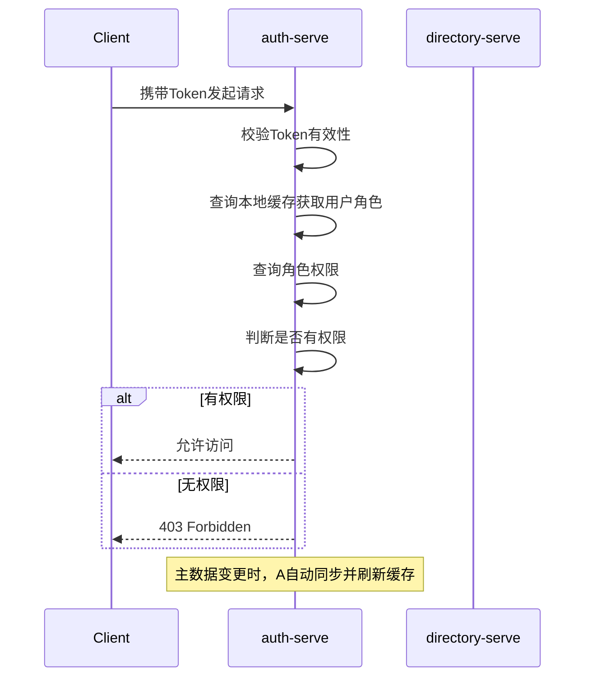
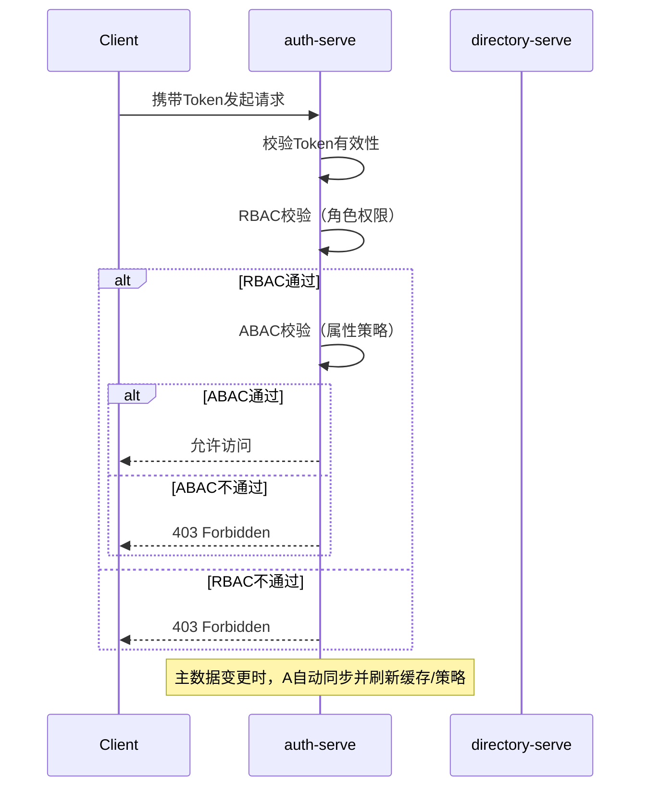

# 认证服务（Auth Service）架构设计

## 一、系统定位

认证服务是平台的统一身份认证与授权中心，负责用户登录、Token 颁发、校验、OAuth2 授权、权限控制等。为所有微服务提供安全、标准的认证能力，支持 JWT、OAuth2 等主流协议，并支持多种认证方式和租户级注册开关。

---

## 术语表
| 名称         | 说明                                                         |
|--------------|--------------------------------------------------------------|
| 用户         | 需要认证的身份主体                                           |
| 客户端       | 访问认证服务的应用（如 Web、App、第三方系统）               |
| Token        | 访问令牌，JWT 格式                                           |
| Refresh Token| 用于刷新 Access Token 的长效令牌                             |
| OAuth2       | 开放授权协议，支持第三方应用接入                             |
| JWT          | JSON Web Token，标准的无状态令牌格式                         |
| 授权码       | OAuth2 授权流程中的临时凭证                                 |
| 租户         | 平台的逻辑隔离单元，支持注册开关                             |

---

## 二、核心职责

1. 用户认证：支持用户名密码、短信、邮箱、支付宝、微信、阿里云等多种认证方式。
2. Token 颁发与校验：颁发 JWT Access Token、Refresh Token，支持 Token 校验与续签。
3. OAuth2 授权：支持标准 OAuth2 授权码、密码、客户端等授权模式。
4. 权限控制：集成 Spring Security，支持基于角色/权限的访问控制。
5. 用户注册：支持多方式注册，按租户配置是否开放注册。
6. 单点登录（SSO）：支持多系统统一认证。
7. 安全审计：记录登录、登出、Token 操作等安全事件。

---

## 三、技术选型

- 语言与框架：Java 21+，Spring Boot 3.x，Spring Security 6.x
- 认证协议：JWT、OAuth2（Spring Authorization Server）
- 存储：PostgreSQL / Redis（存储 Refresh Token、验证码、黑名单等）
- 加密：BCrypt 密码加密
- 依赖：spring-boot-starter-security, spring-authorization-server, spring-data-redis, jjwt

---

## 四、领域模型

### 1. 实体及字段说明

#### User（用户）
| 字段         | 类型    | 说明         | 必填 |
|--------------|---------|--------------|------|
| user_id      | String  | 主键         | 是   |
| tenant_id    | String  | 所属租户     | 是   |
| username     | String  | 用户名       | 是   |
| password     | String  | 加密密码     | 是   |
| status       | String  | 状态（启用/禁用） | 是   |
| email        | String  | 邮箱         | 否   |
| phone        | String  | 手机号       | 否   |

#### Client（客户端）
| 字段         | 类型    | 说明         | 必填 |
|--------------|---------|--------------|------|
| client_id    | String  | 客户端ID     | 是   |
| client_secret| String  | 客户端密钥   | 是   |
| redirect_uri | String  | 回调地址     | 是   |
| scopes       | String  | 授权范围     | 是   |
| grant_types  | String  | 授权类型     | 是   |

#### Token（令牌）
| 字段         | 类型    | 说明         | 必填 |
|--------------|---------|--------------|------|
| token        | String  | JWT Token    | 是   |
| user_id      | String  | 用户ID       | 是   |
| client_id    | String  | 客户端ID     | 是   |
| expires_at   | DateTime| 过期时间     | 是   |
| type         | String  | access/refresh| 是   |

#### Tenant（租户）
| 字段         | 类型    | 说明         | 必填 |
|--------------|---------|--------------|------|
| tenant_id    | String  | 主键         | 是   |
| name         | String  | 租户名称     | 是   |
| allow_register | Boolean | 是否允许注册 | 是   |

---

### 2. 关联关系
- 用户与 Token：一对多
- 客户端与 Token：一对多
- 租户与用户：一对多

---

## 五、认证与注册方式

### 1. 用户名密码登录
- POST /api/v1/auth/login
- 参数：username, password

### 2. 短信验证码登录
- POST /api/v1/auth/sms/send
- POST /api/v1/auth/sms/login
- 参数：phone, sms_code

### 3. 邮箱验证码登录
- POST /api/v1/auth/email/send
- POST /api/v1/auth/email/login
- 参数：email, email_code

### 4. 支付宝/微信/阿里云登录（OAuth2）
- GET /api/v1/auth/alipay/authorize, /wechat/authorize, /aliyun/authorize
- GET /api/v1/auth/alipay/callback, /wechat/callback, /aliyun/callback

### 5. 用户注册（支持多方式，按租户开关）
- POST /api/v1/auth/register
- 参数：tenant_id, username, password, email, phone, sms_code, email_code
- 注册前先校验租户 allow_register 配置

### 6. 查询/配置租户注册开关
- GET /api/v1/tenants/{tenantId}/register-enabled
- PUT /api/v1/tenants/{tenantId}/register-enabled

---

## 六、统一错误码设计
| code      | message           | 说明                     |
|-----------|-------------------|--------------------------|
| 0         | success           | 成功                     |
| 40001     | invalid_param     | 参数错误                 |
| 40101     | unauthorized      | 未认证/Token无效         |
| 40301     | forbidden         | 没有权限/注册关闭        |
| 40401     | not_found         | 资源不存在               |
| 50001     | internal_error    | 服务器内部错误           |

- 所有接口返回格式：
  ```json
  { "code": 0, "message": "success", "data": { ... } }
  ```

---

## 七、接口安全与权限说明
- 所有接口默认需认证（除注册、登录、授权码获取等开放接口）。
- 采用 Spring Security + JWT/OAuth2 统一认证，Token 需通过 Authorization: Bearer <token> 头部传递。
- 支持基于角色/权限的访问控制（如 @PreAuthorize）。
- Token 黑名单、过期、刷新等安全机制完善。
- 注册、验证码等接口需防刷、限流。

---

## 八、典型业务流程图

### 用户注册与登录


### 第三方登录（以支付宝为例）


---

## 九、数据库表结构（简化版）
- users (user_id, tenant_id, username, password, status, email, phone)
- clients (client_id, client_secret, redirect_uri, scopes, grant_types)
- tokens (token, user_id, client_id, expires_at, type)
- tenants (tenant_id, name, allow_register)
- token_blacklist (token, expires_at)
- sms_code (phone, code, expires_at)
- email_code (email, code, expires_at)

---

## 十、代码组织结构
```
auth-serve/
└── src/main/java/com/aixone/auth/
    ├── user/
    ├── client/
    ├── token/
    ├── tenant/
    ├── security/   // Spring Security 配置
    ├── controller/ // REST API
    ├── service/    // 业务逻辑
    └── AuthServeApplication.java
```

---

## 十一、研发计划与执行步骤

### 1. 当前实现情况总结
- 已集成 Spring Security、Spring Authorization Server。
- 支持 JWT Token 颁发与校验，基础 OAuth2 流程。
- 用户、客户端、Token、租户持久化已实现。
- 基础 REST API 已具备，支持多认证方式、注册、刷新、登出等。

### 2. 开发流程与执行清单
- [ ] 完善多认证方式与注册流程
- [ ] 实现租户注册开关配置与校验
- [ ] 补充单元测试、集成测试
- [ ] 完善接口文档与错误码
- [ ] 安全加固（如防爆破、验证码、IP 限流等）

### 3. 注意事项与建议
- 认证服务需与目录服务、用户中心等解耦，接口标准化。
- 重点关注 Token 安全、权限边界、接口幂等性。
- 及时同步文档与代码，便于团队协作和后续扩展。

> 本研发计划作为后续开发的唯一执行清单，建议每完成一项及时勾选并同步文档进度。

---

## 十二、用户、角色主数据归属与协作

平台采用"主数据中心+认证授权中心"分层设计：

- **directory-serve** 负责用户、角色、组织等身份主数据的唯一事实来源（Source of Truth），包括用户、角色、用户-角色关系、组织结构等的增删改查和关系维护。
- **auth-serve** 只做只读引用和本地缓存，专注于认证、Token、OAuth2、权限校验等。

### 协作方式
- auth-serve 通过API/消息机制从 directory-serve 拉取主数据，进行权限校验和认证。
- 主数据变更通过事件/消息队列等机制同步，保证数据一致性。

### 设计优势
- 主数据唯一，权限逻辑解耦，便于扩展和维护。
- 支持未来多系统、多租户、复杂权限模型的演进。

> 该分工模式可保证平台用户、角色等身份信息的一致性和权限校验的高效性。

### 细化落地方案

#### 1. 主数据同步机制
- auth-serve 定期或按需通过 RESTful API/gRPC 从 directory-serve 拉取用户、角色、用户-角色关系等主数据。
- 支持增量同步（如按更新时间、租户分片），减少同步压力。
- 订阅 directory-serve 的变更事件（如 Kafka、RabbitMQ），实现准实时同步。

#### 2. 典型接口调用
- 拉取用户变更：`GET /api/v1/users?updated_after=2024-01-01T00:00:00Z`
- 拉取角色：`GET /api/v1/roles?tenant_id=xxx`
- 查询用户角色：`GET /api/v1/user-roles?user_id=xxx`

#### 3. 事件订阅与处理
- 监听 UserChanged、RoleChanged、UserRoleChanged 等事件。
- 收到事件后，自动拉取变更数据并更新本地缓存。

#### 4. 缓存与一致性
- 本地缓存主数据，提升权限校验性能。
- 通过事件驱动和定时同步，保证缓存与主数据一致。
- 支持缓存失效和强制刷新机制。

#### 5. 安全与接口规范
- 主数据接口需鉴权，防止越权。
- 事件需包含变更类型、时间、主键等关键信息。

#### 6. 协作流程图


> 通过上述机制，auth-serve 可高效、可靠地进行权限校验，确保主数据一致性和平台安全性。

---

## 十三、角色与权限校验逻辑

### 1. 权限模型
- 采用基于角色的访问控制（RBAC），支持后续扩展更细粒度的权限模型（如资源级、操作级）。
- 用户与角色、角色与权限的绑定关系均以 directory-serve 主数据为准。
- 权限可按租户、系统、资源、操作等维度灵活配置。

### 2. 本地缓存与同步
- auth-serve 定期/事件驱动同步 directory-serve 的用户、角色、用户-角色、角色-权限等主数据。
- 本地缓存结构：
  - 用户ID -> 角色列表
  - 角色ID -> 权限列表
- 缓存失效/刷新机制：
  - 监听主数据变更事件，自动刷新相关缓存
  - 支持手动/定时全量刷新

### 3. 权限校验流程
1. 用户请求带上 Token（JWT），auth-serve 解析 Token 获取 user_id、租户、角色等信息。
2. 校验 Token 有效性（签名、过期、黑名单等）。
3. 查询本地缓存，获取用户的角色列表。
4. 根据请求资源、操作，查找所需权限。
5. 判断用户角色是否具备所需权限。
6. 校验通过则放行，否则返回 403 Forbidden。

### 4. 典型伪代码
```java
// 校验用户是否有权限访问某资源
boolean checkPermission(String userId, String resource, String action) {
    List<String> roles = userRoleCache.get(userId);
    for (String role : roles) {
        List<String> permissions = rolePermissionCache.get(role);
        if (permissions.contains(resource + ":" + action)) {
            return true;
        }
    }
    return false;
}
```

### 5. 异常与边界处理
- 用户、角色、权限等主数据未同步时，返回 503 Service Unavailable 或降级处理。
- Token 失效、黑名单、权限变更等场景，及时刷新缓存并强制用户重新认证。
- 支持接口幂等性、权限变更实时生效。

### 6. 安全与审计
- 所有权限校验操作均记录审计日志，便于追踪和合规。
- 支持权限变更、异常操作的告警与监控。

### 7. 流程图


> 通过上述机制，auth-serve 可实现高效、可靠、可扩展的角色与权限校验能力，保障平台安全。

---

## 十四、RBAC+ABAC混合权限模型

### 1. 模型原理
- **RBAC（基于角色的访问控制）**：用户通过角色获得基础权限，适合大部分通用权限场景，结构清晰、易于管理。
- **ABAC（基于属性的访问控制）**：权限决策基于用户、资源、环境等多维属性和策略表达式，支持细粒度、动态、上下文相关的权限需求。
- **混合模型**：先用RBAC判定用户是否具备基础访问权限，再用ABAC策略进行更细粒度的动态校验。

### 2. 权限决策流程
1. **RBAC校验**：判断用户是否具备访问资源的基础角色权限。
2. **ABAC校验**：在RBAC通过后，进一步根据请求上下文、资源属性、环境属性等，应用ABAC策略表达式进行判定。
3. **最终决策**：两者都通过才允许访问，否则拒绝。

### 3. 典型ABAC策略示例
- 用户属性：部门、岗位、级别、标签
- 资源属性：归属租户、敏感级别、创建人
- 环境属性：请求IP、时间、设备类型
- 策略表达式示例：
  - 用户部门=资源部门 且 访问时间在9-18点 且 资源敏感级别<2
  - 用户级别>=资源要求级别

### 4. 伪代码示例
```java
boolean checkAccess(User user, Resource resource, Action action, Context ctx) {
    // 1. RBAC校验
    if (!rbacService.hasRolePermission(user, resource, action)) {
        return false;
    }
    // 2. ABAC校验
    if (!abacService.evaluate(user, resource, action, ctx)) {
        return false;
    }
    return true;
}
```

### 5. 架构设计建议
- 主数据（用户、角色、资源、属性）由 directory-serve 维护，auth-serve 拉取并缓存。
- 权限决策引擎支持RBAC+ABAC组合判定，可内嵌于auth-serve或独立部署。
- 策略管理支持表达式配置、热更新（如数据库、配置中心、策略DSL等）。
- 审计与监控：记录每次权限决策的详细上下文，便于追溯和合规。

### 6. 行业参考
- 阿里云、AWS、Google Cloud等主流云平台均采用RBAC+ABAC混合模型，兼顾企业级权限管理和灵活的细粒度控制。

### 7. 流程图


> 通过RBAC+ABAC混合模型，平台可实现既规范又灵活的权限体系，满足复杂业务和安全合规需求。
