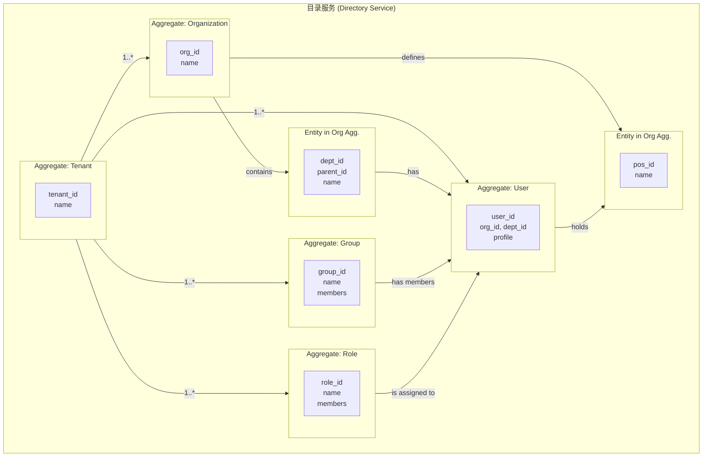

# 目录服务（Directory Service）架构设计

## 一、系统定位

目录服务是平台的核心基础服务之一，负责管理平台内的所有身份实体及其结构关系。它遵循单一职责原则，作为 **租户（Tenant）、组织（Organization）、部门（Department）、岗位（Position）、用户（User）、群组（Group）、角色（Role）** 等核心实体信息的唯一事实来源（Source of Truth）。

### 1.1 核心职责

1.  **租户管理**: 负责租户的生命周期。
2.  **组织与身份管理**:
    *   管理 **组织（Organization）**、**部门（Department）** 的层级结构。
    *   管理 **岗位（Position）** 体系。
    *   管理 **用户（User）** 档案及其在组织内的归属。
3.  **协作与权限结构管理**:
    *   管理跨部门的 **群组（Group）** 及其成员。
    *   管理 **角色（Role）** 及其成员，为授权服务提供结构基础。
4.  **凭证管理**: 安全地存储用户凭证，供认证服务调用。

### 1.2 功能边界
- **不包含**：实时用户认证、具体业务操作权限检查。

## 二、技术栈选择
-   **语言与框架**: Java 21+, Spring Boot 3.x
-   **存储**: PostgreSQL / MySQL
-   **多租户策略**: 基于 `tenant_id` 的数据隔离方案。

## 三、架构设计

### 3.1 领域模型关系图


### 3.2 技术架构图 (分层架构)
(与之前版本一致，保持 Interfaces -> Application -> Domain -> Infrastructure 的分层结构)

## 四、接口层设计 (API)

### 4.1 租户管理 (Tenant)
- `POST /api/v1/tenants`: 创建租户

### 4.2 组织管理 (Organization & related)
- `POST /api/v1/tenants/{tenantId}/organizations`: 创建组织
- `GET /api/v1/tenants/{tenantId}/organizations/{orgId}`: 获取组织信息
- **部门**: `POST /.../{orgId}/departments`
- **岗位**: `POST /.../{orgId}/positions`

### 4.3 用户管理 (User)
- `POST /api/v1/tenants/{tenantId}/users`: 创建用户
- `PUT /.../users/{userId}/assignment`: 分配用户的组织、部门、岗位
- `GET /internal/.../users/credentials/{email}`: 内部凭证接口

### 4.4 群组管理 (Group)
- `POST /api/v1/tenants/{tenantId}/groups`: 创建群组
- `POST /.../groups/{groupId}/members`: 添加成员

### 4.5 角色管理 (Role)
- `POST /api/v1/tenants/{tenantId}/roles`: 创建角色
- `POST /.../roles/{roleId}/members`: 分配角色给用户

## 五、领域层设计

目录服务的领域模型围绕几个核心聚合构建，它们之间的关系定义了整个身份与组织的结构。

1.  **Organization Aggregate**:
    *   **职责**: 作为组织结构的根，管理其下的 **部门（Department）** 和 **岗位（Position）**。
    *   **关系**:
        *   一个组织包含一个树状的部门层级结构。`Department` 是其内部实体。
        *   一个组织定义了一套岗位体系。`Position` 是其内部实体。
    *   **不变量**: 确保部门和岗位在其组织内是唯一的。

2.  **User Aggregate**:
    *   **职责**: 管理用户的个人档案（Profile）和凭证信息。
    *   **关系**:
        *   **与组织/部门/岗位的关系**: 用户通过 `orgId`, `deptId`, `posId` 等外键关联到其所属的组织、部门和岗位。这是一种松散耦合，用户聚合本身不直接管理组织对象。一个用户必须属于一个组织和一个部门，并且可以担任一个或多个岗位（初期简化为担任一个岗位）。
        *   **与群组和角色的关系**: 用户与群组、角色的关系通过独立的关联表（如 `group_members`, `user_roles`）在各自的聚合中管理，而不是在用户聚合内部。这遵循了聚合设计的最佳实践，即只通过ID引用其他聚合。

3.  **Group Aggregate**:
    *   **职责**: 管理一个协作群组及其成员列表。
    *   **关系**:
        *   群组通过一个 `memberIds` 列表（`List<UUID>`）来引用其包含的 `User` 聚合。这是一个多对多的关系。

4.  **Role Aggregate**:
    *   **职责**: 定义一个权限角色及其被赋予该角色的用户列表。
    *   **关系**:
        *   角色通过一个 `memberIds` 列表来引用其包含的 `User` 聚合。这是一个多对多的关系，为授权服务提供了判断依据。

## 六、基础设施层设计 (数据库 Schema)

-   `tenants`: (tenant_id, name, ...)
-   `organizations`: (org_id, tenant_id, name, ...)
-   `departments`: (dept_id, tenant_id, org_id, name, parent_dept_id, ...)
-   `positions`: (pos_id, tenant_id, org_id, name, ...)
-   `users`: (user_id, tenant_id, org_id, dept_id, pos_id, ...)
-   `groups`: (group_id, tenant_id, name, ...)
-   `group_members`: (group_id, user_id)
-   `roles`: (role_id, tenant_id, name, ...)
-   `user_roles`: (user_id, role_id)

## 七、代码组织结构 (Package-by-Feature)
```
directory-serve/
└── src/main/com/aixone/directory/
    ├── tenant/
    ├── user/
    ├── organization/  (包含 Department, Position)
    ├── group/
    ├── role/
    └── DirectoryServeApplication.java
```

## 八、后续规划
- **P0**: 实现租户、组织、用户核心 CRUD。
- **P1**: 实现部门、岗位、群组、角色的完整管理。
- **P2**: 集成事件总线，实现跨服务数据同步。
