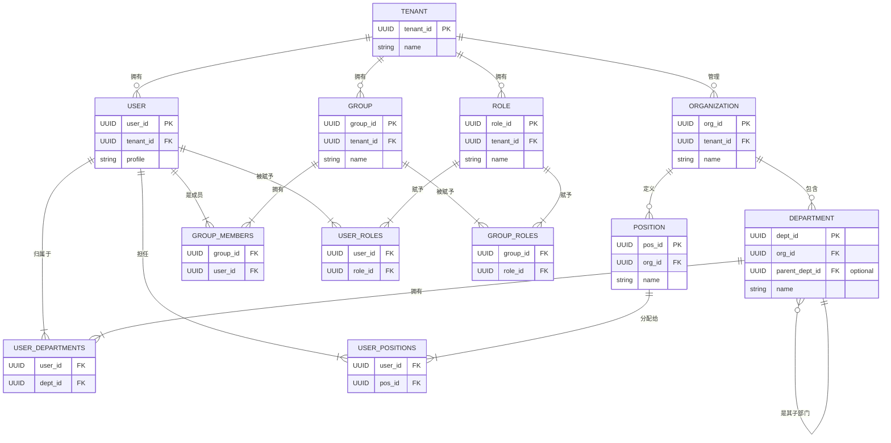

# 目录服务（Directory Service）架构设计

## 一、系统定位

目录服务是平台的核心基础服务之一，负责管理平台内的所有身份实体及其结构关系。它遵循单一职责原则，作为 **租户（Tenant）、组织（Organization）、部门（Department）、岗位（Position）、用户（User）、群组（Group）、角色（Role）** 等核心实体信息的唯一事实来源（Source of Truth）。

### 1.1 核心职责

1.  **租户管理**: 负责租户的生命周期。
2.  **组织与身份管理**:
    *   管理 **组织（Organization）**、**部门（Department）** 的层级结构。
    *   管理 **岗位（Position）** 体系。
    *   管理 **用户（User）** 档案及其在组织内的归属关系（部门、岗位）。
3.  **协作与权限结构管理**:
    *   管理跨部门的 **群组（Group）** 及其成员。
    *   管理 **角色（Role）** 及其与用户、群组的分配关系，为授权服务提供结构基础。
4.  **凭证管理**: 安全地存储用户凭证，供认证服务调用。

### 1.2 功能边界
- **不包含**：实时用户认证、具体业务操作权限检查。

## 二、技术栈选择
-   **语言与框架**: Java 21+, Spring Boot 3.x
-   **存储**: PostgreSQL / MySQL
-   **多租户策略**: 基于 `tenant_id` 的数据隔离方案。

## 三、架构设计

### 3.1 领域实体关系图 (ERD)
为了更清晰地展示实体间的关系，我们采用ER图进行建模。核心关系如下：
- **用户** 可以属于多个 **部门**，并担任多个 **岗位** (多对多)。
- **角色** 不仅可以分配给 **用户**，也可以分配给 **群组**。群组成员将继承群组的角色。



### 3.2 技术架构图 (分层架构)
(与之前版本一致，保持 Interfaces -> Application -> Domain -> Infrastructure 的分层结构)

## 四、接口层设计 (API)

### 4.1 租户管理 (Tenant)
- `POST /api/v1/tenants`: 创建租户

### 4.2 组织管理 (Organization & related)
- `POST /api/v1/tenants/{tenantId}/organizations`: 创建组织
- `GET /api/v1/tenants/{tenantId}/organizations/{orgId}`: 获取组织信息
- **部门**: `POST /.../{orgId}/departments`
- **岗位**: `POST /.../{orgId}/positions`
- **用户部门关系**: `POST /.../users/{userId}/departments`
- **用户岗位关系**: `POST /.../users/{userId}/positions`

### 4.3 用户管理 (User)
- `POST /api/v1/tenants/{tenantId}/users`: 创建用户
- `GET /.../users/{userId}`: 获取用户信息
- `PUT /.../users/{userId}`: 更新用户基本信息
- `GET /internal/.../users/credentials/{email}`: 内部凭证接口

### 4.4 群组管理 (Group)
- `POST /api/v1/tenants/{tenantId}/groups`: 创建群组
- `POST /.../groups/{groupId}/members`: 添加成员
- `DELETE /.../groups/{groupId}/members/{userId}`: 移除成员
- `GET /.../groups/{groupId}/members`: 查看群组成员

### 4.5 角色管理 (Role)
- `POST /api/v1/tenants/{tenantId}/roles`: 创建角色
- `POST /.../roles/{roleId}/users`: 分配角色给用户
- `POST /.../roles/{roleId}/groups`: 分配角色给群组

## 五、领域层设计

目录服务的领域模型围绕几个核心聚合构建，它们之间的关系定义了整个身份与组织的结构。关系的管理通过独立的关联实体（或值对象列表）实现，遵循领域驱动设计的最佳实践。

1.  **Organization Aggregate**:
    *   **职责**: 作为组织结构的根，管理其下的 **部门（Department）** 和 **岗位（Position）**。
    *   **关系**:
        *   一个组织包含一个树状的部门层级结构。`Department` 是其内部实体。
        *   一个组织定义了一套岗位体系。`Position` 是其内部实体。
    *   **不变量**: 确保部门和岗位在其组织内是唯一的。

2.  **User Aggregate**:
    *   **职责**: 管理用户的个人档案（Profile）和凭证信息。
    *   **关系**:
        *   **与组织结构的关系**: 用户与部门、岗位的关系是多对多的，通过独立的关联表（如 `user_departments`, `user_positions`）进行管理。User 聚合本身不直接持有部门或岗位的集合，而是通过ID引用。用户的组织归属感可以通过其所属的部门来推断。
        *   **与群组和角色的关系**: 同样是多对多的关系，通过 `group_members` 和 `user_roles` 这样的关联表在各自的聚合中管理。

3.  **Group Aggregate**:
    *   **职责**: 管理一个协作群组及其成员列表和所拥有的角色列表。
    *   **关系**:
        *   通过 `memberIds` 列表（`List<UUID>`）引用其包含的 `User` 聚合。
        *   通过 `roleIds` 列表（`List<UUID>`）引用其被赋予的 `Role` 聚合。

4.  **Role Aggregate**:
    *   **职责**: 定义一个权限角色。它本身不管理成员，而是被用户和群组所引用。
    *   **关系**:
        *   角色与用户、群组的关系是多对多的。查询一个角色的所有成员时，需要同时查询直接关联的用户和关联群组下的所有用户。

## 六、基础设施层设计 (数据库 Schema)

-   `tenants`: (tenant_id, name, ...)
-   `organizations`: (org_id, tenant_id, name, ...)
-   `departments`: (dept_id, tenant_id, org_id, name, parent_dept_id, ...)
-   `positions`: (pos_id, tenant_id, org_id, name, ...)
-   `users`: (user_id, tenant_id, profile, ...)  -- *移除了 org_id, dept_id, pos_id*
-   `groups`: (group_id, tenant_id, name, ...)
-   `roles`: (role_id, tenant_id, name, ...)
---
-   **关联表 (Join Tables):**
-   `user_departments`: (user_id, dept_id) -- *多对多关系*
-   `user_positions`: (user_id, pos_id) -- *多对多关系*
-   `group_members`: (group_id, user_id)
-   `user_roles`: (user_id, role_id)
-   `group_roles`: (group_id, role_id) -- *新增，用于角色与群组的多对多关系*

## 七、代码组织结构 (Package-by-Feature)
```
directory-serve/
└── src/main/com/aixone/directory/
    ├── tenant/
    ├── user/
    ├── organization/  (包含 Department, Position)
    ├── group/
    ├── role/
    └── DirectoryServeApplication.java
```

## 八、后续规划
- **P0**: 实现租户、组织、用户核心 CRUD。
- **P1**: 实现部门、岗位、群组、角色的完整管理。
- **P2**: 集成事件总线，实现跨服务数据同步。
