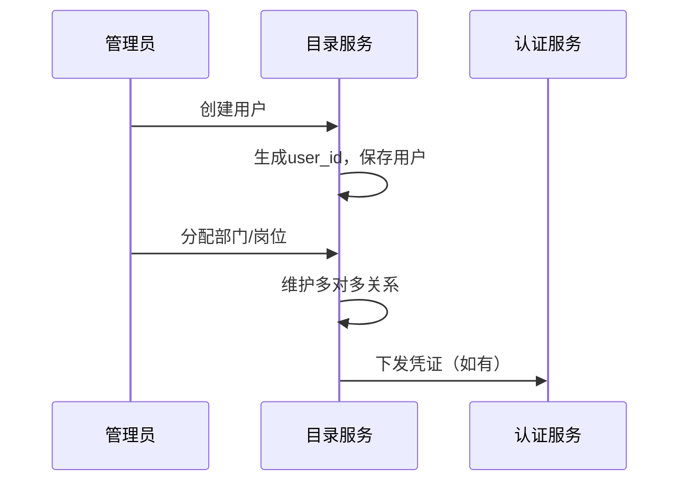
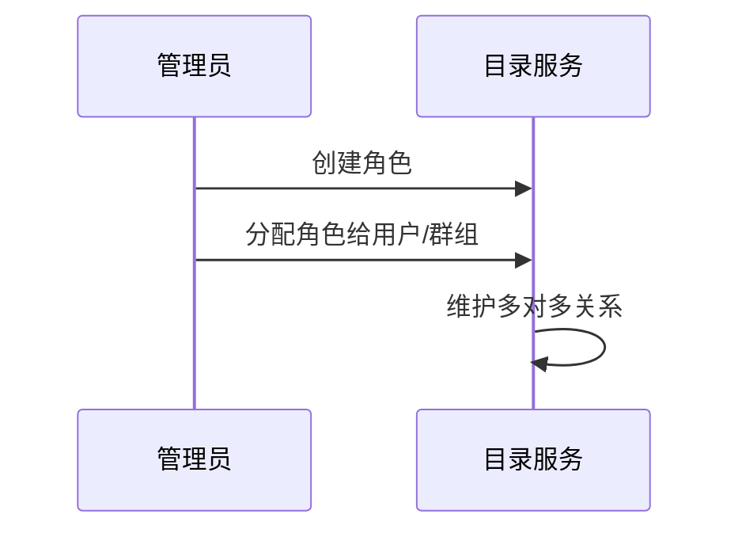
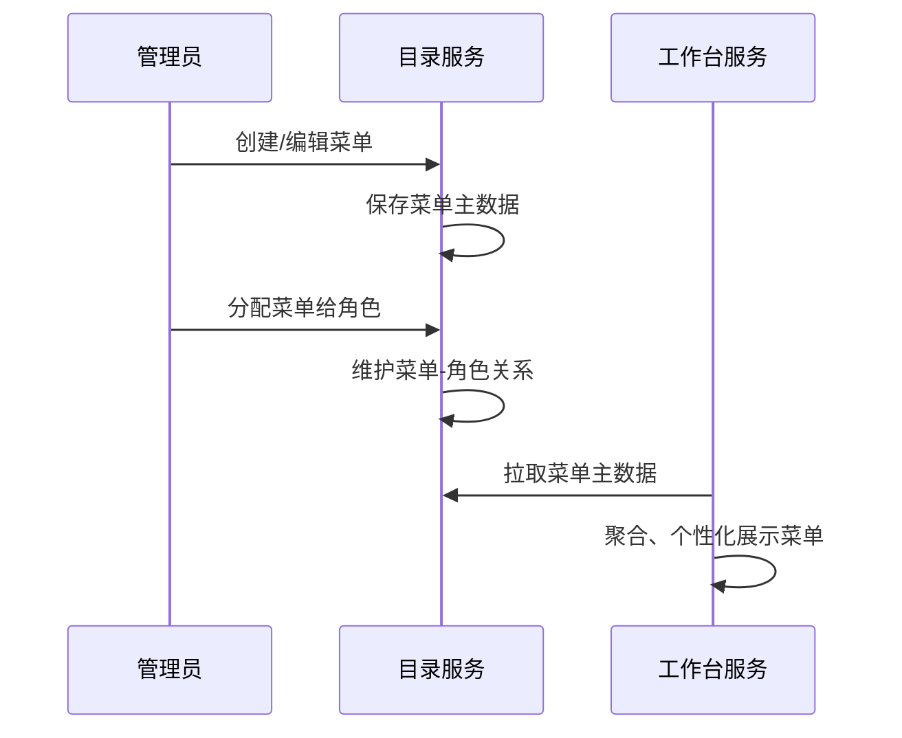

# 目录服务（Directory Service）架构设计（细化版）

## 一、系统定位

目录服务是平台的核心基础服务，负责管理平台内所有身份实体及其结构关系。它作为**租户（Tenant）、组织（Organization）、部门（Department）、岗位（Position）、用户（User）、群组（Group）、角色（Role）、菜单（Menu）**等核心实体信息的唯一事实来源（Source of Truth）。

---

## 术语表
| 名称       | 说明                                                         |
|------------|--------------------------------------------------------------|
| 租户       | 平台的逻辑隔离单元，通常对应一个企业或组织                   |
| 组织       | 租户下的业务实体，包含部门和岗位                             |
| 部门       | 组织的层级结构单元，可嵌套                                   |
| 岗位       | 组织内的职位体系                                             |
| 用户       | 平台的身份主体                                               |
| 群组       | 跨部门/组织的协作集合                                       |
| 角色       | 权限集合，可分配给用户或群组                                 |
| 菜单       | 平台功能导航与权限入口，支持多级结构、个性化配置             |

---

## 二、核心职责

1. **租户管理**：租户生命周期管理。
2. **组织与身份管理**：组织、部门、岗位、用户及其归属关系管理。
3. **协作与权限结构管理**：群组、角色及其分配关系管理。
4. **菜单主数据管理**：菜单结构、层级、与角色/权限的绑定关系管理，支持多租户、个性化扩展。
5. **凭证管理**：安全存储用户凭证，供认证服务调用。

---

## 三、技术选型

- **语言与框架**：Java 21+，Spring Boot 3.x
- **存储**：PostgreSQL / MySQL
- **多租户策略**：基于 `tenant_id` 的数据隔离

---

## 四、领域模型（细化菜单）

### 1. 实体（Entity）及字段说明

#### Tenant（租户）
| 字段         | 类型    | 说明         | 必填 |
|--------------|---------|--------------|------|
| tenant_id    | UUID    | 主键         | 是   |
| name         | String  | 租户名称     | 是   |

#### Organization（组织）
| 字段         | 类型    | 说明         | 必填 |
|--------------|---------|--------------|------|
| org_id       | UUID    | 主键         | 是   |
| tenant_id    | UUID    | 所属租户     | 是   |
| name         | String  | 组织名称     | 是   |

#### Department（部门）
| 字段         | 类型    | 说明         | 必填 |
|--------------|---------|--------------|------|
| dept_id      | UUID    | 主键         | 是   |
| org_id       | UUID    | 所属组织     | 是   |
| name         | String  | 部门名称     | 是   |
| parent_dept_id| UUID   | 上级部门     | 否   |

#### Position（岗位）
| 字段         | 类型    | 说明         | 必填 |
|--------------|---------|--------------|------|
| pos_id       | UUID    | 主键         | 是   |
| org_id       | UUID    | 所属组织     | 是   |
| name         | String  | 岗位名称     | 是   |

#### User（用户）
| 字段         | 类型    | 说明         | 必填 |
|--------------|---------|--------------|------|
| user_id      | UUID    | 主键         | 是   |
| tenant_id    | UUID    | 所属租户     | 是   |
| profile      | String  | 用户档案     | 是   |

#### Group（群组）
| 字段         | 类型    | 说明         | 必填 |
|--------------|---------|--------------|------|
| group_id     | UUID    | 主键         | 是   |
| tenant_id    | UUID    | 所属租户     | 是   |
| name         | String  | 群组名称     | 是   |

#### Role（角色）
| 字段         | 类型    | 说明         | 必填 |
|--------------|---------|--------------|------|
| role_id      | UUID    | 主键         | 是   |
| tenant_id    | UUID    | 所属租户     | 是   |
| name         | String  | 角色名称     | 是   |

#### Menu（菜单）
| 字段         | 类型    | 说明         | 必填 |
|--------------|---------|--------------|------|
| menu_id      | UUID    | 主键         | 是   |
| tenant_id    | UUID    | 所属租户     | 是   |
| parent_id    | UUID    | 上级菜单     | 否   |
| name         | String  | 菜单名称     | 是   |
| path         | String  | 路由路径     | 是   |
| icon         | String  | 图标         | 否   |
| order        | Integer | 排序         | 否   |
| type         | String  | 类型（目录/菜单/按钮）| 是 |
| visible      | Boolean | 是否可见     | 是   |
| config       | String  | 个性化配置（JSON）| 否 |

#### 菜单与角色关系
- MenuRoles（菜单-角色，多对多）

---

### 2. 关联关系（Join Table）

- UserDepartments（用户-部门，多对多）
- UserPositions（用户-岗位，多对多）
- GroupMembers（群组-成员，多对多）
- UserRoles（用户-角色，多对多）
- GroupRoles（群组-角色，多对多）
- MenuRoles（菜单-角色，多对多）

#### JPA 多对多关系建模示例
```java
@Entity
public class User {
    @Id
    private UUID userId;
    // ...
    @ManyToMany
    @JoinTable(
        name = "user_departments",
        joinColumns = @JoinColumn(name = "user_id"),
        inverseJoinColumns = @JoinColumn(name = "dept_id")
    )
    private Set<Department> departments;
}
```

---

## 五、接口设计（API）及示例（补充菜单）

### 1. 租户管理
- `POST /api/v1/tenants`：创建租户
  - 请求示例：
    ```json
    { "name": "AixOne" }
    ```
  - 响应示例：
    ```json
    { "tenant_id": "uuid", "name": "AixOne" }
    ```
- `GET /api/v1/tenants/{tenantId}`：获取租户信息

### 2. 组织管理
- `POST /api/v1/tenants/{tenantId}/organizations`：创建组织
  - 请求示例：
    ```json
    { "name": "总部" }
    ```
  - 响应示例：
    ```json
    { "org_id": "uuid", "tenant_id": "uuid", "name": "总部" }
    ```
- `GET /api/v1/tenants/{tenantId}/organizations/{orgId}`：获取组织信息

#### 部门
- `POST /api/v1/organizations/{orgId}/departments`：创建部门
  - 请求示例：
    ```json
    { "name": "研发部", "parent_dept_id": null }
    ```
  - 响应示例：
    ```json
    { "dept_id": "uuid", "org_id": "uuid", "name": "研发部", "parent_dept_id": null }
    ```

#### 岗位
- `POST /api/v1/organizations/{orgId}/positions`：创建岗位
  - 请求示例：
    ```json
    { "name": "Java开发" }
    ```
  - 响应示例：
    ```json
    { "pos_id": "uuid", "org_id": "uuid", "name": "Java开发" }
    ```

### 3. 用户管理
- `POST /api/v1/tenants/{tenantId}/users`：创建用户
  - 请求示例：
    ```json
    { "profile": "{\"name\":\"张三\"}" }
    ```
  - 响应示例：
    ```json
    { "user_id": "uuid", "tenant_id": "uuid", "profile": "{\"name\":\"张三\"}" }
    ```
- `PUT /api/v1/tenants/{tenantId}/users/{userId}`：更新用户信息

#### 用户与部门/岗位关系
- `POST /api/v1/users/{userId}/departments`：分配部门
  - 请求示例：
    ```json
    { "dept_ids": ["uuid1", "uuid2"] }
    ```
- `POST /api/v1/users/{userId}/positions`：分配岗位
  - 请求示例：
    ```json
    { "pos_ids": ["uuid1", "uuid2"] }
    ```

### 4. 群组管理
- `POST /api/v1/tenants/{tenantId}/groups`：创建群组
  - 请求示例：
    ```json
    { "name": "研发群组" }
    ```
- `POST /api/v1/groups/{groupId}/members`：添加成员
  - 请求示例：
    ```json
    { "user_ids": ["uuid1", "uuid2"] }
    ```

### 5. 角色管理
- `POST /api/v1/tenants/{tenantId}/roles`：创建角色
  - 请求示例：
    ```json
    { "name": "管理员" }
    ```
- `POST /api/v1/roles/{roleId}/users`：分配角色给用户
  - 请求示例：
    ```json
    { "user_ids": ["uuid1", "uuid2"] }
    ```
- `POST /api/v1/roles/{roleId}/groups`：分配角色给群组
  - 请求示例：
    ```json
    { "group_ids": ["uuid1", "uuid2"] }
    ```

### 6. 菜单管理
- `POST /api/v1/tenants/{tenantId}/menus`：创建菜单
  - 请求示例：
    ```json
    { "name": "工作台", "path": "/workbench", "parent_id": null, "type": "menu", "icon": "dashboard", "order": 1 }
    ```
- `GET /api/v1/tenants/{tenantId}/menus`：获取租户下所有菜单（支持树形结构）
- `PUT /api/v1/tenants/{tenantId}/menus/{menuId}`：更新菜单
- `DELETE /api/v1/tenants/{tenantId}/menus/{menuId}`：删除菜单
- `POST /api/v1/menus/{menuId}/roles`：分配菜单给角色
  - 请求示例：
    ```json
    { "role_ids": ["uuid1", "uuid2"] }
    ```

---

## 六、统一错误码设计
| code      | message           | 说明                     |
|-----------|-------------------|--------------------------|
| 0         | success           | 成功                     |
| 40001     | invalid_param     | 参数错误                 |
| 40401     | not_found         | 资源不存在               |
| 40301     | forbidden         | 没有权限                 |
| 50001     | internal_error    | 服务器内部错误           |

- 所有接口返回格式：
  ```json
  { "code": 0, "message": "success", "data": { ... } }
  ```

---

## 七、接口安全与权限说明
- 所有写操作（POST/PUT/DELETE）需鉴权，需携带有效Token。
- 只读操作（GET）可根据业务需求开放部分匿名访问。
- 角色分配、群组管理等敏感操作需校验操作者权限。
- 菜单相关操作需鉴权，支持基于租户、角色的权限校验。
- 菜单-角色绑定操作需校验操作者权限。

---

## 八、典型业务流程图（补充菜单分配）

### 用户入职流程


### 角色分配流程


### 菜单分配流程


---

## 九、数据库表结构（补充菜单）
- tenants (tenant_id, name)
- organizations (org_id, tenant_id, name)
- departments (dept_id, org_id, name, parent_dept_id)
- positions (pos_id, org_id, name)
- users (user_id, tenant_id, profile)
- groups (group_id, tenant_id, name)
- roles (role_id, tenant_id, name)
- user_departments (user_id, dept_id)
- user_positions (user_id, pos_id)
- group_members (group_id, user_id)
- user_roles (user_id, role_id)
- group_roles (group_id, role_id)
- menus (menu_id, tenant_id, parent_id, name, path, icon, order, type, visible, config)
- menu_roles (menu_id, role_id)

---

## 十、代码组织结构
```
directory-serve/
└── src/main/java/com/aixone/directory/
    ├── tenant/
    ├── user/
    ├── organization/  // 包含 Department, Position
    ├── group/
    ├── role/
    ├── menu/   // 新增菜单相关代码
    └── DirectoryServeApplication.java
```

---

## 十一、与工作台服务的协作

- directory-serve 作为菜单主数据中心，负责菜单结构、权限绑定、增删改查等。
- 工作台服务通过 API 拉取菜单主数据，并结合用户/租户/角色的个性化配置进行聚合和动态展示。
- 支持菜单的多租户隔离、个性化扩展、动态权限控制。

---

## 十二、研发计划与执行步骤

### 1. 当前实现情况总结
- 已建立 tenant、user、organization、group、role 五大核心模块，均采用 DDD 分层（domain, application, interfaces, infrastructure）。
- 每个模块均有聚合根（如 User、Department、Role 等），并有仓储接口。
- 部分模块已实现应用服务（如 TenantApplicationService）。
- 每个模块均有 REST Controller，已具备基础API。
- 每个模块均有 JPA Repository、Mapper、PostgresRepository 实现，支持持久化。
- 多对多/关联关系（如 User、Department、Role 等实体）已初步建模，但部分多对多关系和业务逻辑实现可能尚不完善。
- 测试目录已存在，但需补充和完善测试用例。

### 2. 开发流程与执行清单
- [ ] 补全/完善多对多关系与核心CRUD接口（优先保证主线功能可用）
- [ ] 实现典型业务流程用例（如用户入职、角色分配等）
- [ ] 补充和完善单元测试、集成测试
- [ ] 接口规范化与文档同步
- [ ] 后续扩展与优化（如事件、性能、安全等）
- [ ] 补全/完善菜单主数据模型与API
- [ ] 实现菜单与角色的多对多关系
- [ ] 补充菜单相关单元测试、集成测试
- [ ] 完善与工作台服务的接口协作与文档

### 3. 注意事项与建议
- 代码与设计文档同步维护，每完成一个模块或接口，及时补充字段、接口示例和注意事项。
- 复杂业务逻辑、领域不变量等需详细注释，重要变更同步到文档。
- 关注接口鉴权、数据隔离、批量操作性能等问题，逐步优化。
- 关键接口可用Mock数据自测，便于后续联调和演示。

> 本研发计划作为后续开发的唯一执行清单，建议每完成一项及时勾选并同步文档进度。
