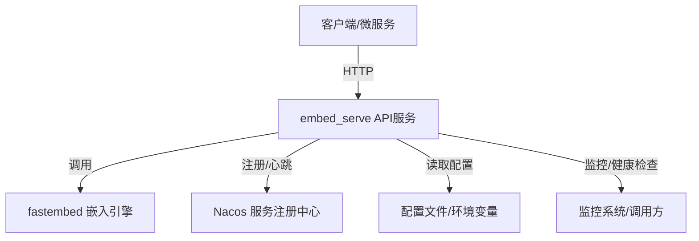

# 嵌入模型服务（embed_serve）设计文档

## 1. 概述

`embed_serve` 是一个基于 FastAPI 的文本嵌入服务，支持多种嵌入模型和推理后端，具备高性能、易扩展、服务注册与健康检查等特性。主要用于为桌面端、移动端及其他微服务提供统一的文本向量化 API。

---

## 2. 整体架构


```
- **A**：调用方，包括桌面端、移动端、其他微服务。
- **B**：本服务，提供 HTTP API。
- **C**：底层嵌入引擎，支持多模型多后端。
- **D**：服务注册与发现。
- **E**：支持多种配置来源。
- **F**：健康检查与监控。

---

## 3. 主要模块与职责

- `main.py`：服务入口，API 路由、生命周期管理、Nacos 注册、健康检查。
- `fastembed`：文本嵌入核心库，支持多模型多推理后端。
- `mf_nacos_service_registrar`：Nacos 客户端，负责服务注册、注销、心跳。
- 配置管理：支持环境变量、YAML 配置文件，优先级 `.env > application.yaml > 默认`。
- 缓存与模型管理：LRU 缓存已加载模型，提升推理性能。

---

## 4. API 设计

### 4.1 获取可用模型和推理后端
- `GET /models`
- 返回：
```json
{
  "models": ["BAAI/bge-base-en-v1.5", ...],
  "providers": ["onnx", "pytorch", "tensorrt"]
}
```

### 4.2 获取文本嵌入
- `POST /embed`
- 请求体：
```json
{
  "texts": ["你好世界", "Hello world"],
  "model_name": "BAAI/bge-base-en-v1.5", // 可选
  "provider": "onnx",                   // 可选
  "normalize": true,                      // 可选
  "batch_size": 32                        // 可选
}
```
- 返回：
```json
{
  "embeddings": [[...], [...]]
}
```

### 4.3 单条推理
- `POST /infer`
- 请求体：
```json
{
  "text": "你好世界",
  "model_name": "BAAI/bge-base-en-v1.5", // 可选
  "provider": "onnx",                   // 可选
  "normalize": true                      // 可选
}
```
- 返回：
```json
{
  "embedding": [...]
}
```

### 4.4 批量推理
- `POST /infer_batch`
- 请求体同 `/embed`，返回同 `/embed`。

### 4.5 服务状态与缓存信息
- `GET /infer_info`
- 返回：模型缓存、命中率、内存、进程信息等。

### 4.6 健康检查
- `GET /actuator/health`
- 返回：服务健康、磁盘、内存、Nacos 注册状态等。

---

## 5. 模型与推理后端支持机制
- 支持多种模型（如 BAAI/bge-base-en-v1.5 等），可扩展。
- 支持多种推理后端（onnx、pytorch、tensorrt）。
- 通过 LRU 缓存机制管理模型实例，提升性能，减少重复加载。
- 支持批量推理与单条推理，接口参数灵活。

---

## 6. 服务注册与健康检查
- 集成 Nacos 服务注册，支持多环境、权重、心跳、健康状态上报。
- 服务启动自动注册，关闭自动注销。
- 健康检查接口 `/actuator/health` 提供标准健康信息，便于监控与自动化运维。

---

## 7. 配置与环境变量说明
- 支持通过环境变量和 `tools/config/application.yaml` 配置端口、Nacos 相关参数。
- 主要环境变量：
  - `NACOS_SERVER_ADDRESSES`、`NACOS_NAMESPACE`、`NACOS_ACCESS_KEY`、`NACOS_SECRET_KEY`、`NACOS_GROUP`、`NACOS_CLUSTER`、`NACOS_SERVICE_NAME`、`NACOS_WEIGHT`、`NACOS_ENABLE`、`NACOS_HEALTHY`、`NACOS_EPHEMERAL`、`PORT`。
- 配置优先级：环境变量 > application.yaml > 默认值。

---

## 8. 依赖与部署建议
- 依赖：Python 3.8+、FastAPI、Uvicorn、fastembed、mf-nacos-service-registrar、psutil、PyYAML。
- 推荐使用虚拟环境统一依赖管理。
- 启动命令：
  ```bash
  uvicorn main:app --host 0.0.0.0 --port 8000
  ```
- 支持通过 Nacos 进行服务发现与负载均衡。

---

## 9. 扩展点与未来规划
- 支持更多嵌入模型和推理后端。
- 增加模型自动下载与热更新能力。
- 丰富监控与告警能力。
- 支持分布式部署与多实例负载均衡。
- 增加权限认证与限流等安全特性。

---

## 10. 参考与致谢
- [FastAPI](https://fastapi.tiangolo.com/)
- [fastembed](https://github.com/FlagOpen/FlagEmbedding)
- [Nacos](https://nacos.io/zh-docs/) 