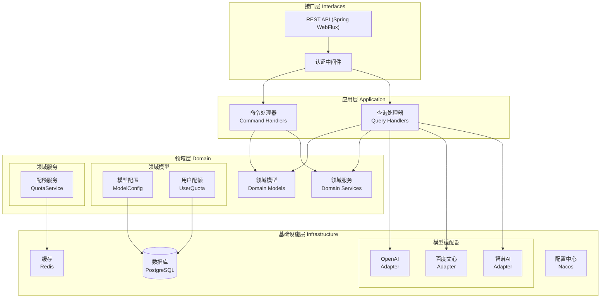
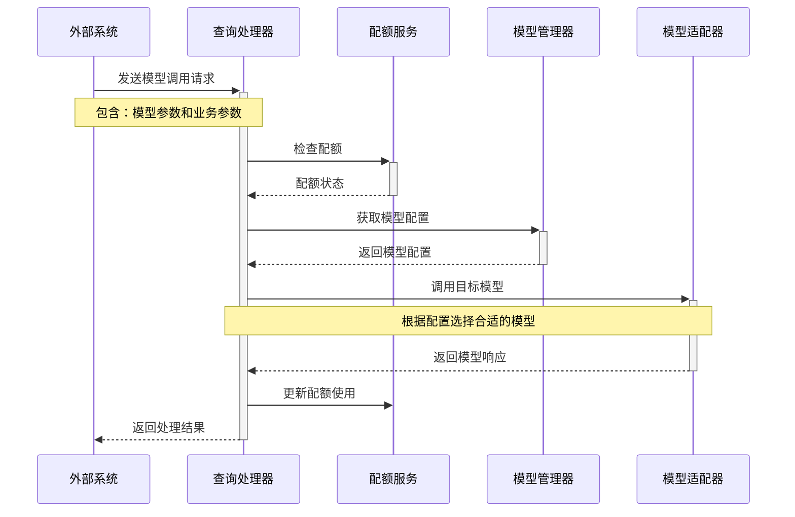
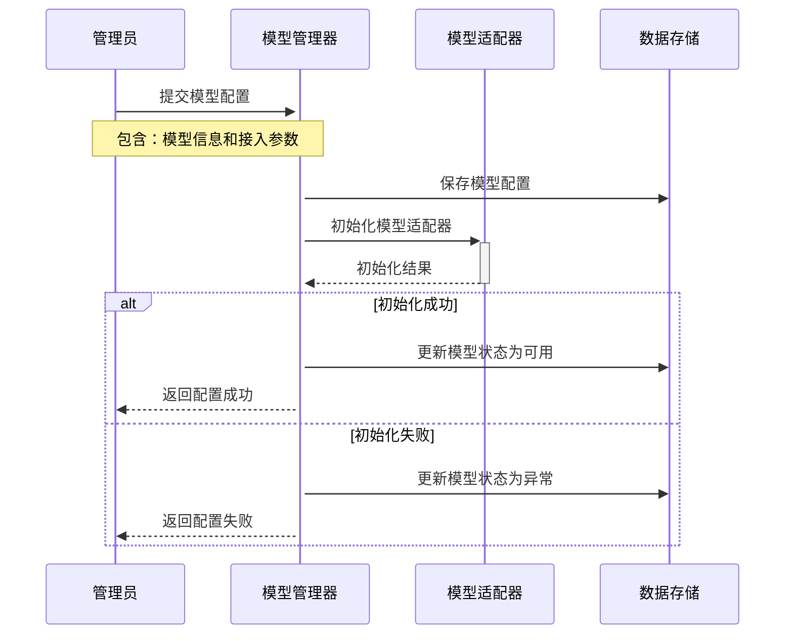

# LLM Serve 架构设计

## 一、系统定位

LLM Serve 是一个统一的大模型接入和管理平台，基于 OpenAI API 规范提供标准接口。平台负责大模型资源的统一管理、调度和运营，包括模型接入配置、密钥管理、配额控制、计费管理等核心能力。本服务不会自己建设大模型，专注于模型资源的统一管理和服务提供。

### 1.1 核心定位

1. **统一接入管理**
   - 标准化接口规范（OpenAI API兼容）
   - 多模型厂商统一接入
   - 模型参数配置管理
   - 模型性能监控和优化

2. **安全与访问控制**
   - 统一密钥管理和分发
   - 多级权限控制体系
   - 访问策略和审计
   - 数据安全保护

3. **资源管理与控制**
   - 精细化配额管理
   - 多维度计费策略
   - 资源使用监控
   - 成本分析和优化

4. **运营与管理**
   - 运营数据分析
   - 使用量统计报表
   - 告警和通知机制
   - SLA 保障体系

### 1.2 功能边界

1. **核心功能**
   - 模型接入和配置管理
   - 密钥发放和权限控制
   - 配额和计费管理
   - 调用统计和监控
   - 运营分析和报表

2. **不含功能**
   - 模型训练和微调
   - 模型部署和推理
   - 大规模数据存储
   - 业务应用开发

## 二、技术栈选择

本章节说明系统采用的核心技术栈和组件选择理由。

基于性能、生态和维护性考虑，选择以下技术栈：

- **语言与框架**: 
  - Java 21+
  - Spring Boot 3.x
  - Spring Cloud Alibaba
  - Spring WebFlux (响应式编程)

- **存储与缓存**:
  - PostgreSQL: 核心数据存储
  - Redis: 缓存、限流、配额管理

- **配置与服务发现**:
  - Nacos: 配置中心和服务注册

## 三、架构设计

本章节描述系统的整体架构设计，包括技术架构、核心流程和部署架构。

### 3.1 技术架构

系统采用分层架构，确保关注点分离和模块化设计。



### 3.2 核心流程

展示系统中最关键的业务流程，包括模型调用和管理流程。

#### 3.2.1 模型调用流程



#### 3.2.2 模型管理流程



### 3.3 部署架构

描述系统的部署拓扑和基础设施要求。

#### 3.3.1 部署拓扑

```
                        [API网关]
                             │
                  ┌─────────┴─────────┐
                  │                   │
            [LLM Serve 1]      [LLM Serve 2]
                  │                   │
          ┌───────┼───────────┬──────┴───────┐
          │       │           │              │
      [Redis]  [PostgreSQL] [Nacos]     [监控系统]
```

#### 3.3.2 基础设施要求
1. **存储服务**
   - PostgreSQL：持久化存储
   - Redis：缓存和会话管理
   - Nacos：配置中心和服务发现

2. **基础组件**
   - API网关：请求路由和负载均衡
   - 监控系统：基础监控和告警

## 四、接口层设计

本章节定义系统对外提供的 API 接口，遵循 OpenAI 接口规范。

### 4.1 功能接口

#### 4.1.1 聊天对话接口（Chat Completions）
- 路径：`POST /v1/chat/completions`
- 功能：支持多轮对话、问答、上下文感知的文本生成，兼容 OpenAI Chat API。
- 特性：
  * SSE：可选，支持流式返回（stream=true 时）
  * 消息格式：`data: {"id":..., "object":..., "choices": [...]}\n\n`
  * 支持多角色（system、user、assistant）

#### 4.1.2 文本生成接口（Completions）
- 路径：`POST /v1/completions`
- 功能：单轮文本生成，兼容 OpenAI Completions API（适用于补全、摘要等场景）。
- 特性：
  * SSE：可选，支持流式返回（stream=true 时）
  * 消息格式：`data: {"id":..., "object":..., "choices": [...]}\n\n`

#### 4.1.3 向量嵌入接口（Embeddings）
- 路径：`POST /v1/embeddings`
- 功能：将文本转为向量嵌入，适用于语义搜索、推荐、知识检索等场景，兼容 OpenAI Embeddings API。
- 特性：
  * SSE：不需要，通常为同步返回
  * 消息格式：`data: {"id":..., "object":..., "data": [{"index":..., "embedding": [...], "object": "embedding"}]}\n\n`

#### 4.1.4 音频处理接口
- **Audio Transcriptions**
  - 路径：`POST /v1/audio/transcriptions`
  - 功能：音频转文字
  - 特性：
    * SSE：**可选**，对于长音频可使用 SSE 返回实时转写结果
    * 消息格式：`data: {"text": "...", "timestamp": "..."}\n\n`

- **Audio Translations**
  - 路径：`POST /v1/audio/translations`
  - 功能：音频翻译（如英语 → 中文）
  - 特性：
    * SSE：**可选**，对于长音频可使用 SSE 返回实时翻译结果
    * 消息格式：`data: {"translation": "...", "timestamp": "..."}\n\n`

#### 4.1.5 图像处理接口
- **Image Generation**
  - 路径：`POST /v1/images/generations`
  - 功能：文本生成图片
  - 特性：
    * SSE：**不需要**，同步返回生成的图片
    * 响应格式：标准 JSON 或二进制图片数据

- **Image Editing**
  - 路径：`POST /v1/images/edits`
  - 功能：修改已有图像
  - 特性：
    * SSE：**不需要**，同步返回编辑后的图片
    * 响应格式：标准 JSON 或二进制图片数据

#### 4.1.6 内容安全接口
- **Moderation**
  - 路径：`POST /v1/moderations`
  - 功能：内容审核
  - 特性：
    * SSE：**不需要**，同步返回审核结果
    * 响应格式：标准 JSON

#### 4.1.7 AI 助理接口（Beta）
- **Assistants**
  - 路径：`POST /v1/assistants`
  - 功能：构建多步任务的 AI 助理
  - 特性：
    * SSE：**不需要**，同步返回助理配置
    * 响应格式：标准 JSON

- **Threads**
  - 路径：`POST /v1/threads`
  - 功能：管理与 Assistant 的对话上下文
  - 特性：
    * SSE：**必需**，用于推送对话状态更新
    * 消息格式：`data: {"thread_id": "...", "status": "...", "messages": [...]}\n\n`

- **Messages**
  - 路径：`POST /v1/messages`
  - 功能：管理对话消息内容
  - 特性：
    * SSE：**必需**，用于推送消息处理状态和工具调用结果
    * 消息格式：`data: {"message_id": "...", "status": "...", "content": "..."}\n\n`

### 4.2 管理接口

#### 4.2.1 模型管理
- **获取模型列表**
  - 路径：`GET /v1/models`
  - 功能：查询所有可用模型
  - 特性：
    * SSE：**不需要**，同步返回模型列表
    * 响应格式：标准 JSON

- **获取模型详情**
  - 路径：`GET /v1/models/{model}`
  - 功能：查询特定模型信息
  - 特性：
    * SSE：**不需要**，同步返回模型详情
    * 响应格式：标准 JSON

#### 4.2.2 系统管理
- **使用统计**
  - 路径：`GET /v1/usage`
  - 功能：查询 API 调用统计
  - 特性：
    * SSE：**可选**，用于实时监控场景
    * 消息格式：`data: {"timestamp": "...", "metrics": {...}}\n\n`

- **服务状态**
  - 路径：`GET /v1/status`
  - 功能：查询服务运行状态
  - 特性：
    * SSE：**可选**，用于实时监控场景
    * 消息格式：`data: {"timestamp": "...", "status": {...}}\n\n`

- **提供商列表**
  - 路径：`GET /v1/providers`
  - 功能：查询可用模型提供商
  - 特性：
    * SSE：**不需要**，同步返回提供商列表
    * 响应格式：标准 JSON

### 4.3 中间件设计

#### 4.3.1 认证中间件
- **功能职责**
  - API 密钥认证
  - 请求签名验证
  - 访问权限控制

#### 4.3.2 请求处理中间件
- **功能职责**
  - 请求参数验证
  - 模型调用路由
  - 响应格式化

## 五、应用层设计

本章节描述系统的核心应用服务及其交互关系。

### 5.1 核心管理服务

1. **模型管理服务**
   - **核心职责**
     * 模型接入配置管理
     * 模型参数和路由管理
     * 模型性能监控和优化
     * 模型生命周期管理
   - **关键特性**
     * 动态配置更新
     * 智能负载均衡
     * 自动故障转移
     * 性能数据采集

2. **密钥管理服务**
   - **核心职责**
     * API密钥生命周期管理
     * 访问权限控制
     * 密钥轮换和吊销
     * 认证策略管理
   - **关键特性**
     * 多级别权限控制
     * 自动密钥轮换
     * 访问策略配置
     * 操作审计跟踪

3. **配额管理服务**
   - **核心职责**
     * 用户配额管理
     * 资源使用控制
     * 限流策略执行
     * 配额预警监控
   - **关键特性**
     * 多维度配额控制
     * 实时用量统计
     * 动态调整能力
     * 预警阈值设置

4. **计费服务**
   - **核心职责**
     * 计费规则管理
     * 用量计费统计
     * 账单生成处理
     * 费用预估分析
   - **关键特性**
     * 灵活的计费策略
     * 实时计费统计
     * 多级计费规则
     * 成本分析预测

### 5.2 多模态服务

1. **统一接口适配**
   - **核心职责**
     * 标准接口规范维护
     * 多模态能力适配
     * 参数转换处理
     * 响应格式统一
   - **支持类型**
     * 文本对话服务
     * 音频处理服务
     * 图像处理服务
     * 多模态混合服务

2. **资源优化管理**
   - **核心职责**
     * 资源缓存策略
     * 带宽使用优化
     * 存储空间管理
     * 资源生命周期
   - **关键特性**
     * 智能缓存策略
     * 资源复用优化
     * 自动清理机制
     * 性能监控分析

### 5.3 运营支撑服务

1. **统计分析服务**
   - **核心职责**
     * 调用量统计分析
     * 性能指标监控
     * 资源使用分析
     * 趋势报表生成
   - **关键指标**
     * 调用成功率
     * 响应时延分布
     * 资源使用率
     * 成本效益分析

2. **监控告警服务**
   - **核心职责**
     * 系统状态监控
     * 业务指标监控
     * 告警规则管理
     * 告警通知分发
   - **监控维度**
     * 系统层监控
     * 业务层监控
     * 资源层监控
     * 安全层监控

3. **审计日志服务**
   - **核心职责**
     * 操作日志记录
     * 调用日志采集
     * 审计数据分析
     * 合规报告生成
   - **审计范围**
     * 管理操作审计
     * API调用审计
     * 资源访问审计
     * 安全事件审计

### 5.4 服务交互关系

1. **核心流程交互**
   - 请求接入认证流程
   - 配额检查和计费流程
   - 模型调用和监控流程
   - 统计分析和报告流程

2. **数据流转关系**
   - 配置数据流转
   - 监控数据流转
   - 统计数据流转
   - 审计数据流转

3. **服务依赖关系**
   - 基础设施依赖
   - 核心服务依赖
   - 支撑服务依赖
   - 外部服务依赖

## 六、领域层设计

本章节描述系统的核心领域模型、领域服务和领域事件。

### 6.1 核心领域模型

#### 6.1.1 聚合根（Aggregates）

1. **模型配置聚合（ModelConfig）**
   - **标识属性**：模型ID、版本号
   - **值对象组合**：
     * 提供商信息（ProviderInfo）
     * 模型能力描述（ModelCapability）
     * 运行时配置（RuntimeConfig）
     * 计费规则（BillingRule）
   - **不变量规则**：
     * 提供商信息必须完整有效
     * 运行参数必须在合理范围内
     * 计费规则必须明确定义

2. **AI助理聚合（Assistant）**
   - **标识属性**：助理ID
   - **实体关联**：
     * 对话线程（Thread）列表
     * 消息（Message）集合
   - **值对象组合**：
     * 工具配置（ToolConfig）
     * 助理能力（AssistantCapability）
   - **不变量规则**：
     * 助理必须关联至少一个模型
     * 工具配置必须有效

3. **用户配额聚合（UserQuota）**
   - **标识属性**：用户ID、配额ID
   - **值对象组合**：
     * 配额策略（QuotaPolicy）
     * 使用统计（UsageStats）
     * 计费周期（BillingCycle）
   - **不变量规则**：
     * 配额使用不能超过限制
     * 计费周期必须明确定义

#### 6.1.2 实体（Entities）

1. **对话线程（Thread）**
   - **标识属性**：线程ID
   - **值对象组合**：
     * 会话上下文（ConversationContext）
     * 线程状态（ThreadStatus）
   - **生命周期**：创建、活跃、完成、归档

2. **消息（Message）**
   - **标识属性**：消息ID
   - **值对象组合**：
     * 消息内容（MessageContent）
     * 角色类型（MessageRole）
     * 时间戳（Timestamp）

3. **调用记录（InvocationRecord）**
   - **标识属性**：记录ID
   - **值对象组合**：
     * 调用参数（InvocationParams）
     * 执行结果（ExecutionResult）
     * 资源消耗（ResourceUsage）

#### 6.1.3 值对象（Value Objects）

1. **配置相关**
   - 提供商信息（ProviderInfo）
   - 模型能力描述（ModelCapability）
   - 运行时配置（RuntimeConfig）
   - 工具配置（ToolConfig）

2. **配额相关**
   - 配额策略（QuotaPolicy）
   - 使用统计（UsageStats）
   - 计费规则（BillingRule）

3. **通用类型**
   - 资源限制（ResourceLimit）
   - 时间周期（TimePeriod）
   - 执行状态（ExecutionStatus）

### 6.2 领域服务

#### 6.2.1 模型服务（ModelService）
- **核心职责**：
  * 模型生命周期管理
  * 模型选择策略执行
  * 负载均衡和故障转移
  * 参数优化和验证
- **依赖服务**：
  * 配额服务
  * 审计服务
- **领域事件发布**：
  * 模型状态变更事件
  * 模型性能告警事件
  * 模型配置更新事件

#### 6.2.2 助理服务（AssistantService）
- **核心职责**：
  * 助理生命周期管理
  * 对话线程处理
  * 消息处理和路由
  * 工具调用协调
- **依赖服务**：
  * 模型服务
  * 配额服务
- **领域事件发布**：
  * 线程状态变更事件
  * 消息处理完成事件
  * 工具调用完成事件

#### 6.2.3 配额服务（QuotaService）
- **核心职责**：
  * 配额检查和控制
  * 使用量统计和分析
  * 计费规则执行
  * 配额策略管理
- **依赖服务**：
  * 模型服务
- **领域事件发布**：
  * 配额超限事件
  * 使用量警告事件
  * 计费周期变更事件

### 6.3 领域事件

1. **模型相关事件**
   - 模型状态变更事件
   - 模型性能告警事件
   - 模型配置更新事件

2. **助理相关事件**
   - 线程创建完成事件
   - 消息处理完成事件
   - 工具调用完成事件

3. **配额相关事件**
   - 配额超限事件
   - 使用量警告事件
   - 计费周期变更事件

## 七、基础设施层设计

本章节描述现阶段 LLM Serve 基础设施层的必要设计，聚焦于支撑统一大模型接入与管理平台的核心能力，优先满足模型接入、配额与密钥管理、计费、监控等主流程。其他如审计、外部集成等功能可放入后期规划。

### 1. 数据存储

#### 1.1 PostgreSQL（关系型数据库）
- **用途**：持久化存储核心业务数据。
- **核心表**：
  - 模型配置（model_config）：存储各接入模型的配置信息。
  - 用户配额（user_quota）：记录用户配额及用量。
  - 调用记录（invocation_record）：保存模型调用日志，便于计费与统计。
  - 密钥信息（api_key）：管理 API 密钥及权限。
- **实现建议**：
  - 采用 ORM 框架（如 JPA/Hibernate），仓储接口与实现分离。
  - 结构设计优先保证数据一致性和扩展性。

#### 1.2 Redis（缓存/限流）
- **用途**：
  - 缓存热点数据（如模型元数据、配额状态）。
  - 实现高效的配额检查与限流。
- **实现建议**：
  - 利用 Redis 原子操作实现分布式配额扣减与限流。
  - 仅缓存高频、易失性数据，持久化数据仍以数据库为准。

#### 1.3 Nacos（配置中心/服务发现）
- **用途**：
  - 动态管理数据库、缓存等基础设施配置。
  - 服务注册与发现，支持弹性扩缩容。
- **实现建议**：
  - 配置与服务注册均通过 Spring Cloud Alibaba 集成。

---

### 2. 大模型适配器

#### 2.1 适配器接口与实现
- **目标**：屏蔽不同大模型厂商 API 差异，提供统一的模型调用接口。
- **设计要点**：
  - 定义统一的 ModelAdapter 接口，包含模型调用、参数转换、响应格式化等方法。
  - 针对主流厂商（如 OpenAI、百度文心、智谱AI）实现各自的适配器类。
  - 适配器需支持基础的负载均衡与重试机制，保证调用稳定性。
  - 适配器注册与管理由模型管理器统一调度。

#### 2.2 模型管理器
- **职责**：
  - 维护所有可用模型及其适配器实例。
  - 根据业务参数、配额状态等，智能选择适配器进行调用。
  - 支持模型配置的动态加载与热更新。

---

### 3. 监控与日志（必要部分）
- **监控**：采集核心业务指标（如模型调用成功率、响应时延、配额用量），便于后续优化和 SLA 保障。
- **日志**：记录关键操作日志和调用日志，支持问题追踪和简单审计。

---

### 4. 代码结构建议
基础设施层建议保留以下核心子包：
- repository/：数据库与缓存实现（PostgreSQL、Redis）
- config/：基础设施相关配置（Nacos）
- adapter/：大模型适配器实现
- monitor/：基础监控集成（如必要的 Prometheus 指标采集）

---

### 5. 后期规划（可延后实现）
- 审计日志、合规报告
- 外部系统集成（如第三方计费、认证等）
- 高级监控与告警、自动化运维
- 插件化适配器、模型混合路由等

---

## 八、代码组织结构

本章节展示系统的代码组织结构。

### 8.1 目录结构

本项目采用分层分包结构，遵循 DDD（领域驱动设计）和现代 Spring Boot 项目最佳实践。各层职责清晰，便于扩展和维护。目录结构规范如下：

```
llm_serve/
├── src/
│   └── main/
│       └── java/
│           └── com.aixone.llm/
│               ├── application/      # 应用层：用例编排、命令/查询处理器、DTO、Facade等
│               │   ├── command/      # 命令处理相关（如 model、quota、audio 等子目录）
│               │   │   ├── model/
│               │   │   ├── quota/
│               │   │   └── audio/
│               │   ├── query/        # 查询处理相关（如 model、quota、audio 等子目录）
│               │   │   ├── model/
│               │   │   ├── quota/
│               │   │   └── audio/
│               │   └── ...           # 其他应用服务
│               ├── domain/           # 领域层：核心业务模型、服务、事件、仓储接口
│               │   ├── models/       # 领域模型
│               │   │   ├── aggregates/ # 聚合根（如 model_config、assistant、userquota 等）
│               │   │   │   ├── model_config/
│               │   │   │   ├── assistant/
│               │   │   │   └── userquota/
│               │   │   ├── entities/   # 实体（如 thread、message、record 等）
│               │   │   │   ├── thread/
│               │   │   │   ├── message/
│               │   │   │   └── record/
│               │   │   └── values/     # 值对象（如 config、quota、common 等）
│               │   │       ├── config/
│               │   │       ├── quota/
│               │   │       └── common/
│               │   ├── services/     # 领域服务接口与实现
│               │   │   ├── impl/     # 领域服务实现
│               │   ├── events/       # 领域事件
│               │   │   ├── model/
│               │   │   ├── assistant/
│               │   │   └── quota/
│               │   └── repositories/ # 仓储接口
│               │       ├── model/
│               │       ├── assistant/
│               │       └── quota/
│               ├── infrastructure/   # 基础设施层：持久化、第三方集成、适配器、实现类
│               │   ├── repository/   # 仓储实现（与 domain/repositories 对应）
│               │   │   ├── model/
│               │   │   ├── assistant/
│               │   │   └── quota/
│               │   ├── config/       # 基础设施相关配置
│               │   └── ...           # 其他适配器、集成类
│               ├── interfaces/       # 接口层：REST API、Web、RPC、认证等
│               │   ├── rest/         # RESTful API 控制器
│               │   ├── middleware/   # 中间件（如认证、限流等）
│               │   └── ...           # 其他接口适配
│               └── LlmServeApplication.java # 启动类
│
├── resources/                         # 配置文件、静态资源
│   ├── application.yml                # Spring Boot 主配置
│   └── ...                            # 其他资源
├── test/                              # 测试代码
│   └── java/                          # 单元测试、集成测试
├── docs/                              # 项目文档
│   └── architecture.md                # 架构设计文档
├── pom.xml                            # Maven 构建文件
└── ...                                # 其他工程文件（如 Dockerfile、README 等）
```

**com.aixone.llm 下各主要子目录说明：**
- `application/command/`、`application/query/`：分别存放命令和查询处理器，按业务领域（如 model、quota、audio）进一步细分，便于用例编排和职责分离。
- `domain/models/aggregates/`：聚合根，代表核心业务对象，每个子目录对应一个聚合（如模型配置、助理、用户配额）。
- `domain/models/entities/`：实体对象，按业务领域细分（如对话线程、消息、调用记录）。
- `domain/models/values/`：值对象，按 config、quota、common 分类，封装不可变业务属性。
- `domain/services/`：领域服务接口，`impl/` 存放实现类。
- `domain/events/`：领域事件，按 model、assistant、quota 分类，便于事件驱动开发。
- `domain/repositories/`：仓储接口，按 model、assistant、quota 分类，便于持久化抽象。
- `infrastructure/repository/`：仓储实现，结构与 domain/repositories 对应。
- `infrastructure/config/`：基础设施相关配置类。
- `interfaces/rest/`：RESTful API 控制器，负责对外接口适配。
- `interfaces/middleware/`：中间件，如认证、限流等。
- 其他目录可根据实际业务扩展。

**规范要求：**
- 所有业务相关代码必须归属于对应的业务子目录，保持结构清晰。
- 新增业务领域时，需在各层按规范增设对应子目录。

该结构确保各层职责清晰、分工明确，便于团队协作和系统扩展。

## 九、后续规划

本章节规划系统的后续演进路线，按优先级排序。

### 9.1 近期规划（P0）
1. **核心功能完善**
   - 支持主流 LLM 供应商接入（文心一言、智谱AI等）
   - 优化模型调用性能和稳定性
   - 完善错误处理和重试机制
   - 补充技术选型的详细论证

2. **监控体系建设**
   - 细化各层面监控指标（系统、应用、业务）
   - 完善关键业务指标定义
   - 制定分级告警策略
   - 建立指标看板体系

3. **安全体系建设**
   - 完善数据安全方案（加密、脱敏、生命周期）
   - 细化访问控制策略
   - 加强审计机制设计
   - 建立安全合规评估机制

4. **依赖关系治理**
   - 细化服务间依赖关系
   - 优化组件版本约束
   - 完善服务依赖文档
   - 制定依赖升级策略

### 9.2 中期规划（P1）
1. **功能增强**
   - 提供管理控制台
   - 支持模型混合调用
   - 智能路由优化
   - 完善配额管理

2. **运维体系建设**
   - 完善容器化部署方案
   - 制定灾备策略
   - 优化运维工具链
   - 自动化运维流程

3. **成本优化方案**
   - 制定资源成本控制策略
   - 实现智能资源调度
   - 建立成本监控体系
   - 优化资源利用效率

### 9.3 远期规划（P2）
1. **架构演进**
   - 微服务架构优化
   - 跨区域部署支持
   - 服务网格接入
   - 云原生架构升级

2. **能力扩展**
   - 插件化模型适配
   - 新模态支持接入
   - 高级路由策略
   - 智能运维平台

3. **生态建设**
   - 开发者工具完善
   - API 生态建设
   - 社区运营支持
   - 文档体系建设 