# 元数据服务设计文档

---

## 1. 业务架构

### 1.1 设计目标

- 提供统一的元数据管理能力，支持动态定义数据结构、属性、关系及界面展示规则。
- 支持前端根据元数据自动渲染界面，实现低代码/无代码的数据管理。
- 支持基于元数据的动态数据操作（增删改查）、校验和权限控制。

### 1.2 核心业务场景

1. **低代码/无代码平台**

   - 支持业务人员通过元数据配置快速构建应用
   - 实现动态界面生成和业务逻辑配置
   - 无需编码即可配置业务表单、流程、报表等
2. **动态表单/报表系统**

   - 支持灵活配置表单字段、校验规则、报表结构
   - 实现数据驱动的界面渲染和业务处理
   - 根据业务需求动态调整，无需修改代码
3. **多租户SaaS平台**

   - 支持租户级自定义字段和业务规则
   - 实现多租户数据隔离和个性化配置
   - 满足不同租户的差异化需求

---

## 2. 技术架构

### 2.1 总体架构设计

元数据服务采用分层解耦的技术架构，主要包括：元数据管理、业务规则引擎、权限与安全、数据服务、能力集成与编排等核心模块。各模块协同工作，实现元数据驱动的动态界面、数据操作、规则校验和安全治理。

#### 2.1.1 架构核心能力与设计原则

**核心能力：**

1. **极致元数据驱动**：所有业务功能均通过元数据进行开发和驱动，支持数据结构、页面、流程、规则、权限的灵活定义和组装
2. **多实例与智能调度**：支持多实例部署，通过API网关智能路由不同业务流量，保障高可用性和可扩展性

**设计原则：**

- **服务全部采用无状态设计**，便于横向扩展和高可用
- **分层解耦**，各模块职责清晰，边界明确
- **事件驱动**，通过aixone-event-sdk实现模块间解耦
- **多租户隔离**，确保租户间数据安全和资源隔离
- **扩展性优先**，支持插件机制和能力扩展

#### 2.1.2 核心模块关系

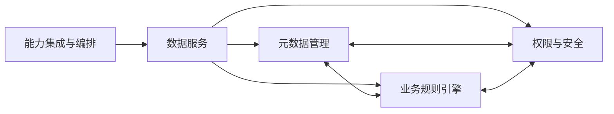

- **元数据管理**：负责元数据的定义、分类、存储、版本管理等
- **业务规则引擎**：负责业务规则的配置、解析、执行
- **权限与安全**：负责认证、授权、权限校验、数据脱敏等
- **数据服务**：对外提供数据操作、动态表单/报表等服务
- **能力集成与编排**：主线流转、能力聚合、对外API统一输出

### 2.2 元数据驱动的核心机制

#### 2.2.1 行为绑定与流程驱动机制

**行为绑定机制：**

- 平台通过元数据的行为描述字段，将结构与前端渲染、后端校验、权限、流程等动态绑定
- 平台引擎自动解析元数据，驱动前后端协同，实现动态表单、自动校验、权限控制等

**流程驱动机制：**

- 流程元数据通过结构化定义，驱动流程引擎实现流程实例的创建、流转、节点执行、事件监听等
- 平台自动将流程元数据与前端流程建模器、动态表单、审批页面等UI行为绑定

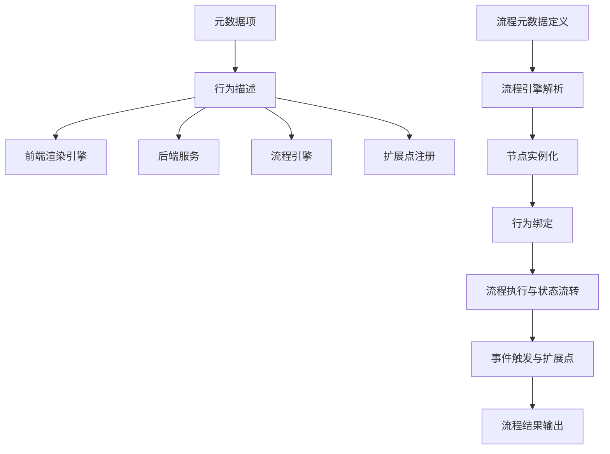

#### 2.2.2 扩展与端到端流转机制

**扩展机制：**

- 平台通过扩展点、插件机制支持自定义校验、控件、节点等
- 用户可通过元数据注册自定义行为，平台动态加载并绑定到对应引擎

**端到端流转机制：**

- 从元数据配置到前后端自动化流转的全过程，均由平台机制自动完成
- 支持用户配置、前端渲染、服务端处理、数据库交互的完整链路

### 2.3 分布式一致性机制

多模块协作和元数据变更的一致性保障是系统稳定性的关键。

#### 2.3.1 事务边界定义

**原子性操作边界：**

| 操作类型     | 事务边界             | 一致性要求 | 实现方式   |
| ------------ | -------------------- | ---------- | ---------- |
| 单元数据操作 | 单个元数据对象       | 强一致性   | 数据库事务 |
| 关联操作     | 元数据对象+属性+关系 | 强一致性   | 本地事务   |
| 跨模块操作   | 元数据+权限+规则     | 最终一致性 | SAGA模式   |
| 批量操作     | 多个独立对象         | 最终一致性 | 分布式事务 |

#### 2.3.2 SAGA事务模式实现

**元数据创建SAGA事务示例：**

```yaml
saga_name: "create_metadata_with_permissions"
steps:
  - step: "create_metadata"
    service: "metadata-service"
    action: "create"
    compensate: "delete_metadata"
  - step: "register_permissions"  
    service: "permission-service"
    action: "register_points"
    compensate: "unregister_points"
  - step: "create_cache_entries"
    service: "cache-service" 
    action: "create_entries"
    compensate: "delete_entries"
```

**补偿操作设计原则：**

- 幂等性：补偿操作可以重复执行
- 语义补偿：通过业务逻辑撤销而非物理回滚
- 异步执行：补偿操作异步执行，避免阻塞

#### 2.3.3 冲突检测与解决

**并发修改冲突检测：**

- 使用乐观锁机制，通过版本号检测并发修改冲突
- 元数据对象包含版本号字段，更新时校验版本一致性
- 发现版本冲突时抛出异常，提示用户数据已被其他用户修改

**冲突解决策略：**

1. **自动合并策略**：非冲突字段自动合并、时间戳优先、权重优先
2. **人工仲裁策略**：三方合并、字段级选择、自定义合并

**数据修复机制：**

- 数据一致性检查：定期检查跨模块数据一致性
- 自动修复：发现不一致时自动触发修复流程

---

### 2.3 部署架构设计

#### 2.3.1 综合部署架构

元数据服务采用分层解耦的物理架构，支持多实例部署和弹性扩展：

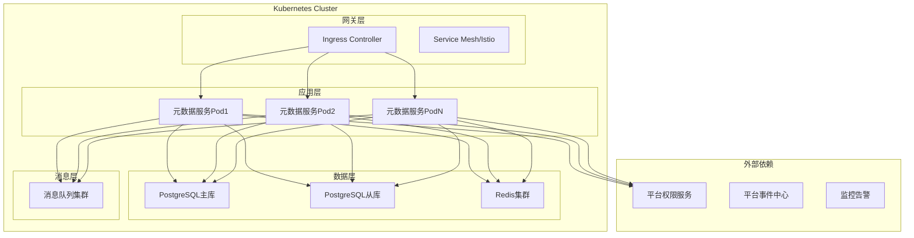

#### 2.3.2 核心组件说明

| 组件类型         | 组件名称       | 主要职责              | 部署特性                       |
| ---------------- | -------------- | --------------------- | ------------------------------ |
| **应用层** | 元数据服务集群 | 业务逻辑处理、API服务 | 无状态、可弹性扩展、支持多实例 |
| **数据层** | PostgreSQL     | 元数据持久化存储      | 主从架构、JSONB支持、RLS隔离   |
| **数据层** | Redis集群      | 高频数据缓存          | 分布式缓存、多级缓存策略       |
| **消息层** | 消息队列       | 异步事件处理          | 集成aixone-event-sdk、可靠传递 |
| **网关层** | API网关        | 流量路由、负载均衡    | 租户路由、故障转移             |

#### 2.3.3 部署策略

**存储策略：**

- **主存储**: PostgreSQL，利用JSONB字段存储动态元数据结构
- **缓存策略**: L1(本地缓存) + L2(Redis分布式缓存)
- **多租户隔离**: 基于Row Level Security (RLS)实现数据隔离

**扩展策略：**

- **水平扩展**：支持多实例的动态扩缩容
- **资源配额**：基于租户的资源使用限制

> 注：详细数据模型、核心数据结构、索引与缓存策略等内容请见第3章数据架构设计。

### 2.4 代码架构设计

#### 2.4.1 分层架构思想

采用DDD分层模型（接口层、应用层、领域层、基础设施层）的设计思想，各层职责与边界明确。

**架构图示意：**

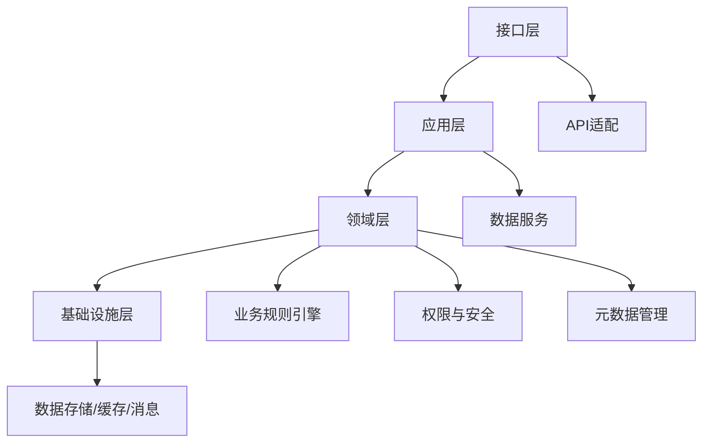

#### 2.4.2 平台主线与模块关系

**新版全局平台模块交互关系图：**

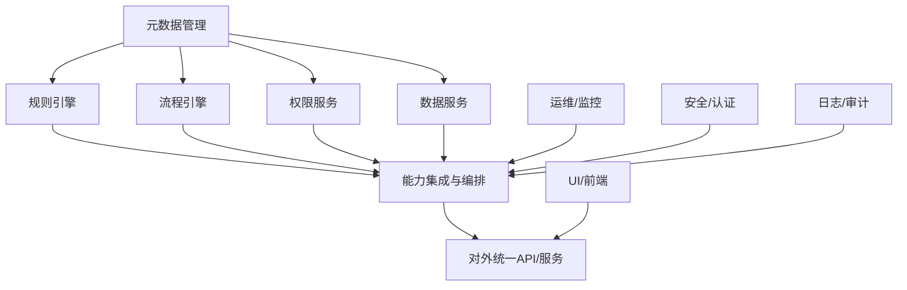

**说明：**

- INTE（能力集成与编排）为主线枢纽，聚合各能力节点（规则、流程、权限、数据等），统一对外输出API/服务
- 元数据管理为所有能力节点提供建模与驱动
- UI/前端通过API与平台交互
- 运维、认证、安全、日志等为平台主线能力提供支撑与治理
- 规则引擎、流程引擎等能力模块以"能力节点"形式对外暴露，主线业务流转、能力聚合与编排均由integration模块统一驱动，各能力模块不直接参与主线流转，仅作为被编排节点

#### 2.4.3 主要模块划分与目录结构

**核心模块划分：**

| 模块名称                            | 模块职责                                                                                 | 目录结构                                                                  | 关键接口/扩展点                                                 |
| ----------------------------------- | ---------------------------------------------------------------------------------------- | ------------------------------------------------------------------------- | --------------------------------------------------------------- |
| **meta-management**           | 元数据项的定义、分类、存储、查询、变更、版本管理                                         | metamanagement/（domain/application/infrastructure/interfaces）           | 元数据定义/变更API、版本管理、扩展字段注册等                    |
| **rule-engine**               | 规则配置、解析、执行、校验、生命周期管理                                                 | ruleengine/（domain/application/infrastructure/interfaces）               | 规则注册/执行/插件接口、日志与测试等                            |
| **process-engine**            | 流程元数据的建模、流程实例的创建与流转、节点行为绑定、流程状态管理、事件监听与扩展点注册 | processengine/（domain/application/infrastructure/interfaces）            | 流程定义/实例/节点扩展点、事件监听等                            |
| **permission-service**        | 基于元数据的权限点管理与平台权限服务集成适配                                             | permissionservice/（domain/application/infrastructure/interfaces）        | 权限校验/策略扩展点、多模型权限校验、数据脱敏等                 |
| **data-service**              | 基于元数据驱动的动态数据操作、导入导出、批量处理                                         | dataservice/（domain/application/infrastructure/interfaces）              | 数据操作/导入导出API、动态表单/报表数据管理等                   |
| **integration-orchestration** | 主线流转、能力聚合、对外API统一输出、协议适配                                            | integrationorchestration/（domain/application/infrastructure/interfaces） | 外部系统/协议适配接口、REST/gRPC/WebSocket适配、事件发布/订阅等 |

**通用目录结构：**

- **common/**：通用工具和共享代码
- **config/scripts/tests/**：配置、脚本、测试等全局目录

> 推荐采用"先分模块再分包（分层）"的目录结构，每个模块按DDD分层组织代码，支持独立开发、测试、演进，便于插件化和微服务化。

#### 2.4.4 元数据驱动业务功能的实现与模块关系

元数据驱动业务功能的主线是：

**metamanagement →（ruleengine / processengine / permissionservice / dataservice）→ integrationorchestration**

- **metamanagement** 是一切业务驱动的基础，负责所有业务对象、字段、结构、表单、页面、流程等的元数据建模与管理
- **ruleengine、processengine、permissionservice、dataservice** 等模块分别负责规则、流程、权限、数据等业务能力的动态实现，均以metamanagement为核心输入
- **integrationorchestration** 负责对外集成和能力编排，聚合各业务能力对外输出
- **common/config/scripts/tests** 为所有模块提供通用支撑

模块关系图：

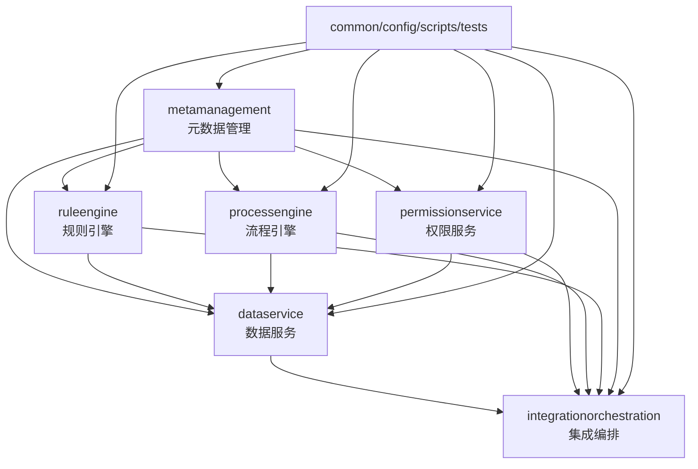

**分点说明：**

- metamanagement：定义和管理所有业务对象、结构、行为，是平台的核心
- ruleengine：基于元数据动态配置和执行业务规则
- processengine：基于元数据动态建模和流转业务流程
- permissionservice：基于元数据动态判定权限、脱敏、访问控制
- dataservice：基于元数据自动生成数据操作、动态表单、报表等
- integrationorchestration：聚合各业务能力，对外集成和能力编排
- common/config/scripts/tests：为所有模块提供通用能力和支撑

> 该协作链路确保所有业务能力都可通过元数据灵活驱动和持续演进，实现平台的自动化。

---

## 3. 数据架构设计

### 3.1 数据架构概述

#### 3.1.1 数据架构设计原则与分层策略

**设计原则：**

- **元数据驱动**：所有数据结构、规则、关系均通过元数据定义和管理
- **分层解耦**：元数据与数据实例分离，元数据管理模块不涉及数据实例管理
- **多租户隔离**：基于租户ID实现数据级隔离，确保租户间数据安全
- **版本管理**：支持元数据多版本并行和回滚，保障数据变更安全
- **扩展性优先**：支持自定义扩展字段和插件机制

**数据分层策略：**

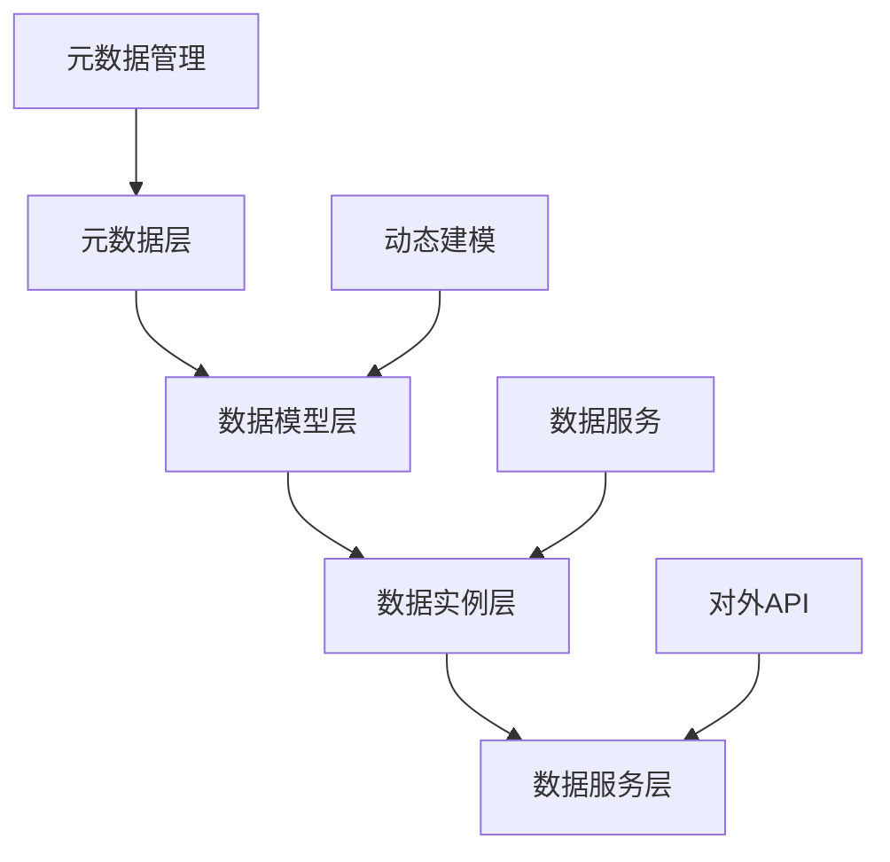

- **元数据层**：定义数据结构、规则、关系等元信息
- **数据模型层**：基于元数据动态生成的数据模型
- **数据实例层**：基于数据模型创建的具体业务数据
- **数据服务层**：对外提供数据操作和查询服务

**数据治理框架：**

- **数据质量管理**：基于规则的数据质量评分和监控
- **数据安全管理**：权限控制、数据脱敏、审计日志
- **数据生命周期管理**：版本控制、归档策略、清理机制
- **数据合规管理**：合规检查、数据血缘、影响分析

### 3.2 元数据分类体系

#### 3.2.1 分类概述

为实现科学治理和灵活扩展，元数据分类采用DAMA推荐的主类型，并将描述性、结构性、数据质量等作为横切属性进行统一管理。

#### 3.2.2 元数据分类定义

##### 业务元数据（Business Metadata）

- **定义**：描述数据在业务中的含义、用途、规则和业务上下文的信息
- **包含内容**：业务术语、业务定义、指标、KPI、业务规则、数据血缘、数据所有者、业务流程等
- **典型应用**：动态表单、业务流程、指标体系等

##### 技术元数据（Technical Metadata）

- **定义**：描述数据在技术实现、存储、处理和流转过程中的结构和属性
- **包含内容**：数据库结构、数据类型、存储位置、接口协议、ETL流程、API、数据模型、系统架构等
- **典型应用**：数据库表结构、API接口、ETL流程等

##### 管理元数据（Administrative Metadata）

- **定义**：描述数据的管理、运维、安全、合规和生命周期相关的信息
- **包含内容**：权限、访问控制、生命周期、版本、变更历史、审计、日志、监控、数据质量规则、合规要求等
- **典型应用**：权限控制、数据脱敏、审计日志等

##### 参考元数据（Reference Metadata）

- **定义**：用于标准化和统一数据引用的信息
- **包含内容**：代码表、字典、枚举、标准分类、外部标准、主数据引用等
- **典型应用**：字典、枚举、标准分类、主数据引用等

#### 3.2.3 横切属性

- **描述性属性**：如name、label、description、tags、owner、createdAt等，适用于所有主类型元数据，便于检索、识别和业务理解。
- **结构性属性**：如parent、children、relations、layout、hierarchy等，描述数据对象之间的结构关系，适用于技术、业务、管理元数据。
- **数据质量属性**：如qualityScore、validationRules、auditStatus等，描述数据质量相关规则和状态，适用于管理元数据，也可扩展到业务和技术元数据。
- **安全属性**：如sensitivity、masking、accessLevel等，描述数据安全和权限要求，适用于管理元数据。

#### 3.2.4 通用应用

- 元数据注册中心支持多层级分类、动态扩展和多维度属性。
- 可视化建模工具支持主类型、子类型、原子属性的拖拽式配置。
- 元数据驱动引擎支持按分类自动生成表单、页面、校验、权限、流程等。
- 支持元数据的多端、多语言、多租户、版本等横向扩展。

#### 3.2.5 元数据与数据实例的概念区分

为避免概念混淆，特别澄清元数据与数据实例的区别：

- **元数据（Metadata）**：描述数据结构、规则、属性的数据，如表结构定义、字段属性、业务规则等
- **数据实例（Data Instance）**：基于元数据定义的具体业务数据，如用户记录、订单记录等
- **数据实例管理**：对数据实例的生命周期、状态、质量进行管理，**仅归属于数据服务模块**

**关系示意：**

```
元数据定义 → 驱动生成 → 数据结构 → 存储 → 数据实例
     ↓                              ↓
  元数据管理模块                数据服务模块
```

> 重要说明：元数据管理模块只负责元数据本身的生命周期管理，不涉及数据实例的管理。数据实例的管理（包括生命周期、状态、质量等）仅归属于数据服务模块。

### 3.3 元数据模型设计

#### 3.3.1 元模型定义

元模型是对所有元数据对象的结构性抽象，定义了元数据的基本组成、属性、关系和扩展点，是元数据治理和低/零代码平台的核心基础。

#### 3.3.2 元模型结构与字段说明

1. **通用元数据对象（MetaObject）**
   - `id`：唯一标识。用于唯一定位元数据对象。
   - `name`：名称。对象的业务名称。
   - `objectType`：对象类型（如实体、字段、关系、规则、字典等）。便于类型识别和扩展。
   - `type`：主类型（业务/技术/管理/参考）。对齐DAMA分类，便于治理。
   - `subType`：子类型（可选）。细分对象类型。
   - `description`：描述。对象的详细说明。
   - `tags`：标签。便于检索、分组和管理。
   - `lifecycle`：生命周期状态（如draft、review、published、deprecated、archived等）。支撑治理流程。
   - `status`：运行状态（如enabled、disabled、locked等）。便于流程控制和状态管理。
   - `owner`/`responsible`：责任人。支持审计和责任划分。
   - `qualityScore`：质量分数。支持质量控制和评估。
   - `complianceLevel`：合规等级。支持合规治理和分级管理。
   - `createdBy`/`createdAt`/`updatedBy`/`updatedAt`：创建/更新信息。用于审计和追溯。
   - **versioning（版本管理）**：所有元数据对象（MetaObject、MetaAttribute、MetaRelation等）均内置版本号、变更历史、回滚能力。支持多版本并行、灰度发布和历史追溯，保障元数据变更的安全性和可控性。
   - **tenantId（多租户标识）**：所有元数据对象均包含tenantId字段，实现租户级隔离。
   - **extensionFields（扩展字段）**：支持自定义扩展字段，便于未来能力扩展和第三方集成。
2. **属性定义（MetaAttribute）**
   - `name`：属性名。字段的唯一标识。
   - `label`：显示名。用于界面展示。
   - `schema`：类型系统（如JSON Schema，支持复杂结构和嵌套）。增强兼容性和灵活性。
   - `required`：是否必填。数据完整性控制。
   - `defaultValue`：默认值。便于初始化和自动填充。
   - `enumRef`：引用字典/枚举。支持标准化和一致性。
   - `validationRules`：校验规则。数据质量和业务规则控制。
   - `ui`：UI属性（控件类型、可见性、顺序、样式等）。支持自动化界面生成。
   - `security`：安全属性（masking, accessLevel等）。数据安全与权限控制。
   - `quality`：质量属性（qualityScore, validation等）。支持质量监控。
3. **关系定义（MetaRelation）**
   - `relationType`：关系类型（一对多、多对多、引用、聚合等）。建模实体间关系。
   - `source`/`target`：关联对象。关系的起点和终点。
   - `field`：关联字段。具体的字段映射。
   - `direction`：方向性（如单向、双向）。支持血缘和依赖分析。
   - `path`：路径性。支持多级导航和链路分析。
   - `navigable`：可导航属性。是否可通过此关系遍历/查询。
   - `constraint`：约束（级联、唯一等）。关系的完整性约束。
4. **规则与行为（MetaRule/MetaBehavior）**
   - `ruleType`：规则类型（唯一、校验、自动化、流程等）。规则的分类。
   - `group`：规则组。便于规则组合和分组管理。
   - `dsl`：规则DSL表达式。支持灵活扩展和复杂行为控制。
   - `expression`/`condition`：规则表达式。具体的逻辑实现。
   - `trigger`：触发条件。规则生效的时机。
   - `action`：执行动作。规则触发后的操作。
   - `flow`：规则流程。支持多步规则链路。
5. **横切属性与扩展（MetaExtension）**
   - `extensionType`：扩展类型（如血缘、权限、流程等）。便于分类和治理。
   - `handler`：扩展处理器。支持插件机制，动态加载扩展逻辑。
   - `i18n`：多语言。国际化支持。
   - `multiTenant`：多租户。租户隔离与扩展。
   - `versioning`：版本管理。支持多版本并行和回滚。
   - `extensionFields`：自定义扩展字段。支持灵活扩展。

#### 3.3.3 元模型设计注意事项

- 主类型与子类型的映射需明确，便于后续治理。
- 横切属性统一建模，便于扩展和分析。
- 关系与行为抽象，支持多种业务和技术场景。
- 多语言、多租户、版本等能力需在元模型中体现。
- 审计能力需记录所有变更操作和访问日志（通过aixone-event-sdk发布审计事件）。

#### 3.3.4 元数据生命周期管理机制

元数据对象的生命周期管理是确保元数据质量和治理的关键机制。

**生命周期状态定义：**

| 状态       | 描述     | 允许操作                   | 流转条件                   |
| ---------- | -------- | -------------------------- | -------------------------- |
| draft      | 草稿状态 | 编辑、删除、提交审核       | 初始状态或回退状态         |
| review     | 审核中   | 查看、审核、修改、退回     | 从draft提交或published修改 |
| published  | 已发布   | 查看、使用、申请修改、废弃 | 审核通过                   |
| deprecated | 已废弃   | 查看、归档                 | 主动废弃或版本替换         |
| archived   | 已归档   | 查看（只读）               | 废弃后自动或手动归档       |

**状态流转图：**

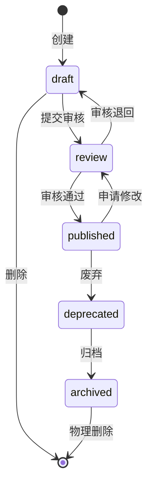

**自动化机制：**

1. **自动流转触发器**

   - 定时检查废弃元数据，超期自动归档
   - 长期未使用的元数据自动标记为待废弃
   - 依赖关系变更时自动触发影响分析
2. **版本管理与生命周期联动**

   - 新版本发布时自动将旧版本标记为deprecated
   - 支持多版本并行的生命周期管理
   - 版本回滚时自动恢复相应的生命周期状态
3. **生命周期权限控制**

   - 不同状态下的操作权限动态管控
   - 状态流转的审批流程可配置
   - 关键状态变更的审计日志记录

**配置示例：**

```json
{
  "lifecycleConfig": {
    "autoArchiveDays": 90,
    "deprecatedWarningDays": 30,
    "approvalRequired": ["draft->published", "published->deprecated"],
    "autoTransitions": [
      {
        "from": "deprecated",
        "to": "archived", 
        "condition": "unusedDays > 90",
        "schedule": "daily"
      }
    ]
  }
}
```

**本节小结：**

- 元模型结构清晰，字段定义明确，便于自动化建模和统一治理。
- 生命周期管理机制确保元数据的质量控制和有序演进。

### 3.4 典型元数据类型设计

本章归纳各类典型元数据（业务规则、权限、UI、数据服务等）的结构化设计、字段定义和典型应用，便于后续功能实现章节引用。

#### 3.4.1 业务规则元数据设计

- **结构示例**：

```json
{
  "id": "rule_username_unique",
  "name": "用户名唯一性校验",
  "type": "校验",
  "scope": "User.username",
  "expression": "isUnique('User', 'username')",
  "message": "用户名已存在，请更换！",
  "enabled": true,
  "priority": 1,
  "trigger": "onSave"
}
```

- **字段定义**：

  - id：规则唯一标识
  - name：规则名称
  - type：规则类型（如校验、约束、自动化、流程、权限等）
  - scope：作用范围（如实体、字段、关系、全局等）
  - expression：规则表达式（如逻辑表达式、脚本、DSL等）
  - message：校验或执行失败时的提示信息
  - enabled：是否启用
  - priority：优先级
  - trigger：触发条件（如事件、状态变更等）
- **典型应用**：

  - 表单校验、业务流程自动化、动态约束、审批流控制等。

#### 3.4.2 权限元数据设计

- **结构示例**：

```json
{
  "subject": "role_admin",
  "object": "User.email",
  "action": "read",
  "scope": "字段级",
  "policy": "RBAC",
  "condition": "true",
  "masking": false
}
```

- **字段定义**：

  - subject：权限主体（如用户、角色）
  - object：权限对象（如实体、字段）
  - action：操作类型（如read、write、delete等）
  - scope：控制粒度（如实体级、字段级等）
  - policy：权限策略（如RBAC、ABAC等）
  - condition：附加条件表达式
  - masking：是否脱敏
- **典型应用**：

  - 字段级权限控制、数据脱敏、动态授权、合规审计等。

#### 3.4.3 UI元数据设计

**设计理念：**

- UI静态页面基于元数据编译生成，避免重复渲染
- 支持主题化、多租户UI定制
- 分层缓存策略提升渲染性能

**UI元数据结构示例：**

```json
{
  "pageMetadata": {
    "pageId": "user_management", 
    "version": "1.2.0",
    "title": "用户管理",
    "layout": {
      "type": "grid",
      "columns": 12,
      "responsive": true
    },
    "theme": "default"
  },
  "componentMetadata": [
    {
      "id": "search_form",
      "type": "SearchForm", 
      "position": {"row": 1, "col": 1, "span": 12},
      "props": {
        "fields": [
          {
            "name": "email",
            "label": "邮箱",
            "inputType": "email",
            "validation": {
              "required": true,
              "pattern": "^\\S+@\\S+\\.\\S+$"
            }
          }
        ],
        "layout": "inline"
      }
    }
  ]
}
```

**字段定义：**

- **pageMetadata**：页面级元数据，包含页面标识、版本、标题、布局、主题等
- **componentMetadata**：组件级元数据，包含组件类型、位置、属性、字段配置等
- **layout**：布局配置，支持网格、响应式等布局方式
- **theme**：主题配置，支持多主题切换
- **validation**：校验规则，支持字段级校验配置

**典型应用：**

- 动态表单生成、页面布局配置、组件库管理、主题定制等

#### 3.4.4 数据实例管理设计

> 本节描述基于元数据的数据实例管理机制。**注意：数据实例管理仅归属于数据服务模块，元数据管理模块不涉及数据实例的管理。**

**概念澄清：**

- 元数据：定义数据结构和规则的数据（如User实体定义），由元数据管理模块负责
- 数据实例：基于元数据创建的具体数据（如某个用户记录），由数据服务模块负责管理
- 数据实例管理：对数据实例的生命周期、状态、质量进行管理，**仅归属于数据服务模块**

**数据实例结构示例：**

```json
{
  "instanceId": "user_inst_001",
  "metadataId": "User",
  "metadataVersion": "1.2.0",
  "businessData": {
    "username": "张三",
    "email": "zhangsan@example.com",
    "phone": "13800138000"
  },
  "instanceMetaInfo": {
    "status": "active",
    "lifecycle": "published",
    "version": 1,
    "createdBy": "admin",
    "createdAt": "2024-06-01T10:00:00Z",
    "updatedAt": "2024-06-02T14:30:00Z",
    "qualityScore": 95,
    "tags": ["vip", "active"],
    "tenantId": "tenant_001"
  }
}
```

**字段定义：**

- instanceId：数据实例唯一标识
- metadataId：关联的元数据定义ID
- metadataVersion：使用的元数据版本
- businessData：实际的业务数据内容
- instanceMetaInfo：数据实例的管理信息
  - status：运行状态（active/inactive/locked）
  - lifecycle：生命周期状态（draft/published/deprecated）
  - version：数据实例版本号
  - qualityScore：数据质量评分

**数据实例生命周期管理：**

| 状态       | 描述     | 允许操作         | 自动流转条件     |
| ---------- | -------- | ---------------- | ---------------- |
| draft      | 草稿数据 | 编辑、删除、发布 | 创建时初始状态   |
| published  | 已发布   | 查看、使用、修改 | 通过校验后发布   |
| deprecated | 已废弃   | 查看、归档       | 业务规则标记废弃 |
| archived   | 已归档   | 查看（只读）     | 废弃后定期归档   |

**治理能力：**

- 多数据源支持：统一管理来自不同数据源的实例
- 动态结构适配：支持元数据变更后的数据结构适配
- 数据质量监控：基于规则的数据质量评分和监控
- 审计追踪：完整的数据变更历史记录
- 权限控制：基于元数据权限配置的实例级权限控制

> 重要说明：以上数据实例管理功能均由数据服务模块提供，元数据管理模块不涉及数据实例的任何管理操作。

#### 3.4.5 流程元数据设计

- **结构示例**：

```json
{
  "id": "process_001",
  "name": "用户注册审批流程",
  "description": "新用户注册的多级审批流程",
  "steps": [
    {
      "stepId": "start",
      "type": "startEvent",
      "name": "开始"
    },
    {
      "stepId": "fillForm",
      "type": "userTask",
      "name": "填写注册信息",
      "assignee": "applicant",
      "formRef": "userRegisterForm",
      "rules": ["rule_check_email", "rule_check_phone"]
    },
    {
      "stepId": "review",
      "type": "userTask",
      "name": "信息审核",
      "assignee": "admin",
      "conditions": [
        {
          "expression": "input.score >= 80",
          "to": "approve"
        },
        {
          "expression": "input.score < 80",
          "to": "reject"
        }
      ]
    },
    {
      "stepId": "approve",
      "type": "endEvent",
      "name": "审批通过"
    },
    {
      "stepId": "reject",
      "type": "endEvent",
      "name": "审批拒绝"
    },
    {
      "stepId": "子流程-材料补充",
      "type": "subProcess",
      "name": "材料补充子流程",
      "processRef": "process_material_supplement"
    }
  ],
  "variables": [
    {
      "name": "score",
      "type": "Integer",
      "defaultValue": 0
    }
  ],
  "events": [
    {
      "type": "processCompleted",
      "action": "sendNotification"
    }
  ]
}
```

- **字段定义**：

  - id：流程唯一标识
  - name：流程名称
  - description：流程描述
  - steps：流程步骤定义
    - stepId：步骤唯一标识
    - type：步骤类型（startEvent、userTask、serviceTask、endEvent等）
    - name：步骤名称
    - assignee：处理人（用户、角色、表达式）
    - formRef：关联表单引用
    - rules：关联规则列表
    - conditions：条件分支定义
  - variables：流程变量定义
  - events：流程事件定义
- **典型应用**：

  - 用户注册审批、请假流程、订单处理、自动化业务流、复杂多级审批、动态表单驱动流程、流程实例监控与追踪等。

### 3.5 数据流设计

#### 3.5.1 数据采集流

**元数据采集流程：**

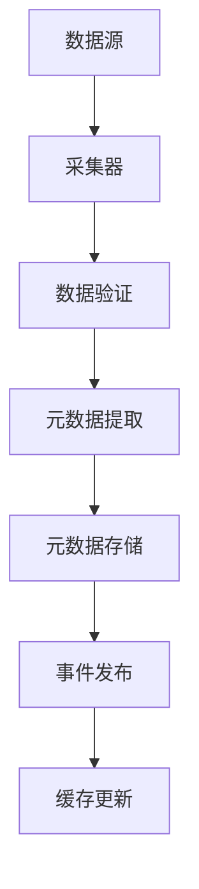

- **数据源**：数据库、API、文件、消息队列等
- **采集器**：自动发现和采集元数据信息
- **数据验证**：验证采集数据的完整性和准确性
- **元数据提取**：从原始数据中提取元数据信息
- **元数据存储**：持久化到元数据存储
- **事件发布**：通过aixone-event-sdk发布元数据变更事件
- **缓存更新**：更新相关缓存

#### 3.5.2 数据处理流

**元数据处理流程：**

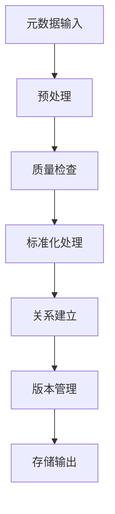

- **预处理**：数据清洗、格式转换
- **质量检查**：数据质量评分和验证
- **标准化处理**：统一数据格式和标准
- **关系建立**：建立元数据间的关系
- **版本管理**：版本控制和历史追踪
- **存储输出**：持久化处理结果

#### 3.5.3 数据分发流

**元数据分发流程：**

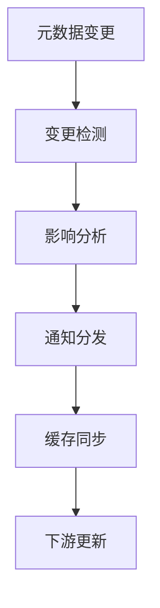

- **变更检测**：检测元数据变更事件
- **影响分析**：分析变更对下游系统的影响
- **通知分发**：向相关系统发送变更通知
- **缓存同步**：同步相关缓存
- **下游更新**：更新下游系统

#### 3.5.4 数据血缘追踪

**数据血缘关系设计：**

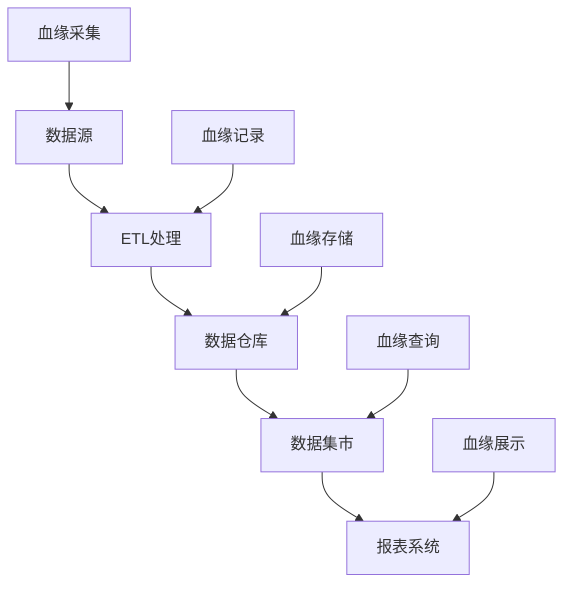

- **血缘采集**：自动采集数据血缘信息
- **血缘记录**：记录数据处理过程中的血缘关系
- **血缘存储**：持久化血缘关系数据
- **血缘查询**：提供血缘关系查询接口
- **血缘展示**：可视化展示血缘关系

### 3.6 数据存储设计

#### 3.6.1 存储策略

**分层存储架构：**

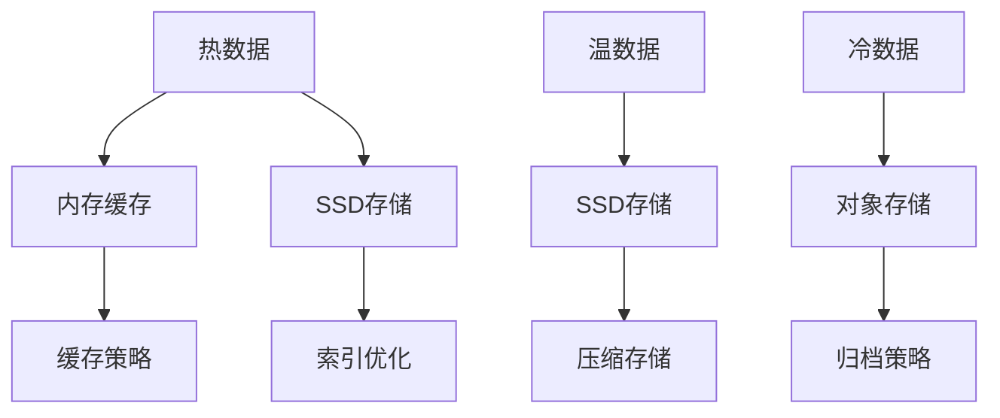

- **热数据**：频繁访问的元数据，存储在内存和SSD
- **温数据**：中等访问频率的元数据，存储在SSD
- **冷数据**：低频访问的元数据，存储在对象存储

#### 3.6.2 分表分库设计

**元数据分表策略：**

```json
{
  "tableSharding": {
    "meta_objects": {
      "strategy": "hash",
      "key": "tenant_id",
      "shards": 16
    },
    "meta_attributes": {
      "strategy": "hash", 
      "key": "object_id",
      "shards": 32
    },
    "meta_relations": {
      "strategy": "hash",
      "key": "source_id",
      "shards": 16
    }
  }
}
```

- **分表策略**：基于租户ID、对象ID等进行分表
- **分库策略**：基于业务域进行分库
- **路由策略**：统一的路由和负载均衡

#### 3.6.3 缓存策略

**多层缓存架构：**

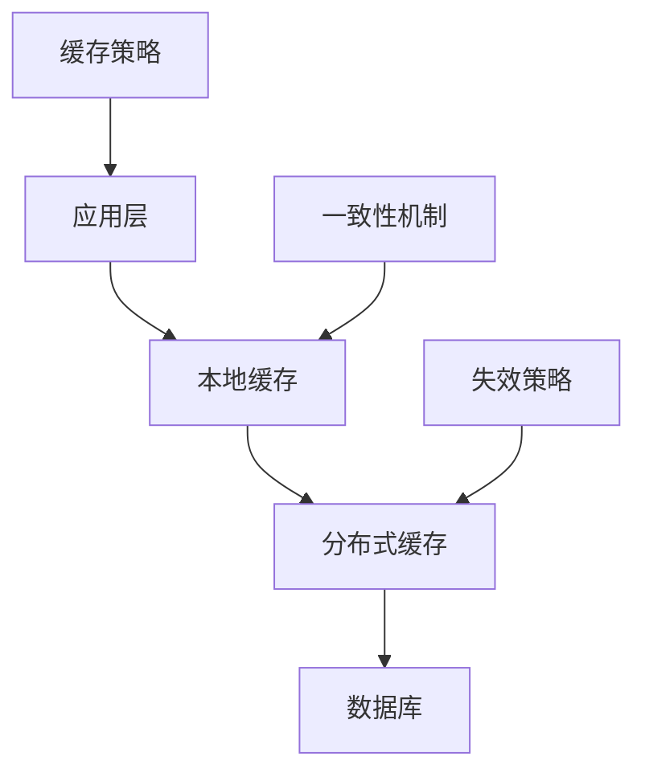

- **本地缓存**：应用内缓存，提升访问速度
- **分布式缓存**：Redis集群，提供共享缓存
- **缓存策略**：LRU、LFU等缓存淘汰策略
- **一致性机制**：缓存与数据库的一致性保证

#### 3.6.4 备份恢复

**备份策略设计：**

```json
{
  "backupStrategy": {
    "fullBackup": {
      "schedule": "daily",
      "retention": "30 days",
      "storage": "object_storage"
    },
    "incrementalBackup": {
      "schedule": "hourly",
      "retention": "7 days",
      "storage": "object_storage"
    },
    "pointInTimeRecovery": {
      "enabled": true,
      "retention": "7 days"
    }
  }
}
```

- **全量备份**：每日全量备份，保留30天
- **增量备份**：每小时增量备份，保留7天
- **时间点恢复**：支持任意时间点恢复

### 3.7 数据治理设计

#### 3.7.1 数据质量管理

**数据质量评估框架：**

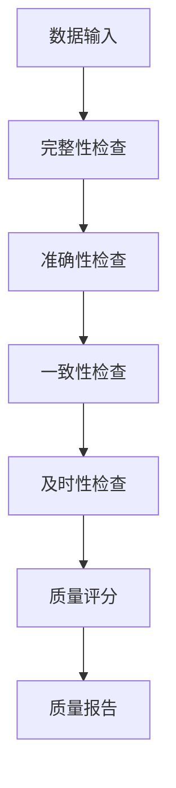

- **完整性检查**：检查数据是否完整
- **准确性检查**：检查数据是否准确
- **一致性检查**：检查数据是否一致
- **及时性检查**：检查数据是否及时
- **质量评分**：综合评估数据质量
- **质量报告**：生成质量报告

#### 3.7.2 数据安全管理

**数据安全框架：**

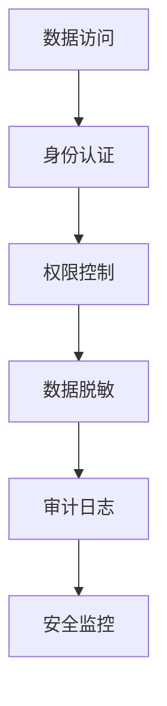

- **身份认证**：用户身份验证
- **权限控制**：基于角色的权限控制
- **数据脱敏**：敏感数据脱敏处理
- **审计日志**：记录数据访问日志
- **安全监控**：实时安全监控

#### 3.7.3 数据生命周期管理

**数据生命周期策略：**

```json
{
  "lifecyclePolicy": {
    "active": {
      "duration": "2 years",
      "action": "archive"
    },
    "archived": {
      "duration": "5 years", 
      "action": "delete"
    },
    "deleted": {
      "duration": "1 year",
      "action": "purge"
    }
  }
}
```

- **活跃期**：数据活跃使用期，2年
- **归档期**：数据归档期，5年
- **删除期**：数据删除期，1年

#### 3.7.4 数据合规管理

**合规检查框架：**

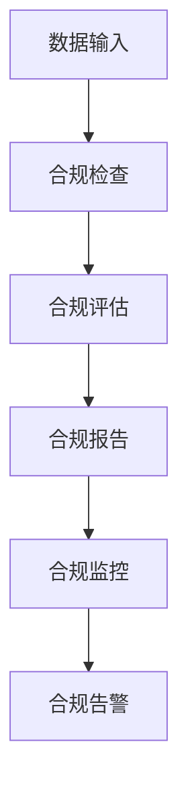

- **合规检查**：检查数据是否符合合规要求
- **合规评估**：评估数据合规风险
- **合规报告**：生成合规报告
- **合规监控**：持续合规监控
- **合规告警**：合规风险告警

### 3.8 元数据依赖管理机制

元数据间的依赖关系管理是确保系统一致性和变更安全性的核心机制。

#### 3.8.1 依赖关系建模

**依赖类型定义：**

| 依赖类型    | 描述     | 影响程度                             | 示例           |
| ----------- | -------- | ------------------------------------ | -------------- |
| strong      | 强依赖   | 被依赖对象删除会导致依赖对象无法使用 | 实体依赖其字段 |
| weak        | 弱依赖   | 被依赖对象变更可能影响功能但不致命   | 表单引用字典值 |
| conditional | 条件依赖 | 在特定条件下才产生依赖关系           | 规则条件依赖   |
| circular    | 循环依赖 | 相互依赖形成环路，需要检测和阻断     | A依赖B，B依赖A |

**依赖关系存储结构：**

```json
{
  "id": "dep_001",
  "sourceId": "user_entity",
  "targetId": "email_field",
  "dependencyType": "strong",
  "version": ">=1.0.0",
  "condition": null,
  "weight": 10,
  "createdAt": "2024-06-01T10:00:00Z",
  "metadata": {
    "reason": "Entity contains field",
    "impact": "high"
  }
}
```

#### 3.8.2 循环依赖检测算法

**有向无环图(DAG)检测：**

```python
def detect_circular_dependency(dependencies):
    """
    使用深度优先搜索检测循环依赖
    """
    graph = build_dependency_graph(dependencies)
    visited = set()
    rec_stack = set()
  
    def dfs(node):
        if node in rec_stack:
            return True  # 发现循环依赖
        if node in visited:
            return False
  
        visited.add(node)
        rec_stack.add(node)
  
        for neighbor in graph.get(node, []):
            if dfs(neighbor):
                return True
  
        rec_stack.remove(node)
        return False
  
    for node in graph:
        if node not in visited:
            if dfs(node):
                return True
    return False
```

**循环依赖阻断机制：**

- 实时检测：元数据创建/修改时实时检测依赖环
- 预防性阻断：发现潜在循环依赖时阻止操作
- 依赖权重：通过权重优化依赖解析顺序
- 智能建议：提供依赖重构建议

#### 3.8.3 变更影响分析

**影响范围计算算法：**

```python
def analyze_change_impact(changed_object_id, dependency_graph):
    """
    分析变更影响范围
    """
    impact_tree = {
        "direct": [],      # 直接影响
        "indirect": [],    # 间接影响  
        "conditional": []  # 条件影响
    }
  
    def traverse_dependencies(obj_id, depth=0, max_depth=5):
        if depth > max_depth:
            return
  
        for dep in get_dependencies(obj_id):
            impact_level = calculate_impact_level(dep)
            target_id = dep.target_id
  
            if depth == 0:
                impact_tree["direct"].append({
                    "id": target_id,
                    "type": dep.type,
                    "impact": impact_level
                })
            else:
                impact_tree["indirect"].append({
                    "id": target_id, 
                    "depth": depth,
                    "impact": impact_level
                })
  
            traverse_dependencies(target_id, depth + 1)
  
    traverse_dependencies(changed_object_id)
    return impact_tree
```

**变更风险评级：**

| 风险等级 | 影响范围    | 风险描述             | 处理策略               |
| -------- | ----------- | -------------------- | ---------------------- |
| LOW      | <5个对象    | 影响范围小，风险可控 | 允许变更，记录日志     |
| MEDIUM   | 5-20个对象  | 中等影响，需要评估   | 需要审批，通知相关人员 |
| HIGH     | 20-50个对象 | 影响较大，风险较高   | 严格审批，制定回滚计划 |
| CRITICAL | >50个对象   | 影响巨大，风险极高   | 阻止变更，需要专项评估 |

#### 3.8.4 依赖版本兼容性管理

**版本兼容性规则：**

```json
{
  "compatibilityRules": {
    "major": "breaking_change",      // 主版本不兼容
    "minor": "backward_compatible",  // 次版本向后兼容  
    "patch": "fully_compatible"      // 补丁版本完全兼容
  },
  "versionConstraints": {
    "strict": "=1.2.3",            // 严格版本匹配
    "compatible": "~1.2.0",         // 兼容版本范围
    "minimum": ">=1.0.0"            // 最低版本要求
  }
}
```

**依赖冲突解决策略：**

- 版本协商：自动选择兼容的最高版本
- 冲突预警：版本不兼容时提前预警
- 强制升级：关键依赖的强制版本升级
- 降级保护：防止意外的版本降级

---

## 4. 模块设计

> 说明：平台通用支撑能力（如统一认证、配置、监控、消息等）由平台统一实现，元数据服务通过integration模块与这些能力集成，无需在本模块体系中重复实现。本章仅描述元数据服务自身的业务模块设计。API适配（如REST/gRPC接口、参数校验、DTO转换等）作为各业务模块的接口层实现，无需单独设API适配层模块。如未来需支持多协议适配或统一API管理，可再单独抽象相关模块。

### 4.1 元数据管理模块

#### 4.1.1 模块职责与边界

| 只负责                                               | 不负责                                       |
| ---------------------------------------------------- | -------------------------------------------- |
| 元数据对象的建模、管理、分类、变更、版本、查询与扩展 | 规则、流程、权限、数据实例等能力的实现与编排 |

> 本模块只负责元数据本身的生命周期管理，不涉及任何业务规则、流程、权限、数据实例的管理与实现。

#### 4.1.2 主要接口设计（接口层）

- **元数据定义接口**
  - createMetadata
  - updateMetadata
  - deleteMetadata
  - getMetadata
- **元数据分类与查询接口**
  - listMetadataByType
  - searchMetadata
- **元数据版本管理接口**
  - getMetadataVersionHistory
  - rollbackMetadataVersion
- **元数据校验与预览接口**
  - validateMetadata
  - previewMetadata

#### 4.1.3 应用服务设计（应用层）

- **MetadataApplicationService**
  - createMetadata(dto)：参数校验→领域服务校验→构建聚合根→持久化→返回DTO
  - updateMetadata(id, dto)：加载聚合根→参数校验→领域服务校验→变更聚合根→版本管理→持久化→返回DTO
  - deleteMetadata(id)：加载聚合根→依赖分析→软删除/级联删除→持久化
  - getMetadata(id)：加载聚合根→组装DTO返回
  - listMetadataByType(type)：条件过滤→分页查询→组装DTO列表
  - searchMetadata(query)：全文检索→组装DTO列表
  - getMetadataVersionHistory(id)：加载历史版本→组装版本列表
  - rollbackMetadataVersion(id, version)：加载历史版本→回滚聚合根→持久化
  - validateMetadata(dto)：参数校验→领域服务校验→返回校验结果
  - previewMetadata(dto)：参数校验→依赖分析→返回变更预览

#### 4.1.4 领域对象与领域服务设计

**领域服务总体描述**
领域服务（Domain Service）负责实现元数据管理中的核心业务规则与复杂操作，如校验、版本管理、依赖分析、预览等。领域服务通常无状态，聚焦于业务规则的实现，与聚合根、实体等领域对象协作，确保业务一致性。

**领域服务方法一览表**

| 服务名称     | 方法名/职责         | 输入参数类型 | 输出类型         | 核心逻辑简述                           | 关键校验/异常处理      |
| ------------ | ------------------- | ------------ | ---------------- | -------------------------------------- | ---------------------- |
| 校验服务     | validate            | MetadataDTO  | ValidationResult | 校验元数据对象的完整性、唯一性、约束等 | 唯一性、必填、约束冲突 |
| 版本管理服务 | createVersion       | MetadataDTO  | VersionDTO       | 生成新版本、保存历史、返回新版本       | 版本号递增、历史一致性 |
| 依赖分析服务 | analyzeDependencies | MetadataDTO  | DependencyResult | 分析元数据间依赖关系，输出依赖树       | 循环依赖、缺失依赖     |
| 预览服务     | preview             | MetadataDTO  | PreviewResult    | 变更前后对比、影响分析                 | -                      |

##### 1. MetaObject（元数据聚合根）

| 字段名          | 类型                     | 说明                          | 设计依据    |
| --------------- | ------------------------ | ----------------------------- | ----------- |
| id              | String                   | 唯一标识                      | 2.3.2/2.2.3 |
| name            | String                   | 元数据名称                    | 2.3.2       |
| type            | String                   | 主类型（业务/技术/管理/参考） | 2.2.1/2.3.2 |
| subType         | String                   | 子类型                        | 2.2.1       |
| status          | String                   | 状态（草稿/生效/废弃等）      | 2.3.2       |
| version         | Integer                  | 版本号                        | 2.3.2       |
| attributes      | List `<MetaAttribute>` | 属性列表                      | 2.3.2/2.3.3 |
| relations       | List `<MetaRelation>`  | 关系列表                      | 2.3.3       |
| rules           | List `<MetaRule>`      | 规则列表                      | 2.3.4       |
| extensions      | List `<MetaExtension>` | 扩展点列表                    | 2.2.5/2.3.5 |
| tenantId        | String                   | 租户ID，多租户支持            | 2.2.2       |
| i18n            | Map<String,String>       | 多语言支持                    | 2.2.2       |
| extensionFields | Map<String,Object>       | 扩展字段                      | 2.2.2/2.3.2 |
| createTime      | DateTime                 | 创建时间                      | 通用        |
| updateTime      | DateTime                 | 更新时间                      | 通用        |

##### 2. MetaAttribute（属性对象）

| 字段名          | 类型               | 说明                          | 设计依据    |
| --------------- | ------------------ | ----------------------------- | ----------- |
| name            | String             | 属性名                        | 2.3.2       |
| label           | String             | 展示标签                      | 2.3.2       |
| type            | String             | 数据类型（string/int/enum等） | 2.3.2       |
| required        | Boolean            | 是否必填                      | 2.3.2       |
| defaultValue    | Object             | 默认值                        | 2.3.2       |
| constraints     | List `<String>`  | 约束（唯一、范围等）          | 2.3.2       |
| i18n            | Map<String,String> | 多语言支持                    | 2.2.2       |
| extensionFields | Map<String,Object> | 扩展字段                      | 2.2.2/2.3.2 |

##### 3. MetaRelation（关系对象）

| 字段名          | 类型               | 说明                    | 设计依据    |
| --------------- | ------------------ | ----------------------- | ----------- |
| sourceId        | String             | 源对象ID                | 2.3.3       |
| targetId        | String             | 目标对象ID              | 2.3.3       |
| type            | String             | 关系类型（依赖/引用等） | 2.3.3       |
| direction       | String             | 方向（单向/双向）       | 2.3.3       |
| constraints     | List `<String>`  | 约束                    | 2.3.3       |
| extensionFields | Map<String,Object> | 扩展字段                | 2.2.2/2.3.3 |

##### 4. MetaRule（规则对象）

| 字段名          | 类型               | 说明                    | 设计依据    |
| --------------- | ------------------ | ----------------------- | ----------- |
| ruleType        | String             | 规则类型（校验/依赖等） | 2.3.4       |
| expression      | String             | 规则表达式              | 2.3.4       |
| errorMessage    | String             | 校验失败提示            | 2.3.4       |
| extensionFields | Map<String,Object> | 扩展字段                | 2.2.2/2.3.4 |

##### 5. MetaExtension（扩展点对象）

| 字段名 | 类型   | 说明       | 设计依据    |
| ------ | ------ | ---------- | ----------- |
| key    | String | 扩展点标识 | 2.2.5/2.3.5 |
| value  | Object | 扩展值     | 2.2.5/2.3.5 |
| type   | String | 扩展类型   | 2.2.5/2.3.5 |
| scope  | String | 作用域     | 2.2.5/2.3.5 |

> 以上领域对象均支持extensionFields（扩展字段）、i18n（多语言）、多租户、版本等横向能力，聚合关系见MetaObject属性。

#### 4.1.5 典型业务流程

- **创建元数据**：参数校验→唯一性校验→权限校验→构建聚合根→持久化→审计记录→返回结果
- **变更元数据**：加载聚合根→参数校验→权限校验→变更属性/关系/规则→版本管理→持久化→审计记录
- **删除元数据**：加载聚合根→权限校验→依赖分析→软删除/级联删除→持久化→审计记录→返回结果
- **查询/检索元数据**：参数校验→权限校验→条件过滤/分页/全文检索→组装DTO列表→返回结果
- **版本管理**：版本对比/差异分析、回滚版本、校验与预览等操作

> 所有操作均通过aixone-event-sdk发布审计事件，支持异常处理和补偿机制。

### 4.2 业务规则引擎模块

#### 4.2.1 模块职责与边界

| 只负责                                             | 不负责                                                      |
| -------------------------------------------------- | ----------------------------------------------------------- |
| 规则的建模、管理与执行（表达式、决策表、规则流等） | 主线流转、能力聚合、API编排、元数据管理、数据服务、权限管理 |

> 本模块仅作为被编排能力节点被能力集成与编排模块调用，不直接参与主线流转与能力聚合。

#### 4.2.2 主要接口设计（接口层）

| 接口名称     | 方法 | 路径                 | 说明              |
| ------------ | ---- | -------------------- | ----------------- |
| 创建规则     | POST | /rules               | 新建业务规则      |
| 更新规则     | PUT  | /rules/{id}          | 更新规则内容      |
| 执行规则     | POST | /rules/{id}/execute  | 执行业务规则      |
| 回滚规则     | POST | /rules/{id}/rollback | 回滚到历史版本    |
| 获取规则详情 | GET  | /rules/{id}          | 获取规则详细信息  |
| 查询规则列表 | GET  | /rules               | 分页/条件查询规则 |

#### 4.2.3 应用服务设计（应用层）

业务规则引擎应用层负责规则的创建、发布、执行、回滚等核心用例，确保规则生命周期管理和执行一致性。

| 方法名       | 输入参数类型                 | 输出类型           | 核心逻辑简述                                                | 关键校验/异常处理              |
| ------------ | ---------------------------- | ------------------ | ----------------------------------------------------------- | ------------------------------ |
| createRule   | CreateRuleCommand            | RuleDTO            | 参数校验→领域服务校验→构建聚合根→持久化→返回DTO         | 参数完整性、唯一性、约束       |
| updateRule   | String id, UpdateRuleCommand | RuleDTO            | 加载聚合根→参数校验→变更聚合根→版本管理→持久化→返回DTO | 版本冲突、权限、依赖分析       |
| executeRule  | String id, RuleInputDTO      | RuleResultDTO      | 加载聚合根→参数校验→领域服务执行→返回结果                | 规则不存在、输入校验、执行异常 |
| rollbackRule | String id, int version       | RuleDTO            | 加载历史版本→回滚聚合根→持久化→返回DTO                   | 版本合法性、权限               |
| getRule      | String id                    | RuleDTO            | 加载聚合根→组装DTO→返回                                   | 不存在、权限                   |
| listRules    | RuleQuery                    | List `<RuleDTO>` | 条件过滤→分页→组装DTO列表                                 | 查询条件合法性                 |

#### 4.2.4 领域对象与领域服务设计

- **领域对象属性表**

| 对象名       | 字段名          | 类型               | 说明                        |
| ------------ | --------------- | ------------------ | --------------------------- |
| Rule         | id              | String             | 规则唯一标识                |
|              | name            | String             | 规则名称                    |
|              | type            | String             | 规则类型（表达式/决策表等） |
|              | expression      | String             | 规则表达式/内容             |
|              | status          | String             | 状态（草稿/生效/废弃等）    |
|              | version         | Integer            | 版本号                      |
|              | extensionFields | Map<String,Object> | 扩展字段                    |
|              | createdAt       | DateTime           | 创建时间                    |
|              | updatedAt       | DateTime           | 更新时间                    |
| RuleSet      | id              | String             | 规则集唯一标识              |
|              | name            | String             | 规则集名称                  |
|              | rules           | List `<Rule>`    | 包含的规则列表              |
|              | status          | String             | 状态                        |
|              | version         | Integer            | 版本号                      |
| RuleInstance | id              | String             | 实例唯一标识                |
|              | ruleId          | String             | 关联规则ID                  |
|              | input           | Object             | 执行输入                    |
|              | output          | Object             | 执行输出                    |
|              | status          | String             | 执行状态                    |
|              | executedAt      | DateTime           | 执行时间                    |

- **领域服务方法表**

| 服务名称     | 方法名/职责   | 输入参数类型          | 输出类型         | 核心逻辑简述                         | 关键校验/异常处理      |
| ------------ | ------------- | --------------------- | ---------------- | ------------------------------------ | ---------------------- |
| 校验服务     | validate      | RuleDTO               | ValidationResult | 校验规则对象的完整性、唯一性、约束等 | 唯一性、必填、约束冲突 |
| 执行服务     | execute       | RuleDTO, RuleInputDTO | RuleResultDTO    | 执行规则表达式/决策表，返回执行结果  | 执行异常、输入校验     |
| 版本管理服务 | createVersion | RuleDTO               | VersionDTO       | 生成新版本、保存历史、返回新版本     | 版本号递增、历史一致性 |

#### 4.2.5 典型业务流程

- **规则创建**：参数校验→唯一性校验→构建聚合根→持久化→返回结果
  - 常见异常/分支：参数不合法（返回错误）、唯一性冲突（返回错误）、持久化失败（回滚并告警）
- **规则更新**：加载聚合根→参数校验→变更聚合根→版本管理→持久化
  - 常见异常/分支：规则不存在、参数不合法、版本冲突、持久化失败
- **规则执行**：加载聚合根→参数校验→领域服务执行→返回结果
  - 常见异常/分支：规则不存在、输入校验失败、执行异常
- **规则回滚**：加载历史版本→回滚聚合根→持久化
  - 常见异常/分支：版本不存在、回滚失败、持久化失败

### 4.3 流程引擎模块

#### 4.3.1 模块定位说明

- 流程引擎作为元数据服务的**核心业务模块**，专注于流程的建模、管理与执行
- 基于元数据驱动的流程定义，支持动态流程配置和流转控制
- 作为能力节点被集成模块调用，提供流程执行能力，不直接参与主线流转

#### 4.3.2 模块职责与边界

| 只负责                                                 | 不负责                                                      |
| ------------------------------------------------------ | ----------------------------------------------------------- |
| 流程的建模、管理与执行（如BPMN、流程流转、任务分派等） | 主线流转、能力聚合、API编排、元数据管理、数据服务、权限管理 |

> 本模块仅作为被编排能力节点被能力集成与编排模块调用，不直接参与主线流转与能力聚合。

#### 4.3.3 主要接口设计（接口层）

| 接口名称         | 方法 | 路径                              | 说明                  |
| ---------------- | ---- | --------------------------------- | --------------------- |
| 创建流程定义     | POST | /process-definitions              | 新建流程定义          |
| 更新流程定义     | PUT  | /process-definitions/{id}         | 更新流程定义内容      |
| 发布流程定义     | POST | /process-definitions/{id}/publish | 发布流程定义          |
| 启动流程实例     | POST | /process-instances                | 启动流程实例          |
| 查询流程实例     | GET  | /process-instances/{id}           | 获取流程实例详情      |
| 流转任务         | POST | /tasks/{id}/complete              | 完成并流转任务        |
| 回滚流程实例     | POST | /process-instances/{id}/rollback  | 回滚流程实例          |
| 查询流程定义     | GET  | /process-definitions/{id}         | 获取流程定义详情      |
| 查询流程定义列表 | GET  | /process-definitions              | 分页/条件查询流程定义 |

#### 4.3.4 应用服务设计（应用层）

流程引擎应用层负责流程定义、发布、实例启动、流转、回滚等核心用例，确保流程生命周期管理和执行一致性。

| 方法名              | 输入参数类型                       | 输出类型                 | 核心逻辑简述                                                | 关键校验/异常处理        |
| ------------------- | ---------------------------------- | ------------------------ | ----------------------------------------------------------- | ------------------------ |
| createProcessDef    | CreateProcessDefCommand            | ProcessDefDTO            | 参数校验→领域服务校验→构建聚合根→持久化→返回DTO         | 参数完整性、唯一性、约束 |
| updateProcessDef    | String id, UpdateProcessDefCommand | ProcessDefDTO            | 加载聚合根→参数校验→变更聚合根→版本管理→持久化→返回DTO | 版本冲突、权限、依赖分析 |
| publishProcessDef   | String id                          | ProcessDefDTO            | 加载聚合根→发布状态变更→持久化→返回DTO                   | 状态校验、权限           |
| startProcessInst    | StartProcessInstCommand            | ProcessInstDTO           | 参数校验→加载流程定义→创建实例→持久化→返回DTO           | 流程定义不存在、参数校验 |
| completeTask        | String id, CompleteTaskCommand     | TaskDTO                  | 加载任务→参数校验→流转任务→持久化→返回DTO               | 任务不存在、状态校验     |
| rollbackProcessInst | String id, int version             | ProcessInstDTO           | 加载历史实例→回滚聚合根→持久化→返回DTO                   | 版本合法性、权限         |
| getProcessDef       | String id                          | ProcessDefDTO            | 加载聚合根→组装DTO→返回                                   | 不存在、权限             |
| listProcessDefs     | ProcessDefQuery                    | List `<ProcessDefDTO>` | 条件过滤→分页→组装DTO列表                                 | 查询条件合法性           |

#### 4.3.5 领域对象与领域服务设计

- **领域对象属性表**

| 对象名            | 字段名          | 类型               | 说明                     |
| ----------------- | --------------- | ------------------ | ------------------------ |
| ProcessDefinition | id              | String             | 流程定义唯一标识         |
|                   | name            | String             | 流程名称                 |
|                   | bpmnXml         | String             | BPMN/XML定义内容         |
|                   | status          | String             | 状态（草稿/发布/废弃等） |
|                   | version         | Integer            | 版本号                   |
|                   | extensionFields | Map<String,Object> | 扩展字段                 |
|                   | createdAt       | DateTime           | 创建时间                 |
|                   | updatedAt       | DateTime           | 更新时间                 |
| ProcessInstance   | id              | String             | 实例唯一标识             |
|                   | processDefId    | String             | 关联流程定义ID           |
|                   | status          | String             | 实例状态                 |
|                   | currentTaskId   | String             | 当前任务ID               |
|                   | startedAt       | DateTime           | 启动时间                 |
|                   | endedAt         | DateTime           | 结束时间                 |
|                   | extensionFields | Map<String,Object> | 扩展字段                 |
| Task              | id              | String             | 任务唯一标识             |
|                   | processInstId   | String             | 关联流程实例ID           |
|                   | name            | String             | 任务名称                 |
|                   | assignee        | String             | 任务负责人               |
|                   | status          | String             | 任务状态                 |
|                   | startedAt       | DateTime           | 启动时间                 |
|                   | completedAt     | DateTime           | 完成时间                 |
|                   | extensionFields | Map<String,Object> | 扩展字段                 |

- **领域服务方法表**

| 服务名称     | 方法名/职责   | 输入参数类型                   | 输出类型         | 核心逻辑简述                             | 关键校验/异常处理        |
| ------------ | ------------- | ------------------------------ | ---------------- | ---------------------------------------- | ------------------------ |
| 校验服务     | validate      | ProcessDefDTO                  | ValidationResult | 校验流程定义对象的完整性、唯一性、约束等 | 唯一性、必填、约束冲突   |
| 流转服务     | transit       | ProcessInstance, Task, Command | TaskDTO          | 任务流转、状态变更、分派、事件触发       | 状态校验、权限、分支异常 |
| 版本管理服务 | createVersion | ProcessDefDTO                  | VersionDTO       | 生成新版本、保存历史、返回新版本         | 版本号递增、历史一致性   |

#### 4.3.6 典型业务流程

- **流程定义创建**：参数校验→唯一性校验→构建聚合根→持久化→返回结果
  - 常见异常/分支：参数不合法（返回错误）、唯一性冲突（返回错误）、持久化失败（回滚并告警）
- **流程定义发布**：加载聚合根→发布状态变更→持久化
  - 常见异常/分支：流程定义不存在、状态冲突、持久化失败
- **流程实例启动**：参数校验→加载流程定义→创建实例→持久化→返回结果
  - 常见异常/分支：流程定义不存在、参数不合法、持久化失败
- **任务流转**：加载任务→参数校验→流转任务→持久化→返回结果
  - 常见异常/分支：任务不存在、状态冲突、分支异常、持久化失败
- **流程实例回滚**：加载历史实例→回滚聚合根→持久化
  - 常见异常/分支：版本不存在、回滚失败、持久化失败

### 4.4 权限与安全模块

#### 4.4.1 模块定位与边界

| 只负责                                       | 不负责                                                                              |
| -------------------------------------------- | ----------------------------------------------------------------------------------- |
| 基于元数据的权限点管理与平台权限服务集成适配 | 用户认证、角色管理、权限策略执行、主线流转、能力聚合、API编排、元数据管理、数据服务 |

> 本模块只负责权限点的定义、注册、同步和校验适配，不负责权限策略的具体执行和用户/角色管理。

#### 4.4.2 主要集成接口设计

| 接口名称    | 方法 | 路径/调用方式        | 说明                                  |
| ----------- | ---- | -------------------- | ------------------------------------- |
| 注册权限点  | POST | /permission/register | 注册元数据定义的权限点到权限服务      |
| 校验权限    | POST | /permission/check    | 校验用户/角色对权限点的访问权限       |
| 同步权限点  | POST | /permission/sync     | 批量同步/更新权限点                   |
| 查询权限点  | GET  | /permission/points   | 查询已注册的权限点                    |
| SDK权限校验 | 调用 | SDK接口              | 通过aixone-permission-sdk进行权限校验 |

#### 4.4.3 元数据驱动的权限机制

- 在元数据模型中为业务对象、操作、流程节点等定义"权限点"字段。
- 权限点通过接口/SDK注册到平台权限服务，形成统一权限模型。
- 业务流程、接口、流程节点等处，按元数据动态获取权限点，调用权限服务/SDK进行权限校验。
- 元数据变更时自动同步/注册新的权限点到权限服务，保持权限模型一致性。
- 所有权限相关操作由平台权限服务统一审计，审计日志通过aixone-event-sdk发布事件到事件中心。

#### 4.4.4 典型业务流程

- **业务对象操作权限校验**：接口/流程节点→获取元数据权限点→调用权限服务/SDK→返回校验结果
  - 常见异常/分支：权限点未注册（自动注册/报错）、权限校验失败（拒绝访问）、权限服务异常（降级/告警）
- **权限点注册/同步**：元数据变更→自动注册/同步到权限服务
  - 常见异常/分支：注册失败（重试/告警）、权限点冲突（合并/报错）

### 4.5 数据服务模块

#### 4.5.1 模块职责与边界

| 只负责                                                          | 不负责                                                                          |
| --------------------------------------------------------------- | ------------------------------------------------------------------------------- |
| 基于元数据驱动的动态数据操作（增删改查）、动态表单/报表数据管理 | 静态业务数据服务、业务逻辑处理、主线流转、能力聚合、API编排、规则/流程/权限实现 |

> 本模块专注于动态数据实例的管理，所有静态业务数据、复杂聚合、业务逻辑、主线流转等均不在本模块范围。

#### 4.5.2 关键类与接口示意

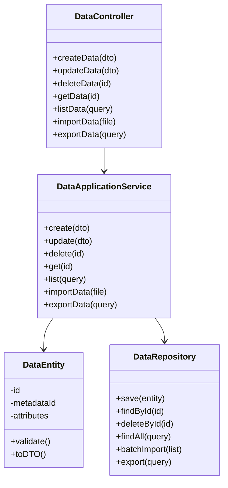

#### 4.5.3 典型流程（动态表单数据保存）

1. 接口层接收数据保存请求，参数校验，DTO转换
2. 应用层根据元数据结构编排数据保存流程
3. 领域层进行数据校验、动态结构处理，构建/变更数据实体
4. 通过仓储接口持久化到数据库
5. 返回结果

#### 4.5.4 与其他模块交互

- 与元数据管理模块集成，动态获取数据结构定义
- 与业务规则引擎模块协作，实现数据操作时的规则校验
- 与权限模块集成，控制数据的访问与操作权限
- 可与接口适配模块协作，对接外部系统数据

### 4.6 UI服务模块

#### 4.6.1 模块职责与边界

| 只负责                                 | 不负责                                                      |
| -------------------------------------- | ----------------------------------------------------------- |
| UI元数据的编译、缓存、渲染、主题管理等 | 主线流转、能力聚合、API编排、元数据管理、数据服务、权限管理 |

> 本模块负责UI元数据的编译和渲染，作为能力节点被集成模块调用，不直接参与主线流转与能力聚合。

#### 4.6.2 主要接口设计（接口层）

| 接口名称     | 方法 | 路径                 | 说明           |
| ------------ | ---- | -------------------- | -------------- |
| 编译UI元数据 | POST | /ui/compile          | 编译UI元数据   |
| 获取编译结果 | GET  | /ui/compiled/{id}    | 获取编译后的UI |
| 更新UI缓存   | POST | /ui/cache/update     | 更新UI缓存     |
| 获取主题配置 | GET  | /ui/themes/{themeId} | 获取主题配置   |
| 预览UI渲染   | POST | /ui/preview          | 预览UI渲染效果 |

#### 4.6.3 应用服务设计（应用层）

UI服务应用层负责UI元数据的编译、缓存、主题管理等核心用例。

| 方法名        | 输入参数类型   | 输出类型      | 核心逻辑简述                                       | 关键校验/异常处理        |
| ------------- | -------------- | ------------- | -------------------------------------------------- | ------------------------ |
| compileUI     | UIMetadataDTO  | CompiledUIDTO | 元数据验证→依赖分析→组件解析→样式编译→模板生成 | 元数据格式错误、依赖缺失 |
| getCompiledUI | String id      | CompiledUIDTO | 检查缓存→加载编译结果→返回                       | 缓存失效、编译结果不存在 |
| updateCache   | String id      | Boolean       | 更新缓存→同步分布式缓存                           | 缓存更新失败             |
| getTheme      | String themeId | ThemeDTO      | 加载主题配置→返回                                 | 主题不存在               |
| previewUI     | UIMetadataDTO  | PreviewResult | 编译UI→渲染预览→返回结果                         | 编译失败、渲染异常       |

#### 4.6.4 领域对象与领域服务设计

- **领域对象属性表**

| 对象名     | 字段名            | 类型                        | 说明             |
| ---------- | ----------------- | --------------------------- | ---------------- |
| UIMetadata | id                | String                      | UI元数据唯一标识 |
|            | pageMetadata      | PageMetadata                | 页面级元数据     |
|            | componentMetadata | List`<ComponentMetadata>` | 组件级元数据列表 |
|            | version           | Integer                     | 版本号           |
|            | tenantId          | String                      | 租户标识         |
| CompiledUI | id                | String                      | 编译结果唯一标识 |
|            | metadataId        | String                      | 关联UI元数据ID   |
|            | compiledContent   | String                      | 编译后的内容     |
|            | cacheKey          | String                      | 缓存键           |
|            | metadataHash      | String                      | 元数据哈希值     |
|            | expireAt          | DateTime                    | 过期时间         |
| Theme      | themeId           | String                      | 主题唯一标识     |
|            | themeName         | String                      | 主题名称         |
|            | styles            | Map<String,Object>          | 样式配置         |
|            | tenantId          | String                      | 租户标识         |

- **领域服务方法表**

| 服务名称 | 方法名/职责 | 输入参数类型            | 输出类型      | 核心逻辑简述           | 关键校验/异常处理    |
| -------- | ----------- | ----------------------- | ------------- | ---------------------- | -------------------- |
| 编译服务 | compile     | UIMetadataDTO           | CompiledUIDTO | UI元数据编译、模板生成 | 编译错误、依赖缺失   |
| 缓存服务 | cache       | CompiledUIDTO           | Boolean       | 编译结果缓存管理       | 缓存失败、存储异常   |
| 主题服务 | applyTheme  | CompiledUIDTO, ThemeDTO | CompiledUIDTO | 主题样式应用           | 主题不存在、样式冲突 |

#### 4.6.5 数据存储设计

**表结构设计：**

**ui_metadata_pages（页面级UI元数据）：**

- page_id：页面唯一标识，主键
- version：版本号
- metadata：JSON格式的页面元数据
- compiled_content：编译后的内容
- cache_key：缓存键
- tenant_id：租户标识
- created_at/updated_at：创建和更新时间

**ui_metadata_components（组件级UI元数据）：**

- component_id：组件唯一标识，主键
- component_type：组件类型
- metadata：JSON格式的组件元数据
- tenant_id：租户标识
- created_at：创建时间

**ui_metadata_themes（主题配置）：**

- theme_id：主题唯一标识，主键
- theme_name：主题名称
- styles：JSON格式的样式配置
- tenant_id：租户标识

**ui_cache_compiled（编译缓存）：**

- cache_key：缓存键，主键
- compiled_content：编译后的内容
- metadata_hash：元数据哈希值
- expire_at：过期时间

**设计要点：**

- 支持多租户隔离，每个表都包含tenant_id字段
- JSONB类型存储元数据，支持高效查询和索引
- 缓存机制，提升编译性能
- 版本管理，支持元数据变更追踪

#### 4.6.6 典型业务流程

- **UI编译**：元数据验证→依赖分析→组件解析→样式编译→模板生成→缓存存储
  - 常见异常/分支：元数据格式错误（返回错误）、依赖缺失（报错）、编译失败（重试）
- **缓存更新**：检测变更→更新缓存→同步分布式缓存
  - 常见异常/分支：缓存更新失败（重试）、同步失败（告警）

### 4.7 能力集成与编排模块（Integration & Orchestration Module）

#### 4.6.1 模块定位与边界

| 只负责                                    | 不负责                                     |
| ----------------------------------------- | ------------------------------------------ |
| 主线流转、能力聚合与对外API输出、协议适配 | 规则、流程、数据服务、权限等能力本身的实现 |

> 本模块是元数据驱动业务主线的实现枢纽，统一驱动各能力节点，避免能力重叠和边界模糊。

#### 4.6.2 主线流转与能力集成时序图

> 下图展示了主线流转过程中，integration-orchestration模块如何统一驱动各能力节点，各节点仅暴露标准接口，不直接参与主线业务流。

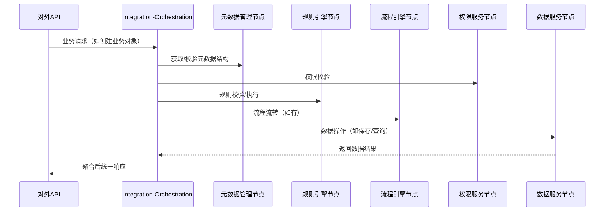

> 说明：
>
> - integration-orchestration模块负责主线流转、能力编排、API聚合。
> - 各能力节点（元数据、规则、流程、权限、数据）只暴露标准接口，由integration统一调用。
> - 能力节点之间无直接调用关系，所有主线流转均由integration-orchestration统一驱动。

#### 4.6.3 典型主线流转调用链伪代码

**主线流转处理流程设计：**

**处理步骤：**

1. **元数据结构校验**：根据请求中的元数据ID获取元数据结构定义
2. **权限校验**：检查用户对指定元数据和操作的权限
3. **规则校验**：根据元数据定义的规则对数据进行校验
4. **流程流转**：如果元数据定义了流程，则启动或推进流程
5. **数据操作**：执行实际的数据保存或查询操作
6. **聚合响应**：将处理结果统一封装后返回

**设计要点：**

- 统一的请求处理入口，确保所有业务请求都经过完整的校验流程
- 模块化设计，各能力节点独立，便于维护和扩展
- 异常处理机制，确保单个节点异常不影响整体流程
- 审计日志记录，便于问题追踪和合规要求

#### 4.6.4 编排与集成机制

- 通过元数据驱动，动态聚合/编排规则引擎、流程引擎、数据服务、权限等能力节点。
- 支持多协议适配（REST/gRPC/WebSocket等），对外统一输出API。
- 编排流程可配置，支持条件分支、并发、事务、回滚等控制。
- 与外部系统集成通过适配器/插件机制实现，支持能力扩展与生态对接。
- 所有编排与集成操作均有日志、监控、审计能力，审计日志通过aixone-event-sdk发布事件到事件中心。

#### 4.6.5 典型业务流程

- **能力编排流转**：接收编排请求→解析元数据/编排定义→依次/并发调用各能力节点→聚合结果→返回统一输出
  - 常见异常/分支：能力节点调用失败（重试/回滚/降级）、编排定义不存在（报错）、协议适配失败（告警）
- **API聚合输出**：接收API聚合请求→按编排定义聚合多个能力节点→统一输出API结果
  - 常见异常/分支：部分节点失败（部分成功/降级）、聚合超时（超时告警）

#### 4.6.6 能力节点注册与发现机制

**能力节点注册策略**:

- **接口标准化**: 所有能力节点实现统一接口规范
- **自动发现**: 基于注解/配置的自动注册机制
- **动态路由**: 支持运行时节点注册/注销
- **健康检查**: 节点状态监控和故障转移

**编排执行机制**:

- **DAG模型**: 基于有向无环图的依赖关系建模
- **并发执行**: 支持无依赖节点的并行处理
- **事务管理**: 分布式事务协调和补偿机制
- **异常处理**: 节点失败的重试、回滚、降级策略

**监控与治理**:

- **执行追踪**: 编排实例的全链路监控
- **性能分析**: 节点执行耗时和瓶颈分析
- **版本管理**: 编排定义的版本控制和灰度发布

---

## 5. 关键算法设计

本章重点介绍元数据服务中业务规则、权限、安全等核心功能的关键算法设计，包括表达式解析与执行、动态校验、权限判定、数据脱敏等。

### 5.1 业务规则表达式解析与执行

#### 5.1.1 设计思路

- 支持多种规则表达式（如逻辑表达式、脚本、DSL等），采用高性能表达式引擎（如 Aviator、MVEL、Groovy）
- 表达式解析与执行需支持缓存、预编译，避免重复解析带来的性能损耗
- 支持参数绑定、上下文传递，表达式函数库可扩展

#### 5.1.2 执行流程设计

1. **表达式注册与存储**：规则表达式持久化到数据库，支持版本管理
2. **缓存机制**：规则触发时优先从缓存加载已编译表达式
3. **解析编译**：若无缓存则解析并编译表达式，加入缓存
4. **执行引擎**：执行表达式，传入上下文参数，返回校验/处理结果

#### 5.1.3 核心组件设计

- **规则引擎（RuleEngine）**：负责表达式缓存管理和执行调度
- **表达式编译器（ExpressionCompiler）**：支持多种表达式语法解析
- **执行上下文（ExecutionContext）**：管理参数传递和结果返回
- **缓存管理器（CacheManager）**：LRU策略的表达式缓存

#### 5.1.5 核心组件设计

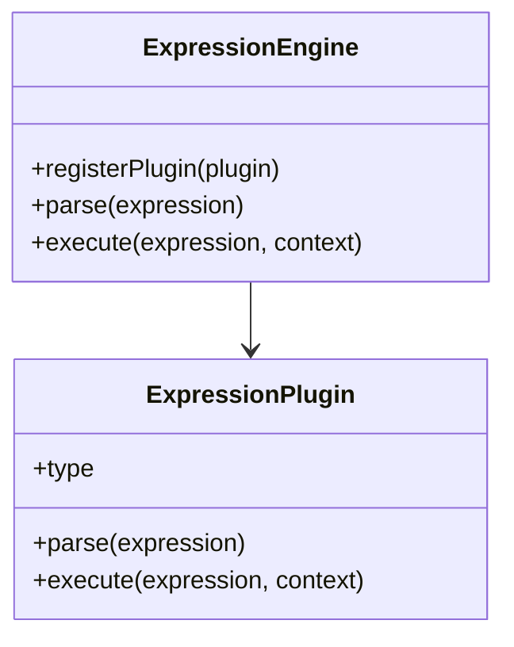

**核心组件：**

- **ExpressionEngine**：规则表达式执行引擎，支持插件机制
- **ExpressionPlugin**：表达式解析与执行插件，支持沙箱安全

### 5.2 动态校验算法

#### 5.2.1 设计思路

- 根据元数据动态生成校验规则，采用责任链模式实现高效校验
- 支持字段级、实体级、关系级多粒度校验，校验器可组合、可配置
- 校验器链可缓存，避免重复构建

#### 5.2.2 校验流程与组件设计

**校验流程：**

1. **元数据解析**：加载元数据定义，提取校验规则
2. **校验器构建**：构建并缓存校验器链
3. **链式校验**：输入数据依次通过校验器链，遇到失败可短路返回
4. **结果聚合**：返回校验结果与错误信息

**核心组件：**

- **校验器接口（Validator）**：定义统一的校验接口规范
- **校验器链（ValidatorChain）**：责任链模式实现的校验器组合
- **校验器工厂（ValidatorFactory）**：根据元数据动态创建校验器

---

### 5.3 权限判定算法

#### 5.3.1 设计思路

- 支持RBAC/ABAC等多种权限模型，采用高效的数据结构存储权限策略
- 权限判定基于用户、角色、资源、操作、上下文等多维度，支持条件表达式和数据脱敏
- 权限策略可预加载到内存，提升判定速度

#### 5.3.2 判定流程与组件设计

**判定流程：**

1. **策略加载**：加载用户角色与权限策略（本地缓存/分布式缓存）
2. **资源匹配**：匹配资源与操作，判断是否有权限
3. **条件计算**：若有条件表达式，动态计算条件
4. **结果返回**：返回判定结果与脱敏策略

**核心组件：**

- **权限引擎（PermissionEngine）**：核心权限判定逻辑
- **权限策略缓存（PermissionCache）**：用户权限策略的高效存储
- **资源匹配器（ResourceMatcher）**：支持通配符和正则匹配

---

### 5.4 数据脱敏算法

#### 5.4.1 设计思路

- 支持多种脱敏方式（如掩码、加密、哈希等），算法实现需兼顾性能与安全
- 脱敏策略可按字段、角色、场景灵活配置，策略可缓存
- 脱敏规则与权限系统联动，实现精细化控制

#### 5.4.2 脱敏流程与组件设计

**脱敏流程：**

1. **策略加载**：加载字段脱敏策略（本地/分布式缓存）
2. **权限判定**：判断当前用户/场景是否需要脱敏
3. **算法执行**：按策略对数据进行高效脱敏处理
4. **结果返回**：返回脱敏后的数据

**核心组件：**

- **脱敏引擎（MaskingEngine）**：统一脱敏处理入口
- **策略管理器（PolicyManager）**：脱敏策略的存储和管理
- **算法库（AlgorithmLibrary）**：内置多种脱敏算法实现

---

### 5.5 UI编译算法

#### 5.5.1 设计思路

- 基于元数据驱动的UI编译机制，支持页面、组件、样式的动态生成
- 采用分层编译策略，支持增量编译和热更新
- 编译结果缓存机制，提升渲染性能
- 支持主题化、多租户UI定制

#### 5.5.2 UI编译流程设计

**编译流程：**

```mermaid
flowchart TD
    A[UI元数据定义] --> B[元数据验证]
    B --> C[依赖分析]
    C --> D[组件解析]
    D --> E[样式编译]
    E --> F[模板生成]
    F --> G[缓存存储]
    G --> H[前端渲染]
  
    I[变更检测] --> J[增量编译]
    J --> K[缓存更新]
    K --> L[前端热更新]
```

**编译步骤：**

1. **元数据验证**：验证UI元数据的完整性和格式正确性
2. **依赖分析**：分析组件间的依赖关系，确定编译顺序
3. **组件解析**：解析组件定义，生成组件实例
4. **样式编译**：编译样式配置，生成CSS
5. **模板生成**：生成最终的HTML模板
6. **缓存存储**：将编译结果存储到缓存中

#### 5.5.3 核心组件设计

- **UI编译器（UICompiler）**：负责UI元数据的编译和模板生成
- **组件解析器（ComponentParser）**：解析组件定义，支持组件嵌套
- **样式编译器（StyleCompiler）**：编译样式配置，支持主题切换
- **缓存管理器（UICacheManager）**：管理编译结果的缓存

#### 5.5.4 编译器配置

```json
{
  "compilerConfig": {
    "mode": "production",
    "enableCache": true,
    "parallelCompile": true,
    "optimizations": {
      "minify": true,
      "treeshaking": true
    }
  }
}
```

**配置说明：**

- mode：编译模式（development/production）
- enableCache：是否启用缓存
- parallelCompile：是否并行编译
- optimizations：优化选项（压缩、摇树优化等）

### 5.6 流程引擎关键算法

#### 5.6.1 设计思路

- 采用有限状态机（FSM）驱动流程实例状态流转，支持节点并发、条件分支、子流程
- 节点调度支持同步/异步执行，事件监听机制支持扩展点注册
- 支持流程实例回滚、补偿、暂停、恢复等操作

#### 5.6.2 流程流转与组件设计

**流程流转：**

1. **定义解析**：流程定义解析，构建状态机模型
2. **实例启动**：启动流程实例，进入初始状态
3. **节点调度**：根据条件/事件推进状态
4. **事件处理**：支持事件监听、扩展点触发
5. **流程控制**：支持流程回滚、补偿、暂停、恢复

**核心组件：**

- **流程实例（ProcessInstance）**：流程执行的运行时状态
- **状态机（StateMachine）**：状态转换的核心逻辑
- **节点调度器（NodeScheduler）**：节点执行的调度管理
- **事件管理器（EventManager）**：事件监听和扩展点触发

```mermaid
stateDiagram-v2
    [*] --> Start
    Start --> Task1: 启动
    Task1 --> Task2: 完成节点1
    Task2 --> End: 完成节点2
    Task1 --> Compensate: 异常/回滚
    Compensate --> Task1: 补偿后重试
```

---

### 5.7 能力编排与聚合关键算法

#### 5.7.1 设计思路

- 采用DAG（有向无环图）模型描述能力节点依赖关系，支持并发/串行编排
- 支持事务一致性、回滚策略、容错降级、超时控制
- 节点执行支持异步、重试、补偿

#### 5.7.2 编排流程与组件设计

**编排流程：**

1. **定义解析**：解析编排定义，构建DAG模型
2. **拓扑排序**：确定节点执行顺序
3. **节点调度**：并发/串行调度能力节点
4. **异常处理**：支持事务一致性、回滚、降级处理

**核心组件：**

- **编排引擎（OrchestrationEngine）**：DAG模型的执行引擎
- **节点管理器（NodeManager）**：能力节点的注册和管理
- **执行器（Executor）**：节点的并发执行控制
- **事务管理器（TransactionManager）**：分布式事务协调

```mermaid
graph TD
    Start --> NodeA
    NodeA --> NodeB
    NodeA --> NodeC
    NodeB --> End
    NodeC --> End
```

---

### 5.8 多租户数据隔离机制强化

#### 5.8.1 设计思路

- **强制隔离**：所有数据、权限、会话均带租户ID，服务端强制校验和过滤
- **上下文传递**：租户上下文通过ThreadLocal和请求头双重机制传递
- **多层隔离**：数据隔离、权限隔离、资源隔离、运维隔离四重保障
- **安全增强**：租户数据加密、访问审计、跨租户防护

#### 5.8.2 数据隔离强化机制

**Row Level Security (RLS) 详细配置：**

**行级安全策略设计：**

**RLS配置：**

- 在元数据表上启用行级安全策略
- 创建租户隔离策略，限制用户只能访问当前租户的数据
- 强制策略，确保超级用户也受租户隔离限制
- 创建租户上下文设置函数，动态设置当前租户ID

**策略设计：**

- 基于tenant_id字段进行数据隔离
- 使用数据库级别的安全策略，确保数据访问安全
- 支持动态租户上下文切换
- 强制策略确保所有用户都受租户隔离限制

**设计要点：**

- 数据库级别的安全控制，比应用层更可靠
- 支持动态租户切换，便于多租户管理
- 强制策略确保安全性，防止绕过
- 性能友好，利用数据库索引优化查询

**租户数据加密密钥管理：**

```json
{
  "encryptionConfig": {
    "keyManagement": "tenant_specific",
    "algorithm": "AES-256-GCM",
    "keyRotation": {
      "enabled": true,
      "interval": "90days",
      "autoRotate": true
    },
    "keyStorage": {
      "type": "vault",
      "path": "secret/tenant-keys/{tenantId}"
    }
  },
  "encryptedFields": [
    "sensitiveData",
    "personalInfo",
    "businessSecrets"
  ]
}
```

#### 5.8.3 资源隔离与配额管理

**元数据服务层面的资源管理：**

- **元数据对象配额**：限制每个租户的元数据对象数量
- **数据实例配额**：限制基于元数据创建的数据实例数量
- **API调用限制**：基于租户的API调用频率控制
- **存储空间限制**：元数据相关存储空间的使用限制

**资源监控与限制：**

- 监听元数据创建、更新、删除事件
- 根据配额配置进行资源使用检查
- 超出配额时触发告警和限制措施

> 注：平台级资源管理（CPU、内存、网络等）由平台统一提供，元数据服务仅关注业务层面的资源限制。

#### 5.8.4 跨租户访问防护

**访问控制矩阵：**

| 操作类型   | 租户内访问 | 跨租户访问 | 防护机制         |
| ---------- | ---------- | ---------- | ---------------- |
| 数据查询   | 允许       | 禁止       | RLS + 应用层过滤 |
| 元数据定义 | 允许       | 禁止       | 租户ID强制校验   |
| 权限配置   | 允许       | 禁止       | 权限服务隔离     |
| 系统配置   | 管理员     | 超级管理员 | 角色分级控制     |

**跨租户防护实现：**

- 使用AOP切面技术，对业务代码无侵入
- 统一的租户隔离校验逻辑，确保数据安全
- 支持灵活的租户ID提取策略

---

### 4.8 扩展点与插件热加载机制

#### 4.8.1 扩展点分类与注册

**扩展点类型：**

| 扩展点类型     | 扩展方式/机制 | 典型场景/用例    |
| -------------- | ------------- | ---------------- |
| 字段扩展点     | 动态字段注入  | 业务对象字段扩展 |
| 行为扩展点     | 接口实现注入  | 业务逻辑扩展     |
| 协议扩展点     | 适配器模式    | 外部系统集成     |
| 能力节点扩展点 | 服务注册发现  | 新业务能力接入   |

**核心机制：**

- **权限控制**：扩展点注册和执行需要相应权限
- **审计机制**：记录扩展点注册、执行、变更操作
- **隔离机制**：扩展点运行在独立环境，确保系统安全
- **版本管理**：支持扩展点版本控制和回滚

#### 4.8.2 插件注册与隔离

**插件注册流程：**

1. 插件开发与打包
2. 权限校验与签名验证
3. 沙箱环境验证
4. 正式注册发布

**沙箱隔离机制：**

- **资源隔离**：限制插件的资源使用
- **权限隔离**：控制插件的访问权限
- **类加载隔离**：使用独立的类加载器
- **异常隔离**：确保插件异常不影响主系统

#### 4.8.3 热加载与回滚

**热加载机制：**

- 版本检测与备份
- 新版本验证
- 平滑切换
- 旧版本清理

**回滚机制：**

- 自动回滚：验证失败时自动回滚
- 手动回滚：支持管理员手动回滚
- 版本管理：维护多个版本支持快速切换

---

### 4.9 缓存策略优化算法

#### 4.9.1 多层缓存架构设计

**缓存分层策略：**

- **L1层（应用内存）**：热点元数据、编译后的规则、SQL模板
- **L2层（Redis分布式）**：元数据查询结果、权限判定结果、动态表单配置

#### 4.9.2 元数据驱动的缓存机制

**缓存策略：**

- **SQL语句缓存**：元数据定义生成的SQL模板缓存
- **规则缓存**：规则表达式编译结果和执行结果缓存
- **前端页面缓存**：UI元数据编译后的页面模板缓存

#### 4.9.3 缓存一致性保障机制

**事件驱动失效策略：**

- 元数据变更时通过事件总线通知缓存失效
- 支持批量删除相关缓存
- 本地缓存和分布式缓存同步失效

**缓存版本控制：**

- 每个缓存条目带版本号
- 缓存读取时验证版本有效性
- 支持相关缓存的原子性批量更新

#### 4.9.4 缓存预热与淘汰策略

**预热机制：**

- 系统启动时预加载核心元数据
- 定时任务预加载热点数据
- 基于使用模式预测并预加载数据

**淘汰策略：**

- 根据数据类型和访问频率设置不同权重
- 租户级别的缓存分区管理
- 支持大批量淘汰时的渐进式处理

### 4.10 数据处理关键算法

#### 4.10.1 搜索索引算法

**索引架构：**

- **全文搜索**：基于ElasticSearch的元数据全文检索
- **结构化搜索**：基于PostgreSQL索引的精确查询
- **实时搜索**：基于Redis的快速查询缓存

**索引策略：**

- **增量索引**：监听元数据变更事件，仅对变更部分重建索引
- **多字段索引**：支持元数据名称、描述、标签、关系等多维度索引
- **租户分片**：按租户维度进行索引分片，确保数据隔离

**搜索优化：**

- **相关性评分**：基于TF-IDF和业务权重的综合评分
- **查询缓存**：集成缓存机制提升查询性能
- **并行搜索**：多索引源的并行查询和结果聚合

#### 4.10.2 数据迁移算法

**Schema演进兼容性：**

- **向前兼容**：新增字段等变更自动执行
- **向后兼容**：版本标记的变更执行
- **破坏性变更**：需要人工确认和迁移计划

**迁移策略：**

- **增量迁移**：支持分批处理和断点续传
- **零停机迁移**：双写策略确保业务连续性
- **数据验证**：多层验证机制确保迁移质量

**兼容性规则：**

| 变更类型   | 兼容性   | 处理策略 | 数据处理       |
| ---------- | -------- | -------- | -------------- |
| 新增字段   | 向前兼容 | 自动执行 | 设置默认值     |
| 删除字段   | 破坏性   | 人工确认 | 数据备份后删除 |
| 字段重命名 | 破坏性   | 人工确认 | 数据映射迁移   |
| 类型变更   | 破坏性   | 人工确认 | 数据转换验证   |
| 约束新增   | 半兼容   | 版本标记 | 数据校验清理   |
