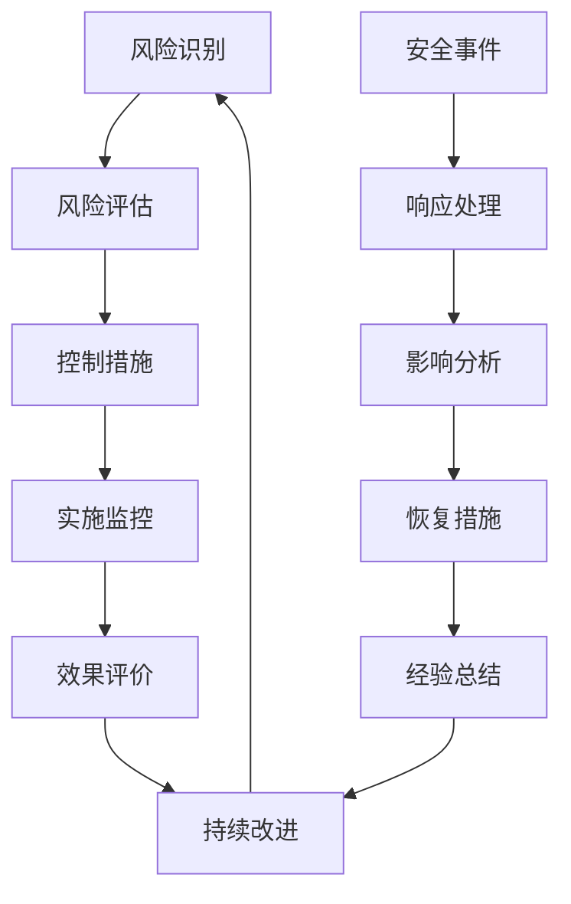

## 9. 安全架构设计

### 9.1 安全设计原则

#### 9.1.1 纵深防御

- **多层安全控制**：在网络、应用、数据、业务等各个层面实施安全防护
- **失效安全**：系统故障时默认拒绝访问，确保安全优先
- **最小权限**：用户和系统组件仅获得完成任务所需的最小权限
- **职责分离**：关键操作需要多人参与，避免单点权限风险

#### 9.1.2 数据保护

- **数据分类分级**：根据敏感程度对数据进行分类标记
- **全生命周期保护**：从数据创建到销毁的完整保护
- **隐私保护**：符合GDPR、PIPL等隐私保护法规要求
- **合规审计**：满足行业合规要求，支持审计追溯

### 9.2 身份认证与授权

#### 9.2.1 身份认证机制

| 认证方式   | 应用场景   | 安全等级 | 技术实现                            |
| ---------- | ---------- | -------- | ----------------------------------- |
| JWT Token  | API访问    | 中等     | 基于aixone-session的统一Token管理   |
| OAuth 2.0  | 第三方集成 | 高       | 标准OAuth 2.0协议，支持多种授权模式 |
| 双因素认证 | 管理员操作 | 高       | TOTP/SMS验证码                      |
| API Key    | 系统间调用 | 中等     | 密钥轮换，访问限制                  |

#### 10.2.2 权限模型设计

```json
{
  "permission": {
    "subject": "user:admin_001",
    "resource": "metadata:User.email", 
    "action": "read",
    "context": {
      "tenant": "tenant_001",
      "environment": "production",
      "time_window": "business_hours"
    },
    "effect": "allow",
    "conditions": [
      {
        "attribute": "department",
        "operator": "equals", 
        "value": "HR"
      }
    ]
  }
}
```

#### 10.2.3 权限控制策略

| 控制类型   | 粒度     | 实现方式        | 应用场景       |
| ---------- | -------- | --------------- | -------------- |
| RBAC       | 角色级   | 角色权限映射    | 通用权限管理   |
| ABAC       | 属性级   | 动态策略引擎    | 复杂业务场景   |
| 字段级权限 | 字段级   | 元数据+权限注解 | 敏感数据保护   |
| 行级安全   | 数据行级 | PostgreSQL RLS  | 多租户数据隔离 |

### 10.3 数据加密与脱敏

#### 10.3.1 加密策略

| 数据类型 | 加密方式   | 密钥管理 | 性能影响 |
| -------- | ---------- | -------- | -------- |
| 传输数据 | TLS 1.3    | 证书管理 | 低       |
| 存储数据 | AES-256    | 密钥轮换 | 中等     |
| 敏感字段 | 字段级加密 | HSM/KMS  | 中等     |
| 备份数据 | 全盘加密   | 密钥托管 | 低       |

#### 10.3.2 数据脱敏规则

```json
{
  "masking_rules": [
    {
      "field": "email",
      "rule_type": "partial_mask",
      "pattern": "***@***.com",
      "conditions": {
        "user_role": "!admin",
        "access_context": "query"
      }
    },
    {
      "field": "phone",
      "rule_type": "format_preserve",
      "pattern": "138****1234",
      "conditions": {
        "data_export": true
      }
    },
    {
      "field": "id_number", 
      "rule_type": "full_mask",
      "replacement": "[ENCRYPTED]",
      "conditions": {
        "user_clearance": "<L3"
      }
    }
  ]
}
```

### 10.4 审计日志系统

#### 10.4.1 审计事件分类

| 事件类型 | 审计内容           | 存储期限 | 告警规则     |
| -------- | ------------------ | -------- | ------------ |
| 访问审计 | 用户登录、API调用  | 90天     | 异常登录检测 |
| 操作审计 | 数据修改、配置变更 | 7年      | 敏感操作告警 |
| 系统审计 | 系统启停、错误日志 | 1年      | 系统异常告警 |
| 安全审计 | 权限变更、安全事件 | 10年     | 实时安全告警 |

#### 10.4.2 审计日志实现

```json
{
  "audit_event": {
    "event_id": "audit_20241201_001",
    "timestamp": "2024-12-01T10:30:00Z",
    "event_type": "metadata_update",
    "severity": "medium",
    "user": {
      "user_id": "admin_001",
      "tenant_id": "tenant_001",
      "ip_address": "192.168.1.100",
      "user_agent": "MetaCenter-Admin/1.0"
    },
    "resource": {
      "resource_type": "metadata",
      "resource_id": "User.profile",
      "operation": "update",
      "before_value": {...},
      "after_value": {...}
    },
    "context": {
      "session_id": "sess_123456",
      "transaction_id": "tx_789012",
      "source_system": "web_console"
    },
    "result": {
      "status": "success",
      "error_code": null,
      "message": "Metadata updated successfully"
    }
  }
}
```

#### 10.4.3 审计日志管理

- **日志采集**：通过aixone-event-sdk统一发布审计事件到事件中心
- **日志存储**：分级存储，热数据Redis，温数据PostgreSQL，冷数据对象存储
- **日志分析**：支持全文检索、统计分析、异常检测
- **合规报告**：自动生成合规审计报告，支持导出

### 10.5 安全威胁防护

#### 10.5.1 输入验证与防护

| 威胁类型 | 防护措施     | 实现位置 | 检测规则     |
| -------- | ------------ | -------- | ------------ |
| SQL注入  | 参数化查询   | ORM层    | 特殊字符检测 |
| XSS攻击  | 输出编码     | API层    | 脚本标签检测 |
| CSRF攻击 | CSRF Token   | Web层    | 来源验证     |
| 恶意文件 | 文件类型检测 | 上传层   | 文件头验证   |

#### 10.5.2 API安全防护

```yaml
api_security:
  rate_limiting:
    global: 1000 req/min
    per_user: 100 req/min
    per_ip: 200 req/min
  
  request_validation:
    max_payload_size: 10MB
    required_headers: ["Authorization", "Content-Type"]
    blocked_ips: []
  
  response_security:
    remove_headers: ["X-Powered-By", "Server"]
    add_headers:
      X-Content-Type-Options: "nosniff"
      X-Frame-Options: "DENY" 
      X-XSS-Protection: "1; mode=block"
```

#### 10.5.3 异常检测与响应

| 异常类型 | 检测指标     | 响应措施 | 恢复策略   |
| -------- | ------------ | -------- | ---------- |
| 暴力破解 | 失败登录频率 | 账户锁定 | 管理员解锁 |
| 异常访问 | 访问模式异常 | 实时告警 | 风险评估   |
| 数据泄露 | 大量数据导出 | 操作阻断 | 审计调查   |
| 系统入侵 | 系统行为异常 | 服务隔离 | 应急响应   |

### 10.6 合规与治理

#### 10.6.1 合规框架

| 合规标准 | 适用范围     | 关键要求         | 实现措施             |
| -------- | ------------ | ---------------- | -------------------- |
| GDPR     | 欧盟用户数据 | 数据保护、隐私权 | 数据分类、加密、脱敏 |
| SOX      | 财务相关数据 | 内控、审计       | 审计日志、职责分离   |
| ISO27001 | 信息安全管理 | 安全体系         | 安全政策、风险评估   |
| 等保2.0  | 国内网络安全 | 技术+管理        | 安全防护、审计监控   |

#### 10.6.2 安全治理流程



#### 10.6.3 安全度量指标

| 指标类别 | 具体指标         | 目标值  | 监控频率 |
| -------- | ---------------- | ------- | -------- |
| 访问控制 | 权限合规率       | >99%    | 日       |
| 数据保护 | 敏感数据加密率   | 100%    | 周       |
| 审计质量 | 审计事件完整率   | >99.9%  | 日       |
| 安全响应 | 安全事件响应时间 | <4小时  | 实时     |
| 漏洞管理 | 高危漏洞修复时间 | <24小时 | 周       |

### 10.7 安全运维

#### 10.7.1 安全监控

- **实时监控**：系统状态、安全事件、异常行为
- **告警机制**：分级告警、多渠道通知、自动升级
- **安全报表**：安全态势、风险趋势、合规状况
- **应急响应**：事件响应流程、应急联系人、恢复预案

#### 10.7.2 安全运维工具

| 工具类型 | 工具名称           | 主要功能             | 集成方式    |
| -------- | ------------------ | -------------------- | ----------- |
| SIEM     | 安全信息事件管理   | 日志聚合、关联分析   | 日志推送    |
| 漏洞扫描 | 定期安全扫描       | 漏洞发现、风险评估   | API集成     |
| 密钥管理 | HSM/KMS            | 密钥生成、存储、轮换 | SDK集成     |
| 监控告警 | Prometheus+Grafana | 指标监控、可视化     | Metrics暴露 |

### 10.8 安全架构总结

元数据服务安全架构采用纵深防御策略，在认证授权、数据保护、审计监控、威胁防护等各个层面建立了完善的安全防护体系。通过与aixone平台SDK的深度集成，确保了安全策略的统一性和一致性。

**关键安全特性**：

- **身份认证**：多因素认证、统一身份管理
- **权限控制**：细粒度权限、动态授权
- **数据保护**：全方位加密、智能脱敏
- **审计监控**：全链路审计、实时监控
- **威胁防护**：多层防护、智能检测
- **合规治理**：标准合规、持续改进
