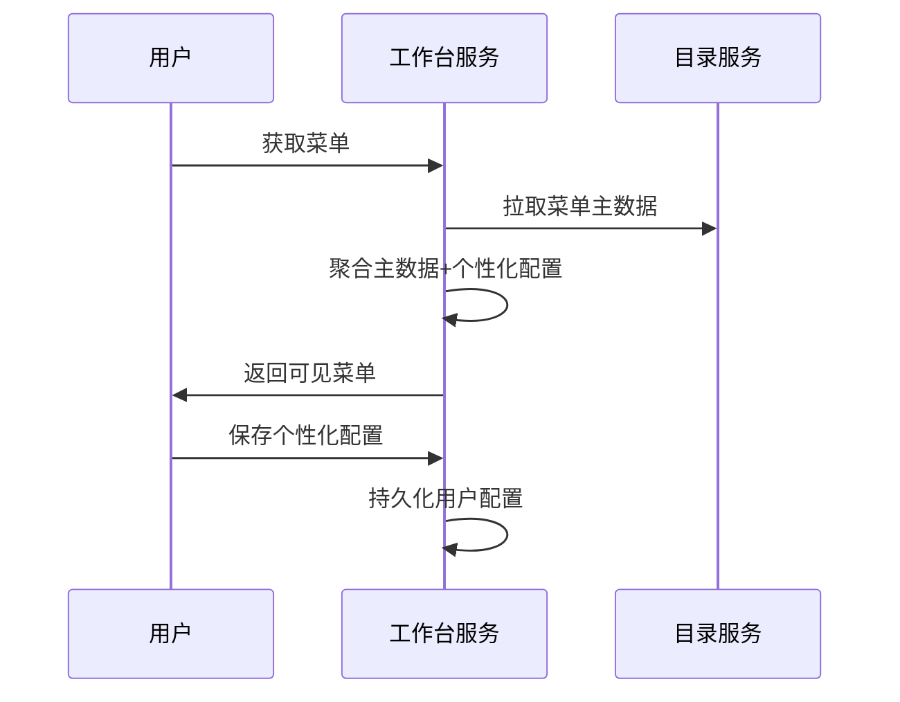

# AixOne 工作台服务（Workbench Service）架构设计（细化版）

## 一、系统定位

AixOne 工作台服务（Workbench Service）作为企业级平台的统一操作入口，面向企业用户、管理员、运维等多角色，聚合各类业务与管理功能，提升平台易用性、一致性与运营能力。服务需支持多租户、个性化、消息聚合、数据分析等企业级需求，成为企业数字化运营的中枢。

---

## 术语表
| 名称   | 说明 |
|--------|------|
| 菜单   | 平台功能导航与权限入口，支持多级结构、个性化配置，由 directory-serve 提供主数据 |
| 快捷入口 | 用户常用功能的快速访问配置 |
| 仪表盘 | 组件化可视化工作区，支持自定义布局 |
| 个性化配置 | 用户/租户/角色级的首页、菜单、仪表盘等定制 |

---

## 二、核心功能与边界

1. 统一入口与用户体验：多角色、多租户统一操作入口，界面与功能可定制。
2. 多系统集成：聚合各类业务系统、报表、监控、审批流、消息通知等。
3. 权限与个性化：基于角色/租户/用户的个性化首页、菜单、快捷入口、仪表盘定制。
4. 运营与数据分析：集成运营看板、数据大屏、统计分析等。
5. 统一消息与待办：聚合各业务系统的消息、待办、告警等。
6. 菜单聚合与个性化展示：主数据由 directory-serve 提供，工作台服务聚合、个性化和动态展示。

---

## 三、领域模型（聚合与个性化）

### 1. 菜单聚合模型
- menu_id: UUID
- tenant_id: UUID
- parent_id: UUID
- name: String
- path: String
- icon: String
- order: Integer
- type: String（目录/菜单/按钮）
- visible: Boolean
- config: String（个性化配置JSON）
- roles: List<UUID>（可见角色ID）
- user_custom: Object（用户个性化配置，如顺序、快捷入口、隐藏等）

### 2. 快捷入口/仪表盘模型
- entry_id: UUID
- user_id/tenant_id: UUID
- type: String（快捷入口/仪表盘组件）
- config: String（布局、样式等）

---

## 四、主要功能模块

1. 统一登录与身份认证（复用 Auth Service）
2. 个人信息与偏好设置
3. 业务系统快捷入口
4. 消息中心、待办中心
5. 运营看板、数据大屏
6. 角色/租户切换
7. 统一搜索
8. 组件化仪表盘（可拖拽、定制）
9. 菜单聚合与个性化展示

---

## 五、接口设计（API）及示例

### 1. 菜单聚合与个性化
- `GET /api/v1/menus`：获取当前用户可见菜单（聚合 directory-serve 主数据+个性化配置）
- `PUT /api/v1/menus/custom`：保存用户菜单个性化配置（如顺序、快捷入口、隐藏等）
- `GET /api/v1/quick-entries`：获取快捷入口
- `PUT /api/v1/quick-entries`：保存快捷入口配置

### 2. 仪表盘与首页
- `GET /api/v1/dashboard`：获取用户仪表盘配置
- `PUT /api/v1/dashboard`：保存仪表盘布局与组件

---

## 六、架构设计

### 1. 前端
- 微前端架构，支持各业务模块独立开发、动态加载。
- 动态菜单渲染，支持多级菜单、快捷入口、个性化定制。
- 菜单组件支持权限控制、个性化配置、国际化。
- 组件化仪表盘，支持拖拽、定制、可视化。

### 2. 后端
- 聚合层，负责用户信息、权限、消息、待办、菜单等聚合与分发。
- 与 API Gateway、Auth Service、Directory Service 等深度集成。
- 提供统一的 API 接口，支持多租户、权限校验、个性化配置。
- 通过接口从 Directory Service 拉取菜单主数据，并结合本地个性化配置进行聚合和展示。
- 支持菜单的多端同步、动态权限控制、个性化扩展。

### 3. 数据存储
- 用户个性化配置、仪表盘布局、快捷入口、菜单定制等存储。
- 菜单个性化配置（如常用菜单、顺序、快捷入口等）持久化。
- 消息、待办、运营数据等聚合与缓存。

---

## 七、与平台其他服务的协作

- 认证与权限：复用 Auth Service，统一认证与权限校验。
- 主数据：通过 Directory Service 获取用户、组织、角色、菜单等主数据。
- 菜单主数据（结构、权限绑定）由 Directory Service 统一管理，工作台服务负责菜单的聚合、个性化和动态展示。
- 菜单接口需支持多租户、权限过滤、个性化扩展。
- 事件与消息：与 Event Center 集成，聚合消息、待办、告警等。
- 智能服务：可集成 LLM Serve、Embed Serve，提供智能助手、搜索等能力。

---

## 八、数据库表结构（个性化配置）
- user_menu_custom (user_id, menu_id, config)
- user_quick_entry (user_id, entry_id, config)
- user_dashboard (user_id, config)

---

## 九、典型业务流程图

### 菜单个性化与聚合流程

---

## 十、研发计划与执行步骤
- [ ] 实现菜单聚合与个性化配置模型
- [ ] 完善菜单聚合、快捷入口、仪表盘等API
- [ ] 前端支持动态菜单渲染、个性化配置、权限控制
- [ ] 完善与 directory-serve 的接口协作与文档
- [ ] 补充单元测试、集成测试
- [ ] 持续优化用户体验与多端一致性

---

## 十一、小结

工作台服务作为企业级平台的统一入口，需重点关注多租户、个性化、集成与运营能力。菜单主数据归属 directory-serve，工作台服务负责菜单聚合、个性化和动态展示，支持多级结构、权限控制和个性化配置，持续演进以支撑企业数字化转型和多场景需求。 